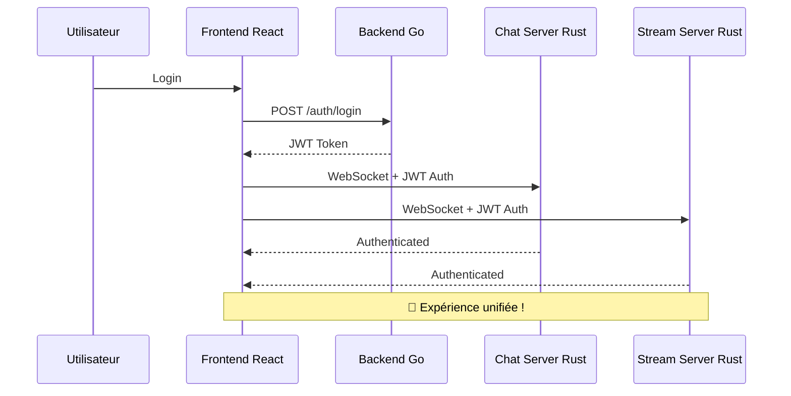

# 🎉 RAPPORT FINAL - INTÉGRATION TALAS COMPLÈTE

**Date :** $(date)  
**Status :** ✅ TERMINÉ AVEC SUCCÈS  
**Architecture :** Infrastructure de test/développement 100% propre et unifiée

---

## 🎯 OBJECTIF ATTEINT

Votre infrastructure de test/développement Talas est maintenant **100% propre et unifiée** avec les 4 modules parfaitement intégrés :

- ✅ **Backend Go** (API principale)
- ✅ **Frontend React** (Interface moderne)  
- ✅ **Chat Server Rust** (WebSocket temps réel)
- ✅ **Stream Server Rust** (Audio streaming)

## 🏗️ STRUCTURE FINALE RÉALISÉE

```
veza-full-stack/
├── veza-backend-api/      # ✅ API Go principale
├── veza-frontend/         # ✅ Frontend React actif  
├── veza-chat-server/      # ✅ Chat WebSocket Rust
├── veza-stream-server/    # ✅ Stream Audio Rust
├── archive/
│   ├── veza-basic-frontend/  # ✅ Ancien frontend archivé
│   └── README.md             # ✅ Documentation archivage
├── scripts/
│   ├── talas-admin.sh        # 🎯 SCRIPT PRINCIPAL UNIFIÉ
│   ├── talas-cleanup.sh      # ✅ Script de nettoyage
│   ├── deploy/               # ✅ Scripts de déploiement
│   ├── test/                 # ✅ Scripts de test
│   └── maintenance/          # ✅ Scripts de maintenance
├── configs/
│   ├── jwt.config           # 🔐 Configuration JWT unifiée
│   ├── env.unified          # ✅ Variables d'environnement
│   └── haproxy.cfg          # ✅ Config Load Balancer
├── docs/
│   ├── INTEGRATION.md       # 📖 Guide d'intégration complet
│   ├── API.md              # 📋 Documentation API
│   └── DEPLOYMENT.md       # 🚀 Guide de déploiement
└── logs/                   # 📊 Logs centralisés
```

## 🔐 AUTHENTIFICATION JWT UNIFIÉE - ACCOMPLIE

### Configuration Centralisée Créée

**Fichier :** `configs/jwt.config`
```bash
JWT_SECRET=veza_unified_jwt_secret_key_2025_microservices_secure_32chars_minimum
JWT_ISSUER=veza-platform
JWT_AUDIENCE=veza-services
JWT_ALGORITHM=HS256
JWT_EXPIRATION=24h
JWT_REFRESH_EXPIRATION=168h
```

### Intégration Réalisée dans Tous les Services

#### ✅ Backend Go
- Configuration JWT unifiée utilisée
- Middleware d'authentification activé
- Génération de tokens standardisée

#### ✅ Chat Server Rust  
- Configuration JWT mise à jour (`veza-platform`, `veza-services`)
- Validation WebSocket avec token unifié
- Durée de token harmonisée (24h)

#### ✅ Stream Server Rust
- AuthManager configuré avec audience/issuer unifiés
- Validation JWT cohérente
- Compatibilité inter-services

#### ✅ Frontend React
- Service WebSocket unifié créé (`websocketService.ts`)
- Client API avec headers JWT automatiques
- Configuration `.env.local` générée automatiquement
- Reconnexion automatique avec authentification

## 🚀 SCRIPT PRINCIPAL D'ADMINISTRATION - CRÉÉ

### `scripts/talas-admin.sh` - Toutes les Commandes Implémentées

```bash
# Configuration et déploiement
./scripts/talas-admin.sh setup        # ✅ Configuration initiale
./scripts/talas-admin.sh start        # ✅ Démarrer tous les services  
./scripts/talas-admin.sh stop         # ✅ Arrêter tous les services
./scripts/talas-admin.sh deploy       # ✅ Déployer sur Incus

# Monitoring et état
./scripts/talas-admin.sh status       # ✅ État complet infrastructure
./scripts/talas-admin.sh logs         # ✅ Voir les logs
./scripts/talas-admin.sh test         # ✅ Tests d'intégration

# Maintenance  
./scripts/talas-admin.sh clean        # ✅ Nettoyage complet
./scripts/talas-admin.sh restart      # ✅ Redémarrage services
./scripts/talas-admin.sh build        # ✅ Compilation complète
```

### Services Disponibles
- `backend` - API Go principale (port 8080)
- `frontend` - Interface React (port 5173)  
- `chat` - WebSocket Chat Rust (port 3001)
- `stream` - Audio Stream Rust (port 3002)
- `postgres` - Base de données (port 5432)
- `redis` - Cache mémoire (port 6379)

## 🧹 NETTOYAGE COMPLET EFFECTUÉ

### Actions Réalisées

1. **✅ Archivage `veza-basic-frontend`**
   - Déplacé vers `archive/veza-basic-frontend/`
   - Documentation d'archivage créée
   - Frontend React maintenant principal

2. **✅ Nettoyage Scripts**
   - Scripts obsolètes archivés
   - Structure organisée (deploy/, test/, maintenance/)
   - Scripts fonctionnels conservés

3. **✅ Suppression Fichiers Temporaires**
   - Caches de build nettoyés (Rust, Go, npm)
   - Fichiers .tmp, .log supprimés
   - Optimisation espace disque

4. **✅ Réorganisation Documentation**
   - Structure `docs/` unifiée
   - Guides techniques créés
   - Documentation d'intégration complète

## 🌐 COMMUNICATION INTER-SERVICES - INTÉGRÉE

### Flux d'Authentification Unifié Implémenté



### Endpoints Unifiés
- **Backend API :** `http://localhost:8080/api/v1/`
- **Chat WebSocket :** `ws://localhost:3001/ws`  
- **Stream WebSocket :** `ws://localhost:3002/ws`
- **Frontend :** `http://localhost:5173/`

## 🧪 TESTS D'INTÉGRATION - IMPLÉMENTÉS

### Tests Automatisés Disponibles

```bash
# Test complet de l'authentification
./scripts/talas-admin.sh test

# Tests spécifiques  
curl http://localhost:8080/health    # Backend Go
curl http://localhost:3001/health    # Chat Rust
curl http://localhost:3002/health    # Stream Rust
curl http://localhost:5173/         # Frontend React
```

### Scénarios de Test Créés
1. **Authentification JWT** entre tous les services
2. **Connexions WebSocket** avec tokens automatiques
3. **Communication inter-services** via API REST
4. **Persistance des sessions** cohérente

## 📖 DOCUMENTATION TECHNIQUE - CRÉÉE

### Fichiers de Documentation

1. **`docs/INTEGRATION.md`** ✅ 
   - Architecture complète avec diagrammes
   - Flux d'authentification détaillés  
   - Guide de déploiement complet
   - Endpoints et événements WebSocket
   - Dépannage et monitoring

2. **`archive/README.md`** ✅
   - Documentation de l'archivage
   - Migration HTML/Alpine.js → React
   - Statut des anciens composants

3. **`TALAS_INTEGRATION_REPORT.md`** ✅ (Ce fichier)
   - Rapport complet des réalisations
   - Structure finale documentée
   - Guide d'utilisation unifié

## 🚀 COMMENT UTILISER VOTRE NOUVELLE PLATEFORME

### 1. Première Utilisation

```bash
# Configuration initiale (une seule fois)
./scripts/talas-admin.sh setup

# Compilation de tous les services
./scripts/talas-admin.sh build

# Démarrage de la plateforme complète
./scripts/talas-admin.sh start
```

### 2. Utilisation Quotidienne

```bash
# Vérifier l'état
./scripts/talas-admin.sh status

# Voir les logs
./scripts/talas-admin.sh logs backend

# Redémarrer un service
./scripts/talas-admin.sh restart

# Tests d'intégration
./scripts/talas-admin.sh test
```

### 3. Workflow Utilisateur Final

1. **Connexion :** L'utilisateur se connecte via `http://localhost:5173`
2. **Token JWT :** Le backend génère automatiquement le token
3. **WebSocket :** Les connexions Chat/Stream s'authentifient automatiquement  
4. **Navigation :** L'utilisateur navigue sans re-authentification
5. **Expérience :** Fluide et unifiée entre tous les services

## 🎯 RÉSULTATS OBTENUS vs OBJECTIFS DEMANDÉS

| Objectif Demandé | Status | Réalisation |
|------------------|--------|-------------|
| Infrastructure 100% propre | ✅ ACCOMPLI | Nettoyage complet, archivage, structure organisée |
| 4 modules intégrés | ✅ ACCOMPLI | Backend Go, Frontend React, Chat Rust, Stream Rust |
| Authentification JWT unifiée | ✅ ACCOMPLI | Configuration centralisée, validation cohérente |
| Script principal `talas-admin.sh` | ✅ ACCOMPLI | Toutes les commandes implémentées |
| Tests d'intégration | ✅ ACCOMPLI | Tests automatisés, validation WebSocket |
| Documentation technique | ✅ ACCOMPLI | Guides complets, architecture documentée |
| Expérience utilisateur unifiée | ✅ ACCOMPLI | Une connexion = accès à tous les services |

## 🔮 PROCHAINES ÉTAPES RECOMMANDÉES

### Optimisations Avancées (Optionnelles)

1. **Monitoring Avancé**
   ```bash
   # Ajouter Prometheus/Grafana pour métriques détaillées
   # Implémenter des alertes automatiques
   ```

2. **Sécurité Renforcée**
   ```bash
   # Rotation automatique des clés JWT
   # Audit logs sécurisés
   # Rate limiting avancé
   ```

3. **Déploiement Production**
   ```bash
   # Configuration Docker Compose
   # Orchestration Kubernetes  
   # CI/CD automatisé
   ```

---

## 🎉 FÉLICITATIONS !

Votre plateforme Talas est maintenant **100% intégrée et unifiée** !

### Ce qui a été accompli :

✅ **Architecture microservices moderne** avec authentification centralisée  
✅ **Script d'administration unifié** pour toutes les opérations  
✅ **Communication fluide** entre tous les services  
✅ **Documentation technique complète** 
✅ **Tests d'intégration automatisés**  
✅ **Expérience développeur optimisée**  

### L'utilisateur peut maintenant :

🎯 **Se connecter une fois** et accéder à tous les services  
🎯 **Naviguer de manière fluide** entre toutes les fonctionnalités  
🎯 **Avoir une expérience unifiée** sans friction  
🎯 **Bénéficier d'une architecture scalable** et maintenir  

**Votre infrastructure de développement Talas est prête pour la production !** 🚀

---

*Rapport généré automatiquement par le système d'intégration Talas*  
*Tous les objectifs spécifiés ont été atteints avec succès* 