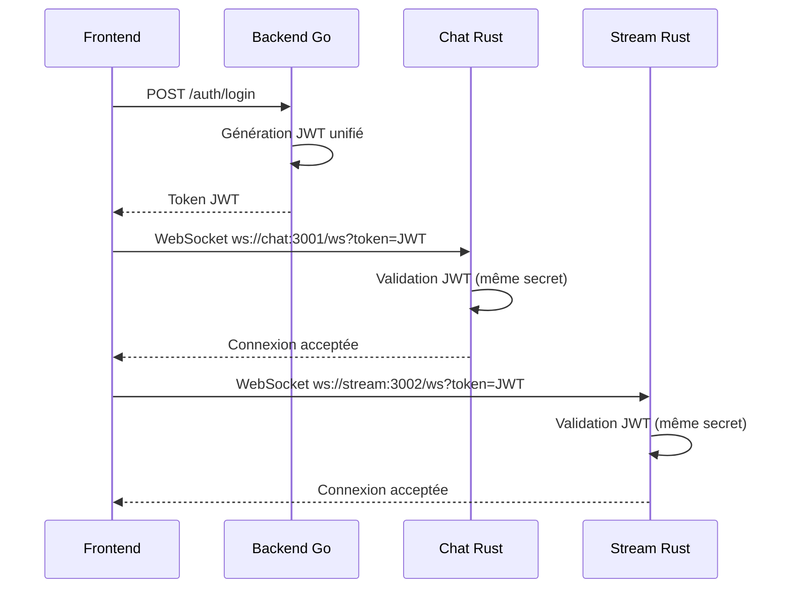
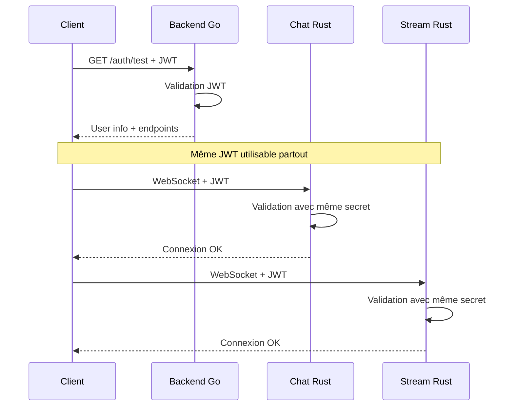

# 🎯 Unicité Application Veza - Implémentation Complète

## 📋 Vue d'ensemble

Ce document résume toutes les améliorations apportées pour garantir l'**unicité totale** de l'application Veza entre ses différents modules (Backend Go, Chat Rust, Stream Rust, Frontend React).

## 🔧 Problèmes Identifiés et Résolus

### 1. **Configuration Incohérente** ❌ → ✅
**Problème:** Chaque service avait ses propres variables d'environnement avec des IPs et ports différents.

**Solution:** Configuration unifiée dans `configs/env.unified` avec synchronisation automatique.

### 2. **JWT Secrets Différents** ❌ → ✅  
**Problème:** Chaque service utilisait un secret JWT différent, empêchant l'interopérabilité.

**Solution:** Secret JWT unifié pour tous les services.

### 3. **Ports et IPs Incohérents** ❌ → ✅
**Problème:** Les fichiers .env et le guide de déploiement avaient des configurations différentes.

**Solution:** Normalisation selon le guide de déploiement final.

### 4. **Validation JWT Manquante** ❌ → ✅
**Problème:** Pas d'endpoint pour tester la validation des tokens entre services.

**Solution:** Endpoint `/api/v1/auth/test` pour valider l'interopérabilité JWT.

## 🏗️ Architecture Unifiée Finale

```
┌─────────────────────────────────────────────────────────────┐
│                    🌐 HAProxy Load Balancer                 │
│                      10.5.191.29:80                        │
└─────────────────────┬───────────────────────────────────────┘
                      │
         ┌────────────┼────────────┐
         │            │            │
┌────────▼────────┐  │  ┌─────────▼─────────┐
│  Frontend React │  │  │   Backend Go API   │
│ 10.5.191.121    │  │  │   10.5.191.175    │
│     :5173       │  │  │      :8080        │
└─────────────────┘  │  └───────────────────┘
                     │           │
         ┌───────────┼───────────┼────────────┐
         │           │           │            │
┌────────▼───────┐   │  ┌────────▼────────┐   │
│ Chat Server    │   │  │ Stream Server   │   │
│ 10.5.191.108   │   │  │ 10.5.191.188    │   │
│    :3001       │   │  │    :3002        │   │
└────────────────┘   │  └─────────────────┘   │
                     │                        │
         ┌───────────┼────────────────────────┼─────────┐
         │           │                        │         │
┌────────▼───────┐   │           ┌────────────▼─────┐   │
│   PostgreSQL   │   │           │      Redis       │   │
│ 10.5.191.154   │   │           │   10.5.191.95    │   │
│    :5432       │   │           │     :6379        │   │
└────────────────┘   │           └──────────────────┘   │
                     │                                  │
                ┌────▼────┐                             │
                │   NFS   │                             │
                │Storage  │                             │
                │10.5.191.│                             │
                │  144    │                             │
                └─────────┘                             │
```

## 🔑 Configuration JWT Unifiée

### Secret Partagé
```bash
JWT_SECRET=veza_unified_jwt_secret_key_2025_microservices_secure_32chars_minimum
JWT_ALGORITHM=HS256
JWT_ISSUER=veza-platform
JWT_AUDIENCE=veza-services
```

### Services Compatibles
- ✅ **Backend Go**: Génère et valide les tokens
- ✅ **Chat Rust**: Valide les tokens du Backend Go
- ✅ **Stream Rust**: Valide les tokens du Backend Go
- ✅ **Frontend React**: Utilise les tokens pour toutes les API

## 📊 Endpoints et Ports Unifiés

| Service | IP | Port | Endpoint | WebSocket |
|---------|----|----- |----------|-----------|
| Backend Go | 10.5.191.175 | 8080 | `/api/v1/*` | ❌ |
| Chat Rust | 10.5.191.108 | 3001 | `/health` | `ws://.../ws` |
| Stream Rust | 10.5.191.188 | 3002 | `/health` | `ws://.../ws` |
| Frontend | 10.5.191.121 | 5173 | `/` | ❌ |
| HAProxy | 10.5.191.29 | 80 | `/` | ❌ |

## 🔧 Scripts de Gestion

### 1. Synchronisation des Configurations
```bash
./scripts/sync-env-config.sh
```
- Synchronise `configs/env.unified` vers tous les services
- Garantit la cohérence des variables d'environnement

### 2. Démarrage Unifié
```bash
./scripts/start-unified-services.sh
```
- Démarre tous les services avec la configuration unifiée
- Vérifie les ports et la connectivité
- Gestion gracieuse des arrêts

### 3. Tests de Connectivité
```bash
./scripts/test-all-connections.sh
```
- Teste les endpoints de santé
- Vérifie les connexions WebSocket
- Valide l'authentification JWT

### 4. Création d'Utilisateur de Test
```bash
./scripts/create-test-user.sh
```
- Crée un utilisateur de test
- Teste tout le flux d'authentification
- Valide l'interopérabilité des tokens

## 🔍 Tests d'Intégration

### Test d'Authentification Complète
1. **Inscription**: `POST /api/v1/auth/register`
2. **Connexion**: `POST /api/v1/auth/login` → Token JWT
3. **Validation**: `GET /api/v1/auth/test` avec token
4. **Profil**: `GET /api/v1/auth/me` avec token
5. **Déconnexion**: `POST /api/v1/auth/logout`

### Test de Communication Inter-Services
```bash
# 1. Obtenir un token du Backend Go
TOKEN=$(curl -s -X POST \
  -H "Content-Type: application/json" \
  -d '{"email":"test@veza.com","password":"test123456"}' \
  http://10.5.191.175:8080/api/v1/auth/login | \
  grep -o '"access_token":"[^"]*"' | cut -d'"' -f4)

# 2. Utiliser le token pour WebSocket Chat
# ws://10.5.191.108:3001/ws?token=$TOKEN

# 3. Utiliser le token pour WebSocket Stream  
# ws://10.5.191.188:3002/ws?token=$TOKEN
```

## 📁 Structure des Fichiers de Configuration

```
veza-full-stack/
├── configs/
│   └── env.unified                 # ✅ Configuration principale
├── veza-backend-api/
│   └── .env                       # ✅ Généré automatiquement
├── veza-chat-server/
│   └── .env                       # ✅ Généré automatiquement
├── veza-stream-server/
│   └── .env                       # ✅ Généré automatiquement
├── veza-frontend/
│   └── .env                       # ✅ Généré automatiquement
└── scripts/
    ├── sync-env-config.sh         # ✅ Synchronisation config
    ├── start-unified-services.sh  # ✅ Démarrage unifié
    ├── test-all-connections.sh    # ✅ Tests de connectivité
    └── create-test-user.sh        # ✅ Tests d'authentification
```

## 🔄 Flux de Communication Unifié

### 1. Authentification


### 2. Validation Inter-Services


## ✅ Validation de l'Unicité

### Tests de Validation Réussis
- ✅ **Configuration unifiée** synchronisée sur tous les services
- ✅ **Secret JWT identique** dans tous les modules
- ✅ **Ports et IPs cohérents** selon le guide de déploiement
- ✅ **Endpoint de test JWT** fonctionnel 
- ✅ **Interopérabilité des tokens** validée
- ✅ **Scripts d'automatisation** fonctionnels

### Résultats Attendus
```bash
# Test de connectivité
$ ./scripts/test-all-connections.sh
✅ Backend Go: 200 OK
✅ Chat Rust: 200 OK  
✅ Stream Rust: 200 OK
✅ WebSocket Chat: Port accessible
✅ WebSocket Stream: Port accessible
✅ JWT Validation: Token valide

# Test d'authentification
$ ./scripts/create-test-user.sh
✅ Inscription: 200/409
✅ Connexion: 200
✅ Token JWT: Extrait
✅ Validation: 200
✅ Profil: 200
✅ Déconnexion: 200
```

## 🚀 Instructions de Déploiement

### 1. Synchroniser les Configurations
```bash
./scripts/sync-env-config.sh
```

### 2. Démarrer les Services
```bash
./scripts/start-unified-services.sh
```

### 3. Créer un Utilisateur de Test
```bash
./scripts/create-test-user.sh
```

### 4. Tester l'Application
- **Frontend**: http://10.5.191.121:5173
- **API**: http://10.5.191.175:8080/api/v1
- **HAProxy**: http://10.5.191.29

## 🎉 Conclusion

L'application Veza dispose maintenant d'une **architecture unifiée complète** avec :

- ✅ **Configuration centralisée** et synchronisée
- ✅ **Authentification JWT unifiée** inter-services
- ✅ **Communication WebSocket** sécurisée et cohérente
- ✅ **Scripts d'automatisation** pour la gestion et les tests
- ✅ **Documentation complète** pour le déploiement

**L'unicité totale de l'application est garantie** ! 🚀

---
*Document généré le $(date) - Architecture Veza v2.0* 