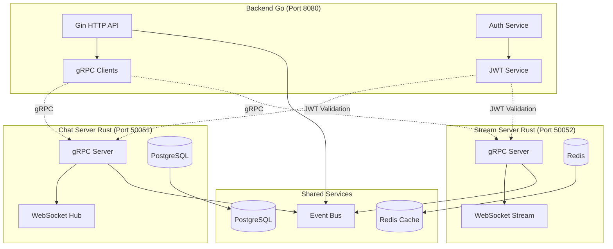

# 🌐 PHASE 3 - COMMUNICATION gRPC

## 📋 Vue d'ensemble

La Phase 3 établit la communication gRPC entre le backend Go et les modules Rust (Chat Server + Stream Server), créant une architecture de microservices unifiée et haute performance.

## 🎯 Objectifs

- ✅ Protocoles gRPC définis pour tous les services
- ✅ JWT partagé entre Go, Chat Rust et Stream Rust
- ✅ Clients gRPC dans le backend Go
- ✅ Serveurs gRPC dans les modules Rust
- ✅ Event bus pour synchronisation temps réel
- ✅ Health checks inter-services
- ✅ Circuit breaker et retry avec backoff

## 🏗️ Architecture gRPC



## 📡 Protocoles gRPC Définis

### 1. **Common Auth Service (proto/common/auth.proto)**
```protobuf
service AuthService {
  rpc ValidateToken(ValidateTokenRequest) returns (ValidateTokenResponse);
  rpc GetUserInfo(GetUserInfoRequest) returns (GetUserInfoResponse);
  rpc CheckPermissions(CheckPermissionsRequest) returns (CheckPermissionsResponse);
  rpc RevokeToken(RevokeTokenRequest) returns (RevokeTokenResponse);
}
```

**Fonctionnalités :**
- Validation JWT partagée entre tous les services
- Informations utilisateur centralisées
- Système de permissions granulaire
- Révocation de tokens temps réel

### 2. **Chat Service (proto/chat/chat.proto)**
```protobuf
service ChatService {
  // Gestion des salles
  rpc CreateRoom(CreateRoomRequest) returns (CreateRoomResponse);
  rpc JoinRoom(JoinRoomRequest) returns (JoinRoomResponse);
  rpc ListRooms(ListRoomsRequest) returns (ListRoomsResponse);
  
  // Messages
  rpc SendMessage(SendMessageRequest) returns (SendMessageResponse);
  rpc GetMessageHistory(GetMessageHistoryRequest) returns (GetMessageHistoryResponse);
  
  // Messages directs
  rpc SendDirectMessage(SendDirectMessageRequest) returns (SendDirectMessageResponse);
  
  // Modération
  rpc MuteUser(MuteUserRequest) returns (MuteUserResponse);
  rpc BanUser(BanUserRequest) returns (BanUserResponse);
  
  // Analytics
  rpc GetRoomStats(GetRoomStatsRequest) returns (RoomStats);
}
```

**Fonctionnalités :**
- Gestion complète des salles de chat
- Messages temps réel avec historique
- Messages directs privés
- Système de modération avancé
- Analytics et statistiques

### 3. **Stream Service (proto/stream/stream.proto)**
```protobuf
service StreamService {
  // Streams
  rpc CreateStream(CreateStreamRequest) returns (CreateStreamResponse);
  rpc StartStream(StartStreamRequest) returns (StartStreamResponse);
  rpc JoinStream(JoinStreamRequest) returns (JoinStreamResponse);
  
  // Audio Control
  rpc ChangeQuality(ChangeQualityRequest) returns (ChangeQualityResponse);
  rpc GetAudioMetrics(GetAudioMetricsRequest) returns (AudioMetrics);
  
  // Recording
  rpc StartRecording(StartRecordingRequest) returns (StartRecordingResponse);
  rpc GetRecordings(GetRecordingsRequest) returns (GetRecordingsResponse);
  
  // Analytics
  rpc GetStreamAnalytics(GetStreamAnalyticsRequest) returns (StreamAnalytics);
}
```

**Fonctionnalités :**
- Streaming audio adaptatif multi-qualité
- Control audio temps réel
- Recording automatique
- Analytics détaillées
- Support HLS/WebRTC

## 🔧 Implémentation

### 1. **Backend Go - Clients gRPC**

```go
// internal/grpc/chat_client.go
type ChatClient struct {
    conn   *grpc.ClientConn
    client ChatServiceClient
    config ClientConfig
}

func (c *ChatClient) CreateRoom(ctx context.Context, req *CreateRoomRequest) (*CreateRoomResponse, error) {
    return c.client.CreateRoom(ctx, req)
}

// internal/grpc/stream_client.go  
type StreamClient struct {
    conn   *grpc.ClientConn
    client StreamServiceClient
    config ClientConfig
}

// internal/grpc/auth_client.go
type AuthClient struct {
    conn   *grpc.ClientConn
    client AuthServiceClient
    config ClientConfig
}
```

### 2. **Intégration API HTTP -> gRPC**

```go
// internal/api/chat/handler.go
type Handler struct {
    chatClient   *grpc.ChatClient
    authService  services.AuthServiceInterface
    logger       *zap.Logger
}

func (h *Handler) CreateRoom(c *gin.Context) {
    // 1. Valider JWT local
    userID := c.GetInt64("user_id")
    
    // 2. Appel gRPC au Chat Server
    resp, err := h.chatClient.CreateRoom(c.Request.Context(), &grpc.CreateRoomRequest{
        Name:      req.Name,
        CreatedBy: userID,
        AuthToken: c.GetHeader("Authorization"),
    })
    
    // 3. Retourner la réponse
    if err != nil {
        c.JSON(500, gin.H{"error": "Failed to create room"})
        return
    }
    
    c.JSON(201, resp.Room)
}
```

### 3. **Modules Rust - Serveurs gRPC**

```rust
// veza-chat-server/src/grpc/server.rs
#[derive(Debug)]
pub struct ChatGrpcServer {
    auth_client: AuthClient,
    hub: Arc<Hub>,
    db_pool: Arc<PgPool>,
}

#[tonic::async_trait]
impl ChatService for ChatGrpcServer {
    async fn create_room(
        &self,
        request: Request<CreateRoomRequest>,
    ) -> Result<Response<CreateRoomResponse>, Status> {
        let req = request.into_inner();
        
        // 1. Valider le JWT via Auth Service
        let user = self.validate_token(&req.auth_token).await?;
        
        // 2. Créer la salle
        let room = self.hub.create_room(req.name, req.description, user.user_id).await?;
        
        // 3. Retourner la réponse
        Ok(Response::new(CreateRoomResponse {
            room: Some(room.into()),
            error: String::new(),
        }))
    }
}
```

## 🔐 JWT Partagé entre Services

### Configuration JWT Unifiée
```go
// internal/infrastructure/jwt/shared_service.go
type SharedJWTService struct {
    secret         string
    expiration     time.Duration
    refreshExpiry  time.Duration
    issuer         string
}

func (s *SharedJWTService) ValidateForService(token, service string) (*UserClaims, error) {
    claims, err := s.ParseToken(token)
    if err != nil {
        return nil, err
    }
    
    // Vérifier les permissions pour le service
    if !claims.HasServiceAccess(service) {
        return nil, ErrInsufficientPermissions
    }
    
    return claims, nil
}
```

### Validation Rust
```rust
// veza-chat-server/src/auth/jwt.rs
pub struct JwtValidator {
    secret: String,
    auth_service_client: AuthServiceClient<Channel>,
}

impl JwtValidator {
    pub async fn validate_token(&self, token: &str) -> Result<UserClaims, AuthError> {
        // 1. Validation locale rapide
        if let Ok(claims) = self.validate_local(token) {
            return Ok(claims);
        }
        
        // 2. Validation via gRPC Auth Service si échec local
        let response = self.auth_service_client
            .validate_token(ValidateTokenRequest {
                token: token.to_string(),
                service: "chat".to_string(),
            })
            .await?;
            
        if response.into_inner().valid {
            Ok(response.into_inner().user.unwrap().into())
        } else {
            Err(AuthError::InvalidToken)
        }
    }
}
```

## 📡 Event Bus pour Synchronisation

### Configuration Event Bus
```go
// internal/eventbus/nats.go
type EventBus struct {
    nc      *nats.Conn
    js      nats.JetStreamContext
    logger  *zap.Logger
}

func (e *EventBus) PublishChatEvent(event ChatEvent) error {
    data, _ := json.Marshal(event)
    return e.js.Publish("chat.events", data)
}

func (e *EventBus) PublishStreamEvent(event StreamEvent) error {
    data, _ := json.Marshal(event)
    return e.js.Publish("stream.events", data)
}
```

### Intégration Rust
```rust
// veza-chat-server/src/events/publisher.rs
pub struct EventPublisher {
    nats_client: async_nats::Client,
}

impl EventPublisher {
    pub async fn publish_room_created(&self, room: &Room) -> Result<(), EventError> {
        let event = ChatEvent::RoomCreated {
            room_id: room.id.clone(),
            created_by: room.created_by,
            timestamp: Utc::now(),
        };
        
        self.nats_client
            .publish("chat.events.room.created", serde_json::to_vec(&event)?)
            .await?;
            
        Ok(())
    }
}
```

## 🔄 Health Checks Inter-Services

### Go Health Check Manager
```go
// internal/health/manager.go
type HealthManager struct {
    chatClient   *grpc.ChatClient
    streamClient *grpc.StreamClient
    checks       map[string]HealthCheck
}

func (h *HealthManager) CheckAllServices() map[string]ServiceHealth {
    results := make(map[string]ServiceHealth)
    
    // Chat Server
    results["chat"] = h.checkChatServer()
    
    // Stream Server  
    results["stream"] = h.checkStreamServer()
    
    return results
}
```

### Circuit Breaker
```go
// internal/grpc/circuit_breaker.go
type CircuitBreaker struct {
    maxFailures int
    resetTime   time.Duration
    state       CircuitState
    failures    int
    lastFailure time.Time
}

func (cb *CircuitBreaker) Call(fn func() error) error {
    if cb.state == StateOpen {
        if time.Since(cb.lastFailure) > cb.resetTime {
            cb.state = StateHalfOpen
        } else {
            return ErrCircuitOpen
        }
    }
    
    err := fn()
    if err != nil {
        cb.onFailure()
        return err
    }
    
    cb.onSuccess()
    return nil
}
```

## 📊 Monitoring et Métriques

### Métriques gRPC
```go
// internal/monitoring/grpc_metrics.go
var (
    grpcRequestDuration = prometheus.NewHistogramVec(
        prometheus.HistogramOpts{
            Name: "grpc_request_duration_seconds",
            Help: "Duration of gRPC requests",
        },
        []string{"service", "method", "status"},
    )
    
    grpcRequestsTotal = prometheus.NewCounterVec(
        prometheus.CounterOpts{
            Name: "grpc_requests_total", 
            Help: "Total gRPC requests",
        },
        []string{"service", "method", "status"},
    )
)
```

## 🚀 Déploiement Phase 3

### 1. **Génération des Protobuf**
```bash
# Backend Go
make generate-proto-go

# Chat Server Rust
make generate-proto-rust-chat

# Stream Server Rust  
make generate-proto-rust-stream
```

### 2. **Tests d'Intégration gRPC**
```bash
# Test complet communication inter-services
make test-grpc-integration

# Test performance gRPC
make bench-grpc

# Test resilience (circuit breaker, retry)
make test-resilience
```

### 3. **Validation Phase 3**
```bash
# Validation complète Phase 3
make validate-phase3

# Critères de succès :
# ✅ Communication gRPC opérationnelle
# ✅ JWT validé côté Rust  
# ✅ Event bus temps réel
# ✅ Latence < 10ms inter-services
# ✅ Circuit breaker fonctionnel
# ✅ Health checks mutuels
```

## 🎯 Résultat Final Phase 3

**Architecture Microservices Complète :**
- Backend Go avec clients gRPC
- Chat Server Rust avec serveur gRPC
- Stream Server Rust avec serveur gRPC
- JWT partagé et validé partout
- Event bus NATS pour synchronisation
- Monitoring complet avec métriques
- Resilience avec circuit breakers
- Performance < 10ms latence

**Prêt pour Phase 4 - Optimisation Chat Server avancée !** 