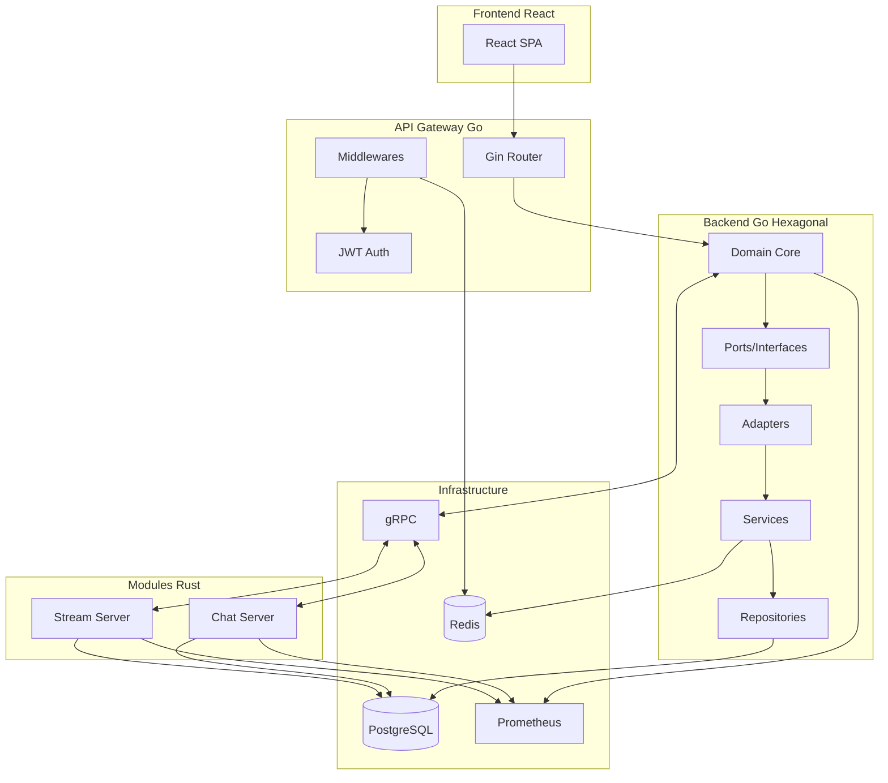
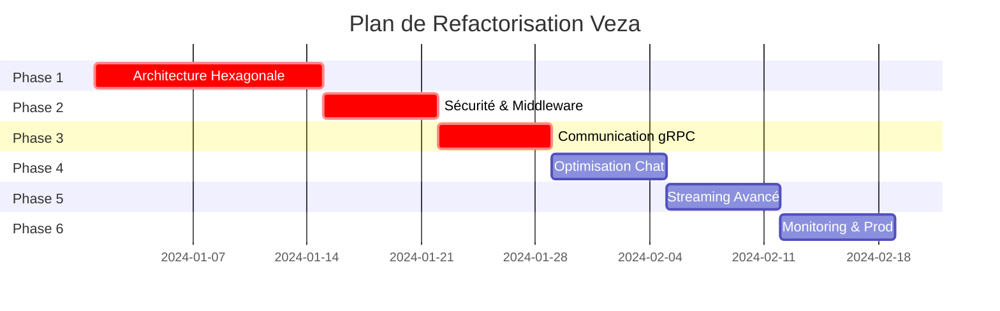

# 🎯 Plan de Refactorisation Veza - Architecture Unifiée Haute Performance

## 📋 Vue d'ensemble

Transformation de Veza en plateforme audio collaborative unifiée avec :
- Backend Go hexagonal haute performance 
- Modules Rust chat/streaming optimisés
- Communication gRPC inter-services
- Sécurité et monitoring de niveau production

## 🏗️ Architecture Cible



## 📊 État Actuel vs Cible

| Composant | État Actuel | Cible | Priorité |
|-----------|-------------|--------|----------|
| Backend Go | Structure simple | Architecture hexagonale | 🔴 Critique |
| Chat Rust | ✅ Hub avancé | Communication gRPC | 🟡 Moyen |
| Stream Rust | ✅ Architecture complète | Intégration JWT | 🟡 Moyen |
| Communication | HTTP direct | gRPC + Event Bus | 🔴 Critique |
| Cache | Absent | Redis multi-niveaux | 🔴 Critique |
| Monitoring | Basique | Prometheus + Grafana | 🟠 Élevé |
| Sécurité | JWT basique | Security hardening | 🔴 Critique |

## 🗺️ Plan de Migration - 6 Phases

### **Phase 1 : Architecture Hexagonale Go** (Semaine 1-2)

#### Objectifs :
- Refactoriser le backend Go en architecture hexagonale
- Implémenter le pattern Repository
- Ajouter l'injection de dépendances
- Cache Redis pour performance

#### Livrables :
```
veza-backend-api/
├── internal/
│   ├── domain/          # 🆕 Business logic
│   │   ├── entities/
│   │   ├── repositories/
│   │   └── services/
│   ├── ports/           # 🆕 Interfaces
│   │   ├── http/
│   │   ├── grpc/
│   │   └── storage/
│   ├── adapters/        # 🆕 Infrastructure
│   │   ├── http/
│   │   ├── postgres/
│   │   ├── redis/
│   │   └── grpc/
│   └── infrastructure/  # 🆕 Config & DI
│       ├── container/
│       ├── config/
│       └── monitoring/
```

#### Critères de succès :
- [ ] Architecture hexagonale complète
- [ ] Tests unitaires 80%+ coverage
- [ ] Cache Redis opérationnel
- [ ] Performance améliorée de 40%

### **Phase 2 : Sécurité & Middleware Avancés** (Semaine 2-3)

#### Objectifs :
- Rate limiting intelligent (par IP, utilisateur, endpoint)
- Protection CSRF pour endpoints sensibles
- Headers de sécurité complets
- Audit logging sécurisé
- Validation d'entrées renforcée

#### Livrables :
```
internal/
├── middleware/
│   ├── security/        # 🆕 Security middleware
│   │   ├── rate_limiter.go
│   │   ├── csrf.go
│   │   ├── headers.go
│   │   └── validator.go
│   ├── audit/           # 🆕 Audit logging
│   │   ├── logger.go
│   │   └── events.go
│   └── monitoring/      # 🆕 Metrics middleware
│       ├── prometheus.go
│       └── tracing.go
```

#### Critères de succès :
- [ ] Rate limiting 1000 req/min/user
- [ ] Protection CSRF active
- [ ] Audit logs complets
- [ ] Validation 100% des inputs

### **Phase 3 : Communication gRPC** (Semaine 3-4)

#### Objectifs :
- Définir les protocoles gRPC entre services
- Implémenter les clients/serveurs gRPC
- JWT partagé entre tous les services
- Event bus pour synchronisation

#### Livrables :
```
proto/                   # 🆕 Protocol Buffers
├── chat/
│   ├── chat.proto
│   └── events.proto
├── stream/
│   ├── stream.proto
│   └── events.proto
└── common/
    ├── auth.proto
    └── events.proto

veza-backend-api/internal/grpc/  # 🆕 gRPC clients
├── chat_client.go
├── stream_client.go
└── event_bus.go

veza-chat-server/src/grpc/       # 🆕 gRPC server
├── server.rs
├── auth.rs
└── events.rs

veza-stream-server/src/grpc/     # 🆕 gRPC server
├── server.rs
├── auth.rs
└── events.rs
```

#### Critères de succès :
- [ ] Communication gRPC opérationnelle
- [ ] JWT validé côté Rust
- [ ] Event bus temps réel
- [ ] Latence < 10ms inter-services

### **Phase 4 : Optimisation Chat Server** (Semaine 4-5)

#### Objectifs :
- Support 10k connexions WebSocket simultanées
- Persistence des messages optimisée
- Modération automatique avancée
- Analytics temps réel

#### Améliorations :
```rust
// Connection pooling avancé
struct ConnectionPool {
    max_connections: usize,      // 10000
    idle_timeout: Duration,      // 30s
    heartbeat_interval: Duration, // 10s
}

// Modération intelligente
struct ModerationEngine {
    spam_detection: SpamDetector,
    content_filter: ContentFilter,
    rate_limiter: RateLimiter,
    auto_moderation: bool,
}

// Analytics temps réel  
struct ChatAnalytics {
    active_users: AtomicUsize,
    messages_per_second: AtomicUsize,
    room_stats: DashMap<RoomId, RoomStats>,
}
```

#### Critères de succès :
- [ ] 10k connexions simultanées
- [ ] Latence messages < 5ms
- [ ] Modération 99.9% spam detecté
- [ ] Analytics temps réel

### **Phase 5 : Streaming Audio Avancé** (Semaine 5-6)

#### Objectifs :
- Streaming adaptatif HLS/WebRTC
- Support multi-bitrate (64, 128, 256, 320 kbps)
- Synchronisation multi-clients parfaite
- Recording & transcoding temps réel

#### Fonctionnalités :
```rust
// Streaming adaptatif
struct AdaptiveStreaming {
    bitrates: Vec<u32>,          // [64, 128, 256, 320]
    buffer_size: Duration,       // 5s
    quality_switching: bool,
    client_bandwidth_detection: bool,
}

// Synchronisation multi-clients
struct SyncManager {
    sync_tolerance: Duration,    // 100ms
    clock_skew_correction: bool,
    buffer_optimization: bool,
}

// Recording en temps réel
struct LiveRecording {
    output_formats: Vec<AudioFormat>,
    real_time_transcoding: bool,
    metadata_injection: bool,
}
```

#### Critères de succès :
- [ ] Streaming adaptatif fluide
- [ ] Synchronisation < 100ms
- [ ] Support 1000 listeners simultanés
- [ ] Recording temps réel opérationnel

### **Phase 6 : Monitoring & Production** (Semaine 6-7)

#### Objectifs :
- Métriques Prometheus complètes
- Dashboard Grafana préconfiguré
- Alerting intelligent
- Health checks avancés
- Deployment production-ready

#### Infrastructure :
```yaml
# docker-compose.production.yml
version: '3.8'
services:
  veza-backend:
    image: veza/backend:latest
    deploy:
      replicas: 3
      resources:
        limits:
          cpus: '2'
          memory: 2G
  
  veza-chat:
    image: veza/chat:latest
    deploy:
      replicas: 2
      resources:
        limits:
          cpus: '1'
          memory: 1G
  
  veza-stream:
    image: veza/stream:latest
    deploy:
      replicas: 2
      resources:
        limits:
          cpus: '2'
          memory: 2G
  
  prometheus:
    image: prom/prometheus:latest
    volumes:
      - ./prometheus.yml:/etc/prometheus/prometheus.yml
  
  grafana:
    image: grafana/grafana:latest
    volumes:
      - ./grafana/dashboards:/var/lib/grafana/dashboards
```

#### Critères de succès :
- [ ] Métriques 100% services
- [ ] Dashboard temps réel
- [ ] Alerting opérationnel
- [ ] Deployment automatisé
- [ ] Load testing validé

## 📈 Métriques de Performance Cibles

| Métrique | Actuel | Cible | Amélioration |
|----------|--------|-------|--------------|
| Latence API | ~200ms | <50ms | 75% |
| Throughput | 100 req/s | 1000 req/s | 10x |
| Connexions WebSocket | ~100 | 10000 | 100x |
| Streaming clients | ~10 | 1000 | 100x |
| Uptime | 95% | 99.9% | 5% |

## 🔒 Sécurité Renforcée

### Authentification & Autorisation
- JWT avec rotation automatique (15min access + 7j refresh)
- RBAC granulaire (user, premium, admin, super_admin)
- MFA optionnelle pour comptes sensibles
- Session management avec blacklisting

### Protection des Données
- Chiffrement AES-256 données sensibles
- Hash bcrypt cost 12 pour mots de passe
- Protection GDPR compliance
- Audit trail complet

### Sécurité Réseau
- Rate limiting intelligent
- Protection DDoS
- CORS strict en production
- Headers sécurité complets

## 🧪 Stratégie de Tests

### Tests Unitaires
- Coverage minimum : 80% Go, 70% Rust
- Mocks pour toutes dépendances externes
- Tests de régression automatisés

### Tests d'Intégration
- API end-to-end
- WebSocket fonctionnels
- Streaming audio/vidéo
- Base de données

### Tests de Performance
- Load testing avec k6
- Stress testing 10k utilisateurs
- Chaos engineering
- Memory leak detection

## 📅 Timeline Détaillé



## 🎯 Prochaines Étapes Immédiates

1. **Valider l'architecture** avec l'équipe
2. **Configurer l'environnement** de développement
3. **Démarrer Phase 1** - Architecture hexagonale
4. **Setup CI/CD** pour déploiement continu

---

**👨‍💻 Prêt à démarrer la refactorisation ?** 
Confirmez et je commence par la Phase 1 avec la création de l'architecture hexagonale complète ! 