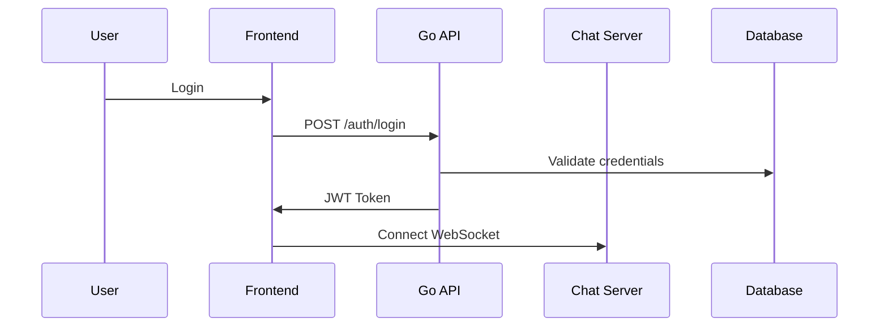

# Flux de Données Veza

```mermaid
sequenceDiagram
    participant U as User
    participant F as Frontend
    participant G as Go API
    participant C as Chat Server
    participant DB as Database
    U->>F: Login
    F->>G: POST /auth/login
    G->>DB: Validate credentials
    G->>F: JWT Token
    F->>C: Connect WebSocket
```
