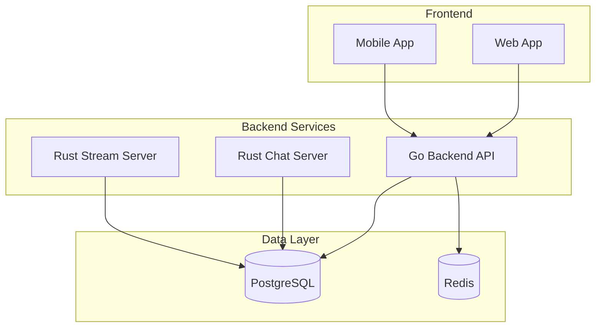

# Architecture Système Veza

```mermaid
graph TB
    subgraph "Frontend"
        Web[Web App]
        Mobile[Mobile App]
    end
    subgraph "Backend Services"
        GoAPI[Go Backend API]
        ChatServer[Rust Chat Server]
        StreamServer[Rust Stream Server]
    end
    subgraph "Data Layer"
        PostgreSQL[(PostgreSQL)]
        Redis[(Redis)]
    end
    Web --> GoAPI
    Mobile --> GoAPI
    GoAPI --> PostgreSQL
    GoAPI --> Redis
    ChatServer --> PostgreSQL
    StreamServer --> PostgreSQL
```
