# 🔐 Authentification - Chat Server

## 🎯 Rôle et Responsabilités

Le module d'authentification du Chat Server gère la sécurité des connexions WebSocket en validant les identités utilisateur et en contrôlant l'accès aux ressources.

### Fonctionnalités Principales
- **Validation JWT** : Vérification des tokens d'accès et refresh
- **Gestion des sessions** : Stockage et invalidation des sessions actives
- **Contrôle d'accès** : Vérification des permissions par room et action
- **Audit de sécurité** : Logging de toutes les tentatives d'authentification
- **Intégration OAuth2** : Support des providers externes (Google, GitHub, etc.)

## 🏗️ Architecture


## 🔧 Implémentation Technique

### Structure Principale

```rust
#[derive(Clone)]
pub struct AuthService {
    jwt_secret: String,
    redis_client: Arc<RedisClient>,
    grpc_client: Arc<AuthGrpcClient>,
    oauth_config: OAuthConfig,
    audit_logger: Arc<AuditLogger>,
}

#[derive(Debug, Clone, Serialize, Deserialize)]
pub struct UserClaims {
    pub sub: String,           // User ID
    pub email: String,
    pub roles: Vec<String>,
    pub tenant_id: i64,
    pub permissions: Vec<String>,
    pub exp: i64,              // Expiration
    pub iat: i64,              // Issued at
    pub jti: String,           // JWT ID
}

#[derive(Debug, Clone)]
pub struct AuthSession {
    pub session_id: String,
    pub user_id: i64,
    pub tenant_id: i64,
    pub roles: Vec<String>,
    pub permissions: Vec<String>,
    pub created_at: DateTime<Utc>,
    pub expires_at: DateTime<Utc>,
    pub last_activity: DateTime<Utc>,
    pub ip_address: String,
    pub user_agent: String,
}
```

### Validation JWT

```rust
impl AuthService {
    pub async fn validate_token(&self, token: &str) -> Result<UserClaims, AuthError> {
        // Décodage et vérification du token
        let token_data = decode::<UserClaims>(
            token,
            &DecodingKey::from_secret(self.jwt_secret.as_ref()),
            &Validation::default()
        ).map_err(|e| {
            self.audit_logger.log_auth_failure(
                "jwt_decode_error",
                &format!("Token decode failed: {}", e),
                None,
            ).await;
            AuthError::InvalidToken
        })?;
        
        // Vérification de l'expiration
        let now = Utc::now().timestamp();
        if token_data.claims.exp < now {
            return Err(AuthError::TokenExpired);
        }
        
        // Vérification de la blacklist
        if self.is_token_blacklisted(&token_data.claims.jti).await? {
            return Err(AuthError::TokenRevoked);
        }
        
        // Audit log de succès
        self.audit_logger.log_auth_success(
            &token_data.claims.sub,
            "jwt_validation",
            &token_data.claims.jti,
        ).await;
        
        Ok(token_data.claims)
    }
    
    pub async fn refresh_token(&self, refresh_token: &str) -> Result<String, AuthError> {
        // Validation du refresh token
        let claims = self.validate_refresh_token(refresh_token).await?;
        
        // Génération d'un nouveau access token
        let new_token = self.generate_access_token(&claims).await?;
        
        // Invalidation de l'ancien refresh token
        self.invalidate_refresh_token(refresh_token).await?;
        
        Ok(new_token)
    }
}
```

### Gestion des Sessions

```rust
impl AuthService {
    pub async fn create_session(
        &self,
        user_id: i64,
        tenant_id: i64,
        ip_address: &str,
        user_agent: &str,
    ) -> Result<AuthSession, AuthError> {
        let session_id = Uuid::new_v4().to_string();
        let now = Utc::now();
        
        // Récupération des informations utilisateur via gRPC
        let user_info = self.grpc_client.get_user_info(user_id).await?;
        
        let session = AuthSession {
            session_id: session_id.clone(),
            user_id,
            tenant_id,
            roles: user_info.roles,
            permissions: user_info.permissions,
            created_at: now,
            expires_at: now + Duration::hours(24),
            last_activity: now,
            ip_address: ip_address.to_string(),
            user_agent: user_agent.to_string(),
        };
        
        // Stockage en Redis
        let session_key = format!("session:{}", session_id);
        self.redis_client
            .set_ex(
                &session_key,
                &serde_json::to_string(&session)?,
                86400, // 24 heures
            )
            .await?;
        
        // Index par utilisateur
        let user_sessions_key = format!("user_sessions:{}", user_id);
        self.redis_client.sadd(&user_sessions_key, &session_id).await?;
        self.redis_client.expire(&user_sessions_key, 86400).await?;
        
        Ok(session)
    }
    
    pub async fn get_session(&self, session_id: &str) -> Result<AuthSession, AuthError> {
        let session_key = format!("session:{}", session_id);
        let session_data = self.redis_client.get(&session_key).await
            .map_err(|_| AuthError::SessionNotFound)?;
        
        let session: AuthSession = serde_json::from_str(&session_data)?;
        
        // Vérification de l'expiration
        if session.expires_at < Utc::now() {
            self.invalidate_session(session_id).await?;
            return Err(AuthError::SessionExpired);
        }
        
        // Mise à jour de l'activité
        self.update_session_activity(session_id).await?;
        
        Ok(session)
    }
    
    pub async fn invalidate_session(&self, session_id: &str) -> Result<(), AuthError> {
        let session_key = format!("session:{}", session_id);
        
        // Récupération de la session avant suppression
        if let Ok(session_data) = self.redis_client.get(&session_key).await {
            if let Ok(session) = serde_json::from_str::<AuthSession>(&session_data) {
                // Suppression de l'index utilisateur
                let user_sessions_key = format!("user_sessions:{}", session.user_id);
                self.redis_client.srem(&user_sessions_key, session_id).await?;
            }
        }
        
        // Suppression de la session
        self.redis_client.del(&session_key).await?;
        
        Ok(())
    }
}
```

### Contrôle d'Accès

```rust
impl AuthService {
    pub async fn check_permission(
        &self,
        user_id: i64,
        resource: &str,
        action: &str,
    ) -> Result<bool, AuthError> {
        // Récupération des permissions utilisateur
        let permissions = self.get_user_permissions(user_id).await?;
        
        // Vérification directe
        let required_permission = format!("{}:{}", resource, action);
        if permissions.contains(&required_permission) {
            return Ok(true);
        }
        
        // Vérification des rôles
        let roles = self.get_user_roles(user_id).await?;
        for role in roles {
            let role_permissions = self.get_role_permissions(&role).await?;
            if role_permissions.contains(&required_permission) {
                return Ok(true);
            }
        }
        
        Ok(false)
    }
    
    pub async fn check_room_access(
        &self,
        user_id: i64,
        room_id: &str,
        action: RoomAction,
    ) -> Result<bool, AuthError> {
        match action {
            RoomAction::Read => {
                // Vérification de l'appartenance à la room
                self.is_room_member(user_id, room_id).await
            }
            RoomAction::Write => {
                // Vérification des permissions d'écriture
                self.check_permission(user_id, "room", "write").await
            }
            RoomAction::Moderate => {
                // Vérification des permissions de modération
                self.check_permission(user_id, "room", "moderate").await
            }
            RoomAction::Admin => {
                // Vérification des permissions d'administration
                self.check_permission(user_id, "room", "admin").await
            }
        }
    }
}
```

## 🔄 Flux d'Authentification

```mermaid
sequenceDiagram
    participant Client as Client WebSocket
    participant Hub as Chat Hub
    participant Auth as Auth Service
    participant Redis as Redis Cache
    participant gRPC as gRPC Auth Service
    participant Audit as Audit Logger
    
    Client->>Hub: Connexion avec token JWT
    Hub->>Auth: validate_token(token)
    Auth->>Auth: Décodage JWT
    Auth->>Redis: Vérification blacklist
    Redis-->>Auth: Token valide
    Auth->>gRPC: get_user_info(user_id)
    gRPC-->>Auth: User info + permissions
    Auth->>Redis: Création session
    Auth->>Audit: Log succès authentification
    Auth-->>Hub: UserClaims
    Hub-->>Client: Connexion établie
    
    Note over Client,Hub: Pendant la session
    Client->>Hub: Action (join room, send message)
    Hub->>Auth: check_permission(user_id, resource, action)
    Auth->>gRPC: Vérification permissions
    gRPC-->>Auth: Permission granted/denied
    Auth-->>Hub: Result
    Hub-->>Client: Action autorisée/refusée
```



## 🛡️ Sécurité Avancée

### Rate Limiting d'Authentification

```rust
impl AuthService {
    pub async fn check_auth_rate_limit(&self, ip_address: &str) -> Result<bool, AuthError> {
        let key = format!("auth_rate_limit:{}", ip_address);
        let current_count = self.redis_client.incr(&key, 1).await?;
        
        if current_count == 1 {
            self.redis_client.expire(&key, 300).await?; // 5 minutes
        }
        
        // Limite: 10 tentatives par 5 minutes
        if current_count > 10 {
            self.audit_logger.log_security_event(
                "rate_limit_exceeded",
                &format!("IP {} exceeded auth rate limit", ip_address),
                Some(ip_address),
            ).await;
            return Err(AuthError::RateLimitExceeded);
        }
        
        Ok(true)
    }
}
```

### Détection d'Anomalies

```rust
impl AuthService {
    pub async fn detect_suspicious_activity(
        &self,
        user_id: i64,
        ip_address: &str,
        user_agent: &str,
    ) -> Result<Vec<SecurityAlert>, AuthError> {
        let mut alerts = Vec::new();
        
        // Vérification de la géolocalisation
        let known_ips = self.get_user_known_ips(user_id).await?;
        if !known_ips.contains(ip_address) {
            alerts.push(SecurityAlert::NewLocation {
                user_id,
                ip_address: ip_address.to_string(),
                timestamp: Utc::now(),
            });
        }
        
        // Vérification des sessions simultanées
        let active_sessions = self.get_user_active_sessions(user_id).await?;
        if active_sessions.len() > 5 {
            alerts.push(SecurityAlert::MultipleSessions {
                user_id,
                session_count: active_sessions.len(),
                timestamp: Utc::now(),
            });
        }
        
        // Vérification du user agent
        let known_agents = self.get_user_known_agents(user_id).await?;
        if !known_agents.contains(user_agent) {
            alerts.push(SecurityAlert::NewUserAgent {
                user_id,
                user_agent: user_agent.to_string(),
                timestamp: Utc::now(),
            });
        }
        
        Ok(alerts)
    }
}
```

## 🔐 OAuth2 Integration

```rust
#[derive(Debug, Clone)]
pub struct OAuthConfig {
    pub providers: HashMap<String, OAuthProvider>,
    pub callback_url: String,
    pub state_secret: String,
}

#[derive(Debug, Clone)]
pub struct OAuthProvider {
    pub name: String,
    pub client_id: String,
    pub client_secret: String,
    pub auth_url: String,
    pub token_url: String,
    pub user_info_url: String,
    pub scopes: Vec<String>,
}

impl AuthService {
    pub async fn initiate_oauth_flow(
        &self,
        provider_name: &str,
        redirect_uri: &str,
    ) -> Result<String, AuthError> {
        let provider = self.oauth_config.providers.get(provider_name)
            .ok_or(AuthError::OAuthProviderNotFound)?;
        
        let state = self.generate_oauth_state().await?;
        
        let auth_url = format!(
            "{}?client_id={}&redirect_uri={}&response_type=code&scope={}&state={}",
            provider.auth_url,
            provider.client_id,
            urlencoding::encode(redirect_uri),
            provider.scopes.join(" "),
            state
        );
        
        Ok(auth_url)
    }
    
    pub async fn handle_oauth_callback(
        &self,
        provider_name: &str,
        code: &str,
        state: &str,
    ) -> Result<AuthSession, AuthError> {
        // Validation du state
        self.validate_oauth_state(state).await?;
        
        let provider = self.oauth_config.providers.get(provider_name)
            .ok_or(AuthError::OAuthProviderNotFound)?;
        
        // Échange du code contre un token
        let token_response = self.exchange_oauth_code(provider, code).await?;
        
        // Récupération des informations utilisateur
        let user_info = self.get_oauth_user_info(provider, &token_response.access_token).await?;
        
        // Création ou mise à jour de l'utilisateur
        let user_id = self.upsert_oauth_user(provider_name, &user_info).await?;
        
        // Création de la session
        self.create_session(user_id, 1, "oauth", "oauth").await
    }
}
```

## 📊 Audit et Monitoring

### Audit Logger

```rust
#[derive(Debug, Clone)]
pub struct AuditLogger {
    redis_client: Arc<RedisClient>,
    grpc_client: Arc<AuthGrpcClient>,
}

impl AuditLogger {
    pub async fn log_auth_success(
        &self,
        user_id: &str,
        method: &str,
        session_id: &str,
    ) {
        let event = AuditEvent {
            event_type: "auth_success".to_string(),
            user_id: user_id.to_string(),
            method: method.to_string(),
            session_id: Some(session_id.to_string()),
            timestamp: Utc::now(),
            ip_address: None,
            user_agent: None,
            details: None,
        };
        
        self.store_audit_event(event).await;
    }
    
    pub async fn log_auth_failure(
        &self,
        method: &str,
        reason: &str,
        ip_address: Option<&str>,
    ) {
        let event = AuditEvent {
            event_type: "auth_failure".to_string(),
            user_id: "unknown".to_string(),
            method: method.to_string(),
            session_id: None,
            timestamp: Utc::now(),
            ip_address: ip_address.map(|s| s.to_string()),
            user_agent: None,
            details: Some(reason.to_string()),
        };
        
        self.store_audit_event(event).await;
    }
    
    async fn store_audit_event(&self, event: AuditEvent) {
        // Stockage en Redis pour analyse en temps réel
        let event_key = format!("audit:{}:{}", event.event_type, event.timestamp.timestamp());
        let _: Result<(), _> = self.redis_client
            .set_ex(
                &event_key,
                &serde_json::to_string(&event).unwrap(),
                86400 * 30, // 30 jours
            )
            .await;
        
        // Envoi au service d'audit via gRPC
        let _: Result<(), _> = self.grpc_client.log_audit_event(event).await;
    }
}
```

## 🧪 Tests

### Tests Unitaires

```rust
#[cfg(test)]
mod tests {
    use super::*;
    
    #[tokio::test]
    async fn test_jwt_validation() {
        let auth_service = create_test_auth_service().await;
        
        // Test token valide
        let token = generate_test_token().await;
        let claims = auth_service.validate_token(&token).await.unwrap();
        assert_eq!(claims.sub, "123");
        
        // Test token expiré
        let expired_token = generate_expired_token().await;
        let result = auth_service.validate_token(&expired_token).await;
        assert!(matches!(result, Err(AuthError::TokenExpired)));
        
        // Test token invalide
        let invalid_token = "invalid.token.here";
        let result = auth_service.validate_token(invalid_token).await;
        assert!(matches!(result, Err(AuthError::InvalidToken)));
    }
    
    #[tokio::test]
    async fn test_permission_checking() {
        let auth_service = create_test_auth_service().await;
        
        // Test permission accordée
        let has_permission = auth_service
            .check_permission(1, "room", "write")
            .await
            .unwrap();
        assert!(has_permission);
        
        // Test permission refusée
        let has_permission = auth_service
            .check_permission(2, "room", "admin")
            .await
            .unwrap();
        assert!(!has_permission);
    }
    
    #[tokio::test]
    async fn test_session_management() {
        let auth_service = create_test_auth_service().await;
        
        // Création de session
        let session = auth_service
            .create_session(1, 1, "127.0.0.1", "test-agent")
            .await
            .unwrap();
        
        assert_eq!(session.user_id, 1);
        assert_eq!(session.tenant_id, 1);
        
        // Récupération de session
        let retrieved_session = auth_service
            .get_session(&session.session_id)
            .await
            .unwrap();
        
        assert_eq!(retrieved_session.user_id, session.user_id);
        
        // Invalidation de session
        auth_service.invalidate_session(&session.session_id).await.unwrap();
        
        let result = auth_service.get_session(&session.session_id).await;
        assert!(matches!(result, Err(AuthError::SessionNotFound)));
    }
}
```

## 🔧 Configuration

### Paramètres de Sécurité

```rust
#[derive(Debug, Clone)]
pub struct SecurityConfig {
    pub jwt_secret: String,
    pub jwt_expiration: Duration,
    pub refresh_token_expiration: Duration,
    pub session_timeout: Duration,
    pub max_sessions_per_user: usize,
    pub rate_limit_attempts: u32,
    pub rate_limit_window: Duration,
    pub enable_2fa: bool,
    pub require_strong_passwords: bool,
    pub password_history_size: usize,
}

impl Default for SecurityConfig {
    fn default() -> Self {
        Self {
            jwt_secret: std::env::var("JWT_SECRET").unwrap_or_else(|_| "default-secret".to_string()),
            jwt_expiration: Duration::hours(1),
            refresh_token_expiration: Duration::days(30),
            session_timeout: Duration::hours(24),
            max_sessions_per_user: 5,
            rate_limit_attempts: 10,
            rate_limit_window: Duration::minutes(5),
            enable_2fa: true,
            require_strong_passwords: true,
            password_history_size: 5,
        }
    }
}
```

Ce module d'authentification assure la sécurité et l'intégrité du système de chat en temps réel. 