# 🕸️ Hub WebSocket - Chat Server

## 🎯 Rôle et Responsabilités

Le Hub WebSocket est le cœur du système de chat en temps réel. Il gère toutes les connexions WebSocket, les rooms, les messages et la distribution des événements.

### Fonctionnalités Principales
- **Gestion des connexions** : Établissement, maintenance et fermeture des connexions WebSocket
- **Gestion des rooms** : Création, suppression, gestion des permissions et des membres
- **Distribution des messages** : Broadcast, unicast, multicast avec filtrage intelligent
- **Synchronisation d'état** : Présence utilisateur, typing indicators, read receipts
- **Modération en temps réel** : Filtrage automatique, rate limiting, bannissement

## 🏗️ Architecture


## 🔧 Implémentation Technique

### Structure Principale

```rust
#[derive(Clone)]
pub struct ChatHub {
    connections: Arc<RwLock<HashMap<String, WebSocketConnection>>>,
    rooms: Arc<RwLock<HashMap<String, ChatRoom>>>,
    auth_service: Arc<AuthService>,
    redis_client: Arc<RedisClient>,
    metrics: Arc<Metrics>,
    event_bus: Arc<EventBus>,
}

pub struct WebSocketConnection {
    pub id: String,
    pub user_id: i64,
    pub tenant_id: i64,
    pub socket: SplitSink<WebSocketStream<MaybeTlsStream<TcpStream>>, Message>,
    pub rooms: HashSet<String>,
    pub last_activity: Instant,
    pub rate_limiter: RateLimiter,
}
```

### Gestion des Connexions

```rust
impl ChatHub {
    pub async fn handle_connection(
        &self,
        socket: WebSocketStream<MaybeTlsStream<TcpStream>>,
        auth_token: String,
    ) -> Result<(), HubError> {
        // Authentification
        let user_info = self.auth_service.validate_token(&auth_token).await?;
        
        // Création de la connexion
        let connection_id = Uuid::new_v4().to_string();
        let connection = WebSocketConnection::new(
            connection_id.clone(),
            user_info.user_id,
            user_info.tenant_id,
            socket,
        );
        
        // Enregistrement
        self.connections.write().await.insert(connection_id, connection);
        
        // Notification de présence
        self.broadcast_presence_update(user_info.user_id, PresenceStatus::Online).await?;
        
        Ok(())
    }
}
```

### Gestion des Rooms

```rust
pub struct ChatRoom {
    pub id: String,
    pub name: String,
    pub room_type: RoomType,
    pub members: HashMap<i64, RoomMember>,
    pub permissions: RoomPermissions,
    pub settings: RoomSettings,
    pub created_at: DateTime<Utc>,
    pub updated_at: DateTime<Utc>,
}

impl ChatHub {
    pub async fn join_room(
        &self,
        connection_id: &str,
        room_id: &str,
    ) -> Result<(), HubError> {
        let mut connections = self.connections.write().await;
        let connection = connections.get_mut(connection_id)
            .ok_or(HubError::ConnectionNotFound)?;
        
        // Vérification des permissions
        if !self.can_join_room(connection.user_id, room_id).await? {
            return Err(HubError::PermissionDenied);
        }
        
        // Ajout à la room
        connection.rooms.insert(room_id.to_string());
        
        // Notification aux autres membres
        self.broadcast_to_room(
            room_id,
            &WsMessage::UserJoined(UserJoinedEvent {
                user_id: connection.user_id,
                room_id: room_id.to_string(),
                timestamp: Utc::now(),
            }),
            Some(connection_id),
        ).await?;
        
        Ok(())
    }
}
```

### Distribution des Messages

```rust
impl ChatHub {
    pub async fn broadcast_to_room(
        &self,
        room_id: &str,
        message: &WsMessage,
        exclude_connection: Option<&str>,
    ) -> Result<(), HubError> {
        let connections = self.connections.read().await;
        let room = self.rooms.read().await.get(room_id)
            .ok_or(HubError::RoomNotFound)?;
        
        let message_bytes = serde_json::to_vec(message)?;
        
        for (connection_id, connection) in connections.iter() {
            if connection.rooms.contains(room_id) {
                if let Some(exclude_id) = exclude_connection {
                    if connection_id == exclude_id {
                        continue;
                    }
                }
                
                // Vérification des permissions de lecture
                if !self.can_read_message(connection.user_id, room_id, message).await? {
                    continue;
                }
                
                // Envoi du message
                if let Err(e) = connection.socket.send(Message::Binary(message_bytes.clone())).await {
                    tracing::error!("Failed to send message to {}: {}", connection_id, e);
                }
            }
        }
        
        Ok(())
    }
}
```

## 🔄 Flux de Données

```mermaid
sequenceDiagram
    participant Client as Client WebSocket
    participant Hub as Chat Hub
    participant Auth as Auth Service
    participant Redis as Redis Cache
    participant DB as PostgreSQL
    participant Mod as Moderation Engine
    
    Client->>Hub: Connexion WebSocket
    Hub->>Auth: Validation token
    Auth-->>Hub: User info
    Hub->>Redis: Cache session
    Hub-->>Client: Connexion établie
    
    Client->>Hub: Join room
    Hub->>DB: Vérification permissions
    DB-->>Hub: Permissions OK
    Hub->>Redis: Update room members
    Hub-->>Client: Room joined
    
    Client->>Hub: Send message
    Hub->>Mod: Validation contenu
    Mod-->>Hub: Message validé
    Hub->>DB: Persistance message
    Hub->>Redis: Cache message
    Hub-->>Client: Message broadcasté
```



## 🛡️ Sécurité et Modération

### Rate Limiting

```rust
impl WebSocketConnection {
    pub async fn check_rate_limit(&mut self, message_type: &str) -> Result<bool, HubError> {
        let key = format!("rate_limit:{}:{}:{}", self.user_id, message_type, self.id);
        
        let current_count = self.redis_client.incr(&key, 1).await?;
        
        if current_count == 1 {
            // Premier message, définir l'expiration
            self.redis_client.expire(&key, 60).await?;
        }
        
        let limit = match message_type {
            "message" => 30,  // 30 messages par minute
            "typing" => 60,   // 60 typing indicators par minute
            "reaction" => 100, // 100 réactions par minute
            _ => 50,
        };
        
        Ok(current_count <= limit)
    }
}
```

### Modération Automatique

```rust
impl ChatHub {
    pub async fn moderate_message(&self, message: &str, user_id: i64) -> ModerationResult {
        // Filtrage de contenu
        if self.contains_profanity(message) {
            return ModerationResult::Blocked(ModerationReason::Profanity);
        }
        
        // Détection de spam
        if self.is_spam(message, user_id).await? {
            return ModerationResult::Blocked(ModerationReason::Spam);
        }
        
        // Vérification des liens
        if let Some(link) = self.extract_link(message) {
            if !self.is_safe_link(link).await? {
                return ModerationResult::Blocked(ModerationReason::UnsafeLink);
            }
        }
        
        ModerationResult::Approved
    }
}
```

## 📊 Métriques et Monitoring

### Métriques Collectées

```rust
#[derive(Debug, Clone)]
pub struct HubMetrics {
    pub active_connections: AtomicU64,
    pub total_messages_sent: AtomicU64,
    pub messages_per_second: AtomicU64,
    pub rooms_active: AtomicU64,
    pub average_message_size: AtomicU64,
    pub error_rate: AtomicU64,
}

impl ChatHub {
    pub async fn record_metrics(&self, event: &HubEvent) {
        match event {
            HubEvent::MessageSent { size, .. } => {
                self.metrics.total_messages_sent.fetch_add(1, Ordering::Relaxed);
                self.metrics.average_message_size.store(
                    (self.metrics.average_message_size.load(Ordering::Relaxed) + size) / 2,
                    Ordering::Relaxed
                );
            }
            HubEvent::ConnectionEstablished { .. } => {
                self.metrics.active_connections.fetch_add(1, Ordering::Relaxed);
            }
            HubEvent::ConnectionClosed { .. } => {
                self.metrics.active_connections.fetch_sub(1, Ordering::Relaxed);
            }
            HubEvent::Error { .. } => {
                self.metrics.error_rate.fetch_add(1, Ordering::Relaxed);
            }
        }
    }
}
```

## 🔧 Configuration

### Paramètres de Performance

```rust
#[derive(Debug, Clone)]
pub struct HubConfig {
    pub max_connections_per_user: usize,
    pub max_rooms_per_connection: usize,
    pub message_queue_size: usize,
    pub heartbeat_interval: Duration,
    pub connection_timeout: Duration,
    pub rate_limit_window: Duration,
    pub max_message_size: usize,
    pub enable_compression: bool,
}

impl Default for HubConfig {
    fn default() -> Self {
        Self {
            max_connections_per_user: 3,
            max_rooms_per_connection: 50,
            message_queue_size: 1000,
            heartbeat_interval: Duration::from_secs(30),
            connection_timeout: Duration::from_secs(300),
            rate_limit_window: Duration::from_secs(60),
            max_message_size: 1024 * 1024, // 1MB
            enable_compression: true,
        }
    }
}
```

## 🧪 Tests

### Tests Unitaires

```rust
#[cfg(test)]
mod tests {
    use super::*;
    
    #[tokio::test]
    async fn test_connection_management() {
        let hub = ChatHub::new(test_config()).await;
        
        // Test création connexion
        let connection = create_test_connection().await;
        hub.add_connection(connection.clone()).await;
        
        assert_eq!(hub.active_connections().await, 1);
        
        // Test fermeture connexion
        hub.remove_connection(&connection.id).await;
        assert_eq!(hub.active_connections().await, 0);
    }
    
    #[tokio::test]
    async fn test_message_broadcasting() {
        let hub = ChatHub::new(test_config()).await;
        
        // Créer une room avec des membres
        let room_id = "test-room";
        let members = vec![1, 2, 3];
        
        for member_id in members {
            let connection = create_test_connection_with_user(member_id).await;
            hub.add_connection(connection).await;
            hub.join_room(&connection.id, room_id).await.unwrap();
        }
        
        // Envoyer un message
        let message = WsMessage::Chat(ChatMessage {
            content: "Hello world".to_string(),
            room_id: room_id.to_string(),
            user_id: 1,
            timestamp: Utc::now(),
        });
        
        hub.broadcast_to_room(room_id, &message, None).await.unwrap();
        
        // Vérifier que tous les membres ont reçu le message
        // (implémentation des assertions selon le mock)
    }
}
```

## 🔗 Interactions avec Autres Modules

### Communication avec Auth Service

```rust
impl ChatHub {
    pub async fn validate_user_permissions(
        &self,
        user_id: i64,
        room_id: &str,
        action: RoomAction,
    ) -> Result<bool, HubError> {
        let request = ValidatePermissionRequest {
            user_id,
            room_id: room_id.to_string(),
            action: action.to_string(),
        };
        
        let response = self.auth_service
            .validate_permission(request)
            .await
            .map_err(|e| HubError::AuthServiceError(e.to_string()))?;
        
        Ok(response.allowed)
    }
}
```

### Synchronisation avec Redis

```rust
impl ChatHub {
    pub async fn sync_room_state(&self, room_id: &str) -> Result<(), HubError> {
        let room = self.rooms.read().await.get(room_id)
            .ok_or(HubError::RoomNotFound)?;
        
        let room_state = RoomState {
            id: room_id.to_string(),
            members: room.members.keys().cloned().collect(),
            last_message_id: room.last_message_id.clone(),
            updated_at: room.updated_at,
        };
        
        self.redis_client
            .set_ex(
                &format!("room:{}:state", room_id),
                &serde_json::to_string(&room_state)?,
                3600, // 1 heure
            )
            .await?;
        
        Ok(())
    }
}
```

## 🚀 Optimisations et Bonnes Pratiques

### Pool de Connexions

```rust
impl ChatHub {
    pub async fn optimize_connections(&self) {
        let mut connections = self.connections.write().await;
        let now = Instant::now();
        
        // Nettoyer les connexions inactives
        connections.retain(|_, connection| {
            if now.duration_since(connection.last_activity) > Duration::from_secs(300) {
                tracing::info!("Removing inactive connection: {}", connection.id);
                false
            } else {
                true
            }
        });
        
        // Optimiser la mémoire
        connections.shrink_to_fit();
    }
}
```

### Compression des Messages

```rust
impl ChatHub {
    pub async fn compress_message(&self, message: &WsMessage) -> Result<Vec<u8>, HubError> {
        let json = serde_json::to_string(message)?;
        
        if self.config.enable_compression && json.len() > 1024 {
            let mut encoder = GzEncoder::new(Vec::new(), Compression::default());
            encoder.write_all(json.as_bytes())?;
            Ok(encoder.finish()?)
        } else {
            Ok(json.into_bytes())
        }
    }
}
```

## 📈 Évolutivité

### Sharding des Rooms

```rust
impl ChatHub {
    pub fn get_room_shard(&self, room_id: &str) -> u32 {
        use std::collections::hash_map::DefaultHasher;
        use std::hash::{Hash, Hasher};
        
        let mut hasher = DefaultHasher::new();
        room_id.hash(&mut hasher);
        (hasher.finish() % self.shard_count as u64) as u32
    }
    
    pub async fn route_to_shard(&self, room_id: &str, message: WsMessage) -> Result<(), HubError> {
        let shard_id = self.get_room_shard(room_id);
        
        if shard_id == self.current_shard_id {
            // Traitement local
            self.broadcast_to_room(room_id, &message, None).await
        } else {
            // Routage vers autre shard
            self.route_to_remote_shard(shard_id, room_id, message).await
        }
    }
}
```

Ce hub WebSocket constitue la base solide pour un système de chat en temps réel hautement performant et scalable. 