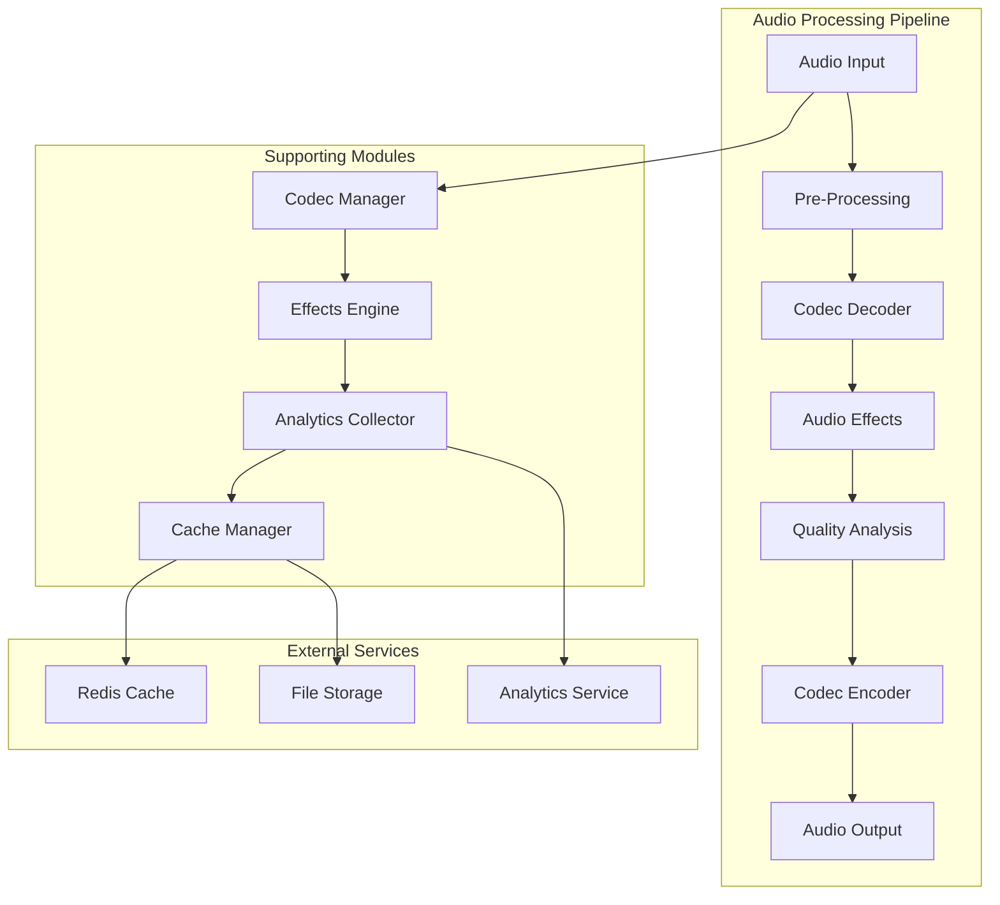
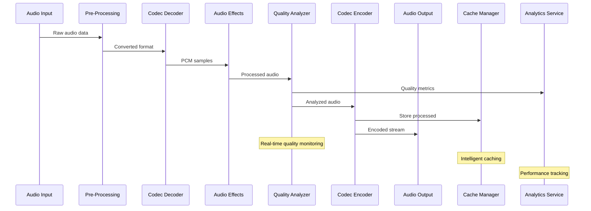

# 🎚️ Traitement Audio - Stream Server

## 🎯 Rôle et Responsabilités

Le module de traitement audio du Stream Server gère l'encodage, le décodage et le traitement des flux audio en temps réel avec une qualité professionnelle.

### Fonctionnalités Principales
- **Encodage multi-codecs** : MP3, AAC, Opus, FLAC avec qualité adaptative
- **Traitement d'effets** : Compression, égalisation, normalisation, réverbération
- **Analyse audio** : FFT, RMS, peak detection, spectrogramme
- **Détection intelligente** : Silence, coupures, anomalies de qualité
- **Optimisation performance** : Utilisation optimale du CPU et de la mémoire

## 🏗️ Architecture



## 🔧 Implémentation Technique

### Structure Principale

```rust
#[derive(Clone)]
pub struct AudioProcessor {
    codec_manager: Arc<CodecManager>,
    effects_engine: Arc<EffectsEngine>,
    analytics_collector: Arc<AnalyticsCollector>,
    cache_manager: Arc<CacheManager>,
    config: AudioConfig,
}

#[derive(Debug, Clone)]
pub struct AudioConfig {
    pub sample_rate: u32,
    pub channels: u16,
    pub bit_depth: u16,
    pub buffer_size: usize,
    pub enable_effects: bool,
    pub quality_presets: HashMap<String, QualityPreset>,
}

#[derive(Debug, Clone)]
pub struct QualityPreset {
    pub name: String,
    pub bitrate: u32,
    pub codec: AudioCodec,
    pub compression_ratio: f32,
    pub enable_normalization: bool,
    pub effects: Vec<AudioEffect>,
}

#[derive(Debug, Clone)]
pub enum AudioCodec {
    MP3 { quality: u8, bitrate: u32 },
    AAC { profile: AacProfile, bitrate: u32 },
    Opus { application: OpusApplication, bitrate: u32 },
    FLAC { compression_level: u8 },
}
```

### Pipeline de Traitement Audio

```rust
impl AudioProcessor {
    pub async fn process_audio_stream(
        &self,
        input_stream: AudioInputStream,
        output_config: &AudioConfig,
    ) -> Result<AudioOutputStream, AudioError> {
        let mut pipeline = AudioPipeline::new();
        
        // Étape 1: Pre-processing
        pipeline.add_stage(Box::new(PreProcessingStage {
            sample_rate_conversion: output_config.sample_rate != input_stream.sample_rate,
            channel_mixing: output_config.channels != input_stream.channels,
            bit_depth_conversion: output_config.bit_depth != input_stream.bit_depth,
        }));
        
        // Étape 2: Décodage du codec source
        let decoder = self.codec_manager.create_decoder(&input_stream.codec)?;
        pipeline.add_stage(Box::new(DecoderStage { decoder }));
        
        // Étape 3: Application des effets
        if self.config.enable_effects {
            for effect in &output_config.effects {
                let effect_processor = self.effects_engine.create_effect(effect)?;
                pipeline.add_stage(Box::new(EffectStage { effect_processor }));
            }
        }
        
        // Étape 4: Analyse de qualité
        pipeline.add_stage(Box::new(QualityAnalysisStage {
            analyzer: self.create_quality_analyzer(),
        }));
        
        // Étape 5: Encodage vers le codec cible
        let encoder = self.codec_manager.create_encoder(&output_config.codec)?;
        pipeline.add_stage(Box::new(EncoderStage { encoder }));
        
        // Exécution du pipeline
        let output_stream = pipeline.process(input_stream).await?;
        
        Ok(output_stream)
    }
}
```

### Gestion des Codecs

```rust
impl CodecManager {
    pub fn create_decoder(&self, codec: &AudioCodec) -> Result<Box<dyn AudioDecoder>, AudioError> {
        match codec {
            AudioCodec::MP3 { quality, bitrate } => {
                let decoder = Mp3Decoder::new(*quality, *bitrate)?;
                Ok(Box::new(decoder))
            }
            AudioCodec::AAC { profile, bitrate } => {
                let decoder = AacDecoder::new(*profile, *bitrate)?;
                Ok(Box::new(decoder))
            }
            AudioCodec::Opus { application, bitrate } => {
                let decoder = OpusDecoder::new(*application, *bitrate)?;
                Ok(Box::new(decoder))
            }
            AudioCodec::FLAC { compression_level } => {
                let decoder = FlacDecoder::new(*compression_level)?;
                Ok(Box::new(decoder))
            }
        }
    }
    
    pub fn create_encoder(&self, codec: &AudioCodec) -> Result<Box<dyn AudioEncoder>, AudioError> {
        match codec {
            AudioCodec::MP3 { quality, bitrate } => {
                let encoder = Mp3Encoder::new(*quality, *bitrate)?;
                Ok(Box::new(encoder))
            }
            AudioCodec::AAC { profile, bitrate } => {
                let encoder = AacEncoder::new(*profile, *bitrate)?;
                Ok(Box::new(encoder))
            }
            AudioCodec::Opus { application, bitrate } => {
                let encoder = OpusEncoder::new(*application, *bitrate)?;
                Ok(Box::new(encoder))
            }
            AudioCodec::FLAC { compression_level } => {
                let encoder = FlacEncoder::new(*compression_level)?;
                Ok(Box::new(encoder))
            }
        }
    }
}
```

### Moteur d'Effets Audio

```rust
#[derive(Debug, Clone)]
pub enum AudioEffect {
    Compression {
        threshold: f32,
        ratio: f32,
        attack: f32,
        release: f32,
    },
    Equalization {
        bands: Vec<EqBand>,
    },
    Normalization {
        target_level: f32,
        window_size: usize,
    },
    Reverb {
        room_size: f32,
        damping: f32,
        wet_level: f32,
        dry_level: f32,
    },
    Limiter {
        threshold: f32,
        release: f32,
    },
}

impl EffectsEngine {
    pub fn create_effect(&self, effect: &AudioEffect) -> Result<Box<dyn AudioEffectProcessor>, AudioError> {
        match effect {
            AudioEffect::Compression { threshold, ratio, attack, release } => {
                let processor = CompressionProcessor::new(*threshold, *ratio, *attack, *release);
                Ok(Box::new(processor))
            }
            AudioEffect::Equalization { bands } => {
                let processor = EqualizationProcessor::new(bands.clone());
                Ok(Box::new(processor))
            }
            AudioEffect::Normalization { target_level, window_size } => {
                let processor = NormalizationProcessor::new(*target_level, *window_size);
                Ok(Box::new(processor))
            }
            AudioEffect::Reverb { room_size, damping, wet_level, dry_level } => {
                let processor = ReverbProcessor::new(*room_size, *damping, *wet_level, *dry_level);
                Ok(Box::new(processor))
            }
            AudioEffect::Limiter { threshold, release } => {
                let processor = LimiterProcessor::new(*threshold, *release);
                Ok(Box::new(processor))
            }
        }
    }
}

// Exemple d'implémentation d'un effet de compression
pub struct CompressionProcessor {
    threshold: f32,
    ratio: f32,
    attack: f32,
    release: f32,
    envelope: f32,
}

impl AudioEffectProcessor for CompressionProcessor {
    fn process(&mut self, buffer: &mut [f32]) -> Result<(), AudioError> {
        for sample in buffer.iter_mut() {
            let input_level = sample.abs();
            
            // Calcul de l'enveloppe
            if input_level > self.envelope {
                self.envelope += (input_level - self.envelope) * self.attack;
            } else {
                self.envelope += (input_level - self.envelope) * self.release;
            }
            
            // Application de la compression
            if self.envelope > self.threshold {
                let over_threshold = self.envelope - self.threshold;
                let gain_reduction = over_threshold * (1.0 - 1.0 / self.ratio);
                let gain = (self.envelope - gain_reduction) / self.envelope;
                *sample *= gain;
            }
        }
        
        Ok(())
    }
}
```

## 📊 Analyse de Qualité Audio

```rust
#[derive(Debug, Clone)]
pub struct AudioQualityMetrics {
    pub rms_level: f32,
    pub peak_level: f32,
    pub dynamic_range: f32,
    pub signal_to_noise_ratio: f32,
    pub frequency_spectrum: Vec<f32>,
    pub silence_detected: bool,
    pub clipping_detected: bool,
    pub timestamp: DateTime<Utc>,
}

impl QualityAnalyzer {
    pub fn analyze_buffer(&mut self, buffer: &[f32]) -> AudioQualityMetrics {
        let mut metrics = AudioQualityMetrics {
            rms_level: 0.0,
            peak_level: 0.0,
            dynamic_range: 0.0,
            signal_to_noise_ratio: 0.0,
            frequency_spectrum: vec![],
            silence_detected: false,
            clipping_detected: false,
            timestamp: Utc::now(),
        };
        
        // Calcul RMS (Root Mean Square)
        let sum_squares: f32 = buffer.iter().map(|&x| x * x).sum();
        metrics.rms_level = (sum_squares / buffer.len() as f32).sqrt();
        
        // Calcul du peak
        metrics.peak_level = buffer.iter().map(|&x| x.abs()).fold(0.0, f32::max);
        
        // Détection de clipping
        metrics.clipping_detected = buffer.iter().any(|&x| x.abs() >= 1.0);
        
        // Détection de silence
        metrics.silence_detected = metrics.rms_level < 0.001;
        
        // Analyse spectrale (FFT)
        if buffer.len() >= 1024 {
            metrics.frequency_spectrum = self.compute_fft(&buffer[..1024]);
        }
        
        // Calcul du rapport signal/bruit
        metrics.signal_to_noise_ratio = self.compute_snr(buffer);
        
        metrics
    }
    
    fn compute_fft(&self, buffer: &[f32]) -> Vec<f32> {
        use rustfft::{FftPlanner, num_complex::Complex};
        
        let mut planner = FftPlanner::new();
        let fft = planner.plan_fft_forward(buffer.len());
        
        let mut buffer_complex: Vec<Complex<f32>> = buffer
            .iter()
            .map(|&x| Complex::new(x, 0.0))
            .collect();
        
        fft.process(&mut buffer_complex);
        
        // Conversion en magnitudes
        buffer_complex
            .iter()
            .take(buffer.len() / 2)
            .map(|c| (c.norm() / buffer.len() as f32).log10() * 20.0)
            .collect()
    }
    
    fn compute_snr(&self, buffer: &[f32]) -> f32 {
        let signal_power: f32 = buffer.iter().map(|&x| x * x).sum();
        let noise_power = self.estimate_noise_power(buffer);
        
        if noise_power > 0.0 {
            10.0 * (signal_power / noise_power).log10()
        } else {
            100.0 // SNR très élevé si pas de bruit
        }
    }
}
```

## 🔄 Flux de Traitement



## 🎛️ Configuration des Presets

```rust
impl AudioProcessor {
    pub fn create_quality_presets() -> HashMap<String, QualityPreset> {
        let mut presets = HashMap::new();
        
        // Preset pour streaming mobile
        presets.insert("mobile".to_string(), QualityPreset {
            name: "Mobile Streaming".to_string(),
            bitrate: 128_000,
            codec: AudioCodec::AAC {
                profile: AacProfile::LC,
                bitrate: 128_000,
            },
            compression_ratio: 0.8,
            enable_normalization: true,
            effects: vec![
                AudioEffect::Compression {
                    threshold: -20.0,
                    ratio: 4.0,
                    attack: 0.005,
                    release: 0.1,
                },
                AudioEffect::Limiter {
                    threshold: -1.0,
                    release: 0.05,
                },
            ],
        });
        
        // Preset pour streaming haute qualité
        presets.insert("hifi".to_string(), QualityPreset {
            name: "High Fidelity".to_string(),
            bitrate: 320_000,
            codec: AudioCodec::FLAC {
                compression_level: 5,
            },
            compression_ratio: 0.95,
            enable_normalization: false,
            effects: vec![
                AudioEffect::Equalization {
                    bands: vec![
                        EqBand { frequency: 60.0, gain: 0.0, q: 1.0 },
                        EqBand { frequency: 1000.0, gain: 0.0, q: 1.0 },
                        EqBand { frequency: 10000.0, gain: 0.0, q: 1.0 },
                    ],
                },
            ],
        });
        
        // Preset pour podcast
        presets.insert("podcast".to_string(), QualityPreset {
            name: "Podcast Optimized".to_string(),
            bitrate: 192_000,
            codec: AudioCodec::MP3 {
                quality: 0,
                bitrate: 192_000,
            },
            compression_ratio: 0.85,
            enable_normalization: true,
            effects: vec![
                AudioEffect::Compression {
                    threshold: -18.0,
                    ratio: 3.0,
                    attack: 0.01,
                    release: 0.15,
                },
                AudioEffect::Equalization {
                    bands: vec![
                        EqBand { frequency: 80.0, gain: -3.0, q: 1.0 },   // Réduction des basses
                        EqBand { frequency: 250.0, gain: 2.0, q: 1.0 },   // Amélioration de la voix
                        EqBand { frequency: 8000.0, gain: 1.0, q: 1.0 },  // Clarté
                    ],
                },
                AudioEffect::Normalization {
                    target_level: -16.0,
                    window_size: 1000,
                },
            ],
        });
        
        presets
    }
}
```

## 🚀 Optimisations Performance

### Pool de Buffers

```rust
#[derive(Clone)]
pub struct AudioBufferPool {
    buffers: Arc<Mutex<VecDeque<Vec<f32>>>>,
    buffer_size: usize,
    max_pool_size: usize,
}

impl AudioBufferPool {
    pub fn new(buffer_size: usize, max_pool_size: usize) -> Self {
        Self {
            buffers: Arc::new(Mutex::new(VecDeque::new())),
            buffer_size,
            max_pool_size,
        }
    }
    
    pub async fn acquire(&self) -> AudioBuffer {
        let mut buffers = self.buffers.lock().await;
        
        if let Some(mut buffer) = buffers.pop_front() {
            buffer.clear();
            buffer.resize(self.buffer_size, 0.0);
            AudioBuffer::Reused(buffer)
        } else {
            AudioBuffer::New(vec![0.0; self.buffer_size])
        }
    }
    
    pub async fn release(&self, mut buffer: Vec<f32>) {
        let mut buffers = self.buffers.lock().await;
        
        if buffers.len() < self.max_pool_size {
            buffer.clear();
            buffers.push_back(buffer);
        }
    }
}

pub enum AudioBuffer {
    New(Vec<f32>),
    Reused(Vec<f32>),
}
```

### Traitement Parallèle

```rust
impl AudioProcessor {
    pub async fn process_parallel(
        &self,
        input_streams: Vec<AudioInputStream>,
        output_config: &AudioConfig,
    ) -> Result<Vec<AudioOutputStream>, AudioError> {
        let mut handles = vec![];
        
        for input_stream in input_streams {
            let processor = self.clone();
            let config = output_config.clone();
            
            let handle = tokio::spawn(async move {
                processor.process_audio_stream(input_stream, &config).await
            });
            
            handles.push(handle);
        }
        
        let mut results = vec![];
        for handle in handles {
            let result = handle.await.map_err(|e| AudioError::ProcessingError(e.to_string()))??;
            results.push(result);
        }
        
        Ok(results)
    }
}
```

## 🧪 Tests

### Tests Unitaires

```rust
#[cfg(test)]
mod tests {
    use super::*;
    
    #[tokio::test]
    async fn test_audio_processing_pipeline() {
        let processor = create_test_audio_processor().await;
        
        // Création d'un signal de test (sinusoïde 440Hz)
        let sample_rate = 44100;
        let duration = 1.0; // 1 seconde
        let frequency = 440.0;
        let samples = (0..(sample_rate as f32 * duration) as usize)
            .map(|i| {
                let t = i as f32 / sample_rate as f32;
                (2.0 * std::f32::consts::PI * frequency * t).sin() * 0.5
            })
            .collect::<Vec<f32>>();
        
        let input_stream = AudioInputStream {
            data: samples,
            sample_rate,
            channels: 1,
            bit_depth: 16,
            codec: AudioCodec::FLAC { compression_level: 5 },
        };
        
        let output_config = AudioConfig {
            sample_rate: 48000,
            channels: 2,
            bit_depth: 24,
            buffer_size: 1024,
            enable_effects: true,
            quality_presets: HashMap::new(),
        };
        
        let output_stream = processor.process_audio_stream(input_stream, &output_config).await.unwrap();
        
        assert_eq!(output_stream.sample_rate, 48000);
        assert_eq!(output_stream.channels, 2);
        assert_eq!(output_stream.bit_depth, 24);
        assert!(!output_stream.data.is_empty());
    }
    
    #[tokio::test]
    async fn test_compression_effect() {
        let mut compressor = CompressionProcessor::new(-20.0, 4.0, 0.005, 0.1);
        
        // Signal de test avec des pics
        let mut buffer = vec![0.1; 1000];
        buffer[500] = 0.8; // Pic à 80%
        
        compressor.process(&mut buffer).unwrap();
        
        // Vérification que le pic a été compressé
        assert!(buffer[500] < 0.8);
        
        // Vérification que les autres échantillons sont peu affectés
        let avg_level: f32 = buffer.iter().sum::<f32>() / buffer.len() as f32;
        assert!((avg_level - 0.1).abs() < 0.05);
    }
    
    #[tokio::test]
    async fn test_quality_analysis() {
        let mut analyzer = QualityAnalyzer::new();
        
        // Signal de test
        let buffer: Vec<f32> = (0..1024)
            .map(|i| {
                let t = i as f32 / 1024.0;
                (2.0 * std::f32::consts::PI * 440.0 * t).sin() * 0.5
            })
            .collect();
        
        let metrics = analyzer.analyze_buffer(&buffer);
        
        assert!(metrics.rms_level > 0.0);
        assert!(metrics.peak_level <= 0.5);
        assert!(!metrics.silence_detected);
        assert!(!metrics.clipping_detected);
        assert!(!metrics.frequency_spectrum.is_empty());
    }
}
```

## 📈 Monitoring et Métriques

### Métriques de Performance

```rust
#[derive(Debug, Clone)]
pub struct AudioPerformanceMetrics {
    pub processing_time_ms: f64,
    pub cpu_usage_percent: f64,
    pub memory_usage_mb: f64,
    pub buffer_underruns: u64,
    pub buffer_overruns: u64,
    pub quality_score: f64,
    pub timestamp: DateTime<Utc>,
}

impl AudioProcessor {
    pub async fn collect_performance_metrics(&self) -> AudioPerformanceMetrics {
        let start_time = Instant::now();
        
        // Simulation de traitement
        self.simulate_processing().await;
        
        let processing_time = start_time.elapsed().as_micros() as f64 / 1000.0;
        
        AudioPerformanceMetrics {
            processing_time_ms: processing_time,
            cpu_usage_percent: self.get_cpu_usage().await,
            memory_usage_mb: self.get_memory_usage().await,
            buffer_underruns: self.buffer_underruns.load(Ordering::Relaxed),
            buffer_overruns: self.buffer_overruns.load(Ordering::Relaxed),
            quality_score: self.calculate_quality_score().await,
            timestamp: Utc::now(),
        }
    }
}
```

Ce module de traitement audio assure une qualité professionnelle tout en optimisant les performances pour le streaming en temps réel. 