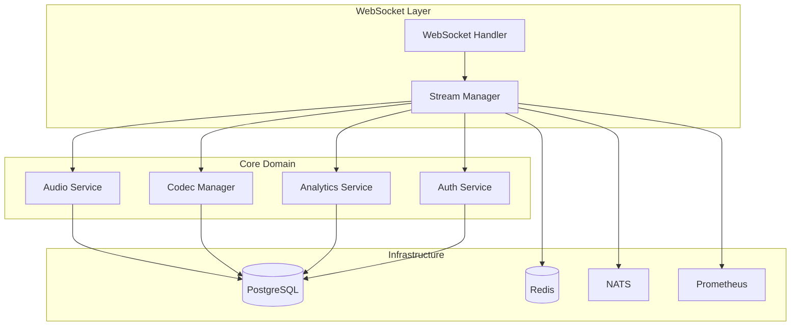

# 🎵 Stream Server Rust - Vue d'ensemble

## 🎯 Objectif

Le Stream Server Rust gère le streaming audio en temps réel, l'encodage multi-bitrate, la synchronisation multi-clients et l'analytics pour la plateforme Veza. Il est conçu pour la performance, la résilience et la scalabilité.

## 🏗️ Architecture

### Structure du Projet
```
veza-stream-server/
├── src/
│   ├── streaming/      # Logique de streaming audio
│   ├── audio/          # Traitement audio, codecs
│   ├── codecs/         # Support multi-codecs (MP3, AAC, Opus)
│   ├── analytics/      # Analytics et statistiques
│   ├── monitoring/     # Métriques et observabilité
│   ├── grpc/           # Services gRPC
│   ├── auth/           # Authentification
│   ├── cache/          # Cache Redis
│   ├── config/         # Configuration
│   └── main.rs         # Entrée principale
├── proto/              # Protobuf (stream, auth)
├── dashboards/         # Dashboards Grafana
├── scripts/            # Scripts de maintenance/tests
```

### Architecture interne


## 🔧 Technologies Utilisées
- **Rust 1.70+**
- **Axum** : Framework web moderne
- **Tokio** : Runtime asynchrone
- **Tokio-tungstenite** : WebSocket performant
- **SQLx** : ORM asynchrone PostgreSQL
- **Redis** : Cache, sessions, pub/sub
- **Symphonia, Hound, Minimp3, Rubato** : Traitement audio/codecs
- **Prometheus** : Métriques
- **Tracing** : Logs structurés
- **NATS** : Message queue
- **JWT, Argon2, bcrypt** : Authentification et sécurité

## 📊 Métriques Clés
- **Streams actifs**
- **Bitrate moyen**
- **Latence streaming**
- **Utilisateurs connectés**
- **Taux d'erreur**
- **Buffering events**
- **Analytics listeners**

## 🔐 Sécurité
- **JWT** pour l'authentification
- **Rate limiting** par IP/utilisateur
- **Validation des fichiers audio** (type, taille, contenu)
- **Audit log** pour actions critiques
- **Protection CSRF sur endpoints sensibles**
- **Chiffrement des données sensibles**

## 🚀 Déploiement
- **Docker**
- **Kubernetes** (Helm chart)
- **Health checks**
- **Readiness/liveness probes**

## 📚 API WebSocket & Streaming
- **Connexion** : `ws(s)://<host>/ws`
- **Authentification** : JWT dans l'URL ou header
- **Événements** :
  - `stream.start`, `stream.stop`, `stream.metadata`, `stream.status`, ...
  - `audio.data` (binaire)
  - `analytics.update`
- **Support multi-bitrate**
- **Synchronisation multi-clients**
- **Recording, playback, analytics**

## 🔄 Communication Inter-Services
- **gRPC** : Auth, analytics, stream
- **NATS** : Events asynchrones
- **Redis** : Pub/Sub, cache

## 🧪 Tests
- **Unitaires** (logique métier)
- **Intégration** (WebSocket, DB, Redis, audio)
- **E2E** (scénarios utilisateur)
- **Charge** (k6, vegeta)
- **Coverage** : 70%+

## 📈 Monitoring & Alerting
- **Prometheus** : Métriques custom
- **Grafana** : Dashboards
- **Alertes** : erreurs, latence, streams

## 📝 Logs
- **Structured JSON** (tracing)
- **Audit log** actions critiques

---

*Dernière mise à jour : 2024-01-01*
*Version : 0.2.0* 