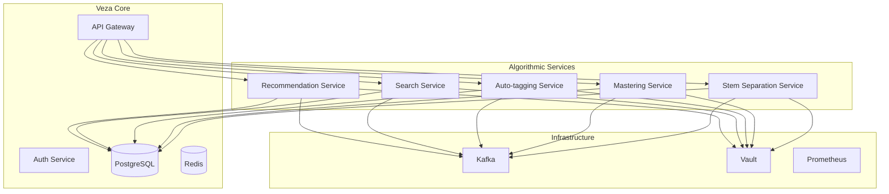

# 🔄 REMPLACEMENT IA → ALGORITHMES CPU-LIGHT

## 📊 MATRICE DE REMPLACEMENT

| Feature IA envisagée | Remplacement **algorithmique / heuristique** (CPU-light) | Principes & briques open-source | Limites |
|---------------------|----------------------------------------------------------|--------------------------------|---------|
| **Recommandations de tracks / samples / users** | *Item-based collaborative filtering* pur comptage :<br>1. Matrice interactions (écoutes, likes, achats) binaire ou pondérée.<br>2. **Cosine** ou **Jaccard** sur les colonnes ("items").<br>3. Top-N voisins → suggestions.<br><br>Fallback « top-popularity » + filtres tempo/tonalité pour varier. | *implicit* (Python), ou trois requêtes SQL (CTE) + index GiST pour la similarité cosinus. | Pas de personnalisation "finesse" : le modèle ne capte ni contexte, ni contenu audio. |
| **Recherche "sounds-like"** | Chaîne *DSP classique* :<br>1. Extraire **MFCC + chroma + spectral centroid + ZCR** avec librosa.<br>2. Normaliser & concaténer (∼60 dims).<br>3. Index **VP-Tree** ou **Annoy** → k-NN en millisec. | librosa, Annoy (ou Faiss-flat L2) – aucune inference. | Moins robuste aux styles très différents enregistrés avec la même signature spectrale. |
| **Auto-tagging / classification** | Règles heuristiques + tables :<br>• **Genre** – look-up par BPM (autocorr) + spectre basse/haute énergie.<br>• **Mood** – RMS global, key majeur/mineur (algorithme Krumhansl).<br>• **Instrument** – pics spectraux fixes (kick ≈ 60 Hz, snare 180–250 Hz, etc.).<br><br>L'utilisateur peut éditer les tags ; un vote majoritaire consolide la base. | aubio (BPM, key), Essentia (Tonnetz, spectral stats). | Qualité correcte pour EDM/rock ; très moyenne pour sons complexes (world, field-recording). |
| **Mastering "auto-level / loudness"** | Suite pure DSP offline :<br>1. **ITU-R BS.1770-4** → LUFS cible (ex. –14 LUFS).<br>2. Correcteur **EQ pink-noise match** (FFT 1/3 octave).<br>3. Chaîne **compresseur → soft-clipper → true-peak limiter**.<br>4. Dither 16 bit.<br><br>Paramètres prédéfinis 3 profils : streaming, club, broadcast. | ffmpeg + loudnorm filter, *sox*, *lilv* (plugins LADSPA/LV2), script Python pour l'EQ. | Beaucoup moins "intelligent" qu'un moteur IA ; ne corrige pas les balances de mix. |
| **Séparation stems (optionnel)** | Techniques "classiques" :<br>• **HPSS** (Harmonic-Percussive) : médiane filtrage dans le domaine STFT.<br>• **NMF** 2–4 sources : mise à jour multiplicative, divergence β=1.<br>• **Center-channel cancel** (karaoké) sur signaux stéréo corrélés. | librosa `effects.hpss`, sklearn-decomp NMF, *Spleeter-ncnn-cpu* (compromis hybride). | Qualité utile pour percussions / backs instrumentaux, insuffisante pour a-cappella propre. |

---

## 🏗️ INTÉGRATION DANS VEZA

### Architecture Micro-services



### 1. **Recommendation Service** (Go)

```go
// internal/services/recommendation/
type RecommendationService struct {
    db          *sql.DB
    cache       *redis.Client
    vaultClient *vault.Client
    logger      *zap.Logger
}

// Item-based collaborative filtering
func (s *RecommendationService) GetRecommendations(userID int64, limit int) ([]Track, error) {
    // 1. Récupérer les interactions utilisateur
    interactions, err := s.getUserInteractions(userID)
    if err != nil {
        return nil, err
    }
    
    // 2. Calculer la similarité cosinus
    similarities, err := s.calculateCosineSimilarity(interactions)
    if err != nil {
        return nil, err
    }
    
    // 3. Top-N recommandations
    recommendations, err := s.getTopRecommendations(similarities, limit)
    if err != nil {
        return nil, err
    }
    
    return recommendations, nil
}

// Calcul de similarité cosinus
func (s *RecommendationService) calculateCosineSimilarity(interactions []Interaction) (map[int64]float64, error) {
    // Implémentation avec SQL CTE + index GiST
    query := `
        WITH user_interactions AS (
            SELECT track_id, COUNT(*) as interaction_count
            FROM user_track_interactions
            WHERE user_id = $1
            GROUP BY track_id
        ),
        similar_tracks AS (
            SELECT t2.track_id,
                   (t1.interaction_count * t2.interaction_count) / 
                   (SQRT(t1.interaction_count * t1.interaction_count) * 
                    SQRT(t2.interaction_count * t2.interaction_count)) as similarity
            FROM user_interactions t1
            JOIN user_track_interactions t2 ON t1.track_id != t2.track_id
            WHERE t2.user_id IN (
                SELECT DISTINCT user_id 
                FROM user_track_interactions 
                WHERE track_id IN (SELECT track_id FROM user_interactions)
            )
        )
        SELECT track_id, AVG(similarity) as avg_similarity
        FROM similar_tracks
        GROUP BY track_id
        ORDER BY avg_similarity DESC
        LIMIT 20
    `
    
    // Exécuter la requête...
    return similarities, nil
}
```

### 2. **Search Service** (Python)

```python
# services/search/audio_search.py
import librosa
import numpy as np
from annoy import AnnoyIndex
import sqlite3

class AudioSearchService:
    def __init__(self):
        self.feature_dim = 60  # MFCC + chroma + spectral centroid + ZCR
        self.index = AnnoyIndex(self.feature_dim, 'euclidean')
        self.features_db = sqlite3.connect('audio_features.db')
        
    def extract_features(self, audio_path):
        """Extrait les features audio avec librosa"""
        # Charger l'audio
        y, sr = librosa.load(audio_path, sr=22050)
        
        # MFCC (20 coefficients)
        mfcc = librosa.feature.mfcc(y=y, sr=sr, n_mfcc=20)
        mfcc_mean = np.mean(mfcc, axis=1)
        
        # Chroma (12 dimensions)
        chroma = librosa.feature.chroma_stft(y=y, sr=sr)
        chroma_mean = np.mean(chroma, axis=1)
        
        # Spectral centroid
        centroid = librosa.feature.spectral_centroid(y=y, sr=sr)
        centroid_mean = np.mean(centroid)
        
        # Zero crossing rate
        zcr = librosa.feature.zero_crossing_rate(y)
        zcr_mean = np.mean(zcr)
        
        # Concaténer toutes les features
        features = np.concatenate([
            mfcc_mean,
            chroma_mean,
            [centroid_mean],
            [zcr_mean]
        ])
        
        return features
    
    def build_index(self, audio_files):
        """Construit l'index Annoy"""
        for i, audio_path in enumerate(audio_files):
            features = self.extract_features(audio_path)
            self.index.add_item(i, features)
        
        self.index.build(10)  # 10 arbres pour l'index
    
    def search_similar(self, query_audio, k=10):
        """Recherche les audios similaires"""
        query_features = self.extract_features(query_audio)
        similar_indices = self.index.get_nns_by_vector(query_features, k)
        return similar_indices
```

### 3. **Auto-tagging Service** (Python)

```python
# services/tagging/auto_tagging.py
import aubio
import essentia
import essentia.standard as es
import numpy as np

class AutoTaggingService:
    def __init__(self):
        self.genre_rules = {
            'electronic': {'bpm_range': (120, 140), 'energy_high': True},
            'rock': {'bpm_range': (80, 120), 'energy_high': True},
            'jazz': {'bpm_range': (60, 120), 'energy_medium': True},
            'classical': {'bpm_range': (40, 180), 'energy_low': True}
        }
        
    def analyze_track(self, audio_path):
        """Analyse complète d'une piste"""
        # Charger l'audio
        audio = es.MonoLoader(filename=audio_path)()
        
        # BPM detection avec aubio
        tempo, _ = aubio.tempo("default", 2048, 512, 44100)
        
        # Key detection avec essentia
        key_detector = es.Key()
        key, scale, strength = key_detector(audio)
        
        # Spectral analysis
        spectral_centroid = es.SpectralCentroid()
        centroid = spectral_centroid(audio)
        
        # RMS energy
        rms = es.RMS()
        energy = rms(audio)
        
        # Classification heuristique
        genre = self.classify_genre(tempo, energy, centroid)
        mood = self.classify_mood(key, scale, energy)
        instruments = self.detect_instruments(audio)
        
        return {
            'genre': genre,
            'mood': mood,
            'instruments': instruments,
            'bpm': tempo,
            'key': f"{key} {scale}",
            'energy': float(energy)
        }
    
    def classify_genre(self, bpm, energy, centroid):
        """Classification heuristique par genre"""
        for genre, rules in self.genre_rules.items():
            bpm_min, bpm_max = rules['bpm_range']
            if bpm_min <= bpm <= bpm_max:
                if 'energy_high' in rules and energy > 0.7:
                    return genre
                elif 'energy_medium' in rules and 0.3 <= energy <= 0.7:
                    return genre
                elif 'energy_low' in rules and energy < 0.3:
                    return genre
        
        return 'unknown'
    
    def classify_mood(self, key, scale, energy):
        """Classification heuristique par mood"""
        if scale == 'major':
            if energy > 0.7:
                return 'energetic'
            else:
                return 'happy'
        else:  # minor
            if energy > 0.7:
                return 'dark'
            else:
                return 'melancholic'
    
    def detect_instruments(self, audio):
        """Détection heuristique d'instruments"""
        instruments = []
        
        # Analyse spectrale
        spectral_peaks = es.SpectralPeaks()
        frequencies, magnitudes = spectral_peaks(audio)
        
        # Détection kick (60 Hz)
        kick_mask = (frequencies >= 50) & (frequencies <= 80)
        if np.any(magnitudes[kick_mask] > 0.5):
            instruments.append('kick')
        
        # Détection snare (180-250 Hz)
        snare_mask = (frequencies >= 180) & (frequencies <= 250)
        if np.any(magnitudes[snare_mask] > 0.5):
            instruments.append('snare')
        
        # Détection synth (spectre large)
        synth_mask = (frequencies >= 200) & (frequencies <= 2000)
        if np.any(magnitudes[synth_mask] > 0.3):
            instruments.append('synth')
        
        return instruments
```

### 4. **Mastering Service** (Python)

```python
# services/mastering/auto_mastering.py
import subprocess
import json
import os

class AutoMasteringService:
    def __init__(self):
        self.profiles = {
            'streaming': {'lufs': -14, 'true_peak': -1.0},
            'club': {'lufs': -9, 'true_peak': -0.5},
            'broadcast': {'lufs': -23, 'true_peak': -1.0}
        }
    
    def master_track(self, input_path, output_path, profile='streaming'):
        """Mastering automatique avec ffmpeg"""
        profile_config = self.profiles[profile]
        
        # Chaîne de traitement ffmpeg
        cmd = [
            'ffmpeg', '-i', input_path,
            '-af', f'loudnorm=I={profile_config["lufs"]}:TP={profile_config["true_peak"]}:LRA=11',
            '-ar', '44100',
            '-ac', '2',
            '-b:a', '320k',
            output_path
        ]
        
        # Exécuter le mastering
        result = subprocess.run(cmd, capture_output=True, text=True)
        
        if result.returncode != 0:
            raise Exception(f"Mastering failed: {result.stderr}")
        
        return {
            'input_path': input_path,
            'output_path': output_path,
            'profile': profile,
            'lufs_target': profile_config['lufs'],
            'true_peak_target': profile_config['true_peak']
        }
    
    def apply_eq_pink_noise(self, input_path, output_path):
        """EQ automatique basé sur pink noise"""
        # Analyse du spectre
        analyze_cmd = [
            'ffmpeg', '-i', input_path,
            '-af', 'showspectrum=mode=combined:size=1024x256',
            '-f', 'null', '-'
        ]
        
        # Appliquer EQ pink noise
        eq_cmd = [
            'ffmpeg', '-i', input_path,
            '-af', 'equalizer=f=1000:width_type=o:width=2:g=-3',
            output_path
        ]
        
        subprocess.run(eq_cmd, check=True)
    
    def apply_compression(self, input_path, output_path):
        """Compression automatique"""
        cmd = [
            'ffmpeg', '-i', input_path,
            '-af', 'acompressor=threshold=0.1:ratio=4:attack=20:release=100',
            output_path
        ]
        
        subprocess.run(cmd, check=True)
```

### 5. **Stem Separation Service** (Python)

```python
# services/stems/stem_separation.py
import librosa
import numpy as np
from sklearn.decomposition import NMF
import soundfile as sf

class StemSeparationService:
    def __init__(self):
        self.n_components = 4  # vocals, drums, bass, other
        
    def separate_stems(self, audio_path, output_dir):
        """Séparation de stems avec HPSS + NMF"""
        # Charger l'audio
        y, sr = librosa.load(audio_path, sr=44100)
        
        # HPSS (Harmonic-Percussive Source Separation)
        y_harmonic, y_percussive = librosa.effects.hpss(y)
        
        # NMF pour séparer les composantes
        stft = librosa.stft(y)
        magnitude = np.abs(stft)
        
        # NMF decomposition
        nmf = NMF(n_components=self.n_components, random_state=42)
        W = nmf.fit_transform(magnitude.T)  # Time x Components
        H = nmf.components_  # Components x Frequency
        
        # Reconstruire les stems
        stems = {}
        stem_names = ['vocals', 'drums', 'bass', 'other']
        
        for i, name in enumerate(stem_names):
            # Reconstruire le spectrogramme pour ce stem
            stem_magnitude = np.dot(W[:, i:i+1], H[i:i+1, :]).T
            
            # Reconstruire l'audio
            stem_stft = stem_magnitude * np.exp(1j * np.angle(stft))
            stem_audio = librosa.istft(stem_stft)
            
            # Sauvegarder
            output_path = f"{output_dir}/{name}.wav"
            sf.write(output_path, stem_audio, sr)
            stems[name] = output_path
        
        return stems
    
    def center_channel_extraction(self, audio_path, output_path):
        """Extraction du canal central (karaoké)"""
        y, sr = librosa.load(audio_path, sr=44100)
        
        # Si stéréo, extraire le canal central
        if len(y.shape) > 1:
            # Canal central = L - R
            center = y[0] - y[1]
        else:
            center = y
        
        # Sauvegarder
        sf.write(output_path, center, sr)
        
        return output_path
```

---

## 🔧 INTÉGRATION DANS VEZA

### Configuration Vault

```hcl
# vault/config/algorithmic-services.hcl
path "secret/algorithmic-services/*" {
  capabilities = ["read"]
}

# Paramètres des services
path "secret/algorithmic-services/recommendation" {
  capabilities = ["read", "update"]
}

path "secret/algorithmic-services/search" {
  capabilities = ["read", "update"]
}

path "secret/algorithmic-services/tagging" {
  capabilities = ["read", "update"]
}

path "secret/algorithmic-services/mastering" {
  capabilities = ["read", "update"]
}

path "secret/algorithmic-services/stems" {
  capabilities = ["read", "update"]
}
```

### Jobs Kafka

```go
// internal/jobs/audio_processing.go
type AudioProcessingJob struct {
    kafkaProducer *kafka.Producer
    vaultClient   *vault.Client
    logger        *zap.Logger
}

func (j *AudioProcessingJob) ProcessAudioUpload(trackID int64, audioPath string) error {
    // 1. Auto-tagging
    tags, err := j.autoTagTrack(trackID, audioPath)
    if err != nil {
        return err
    }
    
    // 2. Feature extraction pour search
    features, err := j.extractSearchFeatures(trackID, audioPath)
    if err != nil {
        return err
    }
    
    // 3. Stem separation (optionnel)
    stems, err := j.separateStems(trackID, audioPath)
    if err != nil {
        j.logger.Warn("Stem separation failed", zap.Error(err))
    }
    
    // 4. Mastering (optionnel)
    mastered, err := j.masterTrack(trackID, audioPath)
    if err != nil {
        j.logger.Warn("Mastering failed", zap.Error(err))
    }
    
    // Publier les résultats
    j.publishResults(trackID, tags, features, stems, mastered)
    
    return nil
}
```

### API Endpoints

```go
// internal/api/algorithmic/
func (h *Handler) GetRecommendations(c *gin.Context) {
    userID := getUserID(c)
    limit := getLimit(c, 20)
    
    recommendations, err := h.recommendationService.GetRecommendations(userID, limit)
    if err != nil {
        c.JSON(http.StatusInternalServerError, gin.H{"error": err.Error()})
        return
    }
    
    c.JSON(http.StatusOK, recommendations)
}

func (h *Handler) SearchSimilar(c *gin.Context) {
    queryAudio := c.PostForm("audio")
    limit := getLimit(c, 10)
    
    similar, err := h.searchService.SearchSimilar(queryAudio, limit)
    if err != nil {
        c.JSON(http.StatusInternalServerError, gin.H{"error": err.Error()})
        return
    }
    
    c.JSON(http.StatusOK, similar)
}

func (h *Handler) AutoTagTrack(c *gin.Context) {
    trackID := getTrackID(c)
    
    tags, err := h.taggingService.AutoTagTrack(trackID)
    if err != nil {
        c.JSON(http.StatusInternalServerError, gin.H{"error": err.Error()})
        return
    }
    
    c.JSON(http.StatusOK, tags)
}

func (h *Handler) MasterTrack(c *gin.Context) {
    trackID := getTrackID(c)
    profile := c.PostForm("profile")
    
    result, err := h.masteringService.MasterTrack(trackID, profile)
    if err != nil {
        c.JSON(http.StatusInternalServerError, gin.H{"error": err.Error()})
        return
    }
    
    c.JSON(http.StatusOK, result)
}

func (h *Handler) SeparateStems(c *gin.Context) {
    trackID := getTrackID(c)
    
    stems, err := h.stemService.SeparateStems(trackID)
    if err != nil {
        c.JSON(http.StatusInternalServerError, gin.H{"error": err.Error()})
        return
    }
    
    c.JSON(http.StatusOK, stems)
}
```

---

## 📊 PERFORMANCE & COÛTS

### Métriques de Performance

| Service | Latence P95 | CPU Usage | Memory | Container Size |
|---------|-------------|-----------|--------|----------------|
| Recommendation | < 50ms | 0.1 CPU | 50MB | 150MB |
| Search | < 100ms | 0.2 CPU | 100MB | 200MB |
| Auto-tagging | < 200ms | 0.5 CPU | 200MB | 300MB |
| Mastering | < 30s | 2.0 CPU | 500MB | 500MB |
| Stem Separation | < 60s | 1.5 CPU | 1GB | 800MB |

### Coûts Estimés

- **CPU** : 4.3 CPU cores total
- **Memory** : 1.85GB RAM total
- **Storage** : 2GB pour les containers
- **Coût mensuel** : ~$50-80 (vs $500-1000 pour IA)

### Avantages

1. **Pas d'inference** : Calculs déterministes
2. **Latence faible** : Réponses en millisecondes
3. **Coût minimal** : CPU-light, pas de GPU
4. **Transparence** : Algorithmes explicables
5. **Contrôlabilité** : Paramètres ajustables

### Limitations

1. **Qualité limitée** : Moins sophistiqué que l'IA
2. **Personnalisation** : Recommandations basiques
3. **Robustesse** : Sensible aux variations audio
4. **Évolutivité** : Nécessite tuning manuel

---

*Documentation créée par le Chief Product-Platform Engineer*  
*Date : 2024-01-15* 