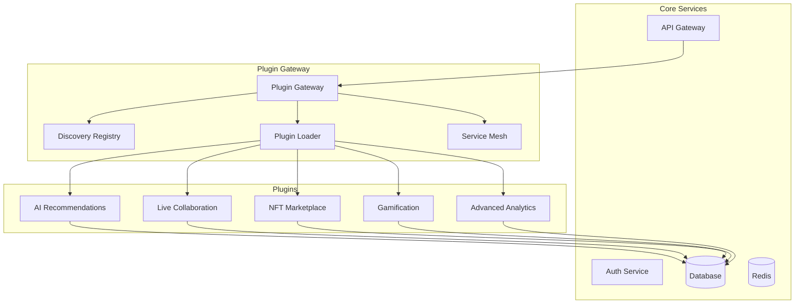

# ADR-001: Plugin Gateway Architecture

## Status
Proposed

## Context
Veza doit supporter un grand nombre de features innovantes tout en maintenant performance, coût et simplicité d'opération. L'architecture actuelle monolithique ne permet pas l'ajout de nouvelles fonctionnalités sans impact sur l'ensemble du système.

## Decision
Implémenter une architecture de **Plugin Gateway** avec découverte dynamique et isolation complète des modules.

## Architecture

### Plugin Gateway Core


### Composants

#### 1. Plugin Gateway
```go
type PluginGateway struct {
    registry    *DiscoveryRegistry
    loader      *PluginLoader
    serviceMesh *ServiceMesh
    config      *GatewayConfig
}

type GatewayConfig struct {
    MaxPlugins        int           `json:"max_plugins"`
    PluginTimeout     time.Duration `json:"plugin_timeout"`
    CircuitBreaker    CircuitBreakerConfig
    RateLimiting      RateLimitConfig
    FeatureFlags      FeatureFlagConfig
}
```

#### 2. Discovery Registry
```go
type DiscoveryRegistry struct {
    plugins map[string]*PluginInfo
    mutex   sync.RWMutex
}

type PluginInfo struct {
    ID          string            `json:"id"`
    Name        string            `json:"name"`
    Version     string            `json:"version"`
    Status      PluginStatus      `json:"status"`
    Endpoints   []PluginEndpoint  `json:"endpoints"`
    Metadata    map[string]string `json:"metadata"`
    HealthCheck HealthCheck       `json:"health_check"`
}

type PluginStatus string
const (
    PluginStatusActive   PluginStatus = "active"
    PluginStatusInactive PluginStatus = "inactive"
    PluginStatusFailed   PluginStatus = "failed"
    PluginStatusLoading  PluginStatus = "loading"
)
```

#### 3. Plugin Loader
```go
type PluginLoader struct {
    sandbox    *SandboxManager
    wasmEngine *WasmEngine
    docker     *DockerManager
}

type SandboxManager struct {
    resources ResourceLimits
    network   NetworkIsolation
    security  SecurityContext
}

type ResourceLimits struct {
    CPU    float64 `json:"cpu_cores"`
    Memory int64   `json:"memory_mb"`
    Disk   int64   `json:"disk_mb"`
    Network int64  `json:"network_mbps"`
}
```

#### 4. Service Mesh
```go
type ServiceMesh struct {
    circuitBreaker *CircuitBreaker
    rateLimiter    *RateLimiter
    loadBalancer   *LoadBalancer
    observability  *Observability
}

type CircuitBreaker struct {
    FailureThreshold int           `json:"failure_threshold"`
    Timeout          time.Duration `json:"timeout"`
    HalfOpenLimit    int           `json:"half_open_limit"`
}
```

## Plugin Contract

### Interface Standard
```go
type Plugin interface {
    // Lifecycle
    Initialize(config PluginConfig) error
    Start() error
    Stop() error
    HealthCheck() HealthStatus
    
    // Communication
    HandleRequest(req PluginRequest) (*PluginResponse, error)
    HandleEvent(event DomainEvent) error
    
    // Metadata
    GetInfo() PluginInfo
    GetMetrics() PluginMetrics
}

type PluginRequest struct {
    ID        string                 `json:"id"`
    Method    string                 `json:"method"`
    Path      string                 `json:"path"`
    Headers   map[string]string      `json:"headers"`
    Body      interface{}            `json:"body"`
    UserID    int64                  `json:"user_id"`
    Context   map[string]interface{} `json:"context"`
}

type PluginResponse struct {
    StatusCode int                    `json:"status_code"`
    Headers    map[string]string      `json:"headers"`
    Body       interface{}            `json:"body"`
    Metadata   map[string]interface{} `json:"metadata"`
}
```

### Plugin Manifest
```yaml
# plugin.yaml
name: ai-recommendations
version: 1.0.0
description: AI-powered music recommendations
author: Veza Team
license: MIT

runtime:
  type: wasm
  version: 1.0

resources:
  cpu: 0.5
  memory: 512
  disk: 100

endpoints:
  - path: /recommendations
    method: GET
    auth: required
    rate_limit: 100/min
    
  - path: /recommendations/users/{user_id}/activity
    method: POST
    auth: required
    rate_limit: 50/min

dependencies:
  - service: user-profile
    version: ">=1.0.0"
  - service: track-analytics
    version: ">=1.0.0"

feature_flags:
  - name: enable_ml_model
    default: false
    description: Enable advanced ML model

health_check:
  endpoint: /health
  interval: 30s
  timeout: 5s
```

## Implementation Strategy

### Phase 1: Core Gateway (2-3 weeks)
1. **Plugin Gateway Core**
   - Discovery registry avec Consul/etcd
   - Plugin loader avec sandboxing
   - Service mesh basique
   - Circuit breaker et rate limiting

2. **Plugin SDK**
   - Interface standardisée
   - SDK Go/Rust pour plugins
   - Documentation et exemples

### Phase 2: Plugin Migration (3-4 weeks)
1. **Migration des services existants**
   - AI Recommendations → Plugin
   - Advanced Analytics → Plugin
   - Gamification → Plugin

2. **Tests et validation**
   - Tests d'intégration
   - Performance benchmarks
   - Chaos engineering

### Phase 3: Advanced Features (4-6 weeks)
1. **Hot-swap des plugins**
   - Mise à jour sans downtime
   - Rollback automatique
   - Versioning des plugins

2. **Monitoring avancé**
   - Métriques par plugin
   - Alertes automatiques
   - Dashboard de gestion

## Quality Gates

### Performance
- **Latency** : < 50ms overhead par plugin
- **Throughput** : Support 1000+ plugins simultanés
- **Resource usage** : < 10% CPU overhead

### Security
- **Isolation** : Sandbox complet par plugin
- **Network** : Isolation réseau par défaut
- **Access control** : RBAC par plugin

### Reliability
- **Availability** : 99.95% uptime
- **Circuit breaker** : Fail-fast sur erreurs
- **Health checks** : Monitoring continu

## Monitoring & Observability

### Métriques Clés
```go
type PluginMetrics struct {
    RequestCount    int64   `json:"request_count"`
    ErrorCount      int64   `json:"error_count"`
    ResponseTime    float64 `json:"response_time_ms"`
    CPUUsage        float64 `json:"cpu_usage_percent"`
    MemoryUsage     float64 `json:"memory_usage_mb"`
    ActiveConnections int64 `json:"active_connections"`
}
```

### Logs Structurés
```json
{
  "level": "info",
  "plugin_id": "ai-recommendations",
  "version": "1.0.0",
  "request_id": "req-123",
  "method": "GET",
  "path": "/recommendations",
  "user_id": 456,
  "response_time_ms": 45,
  "status_code": 200
}
```

## Migration Plan

### Step 1: Infrastructure Setup
```bash
# Déployer Plugin Gateway
kubectl apply -f k8s/plugin-gateway/

# Configurer Consul pour discovery
helm install consul hashicorp/consul

# Déployer monitoring
kubectl apply -f k8s/monitoring/
```

### Step 2: Plugin Development
```bash
# Créer nouveau plugin
veza plugin create ai-recommendations

# Développer plugin
cd plugins/ai-recommendations
go mod init github.com/veza/plugins/ai-recommendations
```

### Step 3: Testing & Deployment
```bash
# Tests locaux
veza plugin test ai-recommendations

# Déploiement en staging
veza plugin deploy ai-recommendations --env staging

# Déploiement en production
veza plugin deploy ai-recommendations --env production
```

## Risks & Mitigation

### Risks
1. **Complexité** : Architecture plus complexe
2. **Performance** : Overhead de communication
3. **Debugging** : Plus difficile à débugger
4. **Security** : Surface d'attaque élargie

### Mitigation
1. **Documentation complète** et exemples
2. **Benchmarks** et optimisations continues
3. **Observabilité** avancée et debugging tools
4. **Security scanning** et audits réguliers

## Success Metrics

### Technical Metrics
- **Plugin load time** : < 5s
- **Request overhead** : < 50ms
- **Memory usage** : < 100MB par plugin
- **Error rate** : < 0.1%

### Business Metrics
- **Feature velocity** : +300% (nouveaux features)
- **Deployment frequency** : +500% (déploiements)
- **Incident reduction** : -50% (incidents)
- **Cost optimization** : -30% (coûts infra)

---

*ADR créé par le Chief Product-Platform Engineer*  
*Date : 2024-01-15* 