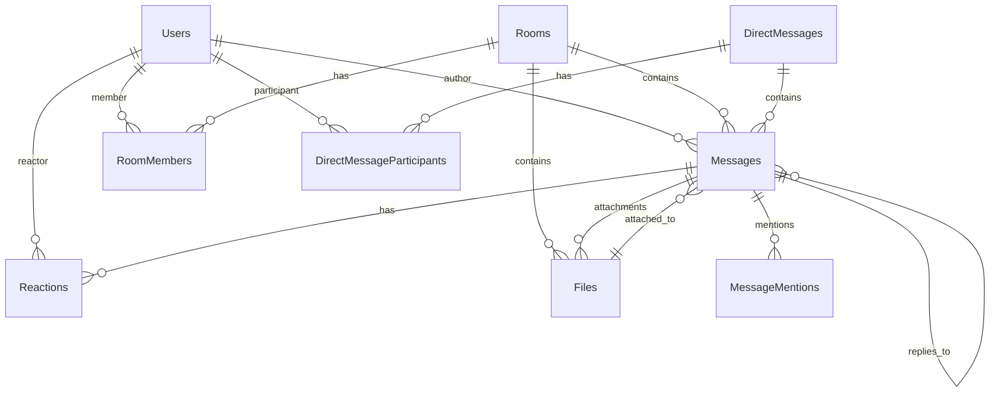

# 📊 Modèles de Données - Documentation Complète

**Version :** 0.2.0  
**Dernière mise à jour :** $(date +"%Y-%m-%d")

## 📋 Vue d'Ensemble

Cette documentation détaille l'ensemble des modèles de données du serveur de chat Veza, incluant les schémas PostgreSQL, les relations, contraintes, index, et exemples d'utilisation.

## 🏗️ Architecture de la Base de Données

### **Diagramme ERD**


## 👤 Modèle Utilisateur

### **Table `users`**
```sql
CREATE TABLE users (
    id SERIAL PRIMARY KEY,
    uuid UUID DEFAULT gen_random_uuid() UNIQUE NOT NULL,
    username VARCHAR(50) UNIQUE NOT NULL,
    email VARCHAR(255) UNIQUE NOT NULL,
    password_hash VARCHAR(255) NOT NULL,
    salt VARCHAR(32) NOT NULL,
    
    -- Profil
    display_name VARCHAR(100),
    bio TEXT,
    avatar_url VARCHAR(500),
    status_message VARCHAR(200),
    timezone VARCHAR(50) DEFAULT 'UTC',
    language VARCHAR(10) DEFAULT 'fr',
    
    -- Sécurité
    role user_role DEFAULT 'user',
    is_active BOOLEAN DEFAULT TRUE,
    is_verified BOOLEAN DEFAULT FALSE,
    last_login_at TIMESTAMP WITH TIME ZONE,
    last_seen_at TIMESTAMP WITH TIME ZONE,
    failed_login_attempts INTEGER DEFAULT 0,
    locked_until TIMESTAMP WITH TIME ZONE,
    
    -- 2FA
    totp_secret VARCHAR(32),
    totp_enabled BOOLEAN DEFAULT FALSE,
    backup_codes TEXT[], -- Codes de récupération chiffrés
    
    -- Métadonnées
    created_at TIMESTAMP WITH TIME ZONE DEFAULT NOW(),
    updated_at TIMESTAMP WITH TIME ZONE DEFAULT NOW(),
    deleted_at TIMESTAMP WITH TIME ZONE,
    
    -- Contraintes
    CONSTRAINT valid_email CHECK (email ~* '^[A-Za-z0-9._%+-]+@[A-Za-z0-9.-]+\.[A-Za-z]{2,}$'),
    CONSTRAINT valid_username CHECK (username ~* '^[a-zA-Z0-9_-]{3,50}$'),
    CONSTRAINT valid_timezone CHECK (timezone IS NULL OR length(timezone) <= 50)
);

-- Enum pour les rôles
CREATE TYPE user_role AS ENUM ('guest', 'user', 'moderator', 'admin');

-- Index
CREATE INDEX idx_users_username ON users(username);
CREATE INDEX idx_users_email ON users(email);
CREATE INDEX idx_users_role ON users(role);
CREATE INDEX idx_users_active ON users(is_active) WHERE is_active = TRUE;
CREATE INDEX idx_users_last_seen ON users(last_seen_at);
CREATE INDEX idx_users_created_at ON users(created_at);
```

### **Structure JSON Utilisateur**
```json
{
  "id": 123,
  "uuid": "550e8400-e29b-41d4-a716-446655440000",
  "username": "john_doe",
  "email": "john@example.com",
  "display_name": "John Doe",
  "bio": "Développeur passionné de Rust",
  "avatar_url": "https://cdn.example.com/avatars/john_doe.jpg",
  "status_message": "En développement 🚀",
  "timezone": "Europe/Paris",
  "language": "fr",
  "role": "user",
  "is_active": true,
  "is_verified": true,
  "is_online": true,
  "last_login_at": "2024-01-15T09:30:00Z",
  "last_seen_at": "2024-01-15T14:25:00Z",
  "totp_enabled": true,
  "created_at": "2024-01-01T00:00:00Z",
  "updated_at": "2024-01-15T14:25:00Z"
}
```

## 🏠 Modèle Salon

### **Table `rooms`**
```sql
CREATE TABLE rooms (
    id SERIAL PRIMARY KEY,
    uuid UUID DEFAULT gen_random_uuid() UNIQUE NOT NULL,
    name VARCHAR(100) NOT NULL,
    description TEXT,
    topic VARCHAR(500),
    
    -- Configuration
    is_public BOOLEAN DEFAULT TRUE,
    is_archived BOOLEAN DEFAULT FALSE,
    max_members INTEGER DEFAULT 1000,
    message_retention_days INTEGER DEFAULT 0, -- 0 = infini
    
    -- Propriétaire
    owner_id INTEGER NOT NULL REFERENCES users(id) ON DELETE CASCADE,
    
    -- Statistiques
    member_count INTEGER DEFAULT 0,
    message_count INTEGER DEFAULT 0,
    last_activity_at TIMESTAMP WITH TIME ZONE,
    
    -- Modération
    slow_mode_seconds INTEGER DEFAULT 0,
    is_nsfw BOOLEAN DEFAULT FALSE,
    welcome_message TEXT,
    rules TEXT,
    
    -- Métadonnées
    metadata JSONB DEFAULT '{}',
    created_at TIMESTAMP WITH TIME ZONE DEFAULT NOW(),
    updated_at TIMESTAMP WITH TIME ZONE DEFAULT NOW(),
    
    -- Contraintes
    CONSTRAINT valid_name CHECK (length(name) >= 1 AND length(name) <= 100),
    CONSTRAINT valid_max_members CHECK (max_members > 0 AND max_members <= 10000),
    CONSTRAINT valid_slow_mode CHECK (slow_mode_seconds >= 0 AND slow_mode_seconds <= 3600)
);

-- Index
CREATE INDEX idx_rooms_name ON rooms(name);
CREATE INDEX idx_rooms_owner ON rooms(owner_id);
CREATE INDEX idx_rooms_public ON rooms(is_public) WHERE is_public = TRUE;
CREATE INDEX idx_rooms_active ON rooms(is_archived) WHERE is_archived = FALSE;
CREATE INDEX idx_rooms_activity ON rooms(last_activity_at);
CREATE INDEX idx_rooms_created_at ON rooms(created_at);
CREATE INDEX idx_rooms_metadata ON rooms USING GIN(metadata);
```

### **Structure JSON Salon**
```json
{
  "id": 1,
  "uuid": "room-550e8400-e29b-41d4-a716-446655440000",
  "name": "General",
  "description": "Salon de discussion générale",
  "topic": "Discussions ouvertes sur tous les sujets",
  "is_public": true,
  "is_archived": false,
  "max_members": 1000,
  "message_retention_days": 0,
  "owner": {
    "id": 1,
    "username": "admin",
    "display_name": "Administrateur"
  },
  "member_count": 150,
  "message_count": 5847,
  "last_activity_at": "2024-01-15T14:30:00Z",
  "slow_mode_seconds": 0,
  "is_nsfw": false,
  "welcome_message": "Bienvenue dans le salon général !",
  "rules": "1. Soyez respectueux\n2. Pas de spam\n3. Restez dans le sujet",
  "metadata": {
    "theme": "tech",
    "auto_moderate": true,
    "allow_bots": false
  },
  "created_at": "2024-01-01T00:00:00Z",
  "updated_at": "2024-01-15T12:00:00Z"
}
```

## 👥 Modèle Membres de Salon

### **Table `room_members`**
```sql
CREATE TABLE room_members (
    id SERIAL PRIMARY KEY,
    room_id INTEGER NOT NULL REFERENCES rooms(id) ON DELETE CASCADE,
    user_id INTEGER NOT NULL REFERENCES users(id) ON DELETE CASCADE,
    
    -- Rôle dans le salon
    role room_member_role DEFAULT 'member',
    
    -- Permissions spéciales
    can_invite BOOLEAN DEFAULT FALSE,
    can_manage_messages BOOLEAN DEFAULT FALSE,
    can_manage_members BOOLEAN DEFAULT FALSE,
    
    -- État
    is_muted BOOLEAN DEFAULT FALSE,
    muted_until TIMESTAMP WITH TIME ZONE,
    notification_level notification_level DEFAULT 'all',
    
    -- Statistiques
    message_count INTEGER DEFAULT 0,
    last_read_message_id INTEGER,
    
    -- Métadonnées
    joined_at TIMESTAMP WITH TIME ZONE DEFAULT NOW(),
    invited_by INTEGER REFERENCES users(id),
    custom_nickname VARCHAR(100),
    
    -- Contraintes
    UNIQUE(room_id, user_id),
    CONSTRAINT valid_nickname CHECK (custom_nickname IS NULL OR length(custom_nickname) <= 100)
);

-- Enums
CREATE TYPE room_member_role AS ENUM ('member', 'moderator', 'admin');
CREATE TYPE notification_level AS ENUM ('none', 'mentions', 'all');

-- Index
CREATE INDEX idx_room_members_room ON room_members(room_id);
CREATE INDEX idx_room_members_user ON room_members(user_id);
CREATE INDEX idx_room_members_role ON room_members(role);
CREATE INDEX idx_room_members_active ON room_members(room_id, user_id) WHERE is_muted = FALSE;
CREATE INDEX idx_room_members_joined ON room_members(joined_at);
```

## 💬 Modèle Message

### **Table `messages`**
```sql
CREATE TABLE messages (
    id SERIAL PRIMARY KEY,
    uuid UUID DEFAULT gen_random_uuid() UNIQUE NOT NULL,
    
    -- Localisation
    room_id INTEGER REFERENCES rooms(id) ON DELETE CASCADE,
    conversation_id INTEGER REFERENCES direct_conversations(id) ON DELETE CASCADE,
    
    -- Auteur
    author_id INTEGER NOT NULL REFERENCES users(id) ON DELETE CASCADE,
    
    -- Contenu
    content TEXT NOT NULL,
    content_type message_content_type DEFAULT 'text',
    raw_content TEXT, -- Contenu avant processing (markdown, etc.)
    
    -- Threading
    parent_message_id INTEGER REFERENCES messages(id) ON DELETE CASCADE,
    thread_count INTEGER DEFAULT 0,
    is_thread_root BOOLEAN DEFAULT FALSE,
    
    -- État
    is_edited BOOLEAN DEFAULT FALSE,
    edit_count INTEGER DEFAULT 0,
    is_deleted BOOLEAN DEFAULT FALSE,
    is_pinned BOOLEAN DEFAULT FALSE,
    
    -- Mentions et références
    mentions INTEGER[] DEFAULT '{}',
    referenced_message_ids INTEGER[] DEFAULT '{}',
    
    -- Réactions
    reaction_count INTEGER DEFAULT 0,
    
    -- Modération
    is_flagged BOOLEAN DEFAULT FALSE,
    flag_count INTEGER DEFAULT 0,
    moderation_status moderation_status DEFAULT 'approved',
    moderated_by INTEGER REFERENCES users(id),
    moderation_reason TEXT,
    
    -- Métadonnées
    metadata JSONB DEFAULT '{}',
    ip_address INET,
    user_agent TEXT,
    
    -- Timestamps
    created_at TIMESTAMP WITH TIME ZONE DEFAULT NOW(),
    updated_at TIMESTAMP WITH TIME ZONE DEFAULT NOW(),
    edited_at TIMESTAMP WITH TIME ZONE,
    deleted_at TIMESTAMP WITH TIME ZONE,
    
    -- Contraintes
    CONSTRAINT message_location_check CHECK (
        (room_id IS NOT NULL AND conversation_id IS NULL) OR
        (room_id IS NULL AND conversation_id IS NOT NULL)
    ),
    CONSTRAINT valid_content CHECK (length(trim(content)) > 0 AND length(content) <= 4000),
    CONSTRAINT valid_thread_count CHECK (thread_count >= 0),
    CONSTRAINT valid_edit_count CHECK (edit_count >= 0)
);

-- Enums
CREATE TYPE message_content_type AS ENUM ('text', 'markdown', 'html', 'code');
CREATE TYPE moderation_status AS ENUM ('pending', 'approved', 'rejected', 'flagged');

-- Index
CREATE INDEX idx_messages_room ON messages(room_id, created_at DESC) WHERE room_id IS NOT NULL;
CREATE INDEX idx_messages_conversation ON messages(conversation_id, created_at DESC) WHERE conversation_id IS NOT NULL;
CREATE INDEX idx_messages_author ON messages(author_id, created_at DESC);
CREATE INDEX idx_messages_parent ON messages(parent_message_id) WHERE parent_message_id IS NOT NULL;
CREATE INDEX idx_messages_thread_root ON messages(id) WHERE is_thread_root = TRUE;
CREATE INDEX idx_messages_pinned ON messages(room_id) WHERE is_pinned = TRUE;
CREATE INDEX idx_messages_flagged ON messages(id) WHERE is_flagged = TRUE;
CREATE INDEX idx_messages_mentions ON messages USING GIN(mentions);
CREATE INDEX idx_messages_created_at ON messages(created_at);
CREATE INDEX idx_messages_metadata ON messages USING GIN(metadata);

-- Index partiel pour les messages non supprimés
CREATE INDEX idx_messages_active ON messages(room_id, created_at DESC) 
WHERE is_deleted = FALSE AND room_id IS NOT NULL;
```

### **Structure JSON Message**
```json
{
  "id": 1001,
  "uuid": "msg-550e8400-e29b-41d4-a716-446655440000",
  "room_id": 1,
  "author": {
    "id": 123,
    "username": "john_doe",
    "display_name": "John Doe",
    "avatar_url": "https://cdn.example.com/avatars/john_doe.jpg"
  },
  "content": "Salut @jane_smith ! Voici le code que tu cherchais :\n```rust\nfn hello() {\n    println!(\"Hello, world!\");\n}\n```",
  "content_type": "markdown",
  "raw_content": "Salut @jane_smith ! Voici le code que tu cherchais :\n```rust\nfn hello() {\n    println!(\"Hello, world!\");\n}\n```",
  "parent_message_id": null,
  "thread_count": 3,
  "is_thread_root": false,
  "is_edited": false,
  "edit_count": 0,
  "is_deleted": false,
  "is_pinned": false,
  "mentions": [456],
  "referenced_message_ids": [],
  "reactions": {
    "👍": {
      "count": 5,
      "users": [
        {"user_id": 456, "username": "jane_smith"},
        {"user_id": 789, "username": "bob_wilson"}
      ],
      "has_user_reacted": true
    },
    "🚀": {
      "count": 2,
      "users": [
        {"user_id": 101, "username": "alice_dev"}
      ],
      "has_user_reacted": false
    }
  },
  "reaction_count": 7,
  "is_flagged": false,
  "flag_count": 0,
  "moderation_status": "approved",
  "metadata": {
    "client": "web",
    "version": "1.0.0",
    "language_detected": "en",
    "code_snippets": ["rust"]
  },
  "created_at": "2024-01-15T12:30:00Z",
  "updated_at": "2024-01-15T12:30:00Z"
}
```

## 📱 Modèle Messages Directs

### **Table `direct_conversations`**
```sql
CREATE TABLE direct_conversations (
    id SERIAL PRIMARY KEY,
    uuid UUID DEFAULT gen_random_uuid() UNIQUE NOT NULL,
    
    -- Participants (limité à 2 pour DM, extensible pour groupes)
    participant_ids INTEGER[] NOT NULL,
    
    -- État
    is_blocked BOOLEAN DEFAULT FALSE,
    blocked_by INTEGER REFERENCES users(id),
    
    -- Statistiques
    message_count INTEGER DEFAULT 0,
    last_activity_at TIMESTAMP WITH TIME ZONE,
    
    -- Métadonnées
    metadata JSONB DEFAULT '{}',
    created_at TIMESTAMP WITH TIME ZONE DEFAULT NOW(),
    updated_at TIMESTAMP WITH TIME ZONE DEFAULT NOW(),
    
    -- Contraintes
    CONSTRAINT valid_participants CHECK (array_length(participant_ids, 1) = 2),
    CONSTRAINT ordered_participants CHECK (participant_ids[1] < participant_ids[2])
);

-- Index
CREATE UNIQUE INDEX idx_direct_conversations_participants ON direct_conversations(participant_ids);
CREATE INDEX idx_direct_conversations_participant ON direct_conversations USING GIN(participant_ids);
CREATE INDEX idx_direct_conversations_active ON direct_conversations(last_activity_at);
CREATE INDEX idx_direct_conversations_blocked ON direct_conversations(id) WHERE is_blocked = TRUE;
```

### **Table `direct_conversation_participants`**
```sql
CREATE TABLE direct_conversation_participants (
    id SERIAL PRIMARY KEY,
    conversation_id INTEGER NOT NULL REFERENCES direct_conversations(id) ON DELETE CASCADE,
    user_id INTEGER NOT NULL REFERENCES users(id) ON DELETE CASCADE,
    
    -- État
    is_active BOOLEAN DEFAULT TRUE,
    notification_level notification_level DEFAULT 'all',
    
    -- Lecture
    last_read_message_id INTEGER,
    unread_count INTEGER DEFAULT 0,
    
    -- Métadonnées
    joined_at TIMESTAMP WITH TIME ZONE DEFAULT NOW(),
    
    -- Contraintes
    UNIQUE(conversation_id, user_id)
);

-- Index
CREATE INDEX idx_dm_participants_conversation ON direct_conversation_participants(conversation_id);
CREATE INDEX idx_dm_participants_user ON direct_conversation_participants(user_id);
```

## 🎭 Modèle Réactions

### **Table `reactions`**
```sql
CREATE TABLE reactions (
    id SERIAL PRIMARY KEY,
    message_id INTEGER NOT NULL REFERENCES messages(id) ON DELETE CASCADE,
    user_id INTEGER NOT NULL REFERENCES users(id) ON DELETE CASCADE,
    emoji VARCHAR(20) NOT NULL,
    
    -- Métadonnées
    created_at TIMESTAMP WITH TIME ZONE DEFAULT NOW(),
    
    -- Contraintes
    UNIQUE(message_id, user_id, emoji),
    CONSTRAINT valid_emoji CHECK (length(emoji) >= 1 AND length(emoji) <= 20)
);

-- Index
CREATE INDEX idx_reactions_message ON reactions(message_id);
CREATE INDEX idx_reactions_user ON reactions(user_id);
CREATE INDEX idx_reactions_emoji ON reactions(emoji);
CREATE INDEX idx_reactions_created_at ON reactions(created_at);

-- Index composite pour l'agrégation
CREATE INDEX idx_reactions_message_emoji ON reactions(message_id, emoji);
```

## 📁 Modèle Fichiers

### **Table `files`**
```sql
CREATE TABLE files (
    id SERIAL PRIMARY KEY,
    uuid UUID DEFAULT gen_random_uuid() UNIQUE NOT NULL,
    
    -- Propriétés du fichier
    filename VARCHAR(255) NOT NULL,
    original_filename VARCHAR(255) NOT NULL,
    file_path VARCHAR(500) NOT NULL,
    file_size BIGINT NOT NULL,
    mime_type VARCHAR(100) NOT NULL,
    file_hash VARCHAR(64) NOT NULL, -- SHA-256
    
    -- Propriétaire
    uploaded_by INTEGER NOT NULL REFERENCES users(id) ON DELETE CASCADE,
    
    -- Localisation
    room_id INTEGER REFERENCES rooms(id) ON DELETE CASCADE,
    message_id INTEGER REFERENCES messages(id) ON DELETE CASCADE,
    
    -- Traitement
    is_processed BOOLEAN DEFAULT FALSE,
    thumbnail_path VARCHAR(500),
    processing_status file_processing_status DEFAULT 'pending',
    
    -- Sécurité
    virus_scan_status virus_scan_status DEFAULT 'pending',
    virus_scan_result TEXT,
    
    -- Métadonnées
    metadata JSONB DEFAULT '{}',
    download_count INTEGER DEFAULT 0,
    
    -- Timestamps
    created_at TIMESTAMP WITH TIME ZONE DEFAULT NOW(),
    expires_at TIMESTAMP WITH TIME ZONE,
    
    -- Contraintes
    CONSTRAINT valid_filename CHECK (length(filename) > 0 AND length(filename) <= 255),
    CONSTRAINT valid_file_size CHECK (file_size > 0 AND file_size <= 104857600), -- 100MB
    CONSTRAINT valid_hash CHECK (length(file_hash) = 64)
);

-- Enums
CREATE TYPE file_processing_status AS ENUM ('pending', 'processing', 'completed', 'failed');
CREATE TYPE virus_scan_status AS ENUM ('pending', 'scanning', 'clean', 'infected', 'failed');

-- Index
CREATE INDEX idx_files_uploader ON files(uploaded_by);
CREATE INDEX idx_files_room ON files(room_id) WHERE room_id IS NOT NULL;
CREATE INDEX idx_files_message ON files(message_id) WHERE message_id IS NOT NULL;
CREATE INDEX idx_files_hash ON files(file_hash);
CREATE INDEX idx_files_mime_type ON files(mime_type);
CREATE INDEX idx_files_created_at ON files(created_at);
CREATE INDEX idx_files_expires_at ON files(expires_at) WHERE expires_at IS NOT NULL;
CREATE INDEX idx_files_virus_scan ON files(virus_scan_status);
```

## 📋 Modèle Audit

### **Table `audit_logs`**
```sql
CREATE TABLE audit_logs (
    id BIGSERIAL PRIMARY KEY,
    
    -- Événement
    event_type VARCHAR(50) NOT NULL,
    event_data JSONB NOT NULL,
    
    -- Acteur
    user_id INTEGER REFERENCES users(id),
    ip_address INET,
    user_agent TEXT,
    
    -- Contexte
    resource_type VARCHAR(50),
    resource_id INTEGER,
    room_id INTEGER REFERENCES rooms(id),
    
    -- Métadonnées
    request_id UUID,
    session_id UUID,
    severity audit_severity DEFAULT 'info',
    
    -- Timestamp
    created_at TIMESTAMP WITH TIME ZONE DEFAULT NOW(),
    
    -- Contraintes
    CONSTRAINT valid_event_type CHECK (length(event_type) > 0)
);

-- Enum
CREATE TYPE audit_severity AS ENUM ('debug', 'info', 'warning', 'error', 'critical');

-- Index
CREATE INDEX idx_audit_logs_event_type ON audit_logs(event_type);
CREATE INDEX idx_audit_logs_user ON audit_logs(user_id) WHERE user_id IS NOT NULL;
CREATE INDEX idx_audit_logs_resource ON audit_logs(resource_type, resource_id);
CREATE INDEX idx_audit_logs_room ON audit_logs(room_id) WHERE room_id IS NOT NULL;
CREATE INDEX idx_audit_logs_created_at ON audit_logs(created_at);
CREATE INDEX idx_audit_logs_severity ON audit_logs(severity);
CREATE INDEX idx_audit_logs_ip ON audit_logs(ip_address) WHERE ip_address IS NOT NULL;

-- Partitioning par mois pour performance
CREATE TABLE audit_logs_y2024m01 PARTITION OF audit_logs
FOR VALUES FROM ('2024-01-01') TO ('2024-02-01');
```

## 🔑 Modèle Sessions

### **Table `user_sessions`**
```sql
CREATE TABLE user_sessions (
    id UUID PRIMARY KEY DEFAULT gen_random_uuid(),
    user_id INTEGER NOT NULL REFERENCES users(id) ON DELETE CASCADE,
    
    -- Token info
    token_hash VARCHAR(64) NOT NULL, -- Hash du refresh token
    access_token_jti UUID, -- JTI du access token
    
    -- Session info
    ip_address INET,
    user_agent TEXT,
    device_info JSONB,
    location_info JSONB,
    
    -- État
    is_active BOOLEAN DEFAULT TRUE,
    last_activity_at TIMESTAMP WITH TIME ZONE DEFAULT NOW(),
    
    -- Timestamps
    created_at TIMESTAMP WITH TIME ZONE DEFAULT NOW(),
    expires_at TIMESTAMP WITH TIME ZONE NOT NULL,
    
    -- Contraintes
    CONSTRAINT valid_expires_at CHECK (expires_at > created_at)
);

-- Index
CREATE INDEX idx_user_sessions_user ON user_sessions(user_id);
CREATE INDEX idx_user_sessions_token_hash ON user_sessions(token_hash);
CREATE INDEX idx_user_sessions_active ON user_sessions(user_id, is_active) WHERE is_active = TRUE;
CREATE INDEX idx_user_sessions_expires_at ON user_sessions(expires_at);
CREATE INDEX idx_user_sessions_last_activity ON user_sessions(last_activity_at);
```

## 📊 Vues Matérialisées et Fonctions

### **Vue des Statistiques de Salon**
```sql
CREATE MATERIALIZED VIEW room_stats AS
SELECT 
    r.id as room_id,
    r.name,
    r.member_count,
    COUNT(DISTINCT m.id) as total_messages,
    COUNT(DISTINCT m.id) FILTER (WHERE m.created_at >= NOW() - INTERVAL '24 hours') as messages_24h,
    COUNT(DISTINCT m.id) FILTER (WHERE m.created_at >= NOW() - INTERVAL '7 days') as messages_7d,
    COUNT(DISTINCT m.author_id) FILTER (WHERE m.created_at >= NOW() - INTERVAL '24 hours') as active_users_24h,
    MAX(m.created_at) as last_message_at,
    COUNT(DISTINCT react.user_id) FILTER (WHERE react.created_at >= NOW() - INTERVAL '24 hours') as reactions_24h
FROM rooms r
LEFT JOIN messages m ON r.id = m.room_id AND m.is_deleted = FALSE
LEFT JOIN reactions react ON m.id = react.message_id
WHERE r.is_archived = FALSE
GROUP BY r.id, r.name, r.member_count;

-- Index sur la vue matérialisée
CREATE INDEX idx_room_stats_messages_24h ON room_stats(messages_24h DESC);
CREATE INDEX idx_room_stats_active_users ON room_stats(active_users_24h DESC);

-- Rafraîchissement automatique
CREATE OR REPLACE FUNCTION refresh_room_stats()
RETURNS void AS $$
BEGIN
    REFRESH MATERIALIZED VIEW CONCURRENTLY room_stats;
END;
$$ LANGUAGE plpgsql;
```

### **Fonction de Calcul des Non-Lus**
```sql
CREATE OR REPLACE FUNCTION calculate_unread_count(
    p_user_id INTEGER,
    p_room_id INTEGER
) RETURNS INTEGER AS $$
DECLARE
    v_last_read_id INTEGER;
    v_unread_count INTEGER;
BEGIN
    -- Obtenir le dernier message lu
    SELECT rm.last_read_message_id 
    INTO v_last_read_id
    FROM room_members rm 
    WHERE rm.user_id = p_user_id AND rm.room_id = p_room_id;
    
    -- Si pas de dernière lecture, compter tous les messages
    IF v_last_read_id IS NULL THEN
        SELECT COUNT(*)
        INTO v_unread_count
        FROM messages m
        WHERE m.room_id = p_room_id 
        AND m.is_deleted = FALSE
        AND m.author_id != p_user_id;
    ELSE
        -- Compter les messages après le dernier lu
        SELECT COUNT(*)
        INTO v_unread_count
        FROM messages m
        WHERE m.room_id = p_room_id 
        AND m.id > v_last_read_id
        AND m.is_deleted = FALSE
        AND m.author_id != p_user_id;
    END IF;
    
    RETURN COALESCE(v_unread_count, 0);
END;
$$ LANGUAGE plpgsql STABLE;
```

## 🔄 Triggers et Contraintes

### **Trigger de Mise à Jour des Statistiques**
```sql
-- Fonction pour mettre à jour les statistiques de salon
CREATE OR REPLACE FUNCTION update_room_stats()
RETURNS TRIGGER AS $$
BEGIN
    IF TG_OP = 'INSERT' THEN
        -- Nouveau message
        UPDATE rooms 
        SET 
            message_count = message_count + 1,
            last_activity_at = NOW()
        WHERE id = NEW.room_id;
        
        RETURN NEW;
    ELSIF TG_OP = 'UPDATE' THEN
        -- Message modifié
        IF OLD.is_deleted = FALSE AND NEW.is_deleted = TRUE THEN
            -- Message supprimé
            UPDATE rooms 
            SET message_count = message_count - 1
            WHERE id = NEW.room_id;
        ELSIF OLD.is_deleted = TRUE AND NEW.is_deleted = FALSE THEN
            -- Message restauré
            UPDATE rooms 
            SET message_count = message_count + 1
            WHERE id = NEW.room_id;
        END IF;
        
        RETURN NEW;
    ELSIF TG_OP = 'DELETE' THEN
        -- Message supprimé physiquement
        UPDATE rooms 
        SET message_count = message_count - 1
        WHERE id = OLD.room_id;
        
        RETURN OLD;
    END IF;
    
    RETURN NULL;
END;
$$ LANGUAGE plpgsql;

-- Appliquer le trigger
CREATE TRIGGER trigger_update_room_stats
    AFTER INSERT OR UPDATE OR DELETE ON messages
    FOR EACH ROW
    EXECUTE FUNCTION update_room_stats();
```

### **Trigger de Gestion des Membres**
```sql
CREATE OR REPLACE FUNCTION manage_room_member_count()
RETURNS TRIGGER AS $$
BEGIN
    IF TG_OP = 'INSERT' THEN
        -- Nouveau membre
        UPDATE rooms 
        SET member_count = member_count + 1
        WHERE id = NEW.room_id;
        
        RETURN NEW;
    ELSIF TG_OP = 'DELETE' THEN
        -- Membre parti
        UPDATE rooms 
        SET member_count = member_count - 1
        WHERE id = OLD.room_id;
        
        RETURN OLD;
    END IF;
    
    RETURN NULL;
END;
$$ LANGUAGE plpgsql;

CREATE TRIGGER trigger_manage_room_member_count
    AFTER INSERT OR DELETE ON room_members
    FOR EACH ROW
    EXECUTE FUNCTION manage_room_member_count();
```

## 📈 Optimisations et Performance

### **Index Composites Avancés**
```sql
-- Pour les requêtes de pagination des messages
CREATE INDEX idx_messages_room_pagination ON messages(room_id, id DESC) 
WHERE is_deleted = FALSE;

-- Pour les recherches de contenu
CREATE INDEX idx_messages_search ON messages USING GIN(to_tsvector('french', content))
WHERE is_deleted = FALSE;

-- Pour les mentions utilisateur
CREATE INDEX idx_messages_user_mentions ON messages(author_id, created_at DESC)
WHERE mentions IS NOT NULL AND array_length(mentions, 1) > 0;

-- Pour l'historique des réactions
CREATE INDEX idx_reactions_user_history ON reactions(user_id, created_at DESC);
```

### **Stratégies de Partitioning**
```sql
-- Partitioning des messages par mois
CREATE TABLE messages_y2024m01 PARTITION OF messages
FOR VALUES FROM ('2024-01-01') TO ('2024-02-01');

CREATE TABLE messages_y2024m02 PARTITION OF messages
FOR VALUES FROM ('2024-02-01') TO ('2024-03-01');

-- Partitioning des logs d'audit par trimestre
CREATE TABLE audit_logs_y2024q1 PARTITION OF audit_logs
FOR VALUES FROM ('2024-01-01') TO ('2024-04-01');
```

## 📚 Exemples de Requêtes

### **Récupérer les Messages avec Pagination**
```sql
-- Messages d'un salon avec pagination cursor-based
SELECT 
    m.id,
    m.uuid,
    m.content,
    m.created_at,
    u.username,
    u.display_name,
    u.avatar_url,
    m.thread_count,
    m.is_pinned,
    -- Agréger les réactions
    COALESCE(
        json_object_agg(
            r.emoji, 
            json_build_object(
                'count', r.reaction_count,
                'users', r.user_list
            )
        ) FILTER (WHERE r.emoji IS NOT NULL),
        '{}'::json
    ) as reactions
FROM messages m
JOIN users u ON m.author_id = u.id
LEFT JOIN (
    SELECT 
        message_id,
        emoji,
        COUNT(*) as reaction_count,
        json_agg(
            json_build_object(
                'user_id', user_id,
                'username', username
            )
        ) as user_list
    FROM reactions r
    JOIN users u ON r.user_id = u.id
    GROUP BY message_id, emoji
) r ON m.id = r.message_id
WHERE 
    m.room_id = $1 
    AND m.is_deleted = FALSE
    AND ($2::INTEGER IS NULL OR m.id < $2) -- cursor pagination
ORDER BY m.id DESC
LIMIT $3;
```

### **Statistiques Utilisateur**
```sql
-- Statistiques complètes d'un utilisateur
WITH user_stats AS (
    SELECT 
        u.id,
        u.username,
        COUNT(DISTINCT m.id) as total_messages,
        COUNT(DISTINCT m.room_id) as rooms_participated,
        COUNT(DISTINCT r.id) as reactions_given,
        COUNT(DISTINCT rm.room_id) as rooms_joined,
        MIN(m.created_at) as first_message_at,
        MAX(m.created_at) as last_message_at
    FROM users u
    LEFT JOIN messages m ON u.id = m.author_id AND m.is_deleted = FALSE
    LEFT JOIN reactions r ON u.id = r.user_id
    LEFT JOIN room_members rm ON u.id = rm.user_id
    WHERE u.id = $1
    GROUP BY u.id, u.username
)
SELECT 
    us.*,
    -- Top salons par activité
    (
        SELECT json_agg(
            json_build_object(
                'room_id', room_id,
                'room_name', room_name,
                'message_count', message_count
            )
        )
        FROM (
            SELECT 
                r.id as room_id,
                r.name as room_name,
                COUNT(m.id) as message_count
            FROM rooms r
            JOIN messages m ON r.id = m.room_id
            WHERE m.author_id = $1 AND m.is_deleted = FALSE
            GROUP BY r.id, r.name
            ORDER BY message_count DESC
            LIMIT 5
        ) top_rooms
    ) as top_rooms_activity
FROM user_stats us;
```

---

Cette documentation des modèles de données fournit une base solide pour comprendre et utiliser efficacement la structure de données du serveur de chat Veza. 