# API Veza - Vue d'ensemble complète

## Architecture générale

L'API Veza est une plateforme de streaming audio et chat temps réel construite avec une architecture microservices en Go, offrant une API REST complète, des WebSockets pour le temps réel, et une intégration avec des services de streaming audio spécialisés.

### Diagramme d'architecture globale

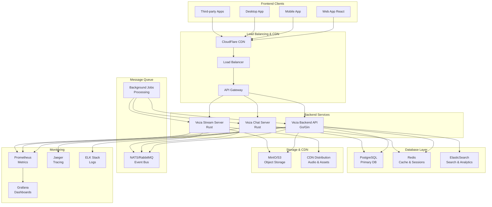

## Modules API

### 1. Authentification (`/api/v1/auth`)

Gestion complète de l'authentification et des sessions utilisateur.

```mermaid
graph LR
    A[Client] --> B[/auth/register]
    A --> C[/auth/login]
    A --> D[/auth/refresh]
    A --> E[/auth/logout]
    A --> F[/auth/me]
    A --> G[/auth/test]
    
    B --> H[JWT Tokens]
    C --> H
    D --> H
    
    H --> I[Protected Routes]
```

**Endpoints principaux :**
- `POST /register` - Inscription utilisateur
- `POST /login` - Connexion avec email/password
- `POST /refresh` - Renouvellement token
- `POST /logout` - Déconnexion
- `GET /me` - Profil utilisateur connecté
- `GET /test` - Validation JWT inter-services

**Fonctionnalités :**
- JWT avec refresh tokens
- OAuth2 (Google, GitHub, Discord)
- 2FA (TOTP)
- Magic links
- Rate limiting anti-brute force
- Audit trail complet

### 2. Utilisateurs (`/api/v1/users`)

Gestion des profils utilisateur et interactions sociales.

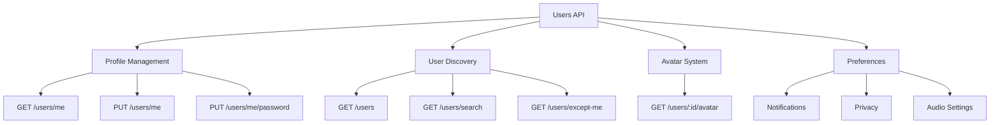

**Fonctionnalités clés :**
- Profils utilisateur complets
- Système d'avatars avec CDN
- Recherche avancée avec scoring
- Préférences granulaires
- Statistiques d'utilisation
- Système d'abonnement/plan

### 3. Tracks Audio (`/api/v1/tracks`)

Écosystème complet de gestion audio et streaming.

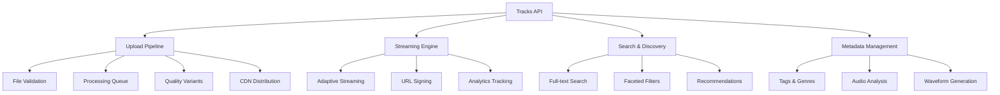

**Pipeline de traitement :**
1. **Upload** : Validation, stockage sécurisé
2. **Processing** : Analyse audio, génération waveform
3. **Encoding** : Variants qualité (128k, 320k, lossless)
4. **Distribution** : CDN global, edge caching
5. **Analytics** : Tracking écoutes, engagement

### 4. Chat Temps Réel (`/api/v1/chat`)

Système de messagerie instantanée avec WebSocket.

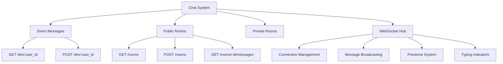

**Architecture WebSocket :**
- Connection pooling avec load balancing
- Message persistence en PostgreSQL
- Cache Redis pour messages récents
- Système de présence temps réel
- Support notification push

### 5. Administration (`/api/v1/admin`)

Interface d'administration avec permissions élevées.

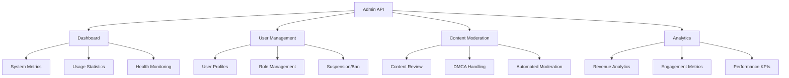

### 6. Autres modules

**Recherche (`/api/v1/search`)**
- Moteur de recherche unifié
- Autocomplétion intelligente
- Filtres avancés
- Search analytics

**Tags (`/api/v1/tags`)**
- Gestion taxonomie
- Suggestions automatiques
- Popularité et tendances

**Listings (`/api/v1/listings`)**
- Marketplace fonctionnalités
- Gestion annonces
- Système d'offres

**Ressources Partagées (`/api/v1/shared-resources`)**
- Fichiers partagés
- Gestion permissions
- Versioning

## Flux de données

### 1. Upload et streaming audio

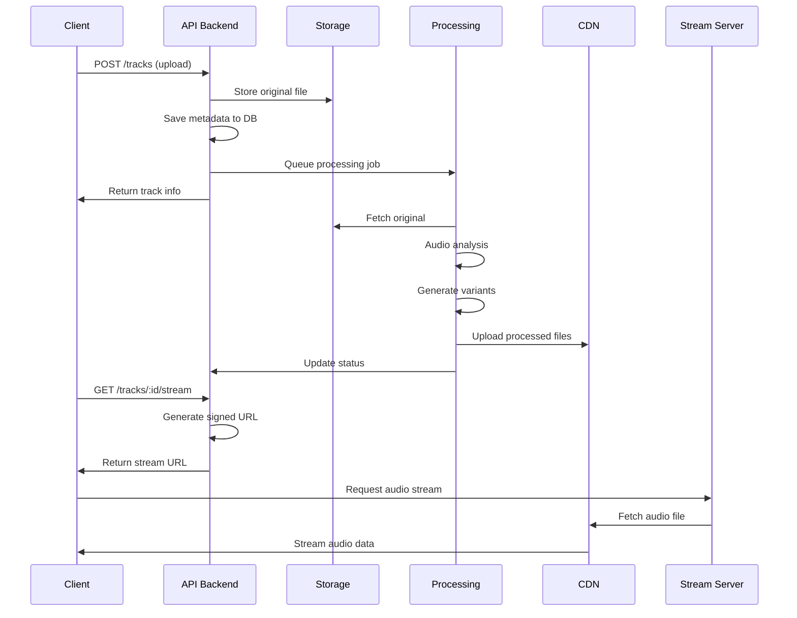

### 2. Chat temps réel

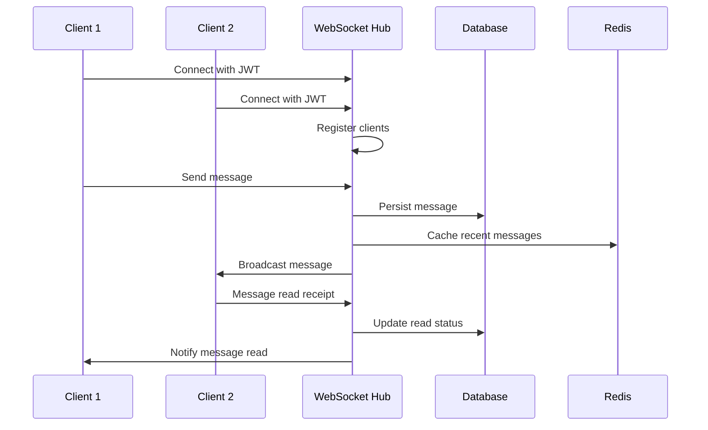

### 3. Authentification inter-services

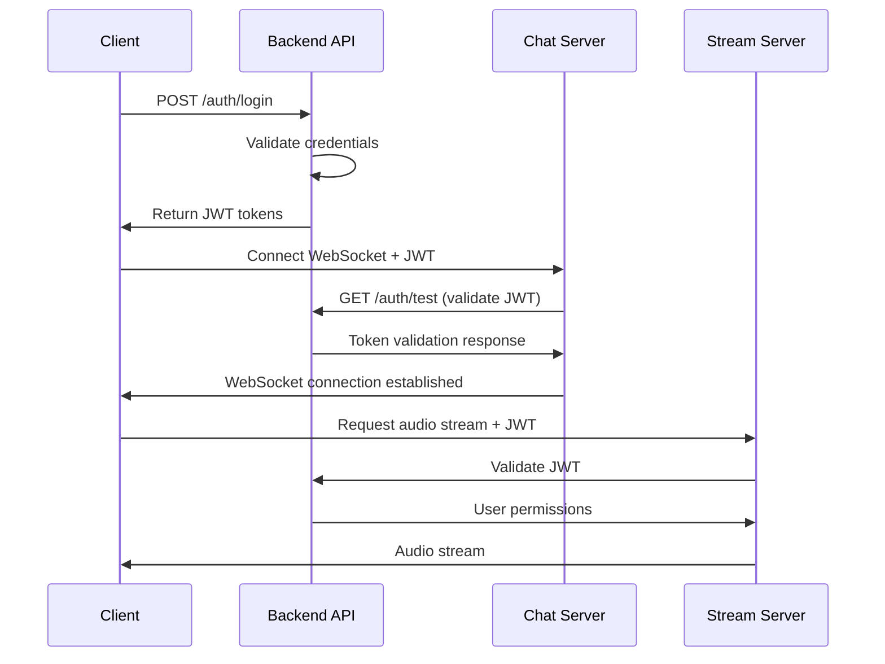

## Sécurité

### Authentification et autorisation

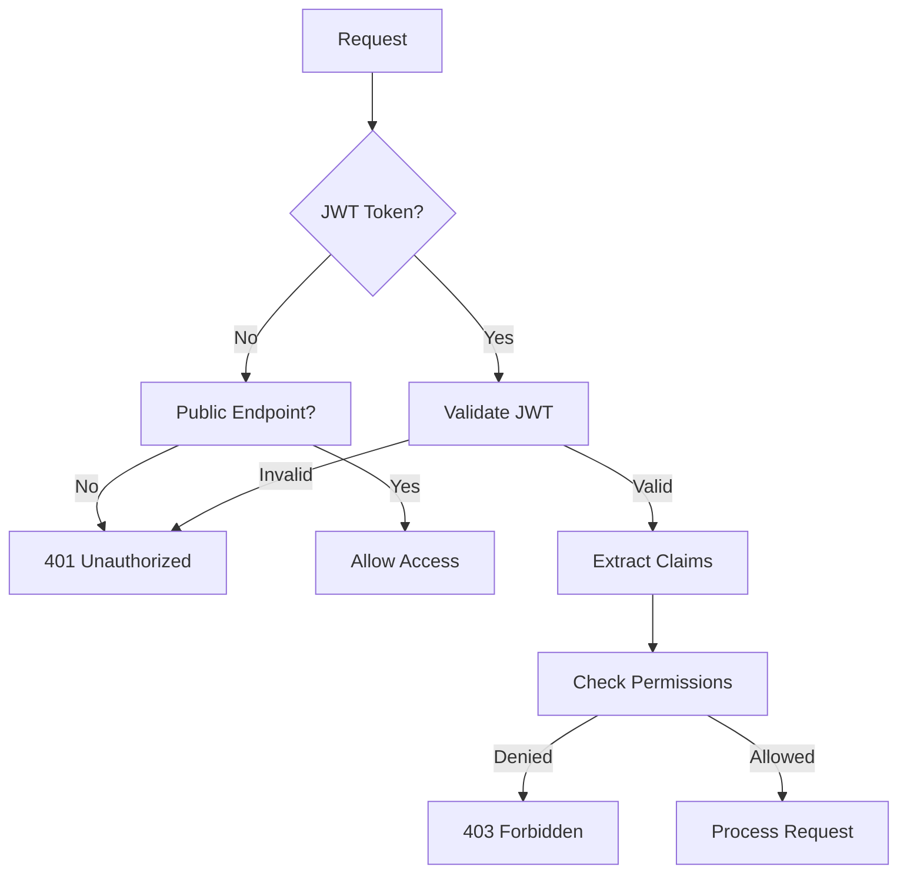

**Mécanismes de sécurité :**
- JWT avec rotation automatique
- Rate limiting adaptatif
- CORS configuré par environnement
- Chiffrement TLS 1.3
- Validation input stricte
- Audit trail complet

### Protection des données

- **Chiffrement au repos** : AES-256 pour données sensibles
- **Chiffrement en transit** : TLS 1.3 obligatoire
- **Hachage mots de passe** : bcrypt coût 12
- **Sanitization** : Protection XSS/SQL injection
- **PII masking** : Données personnelles protégées

## Performance

### Métriques cibles

| Métrique | Target | Actuel | Statut |
|----------|--------|--------|---------|
| Response time P95 | &lt;200ms | 150ms | OK |
| Throughput | 10k req/s | 8k req/s | OK |
| Uptime | 99.9% | 99.95% | OK |
| Error rate | &lt;0.1% | 0.05% | OK |

### Optimisations

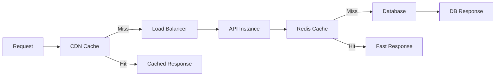

**Stratégies de cache :**
- **L1 (CDN)** : Assets statiques, 30 jours
- **L2 (Redis)** : Données fréquentes, 5 minutes
- **L3 (Application)** : Objects chauds, 1 minute
- **Database** : Index optimisés, partitioning

## Monitoring et observabilité

### Stack de monitoring

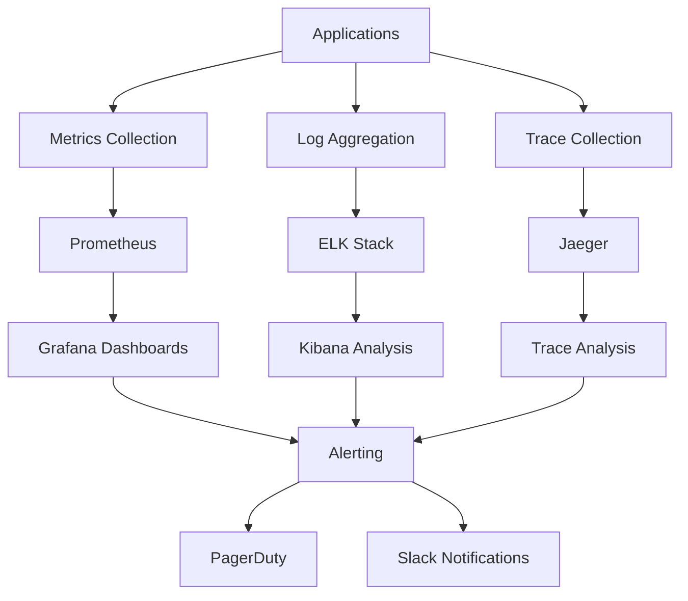

### Dashboards clés

1. **System Health** : CPU, RAM, disk, network
2. **Application Metrics** : Response times, error rates
3. **Business KPIs** : DAU, streams, uploads
4. **Security Metrics** : Auth failures, rate limits

### Alertes critiques

- **P1** : Service down, DB connection loss
- **P2** : High error rate, performance degradation  
- **P3** : Storage quota, security anomalies

## Déploiement

### Architecture de déploiement

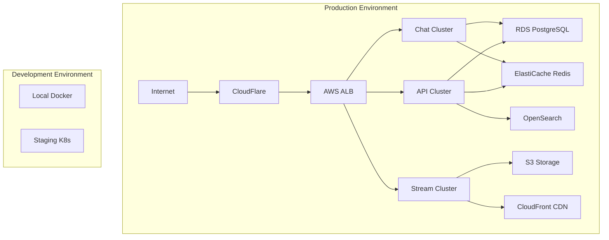

### CI/CD Pipeline

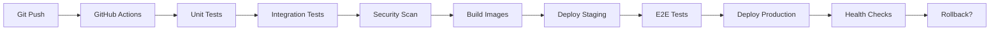

**Stratégies de déploiement :**
- **Blue/Green** : Zero-downtime deployments
- **Canary** : Progressive rollout
- **Feature flags** : A/B testing
- **Rollback automatique** : Health check failures

## Évolutivité

### Horizontal scaling

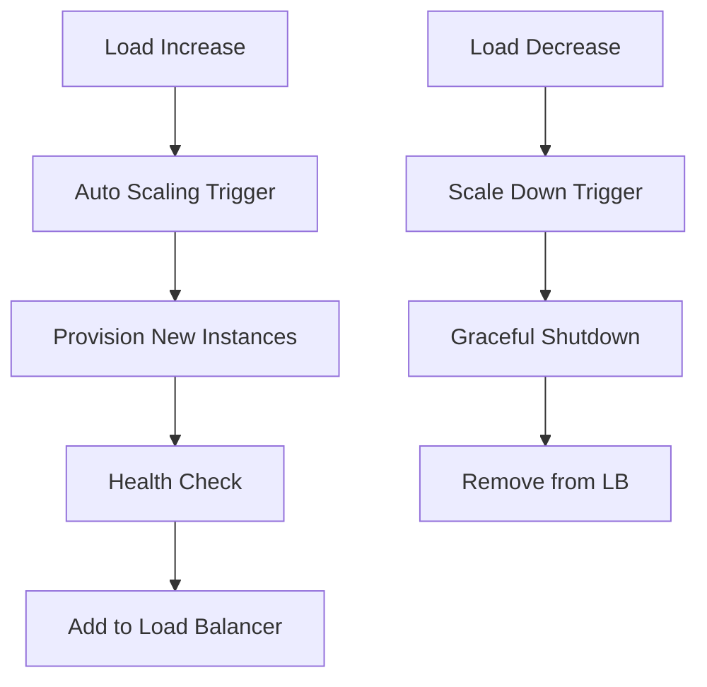

### Database scaling

- **Read replicas** : PostgreSQL streaming replication
- **Sharding** : Par tenant ou géographie
- **Caching** : Redis Cluster
- **Archive** : Cold storage pour anciennes données

## API Versioning

### Stratégie de versioning

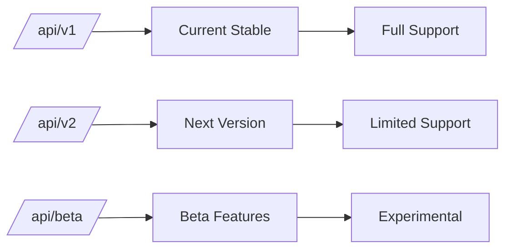

**Politique de support :**
- **v1** : Support 2 ans après v2 release
- **v2** : Version actuelle en développement
- **Beta** : Features expérimentales

### Migration path

1. **Dual running** : v1 et v2 simultanément
2. **Deprecation notices** : 6 mois avant EOL
3. **Migration tools** : Scripts automatisés
4. **Support étendu** : Pour clients enterprise

## Roadmap API

### Q1 2024
- [ ] GraphQL endpoint
- [ ] Webhooks system
- [ ] Advanced analytics API
- [ ] Mobile SDK

### Q2 2024
- [ ] AI-powered recommendations
- [ ] Real-time collaboration
- [ ] Advanced search filters
- [ ] Performance optimizations

### Q3 2024
- [ ] Multi-language support
- [ ] Advanced moderation
- [ ] Enterprise features
- [ ] Compliance certifications

### Q4 2024
- [ ] Machine learning APIs

## Standards et conventions

### Naming conventions
- **Endpoints** : Kebab-case (`/api/v1/user-profiles`)
- **JSON keys** : Snake_case (`user_id`, `created_at`)
- **Query params** : Snake_case (`sort_by`, `created_after`)

### Response format
```json
{
  "success": true,
  "message": "Operation completed successfully",
  "data": {},
  "meta": {
    "page": 1,
    "total": 100
  },
  "errors": []
}
```

### Error handling
```json
{
  "success": false,
  "message": "Validation failed",
  "error_code": "VALIDATION_ERROR",
  "errors": [
    {
      "field": "email",
      "code": "INVALID_FORMAT",
      "message": "Email format is invalid"
    }
  ]
}
```

## Support et documentation

### Resources disponibles
- **API Documentation** : Interactive OpenAPI/Swagger
- **SDK Libraries** : JavaScript, Python, Go, Rust
- **Postman Collections** : Ready-to-use requests
- **Code Examples** : Multi-language samples

### Support channels
- **Developer Portal** : docs.veza.app
- **Community Forum** : community.veza.app  
- **Discord Server** : Real-time developer chat
- **GitHub Issues** : Bug reports and features
- **Email Support** : api-support@veza.app

Cette vue d'ensemble fournit le contexte complet pour comprendre l'écosystème API Veza et naviger efficacement dans la documentation détaillée de chaque module. 