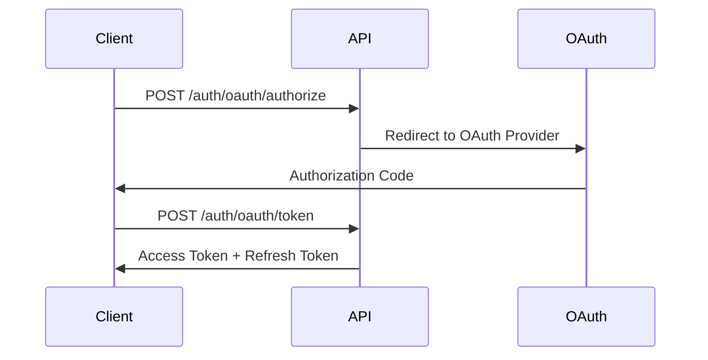

# API Documentation - Veza Backend

## Vue d'ensemble

L'API Veza Backend fournit un ensemble complet d'endpoints REST pour la gestion des utilisateurs, du chat, du streaming et des fonctionnalités de la plateforme.

## Informations de Base

- **Base URL** : `https://api.veza.com`
- **Version** : v1.0.0
- **Format** : JSON
- **Authentification** : JWT Bearer Token
- **Rate Limiting** : 1000 requests/hour per user

## Authentification

### JWT Bearer Token

```http
Authorization: Bearer <jwt_token>
```

### OAuth2 Flow



## Endpoints Principaux

### Authentification

#### POST /auth/login

**Description** : Connexion utilisateur avec email/mot de passe.

**Request Body** :
```json
{
    "email": "user@example.com",
    "password": "securepassword"
}
```

**Response** :
```json
{
    "success": true,
    "data": {
        "access_token": "eyJhbGciOiJIUzI1NiIsInR5cCI6IkpXVCJ9...",
        "refresh_token": "eyJhbGciOiJIUzI1NiIsInR5cCI6IkpXVCJ9...",
        "expires_in": 900,
        "user": {
            "id": "uuid",
            "email": "user@example.com",
            "username": "username",
            "first_name": "John",
            "last_name": "Doe"
        }
    }
}
```

#### POST /auth/register

**Description** : Inscription d'un nouvel utilisateur.

**Request Body** :
```json
{
    "email": "user@example.com",
    "username": "username",
    "password": "securepassword",
    "first_name": "John",
    "last_name": "Doe"
}
```

### Utilisateurs

#### GET /api/users/me

**Description** : Récupération du profil utilisateur connecté.

**Headers** :
```http
Authorization: Bearer <jwt_token>
```

**Response** :
```json
{
    "success": true,
    "data": {
        "id": "uuid",
        "email": "user@example.com",
        "username": "username",
        "first_name": "John",
        "last_name": "Doe",
        "avatar_url": "https://example.com/avatar.jpg",
        "created_at": "2024-01-01T00:00:00Z",
        "last_login_at": "2024-01-01T12:00:00Z",
        "is_active": true,
        "email_verified": true
    }
}
```

### Chat

#### GET /api/chat/rooms

**Description** : Récupération des salons de chat.

**Headers** :
```http
Authorization: Bearer <jwt_token>
```

**Response** :
```json
{
    "success": true,
    "data": {
        "rooms": [
            {
                "id": "uuid",
                "name": "General",
                "description": "General discussion",
                "is_private": false,
                "created_at": "2024-01-01T00:00:00Z",
                "member_count": 150
            }
        ]
    }
}
```

### Streaming

#### GET /api/streams

**Description** : Récupération des streams disponibles.

**Headers** :
```http
Authorization: Bearer <jwt_token>
```

**Response** :
```json
{
    "success": true,
    "data": {
        "streams": [
            {
                "id": "uuid",
                "title": "Live Music Session",
                "description": "Live music streaming",
                "is_live": true,
                "viewer_count": 250,
                "started_at": "2024-01-01T12:00:00Z"
            }
        ]
    }
}
```

## Codes d'Erreur

| Code | Description |
|------|-------------|
| 200 | Succès |
| 201 | Créé |
| 400 | Requête invalide |
| 401 | Non autorisé |
| 403 | Interdit |
| 404 | Non trouvé |
| 422 | Entité non traitable |
| 429 | Trop de requêtes |
| 500 | Erreur serveur |

## Rate Limiting

L'API implémente un système de rate limiting basé sur les tokens JWT :

- **Limite** : 1000 requêtes par heure par utilisateur
- **Headers de réponse** :
  - `X-RateLimit-Limit` : Limite totale
  - `X-RateLimit-Remaining` : Requêtes restantes
  - `X-RateLimit-Reset` : Timestamp de réinitialisation

## Pagination

Les endpoints qui retournent des listes supportent la pagination :

**Query Parameters** :
- `page` : Numéro de page (défaut: 1)
- `limit` : Nombre d'éléments par page (défaut: 20, max: 100)

**Response** :
```json
{
    "success": true,
    "data": {
        "items": [...],
        "pagination": {
            "page": 1,
            "limit": 20,
            "total": 150,
            "pages": 8
        }
    }
}
```

## Webhooks

L'API supporte les webhooks pour les événements importants :

**Configuration** :
```json
{
    "url": "https://your-app.com/webhooks/veza",
    "events": ["user.created", "chat.message", "stream.started"],
    "secret": "webhook_secret"
}
```

**Payload** :
```json
{
    "event": "user.created",
    "timestamp": "2024-01-01T00:00:00Z",
    "data": {
        "user_id": "uuid",
        "email": "user@example.com"
    }
}
```

## SDKs et Bibliothèques

### JavaScript/TypeScript

```bash
npm install @veza/api-client
```

```javascript
import { VezaClient } from '@veza/api-client';

const client = new VezaClient({
    baseUrl: 'https://api.veza.com',
    token: 'your_jwt_token'
});

// Utilisation
const user = await client.users.getMe();
const rooms = await client.chat.getRooms();
```

### Python

```bash
pip install veza-api-client
```

```python
from veza_api import VezaClient

client = VezaClient(
    base_url='https://api.veza.com',
    token='your_jwt_token'
)

# Utilisation
user = client.users.get_me()
rooms = client.chat.get_rooms()
```

## Support

Pour toute question concernant l'API :

- **Documentation** : Cette documentation
- **Issues** : [GitHub Issues](https://github.com/okinrev/veza-full-stack/issues)
- **Discussions** : [GitHub Discussions](https://github.com/okinrev/veza-full-stack/discussions) 