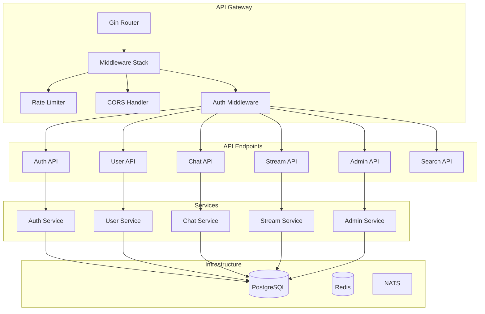

# 🔌 Référence des Endpoints API - Veza

## 📋 Vue d'ensemble

L'API REST Veza est construite avec Gin (Go) et suit les principes RESTful. Elle fournit des endpoints pour l'authentification, la gestion des utilisateurs, le chat, le streaming, et l'administration.

## 🏗️ Architecture API



## 🔧 Configuration de Base

### URL de Base
```
Production: https://api.veza.com/api/v1
Staging: https://staging-api.veza.com/api/v1
Development: http://localhost:8080/api/v1
```

### Headers Requis
```http
Content-Type: application/json
Authorization: Bearer <jwt_token>  # Pour les endpoints protégés
```

### Codes de Statut HTTP
- `200` : Succès
- `201` : Créé
- `400` : Requête invalide
- `401` : Non authentifié
- `403` : Non autorisé
- `404` : Non trouvé
- `409` : Conflit
- `422` : Données invalides
- `500` : Erreur serveur

### Rate Limiting
- **Limite** : 100 requêtes par minute par IP
- **Headers de réponse** :
  - `X-RateLimit-Limit` : Limite par minute
  - `X-RateLimit-Remaining` : Requêtes restantes
  - `X-RateLimit-Reset` : Timestamp de reset

## 🔐 Authentification

### Endpoints d'Authentification

#### POST /api/v1/auth/register
**Description** : Inscription d'un nouvel utilisateur

**Request Body** :
```json
{
  "username": "john_doe",
  "email": "john@example.com",
  "password": "securepassword123"
}
```

**Validation** :
- `username` : 3-50 caractères, unique
- `email` : Format email valide, unique
- `password` : Minimum 8 caractères

**Response** (201) :
```json
{
  "success": true,
  "data": {
    "user_id": 123,
    "username": "john_doe",
    "email": "john@example.com"
  },
  "message": "User registered successfully"
}
```

#### POST /api/v1/auth/login
**Description** : Connexion utilisateur

**Request Body** :
```json
{
  "email": "john@example.com",
  "password": "securepassword123"
}
```

**Response** (200) :
```json
{
  "success": true,
  "data": {
    "user": {
      "id": 123,
      "username": "john_doe",
      "email": "john@example.com",
      "role": "user",
      "is_active": true,
      "is_verified": true
    },
    "access_token": "eyJhbGciOiJIUzI1NiIsInR5cCI6IkpXVCJ9...",
    "refresh_token": "eyJhbGciOiJIUzI1NiIsInR5cCI6IkpXVCJ9...",
    "expires_in": 900
  },
  "message": "Login successful"
}
```

## 👥 Utilisateurs

### GET /api/v1/users/me
**Description** : Récupération du profil utilisateur connecté

**Headers** :
```http
Authorization: Bearer <jwt_token>
```

**Response** (200) :
```json
{
  "success": true,
  "data": {
    "id": 123,
    "username": "john_doe",
    "email": "john@example.com",
    "first_name": "John",
    "last_name": "Doe",
    "avatar_url": "https://example.com/avatar.jpg",
    "created_at": "2024-01-01T00:00:00Z",
    "last_login_at": "2024-01-01T12:00:00Z",
    "is_active": true,
    "is_verified": true
  }
}
```

### PUT /api/v1/users/me
**Description** : Mise à jour du profil utilisateur

**Headers** :
```http
Authorization: Bearer <jwt_token>
```

**Request Body** :
```json
{
  "first_name": "John",
  "last_name": "Doe",
  "avatar_url": "https://example.com/new-avatar.jpg"
}
```

## 💬 Chat

### GET /api/v1/chat/rooms
**Description** : Récupération des salons de chat

**Headers** :
```http
Authorization: Bearer <jwt_token>
```

**Response** (200) :
```json
{
  "success": true,
  "data": {
    "rooms": [
      {
        "id": 1,
        "name": "General",
        "description": "General discussion",
        "is_private": false,
        "member_count": 150,
        "created_at": "2024-01-01T00:00:00Z"
      }
    ]
  }
}
```

### POST /api/v1/chat/rooms
**Description** : Création d'un nouveau salon

**Headers** :
```http
Authorization: Bearer <jwt_token>
```

**Request Body** :
```json
{
  "name": "New Room",
  "description": "Room description",
  "is_private": false
}
```

## 🎵 Streaming

### GET /api/v1/streams
**Description** : Récupération des streams disponibles

**Headers** :
```http
Authorization: Bearer <jwt_token>
```

**Response** (200) :
```json
{
  "success": true,
  "data": {
    "streams": [
      {
        "id": 1,
        "title": "Live Music Session",
        "description": "Live music streaming",
        "is_live": true,
        "viewer_count": 250,
        "started_at": "2024-01-01T12:00:00Z"
      }
    ]
  }
}
```

### POST /api/v1/streams
**Description** : Création d'un nouveau stream

**Headers** :
```http
Authorization: Bearer <jwt_token>
```

**Request Body** :
```json
{
  "title": "My Live Stream",
  "description": "Stream description",
  "is_private": false
}
```

## 🔍 Recherche

### GET /api/v1/search
**Description** : Recherche globale

**Headers** :
```http
Authorization: Bearer <jwt_token>
```

**Query Parameters** :
- `q` : Terme de recherche
- `type` : Type de contenu (users, streams, rooms)
- `limit` : Nombre de résultats (défaut: 20)

**Response** (200) :
```json
{
  "success": true,
  "data": {
    "users": [...],
    "streams": [...],
    "rooms": [...]
  }
}
```

## 📊 Administration

### GET /api/v1/admin/stats
**Description** : Statistiques de la plateforme (Admin uniquement)

**Headers** :
```http
Authorization: Bearer <jwt_token>
```

**Response** (200) :
```json
{
  "success": true,
  "data": {
    "total_users": 10000,
    "active_users_today": 1500,
    "total_streams": 500,
    "active_streams": 25,
    "total_messages": 100000
  }
}
```

## 📝 Codes d'Erreur

### Erreurs HTTP Standard
| Code | Description |
|------|-------------|
| 400 | Bad Request - Données invalides |
| 401 | Unauthorized - Authentification requise |
| 403 | Forbidden - Permissions insuffisantes |
| 404 | Not Found - Ressource introuvable |
| 422 | Unprocessable Entity - Validation échouée |
| 429 | Too Many Requests - Rate limit dépassé |
| 500 | Internal Server Error - Erreur serveur |

### Format d'Erreur
```json
{
  "success": false,
  "error": {
    "code": "USER_NOT_FOUND",
    "message": "User not found",
    "details": {
      "user_id": 123
    }
  }
}
```

## 📚 Exemples d'Utilisation

### JavaScript/TypeScript
```javascript
const API_BASE = 'https://api.veza.com/api/v1';

// Connexion
const loginResponse = await fetch(`${API_BASE}/auth/login`, {
  method: 'POST',
  headers: {
    'Content-Type': 'application/json'
  },
  body: JSON.stringify({
    email: 'user@example.com',
    password: 'password123'
  })
});

const { access_token } = await loginResponse.json();

// Récupération du profil
const profileResponse = await fetch(`${API_BASE}/users/me`, {
  headers: {
    'Authorization': `Bearer ${access_token}`
  }
});
```

### Python
```python
import requests

API_BASE = 'https://api.veza.com/api/v1'

# Connexion
login_response = requests.post(f'{API_BASE}/auth/login', json={
    'email': 'user@example.com',
    'password': 'password123'
})

access_token = login_response.json()['data']['access_token']

# Récupération du profil
profile_response = requests.get(
    f'{API_BASE}/users/me',
    headers={'Authorization': f'Bearer {access_token}'}
)
```

### cURL
```bash
# Connexion
curl -X POST https://api.veza.com/api/v1/auth/login \
  -H "Content-Type: application/json" \
  -d '{"email":"user@example.com","password":"password123"}'

# Récupération du profil
curl -X GET https://api.veza.com/api/v1/users/me \
  -H "Authorization: Bearer <access_token>"
```

## 🔗 Liens Utiles

- [Documentation complète de l'API](./backend-api.md)
- [Guide d'authentification](./authentication.md)
- [Gestion des erreurs](error-handling.md)
- [Webhooks](./webhooks.md) 