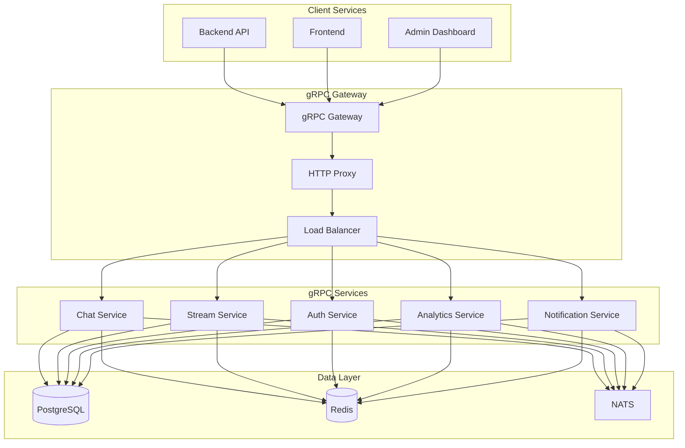
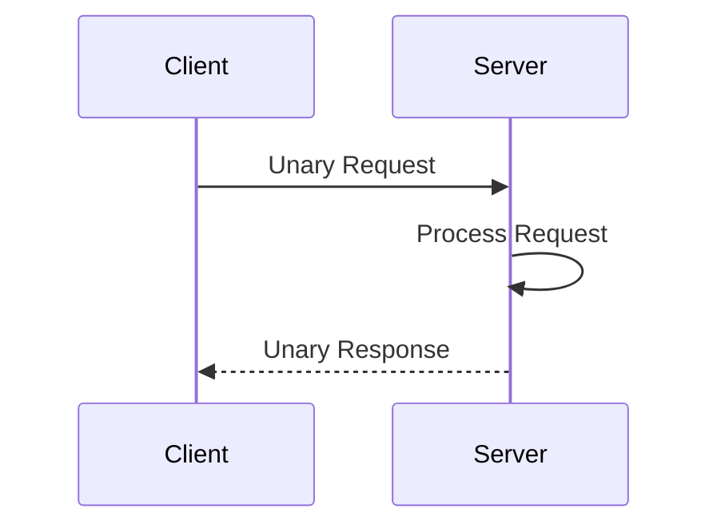
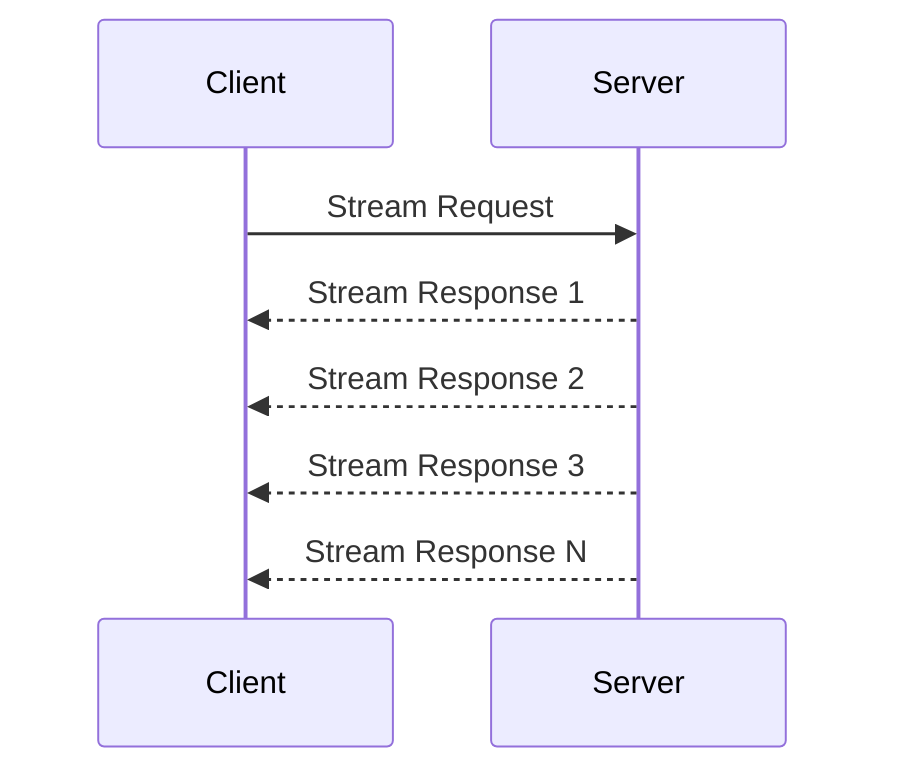
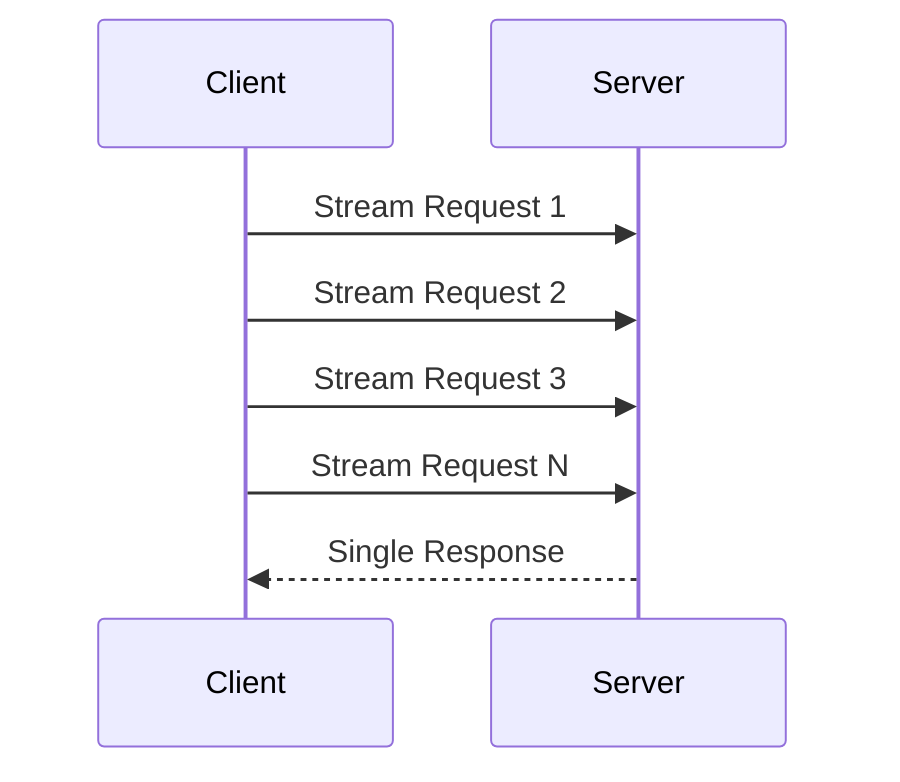
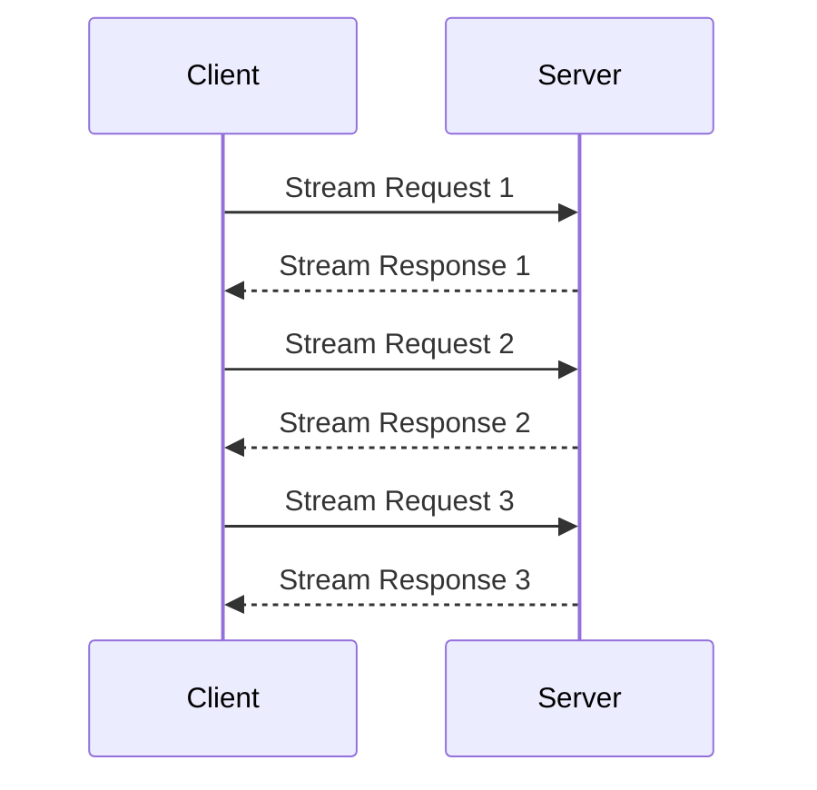

# 🔌 gRPC API - Veza Platform

> **API gRPC pour la communication inter-services sur la plateforme Veza**

## 📋 Table des Matières

- [Vue d'ensemble](#vue-densemble)
- [Architecture gRPC](#architecture-grpc)
- [Services Définis](#services-dfinis)
- [Protobuf Definitions](#protobuf-definitions)
- [Authentification](#authentification)
- [Gestion des Erreurs](#gestion-des-erreurs)
- [Exemples d'Implémentation](#exemples-dimplmentation)

## 🎯 Vue d'ensemble

L'API gRPC de Veza est utilisée pour la communication inter-services avec une performance optimale et une sérialisation binaire efficace. Elle supporte les appels unaires, le streaming unidirectionnel et bidirectionnel.

### 🌟 Fonctionnalités Principales

- **Communication Inter-Services** : Appels RPC entre microservices
- **Streaming Bidirectionnel** : Communication temps réel
- **Sérialisation Binaire** : Performance optimale
- **Code Generation** : Génération automatique de code client/serveur
- **Load Balancing** : Équilibrage de charge intégré
- **Health Checks** : Vérification de santé des services

## 🏗️ Architecture gRPC

### Diagramme d'Architecture



### Types de Communication

#### 1. Unary RPC (Appel-Réponse)



#### 2. Server Streaming RPC



#### 3. Client Streaming RPC



#### 4. Bidirectional Streaming RPC



## 🔧 Services Définis

### 1. Chat Service

```protobuf
service ChatService {
  // Unary RPCs
  rpc SendMessage(SendMessageRequest) returns (SendMessageResponse);
  rpc GetMessages(GetMessagesRequest) returns (GetMessagesResponse);
  rpc CreateRoom(CreateRoomRequest) returns (CreateRoomResponse);
  rpc JoinRoom(JoinRoomRequest) returns (JoinRoomResponse);
  rpc LeaveRoom(LeaveRoomRequest) returns (LeaveRoomResponse);
  
  // Server Streaming RPCs
  rpc StreamMessages(StreamMessagesRequest) returns (stream Message);
  rpc StreamRoomActivity(StreamRoomActivityRequest) returns (stream RoomActivity);
  
  // Bidirectional Streaming RPCs
  rpc ChatStream(stream ChatMessage) returns (stream ChatMessage);
}
```

### 2. Stream Service

```protobuf
service StreamService {
  // Unary RPCs
  rpc UploadAudio(UploadAudioRequest) returns (UploadAudioResponse);
  rpc GetStreamInfo(GetStreamInfoRequest) returns (GetStreamInfoResponse);
  rpc StartStream(StartStreamRequest) returns (StartStreamResponse);
  rpc StopStream(StopStreamRequest) returns (StopStreamResponse);
  
  // Server Streaming RPCs
  rpc StreamAudio(StreamAudioRequest) returns (stream AudioChunk);
  rpc StreamAnalytics(StreamAnalyticsRequest) returns (stream AnalyticsData);
  
  // Client Streaming RPCs
  rpc UploadAudioChunks(stream AudioChunk) returns (UploadAudioResponse);
}
```

### 3. Auth Service

```protobuf
service AuthService {
  // Unary RPCs
  rpc Authenticate(AuthenticateRequest) returns (AuthenticateResponse);
  rpc ValidateToken(ValidateTokenRequest) returns (ValidateTokenResponse);
  rpc RefreshToken(RefreshTokenRequest) returns (RefreshTokenResponse);
  rpc RevokeToken(RevokeTokenRequest) returns (RevokeTokenResponse);
  rpc GetUserInfo(GetUserInfoRequest) returns (GetUserInfoResponse);
  
  // Server Streaming RPCs
  rpc StreamUserSessions(StreamUserSessionsRequest) returns (stream UserSession);
}
```

### 4. Analytics Service

```protobuf
service AnalyticsService {
  // Unary RPCs
  rpc TrackEvent(TrackEventRequest) returns (TrackEventResponse);
  rpc GetAnalytics(GetAnalyticsRequest) returns (GetAnalyticsResponse);
  rpc GetMetrics(GetMetricsRequest) returns (GetMetricsResponse);
  
  // Server Streaming RPCs
  rpc StreamMetrics(StreamMetricsRequest) returns (stream MetricData);
  rpc StreamEvents(StreamEventsRequest) returns (stream EventData);
}
```

### 5. Notification Service

```protobuf
service NotificationService {
  // Unary RPCs
  rpc SendNotification(SendNotificationRequest) returns (SendNotificationResponse);
  rpc GetNotifications(GetNotificationsRequest) returns (GetNotificationsResponse);
  rpc MarkAsRead(MarkAsReadRequest) returns (MarkAsReadResponse);
  
  // Server Streaming RPCs
  rpc StreamNotifications(StreamNotificationsRequest) returns (stream Notification);
}
```

## 📝 Protobuf Definitions

### Messages de Base

```protobuf
// common.proto
syntax = "proto3";

package veza.common;

import "google/protobuf/timestamp.proto";

// Message de base pour les réponses
message BaseResponse {
  bool success = 1;
  string message = 2;
  string error_code = 3;
  google.protobuf.Timestamp timestamp = 4;
}

// Message pour la pagination
message Pagination {
  int32 page = 1;
  int32 page_size = 2;
  int32 total = 3;
  int32 total_pages = 4;
}

// Message pour les métadonnées
message Metadata {
  map<string, string> data = 1;
  google.protobuf.Timestamp created_at = 2;
  google.protobuf.Timestamp updated_at = 3;
}
```

### Messages d'Authentification

```protobuf
// auth.proto
syntax = "proto3";

package veza.auth;

import "google/protobuf/timestamp.proto";

message AuthenticateRequest {
  string email = 1;
  string password = 2;
  string device_id = 3;
  string ip_address = 4;
}

message AuthenticateResponse {
  bool success = 1;
  string access_token = 2;
  string refresh_token = 3;
  int32 expires_in = 4;
  UserInfo user_info = 5;
}

message ValidateTokenRequest {
  string token = 1;
}

message ValidateTokenResponse {
  bool valid = 1;
  UserInfo user_info = 2;
  google.protobuf.Timestamp expires_at = 3;
}

message UserInfo {
  int64 user_id = 1;
  string email = 2;
  string username = 3;
  string first_name = 4;
  string last_name = 5;
  repeated string roles = 6;
  google.protobuf.Timestamp created_at = 7;
}
```

### Messages de Chat

```protobuf
// chat.proto
syntax = "proto3";

package veza.chat;

import "google/protobuf/timestamp.proto";

message ChatMessage {
  int64 message_id = 1;
  int64 room_id = 2;
  int64 user_id = 3;
  string content = 4;
  string message_type = 5;
  bytes metadata = 6;
  int64 reply_to_id = 7;
  google.protobuf.Timestamp created_at = 8;
  google.protobuf.Timestamp updated_at = 9;
}

message SendMessageRequest {
  int64 room_id = 1;
  string content = 2;
  string message_type = 3;
  bytes metadata = 4;
  int64 reply_to_id = 5;
}

message SendMessageResponse {
  bool success = 1;
  ChatMessage message = 2;
  string error_message = 3;
}

message GetMessagesRequest {
  int64 room_id = 1;
  int32 limit = 2;
  int64 before_message_id = 3;
  int64 after_message_id = 4;
}

message GetMessagesResponse {
  repeated ChatMessage messages = 1;
  bool has_more = 2;
  int64 last_message_id = 3;
}

message StreamMessagesRequest {
  int64 room_id = 1;
  int64 last_message_id = 2;
}

message RoomActivity {
  int64 room_id = 1;
  string activity_type = 2;
  int64 user_id = 3;
  bytes data = 4;
  google.protobuf.Timestamp timestamp = 5;
}
```

### Messages de Streaming

```protobuf
// stream.proto
syntax = "proto3";

package veza.stream;

import "google/protobuf/timestamp.proto";

message AudioChunk {
  int64 stream_id = 1;
  int32 chunk_index = 2;
  bytes audio_data = 3;
  int32 sample_rate = 4;
  int32 channels = 5;
  string codec = 6;
  google.protobuf.Timestamp timestamp = 7;
}

message UploadAudioRequest {
  int64 user_id = 1;
  string title = 2;
  string description = 3;
  string genre = 4;
  bytes metadata = 5;
  int32 duration = 6;
  int64 file_size = 7;
  string file_format = 8;
}

message UploadAudioResponse {
  bool success = 1;
  int64 track_id = 2;
  string audio_url = 3;
  string waveform_url = 4;
  string error_message = 5;
}

message StreamAudioRequest {
  int64 track_id = 1;
  int32 quality = 2;
  string format = 3;
}

message AnalyticsData {
  int64 stream_id = 1;
  int32 listeners = 2;
  float bitrate = 3;
  float latency = 4;
  repeated string countries = 5;
  google.protobuf.Timestamp timestamp = 6;
}
```

## 🔐 Authentification

### Mécanismes d'Authentification

L'API gRPC de Veza utilise plusieurs mécanismes d'authentification selon le contexte :

#### 1. JWT Token Authentication

```go
// internal/grpc/auth/jwt_interceptor.go
package auth

import (
    "context"
    "strings"
    
    "google.golang.org/grpc"
    "google.golang.org/grpc/codes"
    "google.golang.org/grpc/metadata"
    "google.golang.org/grpc/status"
)

func JWTInterceptor() grpc.UnaryServerInterceptor {
    return func(ctx context.Context, req interface{}, info *grpc.UnaryServerInfo, handler grpc.UnaryHandler) (interface{}, error) {
        // Extraire le token depuis les métadonnées
        md, ok := metadata.FromIncomingContext(ctx)
        if !ok {
            return nil, status.Error(codes.Unauthenticated, "missing metadata")
        }
        
        authHeader := md.Get("authorization")
        if len(authHeader) == 0 {
            return nil, status.Error(codes.Unauthenticated, "missing authorization header")
        }
        
        token := strings.TrimPrefix(authHeader[0], "Bearer ")
        if token == authHeader[0] {
            return nil, status.Error(codes.Unauthenticated, "invalid authorization header format")
        }
        
        // Valider le token JWT
        claims, err := validateJWT(token)
        if err != nil {
            return nil, status.Error(codes.Unauthenticated, "invalid token")
        }
        
        // Ajouter les informations utilisateur au contexte
        newCtx := context.WithValue(ctx, "user_id", claims.UserID)
        newCtx = context.WithValue(newCtx, "user_email", claims.Email)
        newCtx = context.WithValue(newCtx, "user_roles", claims.Roles)
        
        return handler(newCtx, req)
    }
}
```

#### 2. API Key Authentication

```go
// internal/grpc/auth/api_key_interceptor.go
package auth

import (
    "context"
    
    "google.golang.org/grpc"
    "google.golang.org/grpc/codes"
    "google.golang.org/grpc/metadata"
    "google.golang.org/grpc/status"
)

func APIKeyInterceptor() grpc.UnaryServerInterceptor {
    return func(ctx context.Context, req interface{}, info *grpc.UnaryServerInfo, handler grpc.UnaryHandler) (interface{}, error) {
        md, ok := metadata.FromIncomingContext(ctx)
        if !ok {
            return nil, status.Error(codes.Unauthenticated, "missing metadata")
        }
        
        apiKeys := md.Get("x-api-key")
        if len(apiKeys) == 0 {
            return nil, status.Error(codes.Unauthenticated, "missing API key")
        }
        
        apiKey := apiKeys[0]
        if !isValidAPIKey(apiKey) {
            return nil, status.Error(codes.Unauthenticated, "invalid API key")
        }
        
        return handler(ctx, req)
    }
}
```

## ⚠️ Gestion des Erreurs

### Codes d'Erreur gRPC

```go
// internal/grpc/errors/errors.go
package errors

import (
    "google.golang.org/grpc/codes"
    "google.golang.org/grpc/status"
)

// Erreurs d'authentification
func ErrUnauthorized() error {
    return status.Error(codes.Unauthenticated, "unauthorized")
}

func ErrForbidden() error {
    return status.Error(codes.PermissionDenied, "forbidden")
}

// Erreurs de validation
func ErrInvalidArgument(message string) error {
    return status.Errorf(codes.InvalidArgument, "invalid argument: %s", message)
}

func ErrInvalidEmail(email string) error {
    return status.Errorf(codes.InvalidArgument, "invalid email: %s", email)
}

func ErrInvalidPassword() error {
    return status.Error(codes.InvalidArgument, "invalid password")
}

func ErrInvalidToken() error {
    return status.Error(codes.Unauthenticated, "invalid token")
}

// Erreurs de ressources
func ErrUserNotFound(userID int64) error {
    return status.Errorf(codes.NotFound, "user %d not found", userID)
}

func ErrRoomNotFound(roomID int64) error {
    return status.Errorf(codes.NotFound, "room %d not found", roomID)
}

func ErrMessageNotFound(messageID int64) error {
    return status.Errorf(codes.NotFound, "message %d not found", messageID)
}

func ErrTrackNotFound(trackID int64) error {
    return status.Errorf(codes.NotFound, "track %d not found", trackID)
}

// Erreurs de validation
func ErrInvalidEmail(email string) error {
    return status.Errorf(codes.InvalidArgument, "invalid email: %s", email)
}

func ErrInvalidPassword() error {
    return status.Error(codes.InvalidArgument, "invalid password")
}

func ErrInvalidToken() error {
    return status.Error(codes.Unauthenticated, "invalid token")
}
```

### Middleware de Gestion d'Erreurs

```go
// internal/grpc/middleware/error_handler.go
package middleware

import (
    "context"
    "log"
    
    "google.golang.org/grpc"
    "google.golang.org/grpc/codes"
    "google.golang.org/grpc/status"
)

func ErrorHandlerInterceptor() grpc.UnaryServerInterceptor {
    return func(ctx context.Context, req interface{}, info *grpc.UnaryServerInfo, handler grpc.UnaryHandler) (interface{}, error) {
        resp, err := handler(ctx, req)
        
        if err != nil {
            // Logger l'erreur
            log.Printf("gRPC error in %s: %v", info.FullMethod, err)
            
            // Convertir les erreurs métier en codes gRPC appropriés
            if st, ok := status.FromError(err); ok {
                return nil, st.Err()
            }
            
            // Erreur non gérée, retourner une erreur interne
            return nil, status.Error(codes.Internal, "internal server error")
        }
        
        return resp, nil
    }
}
```

## 💻 Exemples d'Implémentation

### Client Go

```go
// examples/client.go
package main

import (
    "context"
    "log"
    "time"
    
    "google.golang.org/grpc"
    "google.golang.org/grpc/credentials/insecure"
    
    pb "github.com/veza/grpc/proto"
)

func main() {
    // Connexion au serveur gRPC
    conn, err := grpc.Dial("localhost:9090", grpc.WithTransportCredentials(insecure.NewCredentials()))
    if err != nil {
        log.Fatalf("Failed to connect: %v", err)
    }
    defer conn.Close()
    
    // Clients
    chatClient := pb.NewChatServiceClient(conn)
    authClient := pb.NewAuthServiceClient(conn)
    streamClient := pb.NewStreamServiceClient(conn)
    
    // Authentification
    authResp, err := authClient.Authenticate(context.Background(), &pb.AuthenticateRequest{
        Email:    "user@veza.app",
        Password: "password123",
    })
    if err != nil {
        log.Fatalf("Authentication failed: %v", err)
    }
    
    // Créer un contexte avec le token
    ctx := context.WithValue(context.Background(), "authorization", "Bearer "+authResp.AccessToken)
    
    // Envoyer un message
    msgResp, err := chatClient.SendMessage(ctx, &pb.SendMessageRequest{
        RoomId:  1,
        Content: "Hello from gRPC client!",
    })
    if err != nil {
        log.Fatalf("Send message failed: %v", err)
    }
    
    log.Printf("Message sent: %v", msgResp.Message)
    
    // Stream de messages
    stream, err := chatClient.StreamMessages(ctx, &pb.StreamMessagesRequest{
        RoomId: 1,
    })
    if err != nil {
        log.Fatalf("Stream messages failed: %v", err)
    }
    
    for {
        msg, err := stream.Recv()
        if err != nil {
            log.Printf("Stream ended: %v", err)
            break
        }
        log.Printf("Received message: %s", msg.Content)
    }
}
```

### Serveur Go

```go
// internal/grpc/server/server.go
package server

import (
    "context"
    "log"
    "net"
    
    "google.golang.org/grpc"
    "google.golang.org/grpc/reflection"
    
    pb "github.com/veza/grpc/proto"
    "github.com/veza/internal/grpc/auth"
    "github.com/veza/internal/grpc/middleware"
)

type ChatServer struct {
    pb.UnimplementedChatServiceServer
    // Dependencies...
}

func (s *ChatServer) SendMessage(ctx context.Context, req *pb.SendMessageRequest) (*pb.SendMessageResponse, error) {
    userID := ctx.Value("user_id").(int64)
    
    // Logique métier pour envoyer un message
    message := &pb.ChatMessage{
        RoomId:    req.RoomId,
        UserId:    userID,
        Content:   req.Content,
        MessageType: req.MessageType,
        Metadata:  req.Metadata,
        ReplyToId: req.ReplyToId,
    }
    
    // Sauvegarder en base de données
    // Publier sur NATS
    // etc.
    
    return &pb.SendMessageResponse{
        Success: true,
        Message: message,
    }, nil
}

func (s *ChatServer) StreamMessages(req *pb.StreamMessagesRequest, stream pb.ChatService_StreamMessagesServer) error {
    ctx := stream.Context()
    userID := ctx.Value("user_id").(int64)
    
    // Logique de streaming
    for {
        select {
        case <-ctx.Done():
            return ctx.Err()
        default:
            // Récupérer les nouveaux messages
            messages := s.getNewMessages(req.RoomId, userID)
            
            for _, msg := range messages {
                if err := stream.Send(msg); err != nil {
                    return err
                }
            }
            
            // Attendre un peu
            time.Sleep(100 * time.Millisecond)
        }
    }
}

func StartGRPCServer(port string) error {
    lis, err := net.Listen("tcp", ":"+port)
    if err != nil {
        return err
    }
    
    // Créer le serveur gRPC avec les intercepteurs
    s := grpc.NewServer(
        grpc.UnaryInterceptor(
            grpc.ChainUnaryInterceptor(
                auth.JWTInterceptor("your-secret"),
                middleware.ErrorHandlerInterceptor(),
            ),
        ),
    )
    
    // Enregistrer les services
    pb.RegisterChatServiceServer(s, &ChatServer{})
    pb.RegisterAuthServiceServer(s, &AuthServer{})
    pb.RegisterStreamServiceServer(s, &StreamServer{})
    
    // Reflection pour les outils de debug
    reflection.Register(s)
    
    log.Printf("gRPC server listening on port %s", port)
    return s.Serve(lis)
}
```

### Client JavaScript/Node.js

```javascript
// examples/client.js
const grpc = require('@grpc/grpc-js');
const protoLoader = require('@grpc/proto-loader');

// Charger les protos
const packageDefinition = protoLoader.loadSync('./proto/veza.proto', {
    keepCase: true,
    longs: String,
    enums: String,
    defaults: true,
    oneofs: true
});

const vezaProto = grpc.loadPackageDefinition(packageDefinition).veza;

// Créer le client
const client = new vezaProto.ChatService(
    'localhost:9090',
    grpc.credentials.createInsecure()
);

// Authentification
const authClient = new vezaProto.AuthService(
    'localhost:9090',
    grpc.credentials.createInsecure()
);

async function authenticate() {
    return new Promise((resolve, reject) => {
        authClient.authenticate({
            email: 'user@veza.app',
            password: 'password123'
        }, (err, response) => {
            if (err) {
                reject(err);
            } else {
                resolve(response.access_token);
            }
        });
    });
}

async function sendMessage(token, roomId, content) {
    const metadata = new grpc.Metadata();
    metadata.add('authorization', `Bearer ${token}`);
    
    return new Promise((resolve, reject) => {
        client.sendMessage({
            room_id: roomId,
            content: content
        }, metadata, (err, response) => {
            if (err) {
                reject(err);
            } else {
                resolve(response);
            }
        });
    });
}

async function streamMessages(token, roomId) {
    const metadata = new grpc.Metadata();
    metadata.add('authorization', `Bearer ${token}`);
    
    const stream = client.streamMessages({
        room_id: roomId
    }, metadata);
    
    stream.on('data', (message) => {
        console.log('Received message:', message.content);
    });
    
    stream.on('error', (error) => {
        console.error('Stream error:', error);
    });
    
    stream.on('end', () => {
        console.log('Stream ended');
    });
}

// Utilisation
async function main() {
    try {
        const token = await authenticate();
        console.log('Authenticated successfully');
        
        await sendMessage(token, 1, 'Hello from Node.js client!');
        console.log('Message sent successfully');
        
        await streamMessages(token, 1);
    } catch (error) {
        console.error('Error:', error);
    }
}

main();
```

---

## 🔗 Liens croisés

- [Architecture Globale](../../architecture/global-architecture.md)
- [WebSocket API](../websocket/README.md)
- [Base de Données](../../database/schema.md)
- [Monitoring](../../monitoring/metrics/metrics-overview.md)

---

## Pour aller plus loin

- [Guide de Performance](../../guides/performance.md)
- [Troubleshooting](../../troubleshooting/README.md)
- [Sécurité](../../security/README.md)
- [Déploiement](../../deployment/README.md) 