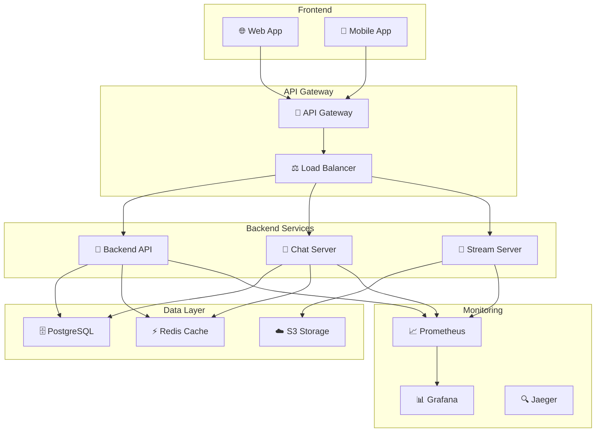

# Architecture Veza Platform

## Vue d'ensemble

Ce dossier contient la documentation complète de l'architecture de la plateforme Veza, incluant les diagrammes, les décisions d'architecture et les guides techniques.

## Structure du Dossier

```
architecture/
├── README.md                    # Ce fichier - Vue d'ensemble
├── backend/                     # Architecture backend
│   ├── backend-architecture.md
│   ├── backend-config.md
│   └── README.md
├── chat-server/                 # Architecture serveur de chat
│   ├── chat-server-architecture.md
│   └── README.md
├── stream-server/               # Architecture serveur de streaming
│   ├── stream-server-architecture.md
│   └── README.md
└── diagrams/                    # Diagrammes d'architecture
    ├── architecture-overview.md
    ├── data-flow.md
    └── test-mermaid.md
```

## Composants Principaux

### 1. Backend API (Go)
- **Technologie** : Go avec Gin framework
- **Base de données** : PostgreSQL
- **Cache** : Redis
- **Authentification** : JWT + OAuth2
- **Documentation** : [Backend Architecture](backend/backend-architecture.md)

### 2. Chat Server (Rust)
- **Technologie** : Rust avec Tokio
- **Protocole** : WebSocket + gRPC
- **Base de données** : PostgreSQL
- **Cache** : Redis
- **Documentation** : [Chat Server Architecture](chat-server/chat-server-architecture.md)

### 3. Stream Server (Rust)
- **Technologie** : Rust avec Tokio
- **Protocole** : WebRTC + gRPC
- **Audio/Video** : Codecs multiples
- **Documentation** : [Stream Server Architecture](stream-server/stream-server-architecture.md)

## Architecture Globale



## Flux de Données

### 1. Authentification
1. Client → API Gateway
2. API Gateway → Backend API
3. Backend API → PostgreSQL (validation)
4. Backend API → Client (JWT token)

### 2. Chat en Temps Réel
1. Client → Chat Server (WebSocket)
2. Chat Server → PostgreSQL (stockage)
3. Chat Server → Redis (cache)
4. Chat Server → Clients (broadcast)

### 3. Streaming Audio/Video
1. Client → Stream Server (WebRTC)
2. Stream Server → S3 (enregistrement)
3. Stream Server → Clients (diffusion)

## Décisions d'Architecture

### Microservices
- **Avantages** : Scalabilité, isolation, déploiement indépendant
- **Inconvénients** : Complexité, latence réseau
- **Décision** : Architecture microservices pour les services critiques

### Base de Données
- **PostgreSQL** : Données relationnelles, ACID
- **Redis** : Cache, sessions, données temporaires
- **S3** : Stockage de fichiers, médias

### Communication
- **REST API** : Opérations CRUD
- **WebSocket** : Communication temps réel
- **gRPC** : Communication inter-services
- **WebRTC** : Streaming audio/video

## Performance et Scalabilité

### Stratégies de Scalabilité
- **Horizontal** : Ajout d'instances
- **Vertical** : Augmentation des ressources
- **Auto-scaling** : Basé sur les métriques

### Monitoring
- **Métriques** : CPU, mémoire, réseau
- **Logs** : Centralisés avec ELK
- **Traçage** : Distributed tracing avec Jaeger

## Sécurité

### Authentification
- JWT tokens avec expiration
- OAuth2 pour les intégrations
- MFA pour les comptes sensibles

### Chiffrement
- TLS 1.3 pour les communications
- Chiffrement au repos (AES-256)
- Rotation automatique des clés

### Protection
- WAF pour la protection web
- Rate limiting
- Validation des entrées

## Déploiement

### Environnements
- **Development** : Local, Docker
- **Staging** : Cloud, données de test
- **Production** : Multi-cloud, haute disponibilité

### CI/CD
- **Build** : Automatisé avec tests
- **Deploy** : Blue-green, rolling updates
- **Monitoring** : Health checks, rollback automatique

## Ressources

### Documentation Technique
- [Backend Architecture](backend/backend-architecture.md)
- [Chat Server Architecture](chat-server/chat-server-architecture.md)
- [Stream Server Architecture](stream-server/stream-server-architecture.md)

### Guides de Développement
- [Guide de Développement](../guides/development-guide.md)
- [API Design](../guides/api-design.md)
- [Database Migrations](../guides/database-migrations.md)

### Monitoring et Observabilité
- [Monitoring Setup](../guides/monitoring-setup.md)
- [Performance Profiling](../guides/performance-profiling.md)
- [Debugging](../guides/debugging.md)

---

**Dernière mise à jour** : $(date)
**Version de l'architecture** : 1.0.0
**Mainteneur** : Équipe Architecture Veza 