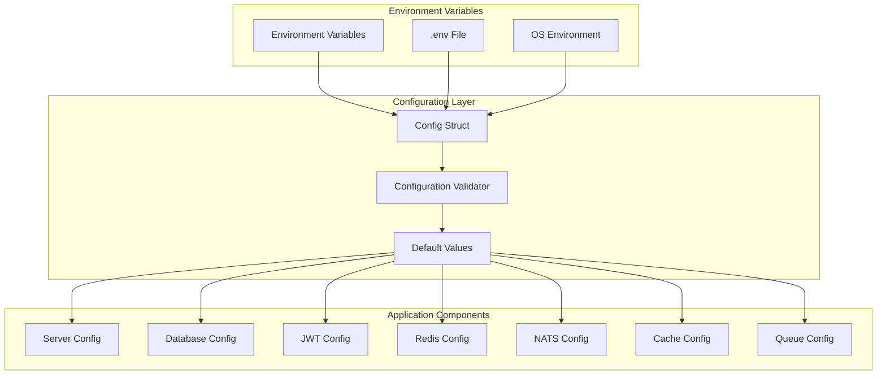

# ⚙️ Configuration Backend API - Veza

## 📋 Vue d'ensemble

Le système de configuration du backend Veza utilise une approche centralisée basée sur les variables d'environnement avec des valeurs par défaut optimisées pour différents environnements (développement, staging, production).

## 🏗️ Architecture de Configuration



## 📁 Structure de Configuration

### Configuration Principale

```go
/**
 * @struct Config
 * @description Configuration globale de l'application Veza Backend API
 * @module veza-backend-api/config
 * @since 1.0.0
 * @author Équipe Veza
 */
type Config struct {
    Server   ServerConfig    // Configuration du serveur HTTP
    Database DatabaseConfig  // Configuration de la base de données
    JWT      JWTConfig       // Configuration JWT
    Redis    RedisConfig     // Configuration Redis
    NATS     NATSConfig      // Configuration NATS
    Cache    CacheConfig     // Configuration du cache
    Queue    QueueConfig     // Configuration des queues
}
```

## 🔧 Composants de Configuration

### 1. ServerConfig - Configuration du Serveur

```go
/**
 * @struct ServerConfig
 * @description Configuration du serveur HTTP Gin
 * @fields Port, ReadTimeout, WriteTimeout, ShutdownTimeout, Environment
 */
type ServerConfig struct {
    Port            string        // Port d'écoute (défaut: 8080)
    ReadTimeout     time.Duration // Timeout de lecture (défaut: 10s)
    WriteTimeout    time.Duration // Timeout d'écriture (défaut: 10s)
    ShutdownTimeout time.Duration // Timeout d'arrêt (défaut: 30s)
    Environment     string        // Environnement (dev/staging/prod)
}
```

**Variables d'environnement :**
- `PORT` : Port du serveur (défaut: 8080)
- `READ_TIMEOUT` : Timeout de lecture (défaut: 10s)
- `WRITE_TIMEOUT` : Timeout d'écriture (défaut: 10s)
- `SHUTDOWN_TIMEOUT` : Timeout d'arrêt (défaut: 30s)
- `ENVIRONMENT` : Environnement (défaut: development)

### 2. DatabaseConfig - Configuration Base de Données

```go
/**
 * @struct DatabaseConfig
 * @description Configuration PostgreSQL avec optimisations haute charge
 * @fields URL, Host, Port, Username, Password, Database, SSLMode, MaxOpenConns, MaxIdleConns, MaxLifetime
 */
type DatabaseConfig struct {
    URL          string        // URL de connexion complète
    Host         string        // Hôte PostgreSQL
    Port         string        // Port PostgreSQL
    Username     string        // Nom d'utilisateur
    Password     string        // Mot de passe
    Database     string        // Nom de la base
    SSLMode      string        // Mode SSL
    MaxOpenConns int           // Connexions max ouvertes (défaut: 100)
    MaxIdleConns int           // Connexions max inactives (défaut: 25)
    MaxLifetime  time.Duration // Durée max de vie (défaut: 5min)
}
```

**Variables d'environnement :**
- `DATABASE_URL` : URL complète de connexion
- `DATABASE_HOST` : Hôte (défaut: localhost)
- `DATABASE_PORT` : Port (défaut: 5432)
- `DATABASE_USER` : Utilisateur (défaut: postgres)
- `DATABASE_PASSWORD` : Mot de passe
- `DATABASE_NAME` : Nom de la base (défaut: veza_dev)
- `DATABASE_MAX_OPEN_CONNS` : Connexions max (défaut: 100)
- `DATABASE_MAX_IDLE_CONNS` : Connexions inactives (défaut: 25)
- `DATABASE_CONN_MAX_LIFETIME` : Durée de vie (défaut: 5min)

### 3. JWTConfig - Configuration JWT

```go
/**
 * @struct JWTConfig
 * @description Configuration JWT avec rotation automatique
 * @fields Secret, ExpirationTime, RefreshTime, RefreshTTL, RefreshRotation
 */
type JWTConfig struct {
    Secret          string        // Clé secrète JWT
    ExpirationTime  time.Duration // Durée de vie access token (défaut: 15min)
    RefreshTime     time.Duration // Durée de vie refresh token (défaut: 7j)
    RefreshTTL      time.Duration // TTL refresh token
    RefreshRotation bool          // Rotation automatique (défaut: true)
}
```

**Variables d'environnement :**
- `JWT_ACCESS_SECRET` : Clé secrète (défaut: your-super-secret-key-change-in-production)
- `JWT_ACCESS_TTL` : Durée access token (défaut: 15min)
- `JWT_REFRESH_TTL` : Durée refresh token (défaut: 7j)
- `JWT_REFRESH_ROTATION` : Rotation automatique (défaut: true)

### 4. RedisConfig - Configuration Redis

```go
/**
 * @struct RedisConfig
 * @description Configuration Redis optimisée haute charge
 * @fields URL, Host, Port, Password, Database, MaxRetries, DialTimeout, ReadTimeout, WriteTimeout, PoolSize, PoolTimeout, IdleTimeout, MaxConnAge, EnableTLS
 */
type RedisConfig struct {
    URL          string        // URL Redis complète
    Host         string        // Hôte Redis
    Port         string        // Port Redis
    Password     string        // Mot de passe Redis
    Database     int           // Base de données Redis
    MaxRetries   int           // Tentatives max (défaut: 3)
    DialTimeout  time.Duration // Timeout connexion (défaut: 5s)
    ReadTimeout  time.Duration // Timeout lecture (défaut: 3s)
    WriteTimeout time.Duration // Timeout écriture (défaut: 3s)
    PoolSize     int           // Taille pool (défaut: 100)
    PoolTimeout  time.Duration // Timeout pool (défaut: 5s)
    IdleTimeout  time.Duration // Timeout inactif (défaut: 5min)
    MaxConnAge   time.Duration // Âge max connexion (défaut: 10min)
    EnableTLS    bool          // Activation TLS (défaut: false)
}
```

**Variables d'environnement :**
- `REDIS_URL` : URL complète Redis
- `REDIS_HOST` : Hôte (défaut: localhost)
- `REDIS_PORT` : Port (défaut: 6379)
- `REDIS_PASSWORD` : Mot de passe
- `REDIS_DATABASE` : Base de données (défaut: 0)
- `REDIS_MAX_RETRIES` : Tentatives max (défaut: 3)
- `REDIS_DIAL_TIMEOUT` : Timeout connexion (défaut: 5s)
- `REDIS_READ_TIMEOUT` : Timeout lecture (défaut: 3s)
- `REDIS_WRITE_TIMEOUT` : Timeout écriture (défaut: 3s)
- `REDIS_POOL_SIZE` : Taille pool (défaut: 100)
- `REDIS_POOL_TIMEOUT` : Timeout pool (défaut: 5s)
- `REDIS_IDLE_TIMEOUT` : Timeout inactif (défaut: 5min)
- `REDIS_MAX_CONN_AGE` : Âge max connexion (défaut: 10min)
- `REDIS_ENABLE_TLS` : Activation TLS (défaut: false)

### 5. NATSConfig - Configuration NATS

```go
/**
 * @struct NATSConfig
 * @description Configuration NATS avec JetStream
 * @fields URL, ClusterID, ClientID, MaxReconnects, ReconnectWait, ConnectTimeout, MaxPendingMsgs, MaxPendingBytes, EnableJetStream, StreamRetentionPolicy
 */
type NATSConfig struct {
    URL                   string        // URL NATS
    ClusterID             string        // ID du cluster
    ClientID              string        // ID du client
    MaxReconnects         int           // Reconnexions max (défaut: 10)
    ReconnectWait         time.Duration // Attente reconnexion (défaut: 2s)
    ConnectTimeout        time.Duration // Timeout connexion (défaut: 5s)
    MaxPendingMsgs        int           // Messages en attente max (défaut: 10000)
    MaxPendingBytes       int64         // Bytes en attente max (défaut: 64MB)
    EnableJetStream       bool          // Activation JetStream (défaut: true)
    StreamRetentionPolicy string        // Politique rétention (défaut: limits)
}
```

**Variables d'environnement :**
- `NATS_URL` : URL NATS (défaut: nats://localhost:4222)
- `NATS_CLUSTER_ID` : ID cluster (défaut: veza-cluster)
- `NATS_CLIENT_ID` : ID client (défaut: veza-backend)
- `NATS_MAX_RECONNECTS` : Reconnexions max (défaut: 10)
- `NATS_RECONNECT_WAIT` : Attente reconnexion (défaut: 2s)
- `NATS_CONNECT_TIMEOUT` : Timeout connexion (défaut: 5s)
- `NATS_MAX_PENDING_MSGS` : Messages en attente (défaut: 10000)
- `NATS_MAX_PENDING_BYTES` : Bytes en attente (défaut: 64MB)
- `NATS_ENABLE_JETSTREAM` : Activation JetStream (défaut: true)
- `NATS_STREAM_RETENTION` : Politique rétention (défaut: limits)

### 6. CacheConfig - Configuration Cache

```go
/**
 * @struct CacheConfig
 * @description Configuration cache multi-niveaux
 * @fields EnableLevel1, EnableLevel2, EnableLevel3, MaxMemoryMB, CompressionLevel, StatsInterval, WarmupEnabled, WarmupInterval
 */
type CacheConfig struct {
    EnableLevel1     bool          // Cache L1 (mémoire) (défaut: true)
    EnableLevel2     bool          // Cache L2 (Redis) (défaut: true)
    EnableLevel3     bool          // Cache L3 (disque) (défaut: false)
    MaxMemoryMB      int           // Mémoire max MB (défaut: 512)
    CompressionLevel int           // Niveau compression (défaut: 1)
    StatsInterval    time.Duration // Intervalle stats (défaut: 30s)
    WarmupEnabled    bool          // Activation warmup (défaut: true)
    WarmupInterval   time.Duration // Intervalle warmup (défaut: 10min)
}
```

**Variables d'environnement :**
- `CACHE_ENABLE_L1` : Activation cache L1 (défaut: true)
- `CACHE_ENABLE_L2` : Activation cache L2 (défaut: true)
- `CACHE_ENABLE_L3` : Activation cache L3 (défaut: false)
- `CACHE_MAX_MEMORY_MB` : Mémoire max MB (défaut: 512)
- `CACHE_COMPRESSION_LEVEL` : Niveau compression (défaut: 1)
- `CACHE_STATS_INTERVAL` : Intervalle stats (défaut: 30s)
- `CACHE_WARMUP_ENABLED` : Activation warmup (défaut: true)
- `CACHE_WARMUP_INTERVAL` : Intervalle warmup (défaut: 10min)

### 7. QueueConfig - Configuration Queue

```go
/**
 * @struct QueueConfig
 * @description Configuration queue de traitement
 * @fields MaxWorkers, MaxQueueSize, ProcessingTimeout, RetryMaxAttempts, RetryBackoffBase, DeadLetterQueueSize
 */
type QueueConfig struct {
    MaxWorkers          int           // Workers max (défaut: 50)
    MaxQueueSize        int           // Taille queue max (défaut: 10000)
    ProcessingTimeout   time.Duration // Timeout traitement (défaut: 30s)
    RetryMaxAttempts    int           // Tentatives max (défaut: 3)
    RetryBackoffBase    time.Duration // Base backoff (défaut: 1s)
    DeadLetterQueueSize int           // Taille DLQ (défaut: 1000)
}
```

**Variables d'environnement :**
- `QUEUE_MAX_WORKERS` : Workers max (défaut: 50)
- `QUEUE_MAX_SIZE` : Taille queue max (défaut: 10000)
- `QUEUE_PROCESSING_TIMEOUT` : Timeout traitement (défaut: 30s)
- `QUEUE_RETRY_MAX_ATTEMPTS` : Tentatives max (défaut: 3)
- `QUEUE_RETRY_BACKOFF_BASE` : Base backoff (défaut: 1s)
- `QUEUE_DLQ_SIZE` : Taille DLQ (défaut: 1000)

## 🔄 Fonctions Utilitaires

### getEnv - Récupération Variable d'Environnement

```go
/**
 * @function getEnv
 * @description Récupère une variable d'environnement avec valeur par défaut
 * @param {string} key - Clé de la variable d'environnement
 * @param {string} defaultValue - Valeur par défaut si non définie
 * @returns {string} Valeur de la variable d'environnement
 * @example
 * port := getEnv("PORT", "8080")
 */
func getEnv(key, defaultValue string) string {
    if value := os.Getenv(key); value != "" {
        return value
    }
    return defaultValue
}
```

### getIntEnv - Variable d'Environnement Entière

```go
/**
 * @function getIntEnv
 * @description Récupère une variable d'environnement entière
 * @param {string} key - Clé de la variable
 * @param {int} defaultValue - Valeur par défaut
 * @returns {int} Valeur entière de la variable
 * @throws {error} Erreur de conversion si la valeur n'est pas un entier
 */
func getIntEnv(key string, defaultValue int) int {
    if value := os.Getenv(key); value != "" {
        if intValue, err := strconv.Atoi(value); err == nil {
            return intValue
        }
    }
    return defaultValue
}
```

### getDurationEnv - Variable d'Environnement Durée

```go
/**
 * @function getDurationEnv
 * @description Récupère une variable d'environnement de type durée
 * @param {string} key - Clé de la variable
 * @param {time.Duration} defaultValue - Valeur par défaut
 * @returns {time.Duration} Durée parsée
 * @example
 * timeout := getDurationEnv("READ_TIMEOUT", 10*time.Second)
 */
func getDurationEnv(key string, defaultValue time.Duration) time.Duration {
    if value := os.Getenv(key); value != "" {
        if duration, err := time.ParseDuration(value); err == nil {
            return duration
        }
    }
    return defaultValue
}
```

## 📊 Optimisations par Environnement

### Développement
```bash
# Configuration optimisée pour le développement
ENVIRONMENT=development
PORT=8080
DATABASE_MAX_OPEN_CONNS=10
REDIS_POOL_SIZE=10
QUEUE_MAX_WORKERS=5
CACHE_MAX_MEMORY_MB=128
```

### Staging
```bash
# Configuration intermédiaire pour les tests
ENVIRONMENT=staging
PORT=8080
DATABASE_MAX_OPEN_CONNS=50
REDIS_POOL_SIZE=50
QUEUE_MAX_WORKERS=20
CACHE_MAX_MEMORY_MB=256
```

### Production
```bash
# Configuration optimisée pour la production
ENVIRONMENT=production
PORT=8080
DATABASE_MAX_OPEN_CONNS=100
REDIS_POOL_SIZE=100
QUEUE_MAX_WORKERS=50
CACHE_MAX_MEMORY_MB=512
JWT_ACCESS_SECRET=your-super-secure-production-secret
REDIS_ENABLE_TLS=true
NATS_ENABLE_JETSTREAM=true
```

## 🔒 Sécurité de Configuration

### Variables Sensibles
- **JWT_ACCESS_SECRET** : Clé secrète JWT (changer en production)
- **DATABASE_PASSWORD** : Mot de passe base de données
- **REDIS_PASSWORD** : Mot de passe Redis

### Bonnes Pratiques
1. **Ne jamais commiter** les fichiers `.env` contenant des secrets
2. **Utiliser des secrets managers** en production (AWS Secrets Manager, HashiCorp Vault)
3. **Rotation régulière** des clés JWT
4. **Validation** des configurations au démarrage
5. **Logs sécurisés** : ne pas logger les valeurs sensibles

## 🧪 Tests de Configuration

### Validation de Configuration
```go
/**
 * @function ValidateConfig
 * @description Valide la configuration au démarrage
 * @param {*Config} config - Configuration à valider
 * @returns {error} Erreur de validation si présente
 */
func ValidateConfig(config *Config) error {
    // Validation des champs obligatoires
    if config.JWT.Secret == "your-super-secret-key-change-in-production" {
        return errors.New("JWT secret must be changed in production")
    }
    
    // Validation des timeouts
    if config.Server.ReadTimeout < 1*time.Second {
        return errors.New("read timeout too short")
    }
    
    return nil
}
```

## 📈 Monitoring de Configuration

### Métriques de Configuration
- **Configuration Load Time** : Temps de chargement de la configuration
- **Environment Variables** : Nombre de variables d'environnement utilisées
- **Default Values Used** : Nombre de valeurs par défaut utilisées
- **Configuration Errors** : Erreurs de configuration

### Alertes
- **Missing Required Config** : Configuration requise manquante
- **Invalid Config Values** : Valeurs de configuration invalides
- **Security Config Issues** : Problèmes de sécurité de configuration

---

**Dernière mise à jour** : $(date)
**Version** : 1.0.0
**Maintenu par** : Équipe Veza 