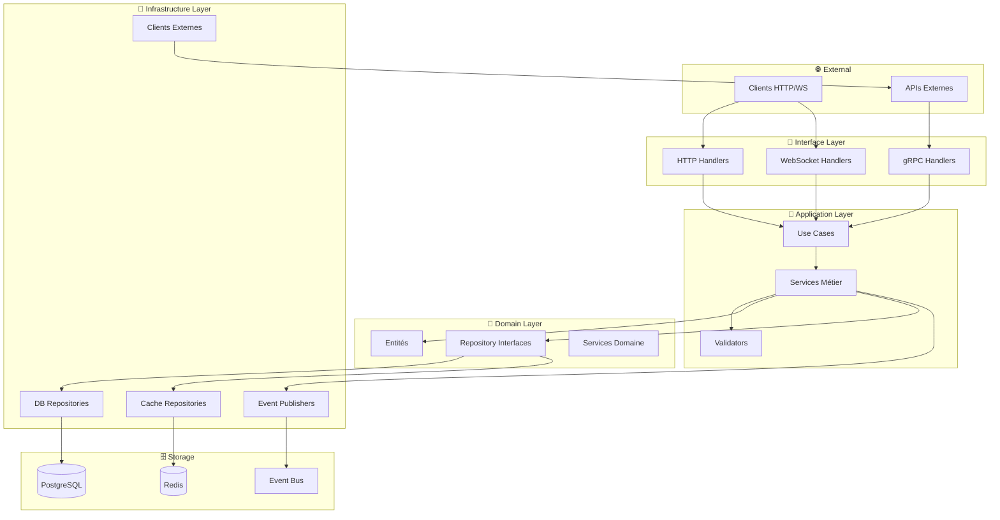

# 🏗️ Documentation Architecture Backend - Répertoire Détaillé

## 📋 Vue d'ensemble

Ce répertoire contient la documentation détaillée de l'architecture du backend Veza, organisée par composants et couches architecturales.

## 📁 Structure de la documentation

```
backend/
├── README.md                 # Ce fichier - Guide général
├── core-architecture.md     # Architecture hexagonale et clean
├── api-layer.md             # Couche API et handlers HTTP
├── service-layer.md         # Couche logique métier
├── data-layer.md            # Couche accès aux données
├── infrastructure.md        # Infrastructure et déploiement
├── security.md              # Sécurité et authentification
├── performance.md           # Optimisations et monitoring
└── integration.md           # Communication inter-services
```

## 🎯 Architecture générale

Le backend Veza suit une **architecture hexagonale** (Ports & Adapters) combinée avec les principes de **Clean Architecture**. Cette approche garantit :

- ✅ **Séparation des responsabilités**
- ✅ **Testabilité maximale**
- ✅ **Indépendance des frameworks**
- ✅ **Maintenabilité à long terme**
- ✅ **Évolutivité des composants**

## 🔄 Flux de données



## 🧩 Composants principaux

### 1. 🔐 Module d'authentification

**Localisation** : `internal/api/auth/`

**Responsabilités** :
- Gestion des comptes utilisateur (inscription/connexion)
- Génération et validation des JWT tokens
- Système de refresh tokens avec rotation
- Magic links et OAuth2 (Google, GitHub)
- Validation des permissions et rôles

**Patterns utilisés** :
- Service Layer pour la logique métier
- Repository Pattern pour l'accès aux données
- Strategy Pattern pour les méthodes d'authentification

### 2. 👥 Module utilisateur

**Localisation** : `internal/api/user/`

**Responsabilités** :
- Gestion des profils utilisateur
- Système de préférences personnalisées
- Relations entre utilisateurs (amis, bloqués)
- Historique d'activité et analytics

### 3. 💬 Module de chat

**Localisation** : `internal/api/chat/` + `internal/websocket/`

**Responsabilités** :
- Chat en temps réel via WebSocket
- Gestion des salons publics et privés
- Messages directs entre utilisateurs
- Modération automatique du contenu
- Historique des conversations

**Technologies** :
- WebSocket pour la communication temps réel
- Redis pour la synchronisation multi-instance
- PostgreSQL pour la persistance

### 4. 🎵 Module de pistes audio

**Localisation** : `internal/api/track/`

**Responsabilités** :
- Upload et stockage des fichiers audio
- Extraction et gestion des métadonnées
- Système de playlists et favoris
- Intégration avec le stream server
- Gestion des formats audio multiples

### 5. 📋 Module d'annonces

**Localisation** : `internal/api/listing/`

**Responsabilités** :
- Création et gestion des annonces
- Système de catégories et tags
- Recherche et filtrage avancés
- Gestion des statuts et cycles de vie

### 6. 💰 Module d'offres

**Localisation** : `internal/api/offer/`

**Responsabilités** :
- Système d'offres et négociations
- Workflow de validation des transactions
- Historique des échanges
- Intégration système de paiement (futur)

### 7. 🔍 Module de recherche

**Localisation** : `internal/api/search/`

**Responsabilités** :
- Recherche globale multi-entités
- Auto-complétion intelligente
- Filtres avancés et facettes
- Analytics des recherches populaires

### 8. 👑 Module d'administration

**Localisation** : `internal/api/admin/`

**Responsabilités** :
- Interface d'administration complète
- Gestion des utilisateurs et permissions
- Modération du contenu
- Analytics et rapports détaillés
- Configuration système en temps réel

## 🔧 Infrastructure technique

### 🗄️ Base de données

**PostgreSQL** comme base principale avec :
- Migrations automatiques versionnées
- Connection pooling optimisé
- Indexes stratégiques pour performance
- Réplication read/write (production)

### ⚡ Cache et performance

**Redis** pour :
- Cache applicatif multi-niveaux
- Sessions utilisateur
- Rate limiting distribué
- Pub/Sub pour événements temps réel

### 📡 Communication

**Protocols supportés** :
- **REST API** : Communication client/serveur principal
- **WebSocket** : Chat et notifications temps réel
- **gRPC** : Communication inter-services
- **NATS** : Event bus pour découplage services

### 🛡️ Sécurité

**Mesures implémentées** :
- JWT avec rotation automatique des secrets
- Rate limiting par IP et utilisateur
- Headers de sécurité (CORS, CSP, etc.)
- Validation rigoureuse des entrées
- Audit trail complet des actions sensibles

## 📊 Monitoring et observabilité

### 🔍 Health checks

- **Liveness probe** : `/health` - État général du service
- **Readiness probe** : `/ready` - Prêt à recevoir du trafic
- **Metrics endpoint** : `/metrics` - Métriques Prometheus

### 📈 Métriques collectées

- **Performance** : Latence P50/P95/P99, throughput
- **Erreurs** : Taux d'erreur par endpoint
- **Infrastructure** : CPU, mémoire, connexions DB
- **Business** : Utilisateurs actifs, transactions, messages

### 📝 Logging

**Logging structuré** avec Zap :
- Logs JSON en production
- Corrélation des requêtes (request ID)
- Différents niveaux (ERROR, WARN, INFO, DEBUG)
- Rotation et archivage automatiques

## 🚀 Déploiement et environnements

### 🏗️ Environments

1. **Développement** (`cmd/server/main.go`)
   - Hot reload avec Air
   - Logs détaillés en console
   - Rate limiting permissif
   - CORS ouvert pour localhost

2. **Production** (`cmd/production-server/main.go`)
   - Logging optimisé (JSON)
   - Rate limiting strict avec Redis
   - Security headers renforcés
   - Health checks pour load balancer

### 🐳 Containerisation

**Docker multi-stage** :
- Stage build avec Go 1.21
- Stage runtime avec Alpine minimal
- Optimisation de la taille d'image
- Security scanning automatique

### ☸️ Kubernetes

**Déploiement cloud-native** :
- Horizontal Pod Autoscaling
- Resource limits configurables
- Liveness/Readiness probes
- Rolling updates sans interruption

## 🧪 Tests et qualité

### 📋 Stratégie de tests

1. **Tests unitaires** : Logique métier et use cases
2. **Tests d'intégration** : API endpoints avec DB de test
3. **Tests de contrat** : Validation des interfaces
4. **Tests de performance** : Load testing et benchmarks

### 🔧 Outils de qualité

- **Static analysis** : `go vet`, `staticcheck`
- **Linting** : `golangci-lint` avec règles strictes
- **Security** : `gosec` pour vulnerabilités
- **Coverage** : Minimum 80% de couverture de code

## 📚 Documentation associée

### 🔗 Liens vers autres sections

- **[Configuration](../../deployment/deployment-guide.md)** : Variables d'environnement et setup
- **[API Reference](../../api/endpoints-reference.md)** : Documentation complète des endpoints
- **[Database](../../database/schema.md)** : Schéma de base de données
- **[Security](../../security/authentication.md)** : Guide de sécurité détaillé
- **[Monitoring](../../monitoring/metrics.md)** : Métriques et alertes

### 📖 Guides de développement

- **[Ajouter un nouveau module](../../guides/new-module.md)** : Comment créer un nouveau module métier
- **[Migration de base de données](../../guides/migrations.md)** : Process de migration sécurisé
- **[Debugging](../../guides/debugging.md)** : Techniques de débogage et profiling
- **[Testing](../../guides/testing.md)** : Best practices pour les tests

## 🛠️ Outils de développement

### 🚀 Setup développement local

```bash
# Prérequis
go version    # 1.21+
docker --version
make --version

# Installation
git clone <repo>
cd veza-backend-api
cp config.example.env .env
make dev-setup
make dev-start
```

### 🔧 Commandes utiles

```bash
# Développement
make dev           # Démarrage avec hot reload
make test          # Tests complets
make lint          # Linting et static analysis
make migrate       # Migrations DB

# Production
make build         # Build optimisé
make docker        # Build image Docker
make deploy        # Déploiement
```

## 🎯 Feuille de route

### 📈 Prochaines fonctionnalités

- [ ] **API Gateway** : Centralisation du routing
- [ ] **Event Sourcing** : Historique complet des événements
- [ ] **CQRS** : Séparation lecture/écriture
- [ ] **GraphQL** : API flexible pour mobile
- [ ] **Microservices** : Découpage en services autonomes

### 🔄 Améliorations techniques

- [ ] **Observability** : Tracing distribué avec Jaeger
- [ ] **Performance** : Cache intelligent avec prédiction
- [ ] **Security** : Zero-trust architecture
- [ ] **Scalability** : Horizontal scaling automatique

---

## 📞 Support et contact

- **📧 Email** : backend-team@veza.com
- **💬 Slack** : #backend-dev
- **📋 Issues** : [GitHub Issues](https://github.com/okinrev/veza-full-stack/issues)
- **📚 Wiki** : [Confluence Backend](https://veza.atlassian.net/wiki/backend)

---

**📝 Dernière mise à jour** : $(date)  
**👨‍💻 Maintenu par** : Équipe Backend Veza  
**🔄 Version** : 1.0.0 