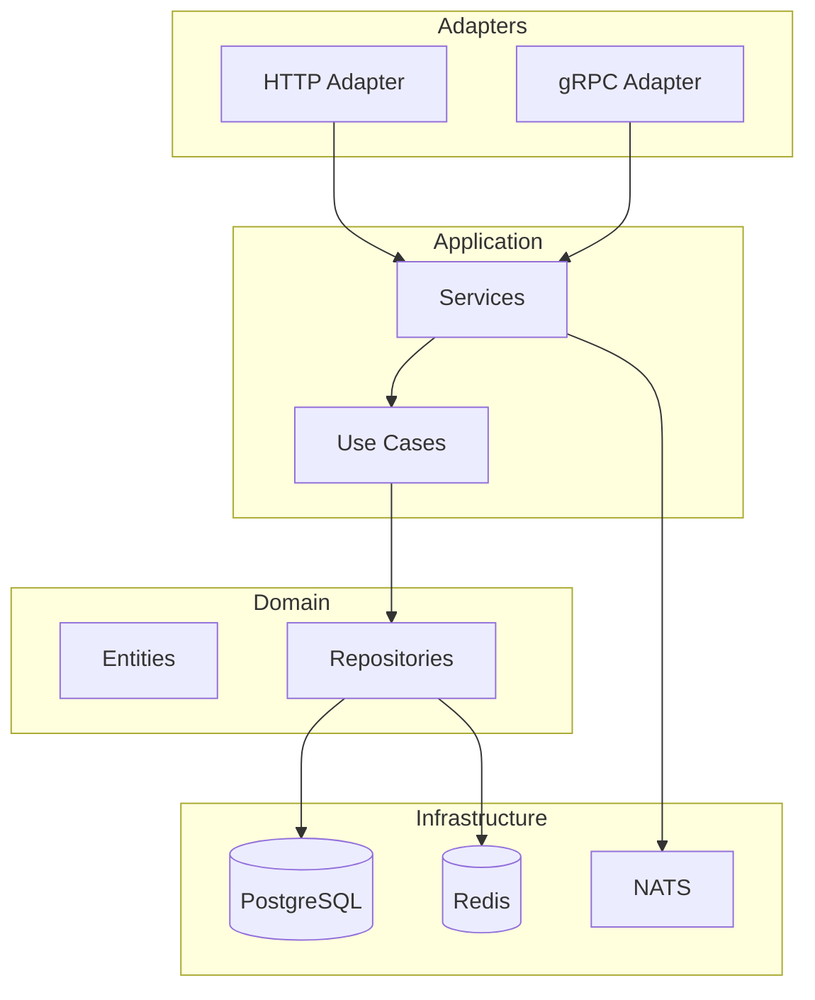

# Architecture Backend - Veza

## Vue d'ensemble

Ce document décrit l'architecture du backend API de Veza.

## Architecture Hexagonale

## Technologies

- **Langage** : Go 1.21+
- **Framework** : Gin
- **ORM** : GORM
- **Base de données** : PostgreSQL
- **Cache** : Redis
- **Message Queue** : NATS

---

**Dernière mise à jour** : $(date)
**Version** : 1.0.0 