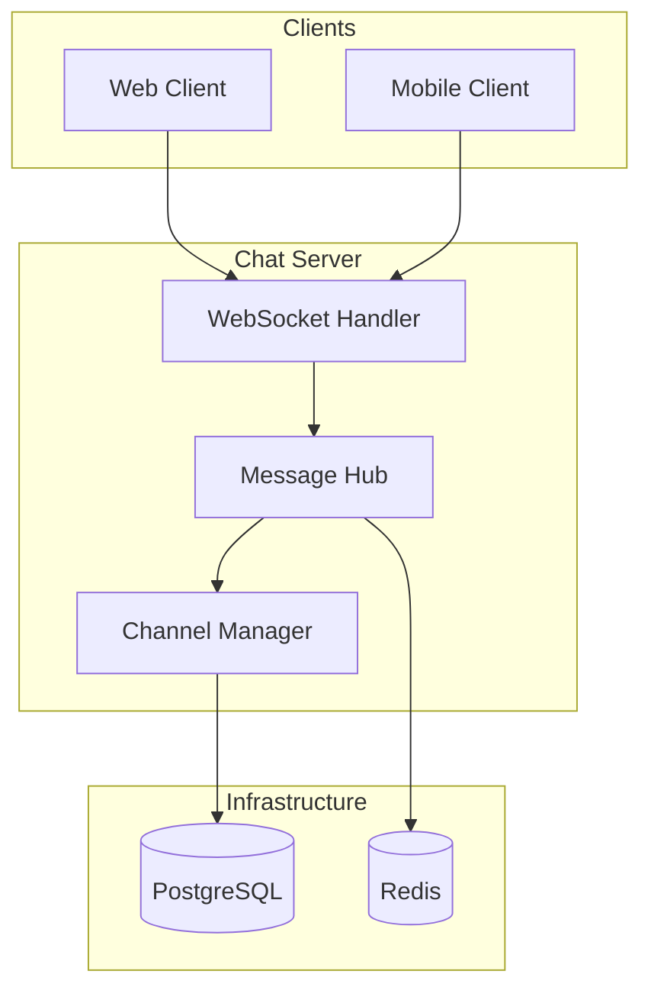
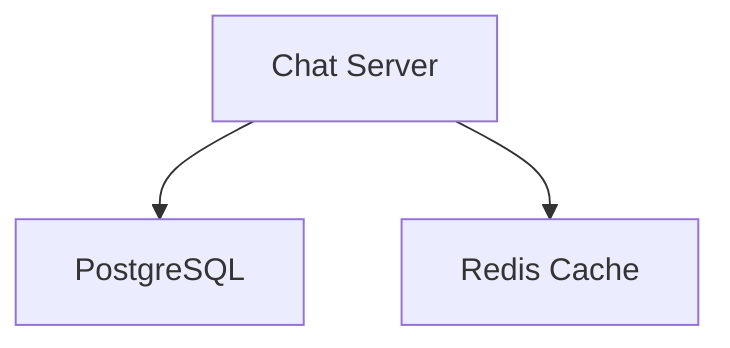

# Architecture Chat Server - Veza

## Vue d'ensemble

Ce document décrit l'architecture du serveur de chat Veza.

## Architecture WebSocket

## Technologies

- **Langage** : Rust
- **Framework** : Axum
- **WebSocket** : tokio-tungstenite
- **Base de données** : PostgreSQL
- **Cache** : Redis

## Composants principaux
- Serveur WebSocket (Rust)
- PostgreSQL
- Redis

## Diagramme d'architecture

## Ressources
- [README général](../README.md)

---

**Dernière mise à jour** : $(date)
**Version** : 1.0.0 