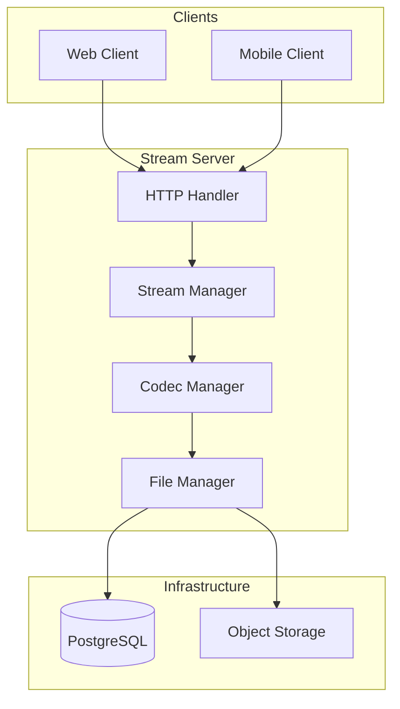

# Architecture Stream Server - Veza

## Vue d'ensemble

Ce document décrit l'architecture du serveur de streaming Veza.

## Architecture de Streaming

## Technologies

- **Langage** : Rust
- **Framework** : Axum
- **Codecs** : FFmpeg
- **Base de données** : PostgreSQL
- **Storage** : S3/Cloud Storage

---

**Dernière mise à jour** : $(date)
**Version** : 1.0.0 