# 📚 Base de Données - Veza Platform

## Vue d'ensemble

La base de données Veza utilise PostgreSQL comme SGBD principal avec Redis pour le cache et les sessions. Elle est conçue pour supporter la scalabilité, les performances et la fiabilité de la plateforme de streaming audio et chat en temps réel.

---

## Architecture de la base de données

```mermaid
graph TB
    subgraph "Services"
        API[Backend API]
        Chat[Chat Server]
        Stream[Stream Server]
    end
    
    subgraph "Base de Données"
        PG[(PostgreSQL)]
        Redis[(Redis)]
    end
    
    API --> PG
    Chat --> PG
    Stream --> PG
    API --> Redis
    Chat --> Redis
    Stream --> Redis
```



---

## Schéma de base de données


---

## Modèles de données

### 1. Utilisateurs et profils

```sql
-- Table des utilisateurs
CREATE TABLE users (
    id BIGSERIAL PRIMARY KEY,
    email VARCHAR(255) UNIQUE NOT NULL,
    username VARCHAR(50) UNIQUE NOT NULL,
    password_hash VARCHAR(255) NOT NULL,
    first_name VARCHAR(100),
    last_name VARCHAR(100),
    bio TEXT,
    avatar_url VARCHAR(500),
    location VARCHAR(200),
    website VARCHAR(500),
    email_verified BOOLEAN DEFAULT FALSE,
    is_active BOOLEAN DEFAULT TRUE,
    created_at TIMESTAMP DEFAULT CURRENT_TIMESTAMP,
    updated_at TIMESTAMP DEFAULT CURRENT_TIMESTAMP,
    last_login_at TIMESTAMP
);

-- Table des profils utilisateur
CREATE TABLE user_profiles (
    user_id BIGINT PRIMARY KEY REFERENCES users(id) ON DELETE CASCADE,
    preferences JSONB DEFAULT '{}',
    social_links JSONB DEFAULT '{}',
    notification_settings JSONB DEFAULT '{}',
    updated_at TIMESTAMP DEFAULT CURRENT_TIMESTAMP
);

-- Index pour les performances
CREATE INDEX idx_users_email ON users(email);
CREATE INDEX idx_users_username ON users(username);
CREATE INDEX idx_users_created_at ON users(created_at);
CREATE INDEX idx_users_is_active ON users(is_active);

-- Trigger pour updated_at
CREATE OR REPLACE FUNCTION update_updated_at_column()
RETURNS TRIGGER AS $$
BEGIN
    NEW.updated_at = CURRENT_TIMESTAMP;
    RETURN NEW;
END;
$$ language 'plpgsql';

CREATE TRIGGER update_users_updated_at 
    BEFORE UPDATE ON users 
    FOR EACH ROW EXECUTE FUNCTION update_updated_at_column();
```

### 2. Contenu audio

```sql
-- Table des pistes audio
CREATE TABLE tracks (
    id BIGSERIAL PRIMARY KEY,
    user_id BIGINT NOT NULL REFERENCES users(id) ON DELETE CASCADE,
    title VARCHAR(255) NOT NULL,
    artist VARCHAR(255),
    album VARCHAR(255),
    genre VARCHAR(100),
    description TEXT,
    audio_url VARCHAR(500) NOT NULL,
    waveform_url VARCHAR(500),
    duration INTEGER NOT NULL, -- en secondes
    file_size BIGINT NOT NULL, -- en bytes
    file_format VARCHAR(20) NOT NULL,
    metadata JSONB DEFAULT '{}',
    is_public BOOLEAN DEFAULT TRUE,
    is_explicit BOOLEAN DEFAULT FALSE,
    play_count INTEGER DEFAULT 0,
    like_count INTEGER DEFAULT 0,
    created_at TIMESTAMP DEFAULT CURRENT_TIMESTAMP,
    updated_at TIMESTAMP DEFAULT CURRENT_TIMESTAMP
);

-- Table des playlists
CREATE TABLE playlists (
    id BIGSERIAL PRIMARY KEY,
    user_id BIGINT NOT NULL REFERENCES users(id) ON DELETE CASCADE,
    name VARCHAR(255) NOT NULL,
    description TEXT,
    cover_url VARCHAR(500),
    is_public BOOLEAN DEFAULT TRUE,
    track_count INTEGER DEFAULT 0,
    duration INTEGER DEFAULT 0, -- en secondes
    created_at TIMESTAMP DEFAULT CURRENT_TIMESTAMP,
    updated_at TIMESTAMP DEFAULT CURRENT_TIMESTAMP
);

-- Table de liaison playlist-pistes
CREATE TABLE playlist_tracks (
    playlist_id BIGINT REFERENCES playlists(id) ON DELETE CASCADE,
    track_id BIGINT REFERENCES tracks(id) ON DELETE CASCADE,
    position INTEGER NOT NULL,
    added_at TIMESTAMP DEFAULT CURRENT_TIMESTAMP,
    PRIMARY KEY (playlist_id, track_id)
);

-- Index pour les performances
CREATE INDEX idx_tracks_user_id ON tracks(user_id);
CREATE INDEX idx_tracks_created_at ON tracks(created_at);
CREATE INDEX idx_tracks_is_public ON tracks(is_public);
CREATE INDEX idx_tracks_genre ON tracks(genre);
CREATE INDEX idx_tracks_play_count ON tracks(play_count DESC);
CREATE INDEX idx_tracks_like_count ON tracks(like_count DESC);

CREATE INDEX idx_playlists_user_id ON playlists(user_id);
CREATE INDEX idx_playlists_is_public ON playlists(is_public);
CREATE INDEX idx_playlists_created_at ON playlists(created_at);

CREATE INDEX idx_playlist_tracks_playlist_id ON playlist_tracks(playlist_id);
CREATE INDEX idx_playlist_tracks_track_id ON playlist_tracks(track_id);
CREATE INDEX idx_playlist_tracks_position ON playlist_tracks(playlist_id, position);
```

### 3. Chat et messagerie

```sql
-- Table des salles de chat
CREATE TABLE chat_rooms (
    id BIGSERIAL PRIMARY KEY,
    name VARCHAR(255) NOT NULL,
    description TEXT,
    type VARCHAR(50) DEFAULT 'public', -- public, private, direct
    created_by BIGINT REFERENCES users(id) ON DELETE SET NULL,
    max_participants INTEGER DEFAULT 100,
    is_private BOOLEAN DEFAULT FALSE,
    created_at TIMESTAMP DEFAULT CURRENT_TIMESTAMP,
    updated_at TIMESTAMP DEFAULT CURRENT_TIMESTAMP
);

-- Table des participants aux salles
CREATE TABLE chat_room_participants (
    room_id BIGINT REFERENCES chat_rooms(id) ON DELETE CASCADE,
    user_id BIGINT REFERENCES users(id) ON DELETE CASCADE,
    role VARCHAR(50) DEFAULT 'member', -- member, moderator, admin
    joined_at TIMESTAMP DEFAULT CURRENT_TIMESTAMP,
    last_read_at TIMESTAMP DEFAULT CURRENT_TIMESTAMP,
    PRIMARY KEY (room_id, user_id)
);

-- Table des messages
CREATE TABLE chat_messages (
    id BIGSERIAL PRIMARY KEY,
    room_id BIGINT NOT NULL REFERENCES chat_rooms(id) ON DELETE CASCADE,
    user_id BIGINT NOT NULL REFERENCES users(id) ON DELETE CASCADE,
    content TEXT NOT NULL,
    message_type VARCHAR(50) DEFAULT 'text', -- text, image, audio, system
    metadata JSONB DEFAULT '{}',
    reply_to_id BIGINT REFERENCES chat_messages(id) ON DELETE SET NULL,
    is_edited BOOLEAN DEFAULT FALSE,
    created_at TIMESTAMP DEFAULT CURRENT_TIMESTAMP,
    updated_at TIMESTAMP DEFAULT CURRENT_TIMESTAMP
);

-- Index pour les performances
CREATE INDEX idx_chat_rooms_created_by ON chat_rooms(created_by);
CREATE INDEX idx_chat_rooms_type ON chat_rooms(type);
CREATE INDEX idx_chat_rooms_is_private ON chat_rooms(is_private);

CREATE INDEX idx_chat_room_participants_room_id ON chat_room_participants(room_id);
CREATE INDEX idx_chat_room_participants_user_id ON chat_room_participants(user_id);
CREATE INDEX idx_chat_room_participants_role ON chat_room_participants(room_id, role);

CREATE INDEX idx_chat_messages_room_id ON chat_messages(room_id);
CREATE INDEX idx_chat_messages_user_id ON chat_messages(user_id);
CREATE INDEX idx_chat_messages_created_at ON chat_messages(room_id, created_at DESC);
CREATE INDEX idx_chat_messages_reply_to_id ON chat_messages(reply_to_id);
```

### 4. Interactions sociales

```sql
-- Table des likes
CREATE TABLE likes (
    user_id BIGINT REFERENCES users(id) ON DELETE CASCADE,
    track_id BIGINT REFERENCES tracks(id) ON DELETE CASCADE,
    created_at TIMESTAMP DEFAULT CURRENT_TIMESTAMP,
    PRIMARY KEY (user_id, track_id)
);

-- Table des follows
CREATE TABLE follows (
    follower_id BIGINT REFERENCES users(id) ON DELETE CASCADE,
    following_id BIGINT REFERENCES users(id) ON DELETE CASCADE,
    created_at TIMESTAMP DEFAULT CURRENT_TIMESTAMP,
    PRIMARY KEY (follower_id, following_id)
);

-- Table des commentaires
CREATE TABLE comments (
    id BIGSERIAL PRIMARY KEY,
    user_id BIGINT NOT NULL REFERENCES users(id) ON DELETE CASCADE,
    track_id BIGINT NOT NULL REFERENCES tracks(id) ON DELETE CASCADE,
    content TEXT NOT NULL,
    parent_id BIGINT REFERENCES comments(id) ON DELETE CASCADE,
    like_count INTEGER DEFAULT 0,
    created_at TIMESTAMP DEFAULT CURRENT_TIMESTAMP,
    updated_at TIMESTAMP DEFAULT CURRENT_TIMESTAMP
);

-- Index pour les performances
CREATE INDEX idx_likes_user_id ON likes(user_id);
CREATE INDEX idx_likes_track_id ON likes(track_id);
CREATE INDEX idx_likes_created_at ON likes(created_at);

CREATE INDEX idx_follows_follower_id ON follows(follower_id);
CREATE INDEX idx_follows_following_id ON follows(following_id);
CREATE INDEX idx_follows_created_at ON follows(created_at);

CREATE INDEX idx_comments_user_id ON comments(user_id);
CREATE INDEX idx_comments_track_id ON comments(track_id);
CREATE INDEX idx_comments_parent_id ON comments(parent_id);
CREATE INDEX idx_comments_created_at ON comments(track_id, created_at DESC);
```

### 5. Sessions et audit

```sql
-- Table des sessions
CREATE TABLE sessions (
    id VARCHAR(255) PRIMARY KEY,
    user_id BIGINT NOT NULL REFERENCES users(id) ON DELETE CASCADE,
    device_id VARCHAR(255),
    ip_address INET,
    user_agent TEXT,
    created_at TIMESTAMP DEFAULT CURRENT_TIMESTAMP,
    last_used_at TIMESTAMP DEFAULT CURRENT_TIMESTAMP,
    expires_at TIMESTAMP NOT NULL
);

-- Table des logs d'audit
CREATE TABLE audit_logs (
    id BIGSERIAL PRIMARY KEY,
    user_id BIGINT REFERENCES users(id) ON DELETE SET NULL,
    action VARCHAR(100) NOT NULL,
    resource_type VARCHAR(50) NOT NULL,
    resource_id BIGINT,
    old_values JSONB,
    new_values JSONB,
    ip_address INET,
    created_at TIMESTAMP DEFAULT CURRENT_TIMESTAMP
);

-- Index pour les performances
CREATE INDEX idx_sessions_user_id ON sessions(user_id);
CREATE INDEX idx_sessions_expires_at ON sessions(expires_at);
CREATE INDEX idx_sessions_device_id ON sessions(device_id);

CREATE INDEX idx_audit_logs_user_id ON audit_logs(user_id);
CREATE INDEX idx_audit_logs_action ON audit_logs(action);
CREATE INDEX idx_audit_logs_resource ON audit_logs(resource_type, resource_id);
CREATE INDEX idx_audit_logs_created_at ON audit_logs(created_at);
```

---

## Requêtes optimisées

### 1. Requêtes utilisateur

```sql
-- Récupération du profil utilisateur avec statistiques
SELECT 
    u.id,
    u.email,
    u.username,
    u.first_name,
    u.last_name,
    u.bio,
    u.avatar_url,
    u.location,
    u.website,
    u.created_at,
    u.last_login_at,
    up.preferences,
    up.social_links,
    up.notification_settings,
    COUNT(DISTINCT t.id) as track_count,
    COUNT(DISTINCT p.id) as playlist_count,
    COUNT(DISTINCT f.following_id) as following_count,
    COUNT(DISTINCT f2.follower_id) as follower_count,
    SUM(t.play_count) as total_plays,
    SUM(t.like_count) as total_likes
FROM users u
LEFT JOIN user_profiles up ON u.id = up.user_id
LEFT JOIN tracks t ON u.id = t.user_id AND t.is_public = true
LEFT JOIN playlists p ON u.id = p.user_id AND p.is_public = true
LEFT JOIN follows f ON u.id = f.follower_id
LEFT JOIN follows f2 ON u.id = f2.following_id
WHERE u.id = $1
GROUP BY u.id, up.preferences, up.social_links, up.notification_settings;

-- Recherche d'utilisateurs avec pagination
SELECT 
    u.id,
    u.username,
    u.first_name,
    u.last_name,
    u.avatar_url,
    u.bio,
    COUNT(DISTINCT t.id) as track_count,
    COUNT(DISTINCT f2.follower_id) as follower_count
FROM users u
LEFT JOIN tracks t ON u.id = t.user_id AND t.is_public = true
LEFT JOIN follows f2 ON u.id = f2.following_id
WHERE u.is_active = true
  AND (u.username ILIKE $1 OR u.first_name ILIKE $1 OR u.last_name ILIKE $1)
GROUP BY u.id
ORDER BY 
    CASE WHEN u.username ILIKE $1 THEN 1 ELSE 2 END,
    follower_count DESC,
    track_count DESC
LIMIT $2 OFFSET $3;
```

### 2. Requêtes de contenu

```sql
-- Récupération des pistes avec métadonnées
SELECT 
    t.id,
    t.title,
    t.artist,
    t.album,
    t.genre,
    t.description,
    t.audio_url,
    t.waveform_url,
    t.duration,
    t.file_size,
    t.file_format,
    t.metadata,
    t.is_public,
    t.is_explicit,
    t.play_count,
    t.like_count,
    t.created_at,
    u.id as user_id,
    u.username,
    u.avatar_url,
    EXISTS(SELECT 1 FROM likes l WHERE l.track_id = t.id AND l.user_id = $2) as is_liked,
    COUNT(DISTINCT c.id) as comment_count
FROM tracks t
JOIN users u ON t.user_id = u.id
LEFT JOIN comments c ON t.id = c.track_id
WHERE t.is_public = true
  AND (t.title ILIKE $1 OR t.artist ILIKE $1 OR t.genre ILIKE $1)
GROUP BY t.id, u.id, u.username, u.avatar_url
ORDER BY 
    CASE WHEN t.title ILIKE $1 THEN 1 ELSE 2 END,
    t.play_count DESC,
    t.created_at DESC
LIMIT $3 OFFSET $4;

-- Récupération des playlists avec pistes
SELECT 
    p.id,
    p.name,
    p.description,
    p.cover_url,
    p.is_public,
    p.track_count,
    p.duration,
    p.created_at,
    u.id as user_id,
    u.username,
    u.avatar_url,
    json_agg(
        json_build_object(
            'id', t.id,
            'title', t.title,
            'artist', t.artist,
            'duration', t.duration,
            'audio_url', t.audio_url,
            'position', pt.position
        ) ORDER BY pt.position
    ) as tracks
FROM playlists p
JOIN users u ON p.user_id = u.id
LEFT JOIN playlist_tracks pt ON p.id = pt.playlist_id
LEFT JOIN tracks t ON pt.track_id = t.id
WHERE p.id = $1 AND (p.is_public = true OR p.user_id = $2)
GROUP BY p.id, u.id, u.username, u.avatar_url;
```

### 3. Requêtes de chat

```sql
-- Récupération des messages d'une salle avec pagination
SELECT 
    cm.id,
    cm.content,
    cm.message_type,
    cm.metadata,
    cm.reply_to_id,
    cm.is_edited,
    cm.created_at,
    cm.updated_at,
    u.id as user_id,
    u.username,
    u.avatar_url,
    crp.role as user_role,
    CASE 
        WHEN cm.reply_to_id IS NOT NULL THEN (
            SELECT json_build_object(
                'id', reply.id,
                'content', reply.content,
                'user_id', reply_user.id,
                'username', reply_user.username
            )
            FROM chat_messages reply
            JOIN users reply_user ON reply.user_id = reply_user.id
            WHERE reply.id = cm.reply_to_id
        )
        ELSE NULL
    END as reply_to_message
FROM chat_messages cm
JOIN users u ON cm.user_id = u.id
JOIN chat_room_participants crp ON cm.room_id = crp.room_id AND cm.user_id = crp.user_id
WHERE cm.room_id = $1
ORDER BY cm.created_at DESC
LIMIT $2 OFFSET $3;

-- Récupération des salles de chat d'un utilisateur
SELECT 
    cr.id,
    cr.name,
    cr.description,
    cr.type,
    cr.max_participants,
    cr.is_private,
    cr.created_at,
    cr.updated_at,
    creator.id as creator_id,
    creator.username as creator_username,
    creator.avatar_url as creator_avatar,
    crp.role as user_role,
    crp.joined_at,
    crp.last_read_at,
    COUNT(DISTINCT cm.id) as message_count,
    COUNT(DISTINCT crp2.user_id) as participant_count,
    (
        SELECT cm2.content
        FROM chat_messages cm2
        WHERE cm2.room_id = cr.id
        ORDER BY cm2.created_at DESC
        LIMIT 1
    ) as last_message,
    (
        SELECT cm2.created_at
        FROM chat_messages cm2
        WHERE cm2.room_id = cr.id
        ORDER BY cm2.created_at DESC
        LIMIT 1
    ) as last_message_at
FROM chat_rooms cr
JOIN chat_room_participants crp ON cr.id = crp.room_id
LEFT JOIN users creator ON cr.created_by = creator.id
LEFT JOIN chat_room_participants crp2 ON cr.id = crp2.room_id
LEFT JOIN chat_messages cm ON cr.id = cm.room_id
WHERE crp.user_id = $1
GROUP BY cr.id, creator.id, creator.username, creator.avatar_url, crp.role, crp.joined_at, crp.last_read_at
ORDER BY last_message_at DESC NULLS LAST;
```

### 4. Requêtes d'analytics

```sql
-- Statistiques d'utilisation par utilisateur
SELECT 
    u.id,
    u.username,
    u.email,
    COUNT(DISTINCT t.id) as tracks_created,
    SUM(t.play_count) as total_plays,
    SUM(t.like_count) as total_likes,
    COUNT(DISTINCT p.id) as playlists_created,
    COUNT(DISTINCT f.following_id) as following_count,
    COUNT(DISTINCT f2.follower_id) as follower_count,
    COUNT(DISTINCT c.id) as comments_made,
    AVG(t.duration) as avg_track_duration,
    MAX(t.created_at) as last_track_created
FROM users u
LEFT JOIN tracks t ON u.id = t.user_id
LEFT JOIN playlists p ON u.id = p.user_id
LEFT JOIN follows f ON u.id = f.follower_id
LEFT JOIN follows f2 ON u.id = f2.following_id
LEFT JOIN comments c ON u.id = c.user_id
WHERE u.created_at >= $1
GROUP BY u.id, u.username, u.email
ORDER BY total_plays DESC;

-- Top des pistes les plus populaires
SELECT 
    t.id,
    t.title,
    t.artist,
    t.genre,
    t.duration,
    t.play_count,
    t.like_count,
    t.created_at,
    u.id as user_id,
    u.username,
    u.avatar_url,
    COUNT(DISTINCT c.id) as comment_count,
    COUNT(DISTINCT pl.id) as playlist_count
FROM tracks t
JOIN users u ON t.user_id = u.id
LEFT JOIN comments c ON t.id = c.track_id
LEFT JOIN playlist_tracks pt ON t.id = pt.track_id
LEFT JOIN playlists pl ON pt.playlist_id = pl.id
WHERE t.is_public = true
  AND t.created_at >= $1
GROUP BY t.id, u.id, u.username, u.avatar_url
ORDER BY t.play_count DESC, t.like_count DESC
LIMIT $2;

-- Activité récente
SELECT 
    'track_created' as activity_type,
    t.id as resource_id,
    t.title as resource_title,
    t.created_at as activity_date,
    u.id as user_id,
    u.username,
    u.avatar_url
FROM tracks t
JOIN users u ON t.user_id = u.id
WHERE t.is_public = true
  AND t.created_at >= $1

UNION ALL

SELECT 
    'playlist_created' as activity_type,
    p.id as resource_id,
    p.name as resource_title,
    p.created_at as activity_date,
    u.id as user_id,
    u.username,
    u.avatar_url
FROM playlists p
JOIN users u ON p.user_id = u.id
WHERE p.is_public = true
  AND p.created_at >= $1

UNION ALL

SELECT 
    'user_followed' as activity_type,
    f.following_id as resource_id,
    u2.username as resource_title,
    f.created_at as activity_date,
    u1.id as user_id,
    u1.username,
    u1.avatar_url
FROM follows f
JOIN users u1 ON f.follower_id = u1.id
JOIN users u2 ON f.following_id = u2.id
WHERE f.created_at >= $1

ORDER BY activity_date DESC
LIMIT $2;
```

---

## Migrations et versioning

### Structure des migrations

```sql
-- Migration 001: Initial schema
-- 2024-01-01-001-initial-schema.sql

-- Création des tables de base
CREATE TABLE users (
    id BIGSERIAL PRIMARY KEY,
    email VARCHAR(255) UNIQUE NOT NULL,
    username VARCHAR(50) UNIQUE NOT NULL,
    password_hash VARCHAR(255) NOT NULL,
    created_at TIMESTAMP DEFAULT CURRENT_TIMESTAMP,
    updated_at TIMESTAMP DEFAULT CURRENT_TIMESTAMP
);

-- Migration 002: Add user profiles
-- 2024-01-15-002-add-user-profiles.sql

ALTER TABLE users ADD COLUMN first_name VARCHAR(100);
ALTER TABLE users ADD COLUMN last_name VARCHAR(100);
ALTER TABLE users ADD COLUMN bio TEXT;
ALTER TABLE users ADD COLUMN avatar_url VARCHAR(500);

CREATE TABLE user_profiles (
    user_id BIGINT PRIMARY KEY REFERENCES users(id) ON DELETE CASCADE,
    preferences JSONB DEFAULT '{}',
    social_links JSONB DEFAULT '{}',
    notification_settings JSONB DEFAULT '{}',
    updated_at TIMESTAMP DEFAULT CURRENT_TIMESTAMP
);

-- Migration 003: Add tracks and playlists
-- 2024-02-01-003-add-content-tables.sql

CREATE TABLE tracks (
    id BIGSERIAL PRIMARY KEY,
    user_id BIGINT NOT NULL REFERENCES users(id) ON DELETE CASCADE,
    title VARCHAR(255) NOT NULL,
    artist VARCHAR(255),
    album VARCHAR(255),
    genre VARCHAR(100),
    description TEXT,
    audio_url VARCHAR(500) NOT NULL,
    duration INTEGER NOT NULL,
    file_size BIGINT NOT NULL,
    file_format VARCHAR(20) NOT NULL,
    metadata JSONB DEFAULT '{}',
    is_public BOOLEAN DEFAULT TRUE,
    play_count INTEGER DEFAULT 0,
    like_count INTEGER DEFAULT 0,
    created_at TIMESTAMP DEFAULT CURRENT_TIMESTAMP,
    updated_at TIMESTAMP DEFAULT CURRENT_TIMESTAMP
);

CREATE TABLE playlists (
    id BIGSERIAL PRIMARY KEY,
    user_id BIGINT NOT NULL REFERENCES users(id) ON DELETE CASCADE,
    name VARCHAR(255) NOT NULL,
    description TEXT,
    cover_url VARCHAR(500),
    is_public BOOLEAN DEFAULT TRUE,
    track_count INTEGER DEFAULT 0,
    duration INTEGER DEFAULT 0,
    created_at TIMESTAMP DEFAULT CURRENT_TIMESTAMP,
    updated_at TIMESTAMP DEFAULT CURRENT_TIMESTAMP
);

CREATE TABLE playlist_tracks (
    playlist_id BIGINT REFERENCES playlists(id) ON DELETE CASCADE,
    track_id BIGINT REFERENCES tracks(id) ON DELETE CASCADE,
    position INTEGER NOT NULL,
    added_at TIMESTAMP DEFAULT CURRENT_TIMESTAMP,
    PRIMARY KEY (playlist_id, track_id)
);

-- Index pour les performances
CREATE INDEX idx_tracks_user_id ON tracks(user_id);
CREATE INDEX idx_tracks_created_at ON tracks(created_at);
CREATE INDEX idx_tracks_is_public ON tracks(is_public);
CREATE INDEX idx_tracks_play_count ON tracks(play_count DESC);

CREATE INDEX idx_playlists_user_id ON playlists(user_id);
CREATE INDEX idx_playlists_is_public ON playlists(is_public);

CREATE INDEX idx_playlist_tracks_playlist_id ON playlist_tracks(playlist_id);
CREATE INDEX idx_playlist_tracks_track_id ON playlist_tracks(track_id);
CREATE INDEX idx_playlist_tracks_position ON playlist_tracks(playlist_id, position);
```

### Script de migration automatique

```go
// migrations/migrator.go
package migrations

import (
    "database/sql"
    "fmt"
    "log"
    "os"
    "path/filepath"
    "sort"
    "strings"
    "time"
)

type Migration struct {
    ID        string
    Name      string
    SQL       string
    AppliedAt time.Time
}

type Migrator struct {
    db *sql.DB
}

func NewMigrator(db *sql.DB) *Migrator {
    return &Migrator{db: db}
}

func (m *Migrator) CreateMigrationsTable() error {
    query := `
        CREATE TABLE IF NOT EXISTS migrations (
            id VARCHAR(255) PRIMARY KEY,
            name VARCHAR(255) NOT NULL,
            sql_content TEXT NOT NULL,
            applied_at TIMESTAMP DEFAULT CURRENT_TIMESTAMP
        );
    `
    _, err := m.db.Exec(query)
    return err
}

func (m *Migrator) GetAppliedMigrations() (map[string]Migration, error) {
    query := `SELECT id, name, sql_content, applied_at FROM migrations ORDER BY applied_at`
    rows, err := m.db.Query(query)
    if err != nil {
        return nil, err
    }
    defer rows.Close()

    migrations := make(map[string]Migration)
    for rows.Next() {
        var migration Migration
        err := rows.Scan(&migration.ID, &migration.Name, &migration.SQL, &migration.AppliedAt)
        if err != nil {
            return nil, err
        }
        migrations[migration.ID] = migration
    }

    return migrations, nil
}

func (m *Migrator) LoadMigrationFiles(dir string) ([]Migration, error) {
    files, err := filepath.Glob(filepath.Join(dir, "*.sql"))
    if err != nil {
        return nil, err
    }

    var migrations []Migration
    for _, file := range files {
        filename := filepath.Base(file)
        if !strings.HasSuffix(filename, ".sql") {
            continue
        }

        content, err := os.ReadFile(file)
        if err != nil {
            return nil, err
        }

        // Extraire l'ID et le nom du fichier
        parts := strings.Split(strings.TrimSuffix(filename, ".sql"), "-")
        if len(parts) < 2 {
            continue
        }

        migration := Migration{
            ID:   parts[0],
            Name: strings.Join(parts[1:], "-"),
            SQL:  string(content),
        }
        migrations = append(migrations, migration)
    }

    // Trier par ID
    sort.Slice(migrations, func(i, j int) bool {
        return migrations[i].ID < migrations[j].ID
    })

    return migrations, nil
}

func (m *Migrator) ApplyMigration(migration Migration) error {
    // Démarrer une transaction
    tx, err := m.db.Begin()
    if err != nil {
        return err
    }
    defer tx.Rollback()

    // Appliquer la migration
    _, err = tx.Exec(migration.SQL)
    if err != nil {
        return fmt.Errorf("failed to apply migration %s: %w", migration.ID, err)
    }

    // Enregistrer la migration
    _, err = tx.Exec(`
        INSERT INTO migrations (id, name, sql_content, applied_at)
        VALUES ($1, $2, $3, $4)
    `, migration.ID, migration.Name, migration.SQL, time.Now())
    if err != nil {
        return fmt.Errorf("failed to record migration %s: %w", migration.ID, err)
    }

    return tx.Commit()
}

func (m *Migrator) RunMigrations(dir string) error {
    // Créer la table de migrations si elle n'existe pas
    if err := m.CreateMigrationsTable(); err != nil {
        return err
    }

    // Charger les migrations appliquées
    applied, err := m.GetAppliedMigrations()
    if err != nil {
        return err
    }

    // Charger les fichiers de migration
    migrations, err := m.LoadMigrationFiles(dir)
    if err != nil {
        return err
    }

    // Appliquer les nouvelles migrations
    for _, migration := range migrations {
        if _, exists := applied[migration.ID]; !exists {
            log.Printf("Applying migration: %s - %s", migration.ID, migration.Name)
            if err := m.ApplyMigration(migration); err != nil {
                return err
            }
            log.Printf("Applied migration: %s", migration.ID)
        }
    }

    return nil
}
```

---

## Optimisations de performance

### 1. Index composites

```sql
-- Index pour les requêtes de recherche
CREATE INDEX idx_tracks_search ON tracks USING gin(to_tsvector('english', title || ' ' || artist || ' ' || genre));

-- Index pour les requêtes de tri
CREATE INDEX idx_tracks_popularity ON tracks(is_public, play_count DESC, like_count DESC, created_at DESC);

-- Index pour les requêtes temporelles
CREATE INDEX idx_tracks_recent ON tracks(is_public, created_at DESC) WHERE is_public = true;

-- Index pour les requêtes utilisateur
CREATE INDEX idx_tracks_user_recent ON tracks(user_id, created_at DESC);

-- Index pour les playlists
CREATE INDEX idx_playlists_user_public ON playlists(user_id, is_public, created_at DESC);

-- Index pour les messages de chat
CREATE INDEX idx_chat_messages_room_time ON chat_messages(room_id, created_at DESC);
CREATE INDEX idx_chat_messages_user_time ON chat_messages(user_id, created_at DESC);
```

### 2. Partitioning

```sql
-- Partitioning des messages de chat par date
CREATE TABLE chat_messages_2024_01 PARTITION OF chat_messages
    FOR VALUES FROM ('2024-01-01') TO ('2024-02-01');

CREATE TABLE chat_messages_2024_02 PARTITION OF chat_messages
    FOR VALUES FROM ('2024-02-01') TO ('2024-03-01');

-- Partitioning des logs d'audit par mois
CREATE TABLE audit_logs_2024_01 PARTITION OF audit_logs
    FOR VALUES FROM ('2024-01-01') TO ('2024-02-01');

CREATE TABLE audit_logs_2024_02 PARTITION OF audit_logs
    FOR VALUES FROM ('2024-02-01') TO ('2024-03-01');
```

### 3. Configuration PostgreSQL

```sql
-- Configuration optimisée pour les performances
ALTER SYSTEM SET shared_buffers = '256MB';
ALTER SYSTEM SET effective_cache_size = '1GB';
ALTER SYSTEM SET maintenance_work_mem = '64MB';
ALTER SYSTEM SET checkpoint_completion_target = 0.9;
ALTER SYSTEM SET wal_buffers = '16MB';
ALTER SYSTEM SET default_statistics_target = 100;
ALTER SYSTEM SET random_page_cost = 1.1;
ALTER SYSTEM SET effective_io_concurrency = 200;

-- Configuration pour les requêtes parallèles
ALTER SYSTEM SET max_parallel_workers_per_gather = 4;
ALTER SYSTEM SET max_parallel_workers = 8;
ALTER SYSTEM SET parallel_tuple_cost = 0.1;
ALTER SYSTEM SET parallel_setup_cost = 1000.0;

-- Configuration pour la mémoire
ALTER SYSTEM SET work_mem = '4MB';
ALTER SYSTEM SET temp_buffers = '8MB';

-- Recharger la configuration
SELECT pg_reload_conf();
```

---

## Métriques et monitoring

### Métriques de base de données

```sql
-- Requêtes lentes
SELECT 
    query,
    calls,
    total_time,
    mean_time,
    rows,
    100.0 * shared_blks_hit / nullif(shared_blks_hit + shared_blks_read, 0) AS hit_percent
FROM pg_stat_statements
WHERE mean_time > 100
ORDER BY mean_time DESC
LIMIT 10;

-- Utilisation des index
SELECT 
    schemaname,
    tablename,
    indexname,
    idx_scan,
    idx_tup_read,
    idx_tup_fetch
FROM pg_stat_user_indexes
ORDER BY idx_scan DESC;

-- Taille des tables
SELECT 
    schemaname,
    tablename,
    pg_size_pretty(pg_total_relation_size(schemaname||'.'||tablename)) as size
FROM pg_tables
WHERE schemaname = 'public'
ORDER BY pg_total_relation_size(schemaname||'.'||tablename) DESC;

-- Statistiques de connexions
SELECT 
    state,
    count(*)
FROM pg_stat_activity
GROUP BY state;
```

### Configuration Prometheus

```yaml
# postgres_exporter.yml
global:
  scrape_interval: 15s

scrape_configs:
  - job_name: 'postgres'
    static_configs:
      - targets: ['localhost:9187']
    metrics_path: '/metrics'
    scrape_interval: 10s

  - job_name: 'redis'
    static_configs:
      - targets: ['localhost:9121']
    metrics_path: '/metrics'
    scrape_interval: 10s
```

---

## Sauvegarde et récupération

### Script de sauvegarde

```bash
#!/bin/bash
# backup.sh

# Configuration
DB_NAME="veza_production"
BACKUP_DIR="/backups/postgres"
DATE=$(date +%Y%m%d_%H%M%S)
BACKUP_FILE="$BACKUP_DIR/veza_$DATE.sql"

# Créer le répertoire de sauvegarde
mkdir -p $BACKUP_DIR

# Sauvegarde complète
pg_dump -h localhost -U postgres -d $DB_NAME > $BACKUP_FILE

# Compression
gzip $BACKUP_FILE

# Nettoyage des anciennes sauvegardes (garder 30 jours)
find $BACKUP_DIR -name "*.sql.gz" -mtime +30 -delete

# Vérification de la sauvegarde
if [ $? -eq 0 ]; then
    echo "Backup completed successfully: $BACKUP_FILE.gz"
else
    echo "Backup failed!"
    exit 1
fi
```

### Script de restauration

```bash
#!/bin/bash
# restore.sh

# Configuration
DB_NAME="veza_production"
BACKUP_FILE="$1"

if [ -z "$BACKUP_FILE" ]; then
    echo "Usage: $0 <backup_file>"
    exit 1
fi

# Vérifier que le fichier existe
if [ ! -f "$BACKUP_FILE" ]; then
    echo "Backup file not found: $BACKUP_FILE"
    exit 1
fi

# Restauration
echo "Restoring database from $BACKUP_FILE..."

if [[ $BACKUP_FILE == *.gz ]]; then
    gunzip -c $BACKUP_FILE | psql -h localhost -U postgres -d $DB_NAME
else
    psql -h localhost -U postgres -d $DB_NAME < $BACKUP_FILE
fi

if [ $? -eq 0 ]; then
    echo "Restore completed successfully"
else
    echo "Restore failed!"
    exit 1
fi
```

---

## Liens croisés

- [API backend](../api/)
- [Tests de base de données](../testing/integration/)
- [Sécurité](../security/)
- [Monitoring](../monitoring/)
- [Déploiement](../deployment/)
- [CI/CD](../deployment/ci-cd/)

---

## Pour aller plus loin

- [Guide des migrations](./migrations/README.md)
- [Optimisation des requêtes](./queries/README.md)
- [Stratégie de sauvegarde](./backup/README.md)
- [Monitoring de base de données](../monitoring/database/README.md)
- [FAQ et troubleshooting](../reference/README.md) 