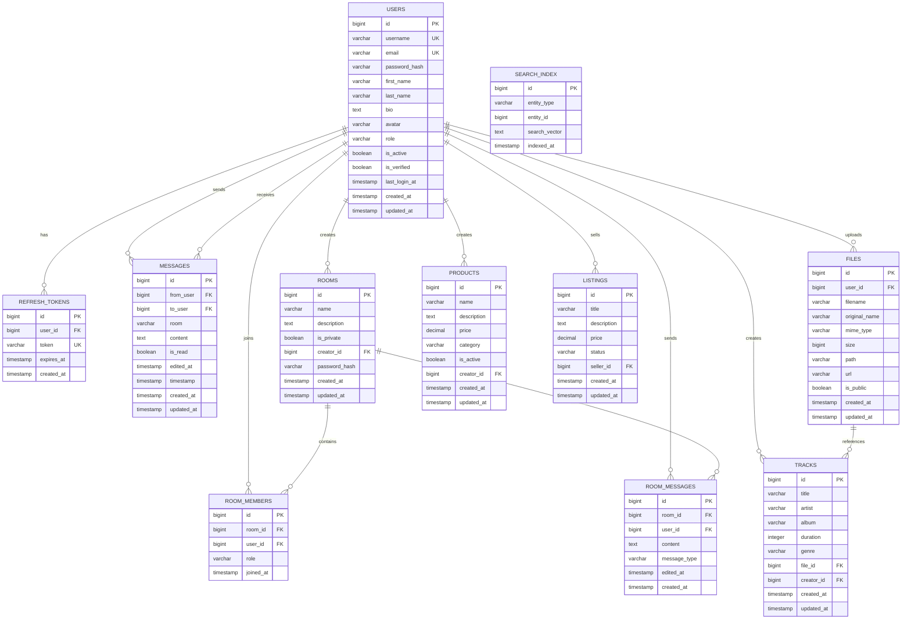

# 🗄️ Schéma de Base de Données - Veza

## 📋 Vue d'ensemble

La base de données Veza utilise PostgreSQL comme système de gestion de base de données principal, avec Redis pour le cache et les sessions. Le schéma est conçu pour supporter une plateforme de streaming audio et de chat en temps réel avec des fonctionnalités avancées d'authentification, de modération et d'analytics.

## 🏗️ Architecture de Base de Données



## 📊 Modèles de Données

### 1. User - Modèle Utilisateur

```go
/**
 * @struct User
 * @description Modèle principal pour les utilisateurs du système
 * @table users
 * @primary_key id
 * @unique_keys username, email
 * @since 1.0.0
 * @author Équipe Veza
 */
type User struct {
    ID           int64          `db:"id" json:"id"`                     // Identifiant unique
    Username     string         `db:"username" json:"username"`         // Nom d'utilisateur unique
    Email        string         `db:"email" json:"email"`               // Email unique
    PasswordHash string         `db:"password_hash" json:"-"`           // Hash du mot de passe (non sérialisé)
    FirstName    sql.NullString `db:"first_name" json:"first_name,omitempty"` // Prénom optionnel
    LastName     sql.NullString `db:"last_name" json:"last_name,omitempty"`   // Nom de famille optionnel
    Bio          sql.NullString `db:"bio" json:"bio,omitempty"`         // Biographie optionnelle
    Avatar       sql.NullString `db:"avatar" json:"avatar,omitempty"`   // URL de l'avatar optionnel
    Role         string         `db:"role" json:"role"`                 // Rôle: user, admin, super_admin
    IsActive     bool           `db:"is_active" json:"is_active"`       // Statut actif/inactif
    IsVerified   bool           `db:"is_verified" json:"is_verified"`   // Email vérifié
    LastLoginAt  sql.NullTime   `db:"last_login_at" json:"last_login_at,omitempty"` // Dernière connexion
    CreatedAt    time.Time      `db:"created_at" json:"created_at"`     // Date de création
    UpdatedAt    time.Time      `db:"updated_at" json:"updated_at"`     // Date de modification
}
```

**Contraintes :**
- `username` : Unique, non null, longueur 3-50 caractères
- `email` : Unique, non null, format email valide
- `password_hash` : Non null, hash bcrypt
- `role` : Enum ('user', 'admin', 'super_admin')

**Index :**
- `idx_users_username` : Index unique sur username
- `idx_users_email` : Index unique sur email
- `idx_users_role` : Index sur role pour les requêtes d'autorisation
- `idx_users_created_at` : Index sur created_at pour le tri

### 2. RefreshToken - Tokens de Rafraîchissement

```go
/**
 * @struct RefreshToken
 * @description Tokens JWT de rafraîchissement pour l'authentification
 * @table refresh_tokens
 * @primary_key id
 * @foreign_key user_id -> users.id
 * @since 1.0.0
 * @author Équipe Veza
 */
type RefreshToken struct {
    ID        int64     `db:"id" json:"id"`               // Identifiant unique
    UserID    int64     `db:"user_id" json:"user_id"`     // Référence vers l'utilisateur
    Token     string    `db:"token" json:"token"`         // Token JWT de rafraîchissement
    ExpiresAt time.Time `db:"expires_at" json:"expires_at"` // Date d'expiration
    CreatedAt time.Time `db:"created_at" json:"created_at"` // Date de création
}
```

**Contraintes :**
- `user_id` : Foreign key vers users.id, non null
- `token` : Unique, non null, longueur 255 caractères
- `expires_at` : Non null, date future

**Index :**
- `idx_refresh_tokens_user_id` : Index sur user_id
- `idx_refresh_tokens_token` : Index unique sur token
- `idx_refresh_tokens_expires_at` : Index sur expires_at pour le nettoyage

### 3. Message - Messages de Chat

```go
/**
 * @struct Message
 * @description Messages de chat directs ou en salons
 * @table messages
 * @primary_key id
 * @foreign_keys from_user -> users.id, to_user -> users.id
 * @since 1.0.0
 * @author Équipe Veza
 */
type Message struct {
    ID        int64          `db:"id" json:"id"`                     // Identifiant unique
    FromUser  int64          `db:"from_user" json:"from_user"`       // ID de l'expéditeur
    ToUser    sql.NullInt64  `db:"to_user" json:"to_user,omitempty"` // ID du destinataire (messages directs)
    Room      sql.NullString `db:"room" json:"room,omitempty"`       // Nom du salon (messages de salon)
    Content   string         `db:"content" json:"content"`           // Contenu du message
    IsRead    bool           `db:"is_read" json:"is_read"`           // Statut de lecture
    EditedAt  sql.NullTime   `db:"edited_at" json:"edited_at,omitempty"` // Date de modification
    Timestamp time.Time      `db:"timestamp" json:"timestamp"`       // Horodatage du message
    CreatedAt time.Time      `db:"created_at" json:"created_at"`     // Date de création
    UpdatedAt time.Time      `db:"updated_at" json:"updated_at"`     // Date de modification
}
```

**Contraintes :**
- `from_user` : Foreign key vers users.id, non null
- `to_user` : Foreign key vers users.id, nullable (pour les salons)
- `room` : Nom du salon, nullable (pour les messages directs)
- `content` : Non null, longueur 1-10000 caractères
- `timestamp` : Non null, date/heure du message

**Index :**
- `idx_messages_from_user` : Index sur from_user
- `idx_messages_to_user` : Index sur to_user
- `idx_messages_room` : Index sur room
- `idx_messages_timestamp` : Index sur timestamp pour le tri
- `idx_messages_conversation` : Index composite (from_user, to_user, timestamp)

### 4. Room - Salons de Chat

```go
/**
 * @struct Room
 * @description Salons de chat publics ou privés
 * @table rooms
 * @primary_key id
 * @foreign_key creator_id -> users.id
 * @since 1.0.0
 * @author Équipe Veza
 */
type Room struct {
    ID           int64          `db:"id" json:"id"`                     // Identifiant unique
    Name         string         `db:"name" json:"name"`                 // Nom du salon
    Description  sql.NullString `db:"description" json:"description,omitempty"` // Description optionnelle
    IsPrivate    bool           `db:"is_private" json:"is_private"`     // Salon privé/public
    CreatorID    sql.NullInt64  `db:"creator_id" json:"creator_id,omitempty"` // ID du créateur
    PasswordHash sql.NullString `db:"password_hash" json:"-"`           // Hash du mot de passe (salons privés)
    CreatedAt    time.Time      `db:"created_at" json:"created_at"`     // Date de création
    UpdatedAt    time.Time      `db:"updated_at" json:"updated_at"`     // Date de modification
}
```

**Contraintes :**
- `name` : Unique, non null, longueur 3-100 caractères
- `creator_id` : Foreign key vers users.id, nullable
- `password_hash` : Hash bcrypt, nullable (pour les salons privés)

**Index :**
- `idx_rooms_name` : Index unique sur name
- `idx_rooms_creator_id` : Index sur creator_id
- `idx_rooms_is_private` : Index sur is_private
- `idx_rooms_created_at` : Index sur created_at

### 5. RoomMember - Membres des Salons

```go
/**
 * @struct RoomMember
 * @description Appartenance aux salons avec rôles
 * @table room_members
 * @primary_key id
 * @foreign_keys room_id -> rooms.id, user_id -> users.id
 * @unique room_id, user_id
 * @since 1.0.0
 * @author Équipe Veza
 */
type RoomMember struct {
    ID       int64     `db:"id" json:"id"`           // Identifiant unique
    RoomID   int64     `db:"room_id" json:"room_id"` // ID du salon
    UserID   int64     `db:"user_id" json:"user_id"` // ID de l'utilisateur
    Role     string    `db:"role" json:"role"`       // Rôle: owner, admin, member
    JoinedAt time.Time `db:"joined_at" json:"joined_at"` // Date d'adhésion
}
```

**Contraintes :**
- `room_id` : Foreign key vers rooms.id, non null
- `user_id` : Foreign key vers users.id, non null
- `role` : Enum ('owner', 'admin', 'member'), non null
- Contrainte unique sur (room_id, user_id)

**Index :**
- `idx_room_members_room_id` : Index sur room_id
- `idx_room_members_user_id` : Index sur user_id
- `idx_room_members_role` : Index sur role
- `idx_room_members_unique` : Index unique (room_id, user_id)

### 6. RoomMessage - Messages de Salon

```go
/**
 * @struct RoomMessage
 * @description Messages spécifiques aux salons avec types
 * @table room_messages
 * @primary_key id
 * @foreign_keys room_id -> rooms.id, user_id -> users.id
 * @since 1.0.0
 * @author Équipe Veza
 */
type RoomMessage struct {
    ID          int64         `db:"id" json:"id"`                     // Identifiant unique
    RoomID      int64         `db:"room_id" json:"room_id"`           // ID du salon
    UserID      sql.NullInt64 `db:"user_id" json:"user_id,omitempty"` // ID de l'utilisateur (null pour messages système)
    Content     string        `db:"content" json:"content"`           // Contenu du message
    MessageType string        `db:"message_type" json:"message_type"` // Type: message, join, leave, system
    EditedAt    sql.NullTime  `db:"edited_at" json:"edited_at,omitempty"` // Date de modification
    CreatedAt   time.Time     `db:"created_at" json:"created_at"`     // Date de création
}
```

**Contraintes :**
- `room_id` : Foreign key vers rooms.id, non null
- `user_id` : Foreign key vers users.id, nullable
- `content` : Non null, longueur 1-10000 caractères
- `message_type` : Enum ('message', 'join', 'leave', 'system'), non null

**Index :**
- `idx_room_messages_room_id` : Index sur room_id
- `idx_room_messages_user_id` : Index sur user_id
- `idx_room_messages_message_type` : Index sur message_type
- `idx_room_messages_created_at` : Index sur created_at

### 7. File - Gestion des Fichiers

```go
/**
 * @struct File
 * @description Gestion des fichiers uploadés (images, audio, etc.)
 * @table files
 * @primary_key id
 * @foreign_key user_id -> users.id
 * @since 1.0.0
 * @author Équipe Veza
 */
type File struct {
    ID           int64     `db:"id" json:"id"`                     // Identifiant unique
    UserID       int64     `db:"user_id" json:"user_id"`           // ID de l'utilisateur uploader
    Filename     string    `db:"filename" json:"filename"`         // Nom du fichier sur le serveur
    OriginalName string    `db:"original_name" json:"original_name"` // Nom original du fichier
    MimeType     string    `db:"mime_type" json:"mime_type"`       // Type MIME
    Size         int64     `db:"size" json:"size"`                 // Taille en bytes
    Path         string    `db:"path" json:"path"`                 // Chemin sur le serveur
    URL          string    `db:"url" json:"url"`                   // URL publique
    IsPublic     bool      `db:"is_public" json:"is_public"`       // Fichier public/privé
    CreatedAt    time.Time `db:"created_at" json:"created_at"`     // Date de création
    UpdatedAt    time.Time `db:"updated_at" json:"updated_at"`     // Date de modification
}
```

**Contraintes :**
- `user_id` : Foreign key vers users.id, non null
- `filename` : Non null, unique
- `original_name` : Non null, longueur 1-255 caractères
- `mime_type` : Non null, format MIME valide
- `size` : Non null, > 0
- `path` : Non null, chemin valide
- `url` : Non null, URL valide

**Index :**
- `idx_files_user_id` : Index sur user_id
- `idx_files_filename` : Index unique sur filename
- `idx_files_mime_type` : Index sur mime_type
- `idx_files_is_public` : Index sur is_public
- `idx_files_created_at` : Index sur created_at

### 8. Product - Produits

```go
/**
 * @struct Product
 * @description Produits vendus sur la plateforme
 * @table products
 * @primary_key id
 * @foreign_key creator_id -> users.id
 * @since 1.0.0
 * @author Équipe Veza
 */
type Product struct {
    ID          int64     `db:"id" json:"id"`                     // Identifiant unique
    Name        string    `db:"name" json:"name"`                 // Nom du produit
    Description string    `db:"description" json:"description"`   // Description du produit
    Price       float64   `db:"price" json:"price"`               // Prix en euros
    Category    string    `db:"category" json:"category"`         // Catégorie du produit
    IsActive    bool      `db:"is_active" json:"is_active"`       // Produit actif/inactif
    CreatorID   int64     `db:"creator_id" json:"creator_id"`     // ID du créateur
    CreatedAt   time.Time `db:"created_at" json:"created_at"`     // Date de création
    UpdatedAt   time.Time `db:"updated_at" json:"updated_at"`     // Date de modification
}
```

**Contraintes :**
- `name` : Non null, longueur 1-255 caractères
- `description` : Non null, longueur 1-10000 caractères
- `price` : Non null, >= 0
- `category` : Non null, longueur 1-100 caractères
- `creator_id` : Foreign key vers users.id, non null

**Index :**
- `idx_products_creator_id` : Index sur creator_id
- `idx_products_category` : Index sur category
- `idx_products_is_active` : Index sur is_active
- `idx_products_price` : Index sur price
- `idx_products_created_at` : Index sur created_at

### 9. Track - Pistes Audio

```go
/**
 * @struct Track
 * @description Pistes audio pour le streaming
 * @table tracks
 * @primary_key id
 * @foreign_keys file_id -> files.id, creator_id -> users.id
 * @since 1.0.0
 * @author Équipe Veza
 */
type Track struct {
    ID        int64     `db:"id" json:"id"`                     // Identifiant unique
    Title     string    `db:"title" json:"title"`               // Titre de la piste
    Artist    string    `db:"artist" json:"artist"`             // Artiste
    Album     string    `db:"album" json:"album"`               // Album
    Duration  int       `db:"duration" json:"duration"`         // Durée en secondes
    Genre     string    `db:"genre" json:"genre"`               // Genre musical
    FileID    int64     `db:"file_id" json:"file_id"`           // ID du fichier audio
    CreatorID int64     `db:"creator_id" json:"creator_id"`     // ID du créateur
    CreatedAt time.Time `db:"created_at" json:"created_at"`     // Date de création
    UpdatedAt time.Time `db:"updated_at" json:"updated_at"`     // Date de modification
}
```

**Contraintes :**
- `title` : Non null, longueur 1-255 caractères
- `artist` : Non null, longueur 1-255 caractères
- `album` : Non null, longueur 1-255 caractères
- `duration` : Non null, > 0
- `genre` : Non null, longueur 1-100 caractères
- `file_id` : Foreign key vers files.id, non null
- `creator_id` : Foreign key vers users.id, non null

**Index :**
- `idx_tracks_file_id` : Index sur file_id
- `idx_tracks_creator_id` : Index sur creator_id
- `idx_tracks_artist` : Index sur artist
- `idx_tracks_album` : Index sur album
- `idx_tracks_genre` : Index sur genre
- `idx_tracks_duration` : Index sur duration

## 🔄 Relations et Contraintes

### Contraintes de Clés Étrangères

```sql
-- Users -> RefreshTokens
ALTER TABLE refresh_tokens 
ADD CONSTRAINT fk_refresh_tokens_user_id 
FOREIGN KEY (user_id) REFERENCES users(id) ON DELETE CASCADE;

-- Users -> Messages (from_user)
ALTER TABLE messages 
ADD CONSTRAINT fk_messages_from_user 
FOREIGN KEY (from_user) REFERENCES users(id) ON DELETE CASCADE;

-- Users -> Messages (to_user)
ALTER TABLE messages 
ADD CONSTRAINT fk_messages_to_user 
FOREIGN KEY (to_user) REFERENCES users(id) ON DELETE CASCADE;

-- Users -> Rooms (creator)
ALTER TABLE rooms 
ADD CONSTRAINT fk_rooms_creator_id 
FOREIGN KEY (creator_id) REFERENCES users(id) ON DELETE SET NULL;

-- Rooms -> RoomMembers
ALTER TABLE room_members 
ADD CONSTRAINT fk_room_members_room_id 
FOREIGN KEY (room_id) REFERENCES rooms(id) ON DELETE CASCADE;

-- Users -> RoomMembers
ALTER TABLE room_members 
ADD CONSTRAINT fk_room_members_user_id 
FOREIGN KEY (user_id) REFERENCES users(id) ON DELETE CASCADE;

-- Rooms -> RoomMessages
ALTER TABLE room_messages 
ADD CONSTRAINT fk_room_messages_room_id 
FOREIGN KEY (room_id) REFERENCES rooms(id) ON DELETE CASCADE;

-- Users -> RoomMessages
ALTER TABLE room_messages 
ADD CONSTRAINT fk_room_messages_user_id 
FOREIGN KEY (user_id) REFERENCES users(id) ON DELETE SET NULL;

-- Users -> Files
ALTER TABLE files 
ADD CONSTRAINT fk_files_user_id 
FOREIGN KEY (user_id) REFERENCES users(id) ON DELETE CASCADE;

-- Users -> Products
ALTER TABLE products 
ADD CONSTRAINT fk_products_creator_id 
FOREIGN KEY (creator_id) REFERENCES users(id) ON DELETE CASCADE;

-- Files -> Tracks
ALTER TABLE tracks 
ADD CONSTRAINT fk_tracks_file_id 
FOREIGN KEY (file_id) REFERENCES files(id) ON DELETE CASCADE;

-- Users -> Tracks
ALTER TABLE tracks 
ADD CONSTRAINT fk_tracks_creator_id 
FOREIGN KEY (creator_id) REFERENCES users(id) ON DELETE CASCADE;
```

### Contraintes d'Intégrité

```sql
-- Contrainte unique sur username
ALTER TABLE users 
ADD CONSTRAINT uk_users_username UNIQUE (username);

-- Contrainte unique sur email
ALTER TABLE users 
ADD CONSTRAINT uk_users_email UNIQUE (email);

-- Contrainte unique sur room name
ALTER TABLE rooms 
ADD CONSTRAINT uk_rooms_name UNIQUE (name);

-- Contrainte unique sur refresh token
ALTER TABLE refresh_tokens 
ADD CONSTRAINT uk_refresh_tokens_token UNIQUE (token);

-- Contrainte unique sur filename
ALTER TABLE files 
ADD CONSTRAINT uk_files_filename UNIQUE (filename);

-- Contrainte unique sur room membership
ALTER TABLE room_members 
ADD CONSTRAINT uk_room_members_room_user UNIQUE (room_id, user_id);
```

## 📈 Optimisations de Performance

### Index Composés

```sql
-- Index pour les conversations directes
CREATE INDEX idx_messages_conversation 
ON messages (from_user, to_user, timestamp DESC);

-- Index pour les messages de salon
CREATE INDEX idx_room_messages_room_timestamp 
ON room_messages (room_id, created_at DESC);

-- Index pour la recherche de produits
CREATE INDEX idx_products_search 
ON products (category, is_active, price) 
WHERE is_active = true;

-- Index pour la recherche de pistes
CREATE INDEX idx_tracks_search 
ON tracks (genre, artist, album);
```

### Partitioning

```sql
-- Partitioning des messages par date (pour les gros volumes)
CREATE TABLE messages_2024_01 PARTITION OF messages
FOR VALUES FROM ('2024-01-01') TO ('2024-02-01');

CREATE TABLE messages_2024_02 PARTITION OF messages
FOR VALUES FROM ('2024-02-01') TO ('2024-03-01');
```

### Full-Text Search

```sql
-- Index de recherche plein texte pour les messages
CREATE INDEX idx_messages_content_fts 
ON messages USING gin(to_tsvector('french', content));

-- Index de recherche plein texte pour les produits
CREATE INDEX idx_products_search_fts 
ON products USING gin(to_tsvector('french', name || ' ' || description));
```

## 🔒 Sécurité

### Chiffrement des Données Sensibles

```sql
-- Extension pour le chiffrement
CREATE EXTENSION IF NOT EXISTS pgcrypto;

-- Chiffrement du mot de passe (déjà fait par bcrypt dans l'application)
-- Chiffrement des tokens de rafraîchissement
UPDATE refresh_tokens 
SET token = pgp_sym_encrypt(token, 'encryption_key');
```

### Audit Trail

```sql
-- Table d'audit pour les modifications sensibles
CREATE TABLE audit_logs (
    id BIGSERIAL PRIMARY KEY,
    table_name VARCHAR(50) NOT NULL,
    record_id BIGINT NOT NULL,
    action VARCHAR(20) NOT NULL, -- INSERT, UPDATE, DELETE
    old_values JSONB,
    new_values JSONB,
    user_id BIGINT REFERENCES users(id),
    ip_address INET,
    created_at TIMESTAMP DEFAULT NOW()
);

-- Trigger pour l'audit des utilisateurs
CREATE OR REPLACE FUNCTION audit_user_changes()
RETURNS TRIGGER AS $$
BEGIN
    IF TG_OP = 'UPDATE' THEN
        INSERT INTO audit_logs (table_name, record_id, action, old_values, new_values)
        VALUES ('users', NEW.id, 'UPDATE', to_jsonb(OLD), to_jsonb(NEW));
        RETURN NEW;
    ELSIF TG_OP = 'DELETE' THEN
        INSERT INTO audit_logs (table_name, record_id, action, old_values)
        VALUES ('users', OLD.id, 'DELETE', to_jsonb(OLD));
        RETURN OLD;
    END IF;
    RETURN NULL;
END;
$$ LANGUAGE plpgsql;

CREATE TRIGGER trigger_audit_users
    AFTER UPDATE OR DELETE ON users
    FOR EACH ROW EXECUTE FUNCTION audit_user_changes();
```

## 📊 Métriques et Monitoring

### Requêtes de Monitoring

```sql
-- Nombre d'utilisateurs actifs par jour
SELECT 
    DATE(created_at) as date,
    COUNT(*) as new_users
FROM users 
WHERE created_at >= NOW() - INTERVAL '30 days'
GROUP BY DATE(created_at)
ORDER BY date;

-- Messages par heure
SELECT 
    DATE_TRUNC('hour', timestamp) as hour,
    COUNT(*) as message_count
FROM messages 
WHERE timestamp >= NOW() - INTERVAL '24 hours'
GROUP BY DATE_TRUNC('hour', timestamp)
ORDER BY hour;

-- Top des salons les plus actifs
SELECT 
    r.name,
    COUNT(rm.id) as member_count,
    COUNT(rmm.id) as message_count
FROM rooms r
LEFT JOIN room_members rm ON r.id = rm.room_id
LEFT JOIN room_messages rmm ON r.id = rmm.room_id
WHERE rmm.created_at >= NOW() - INTERVAL '7 days'
GROUP BY r.id, r.name
ORDER BY message_count DESC
LIMIT 10;
```

---

**Dernière mise à jour** : $(date)
**Version** : 1.0.0
**Maintenu par** : Équipe Veza 