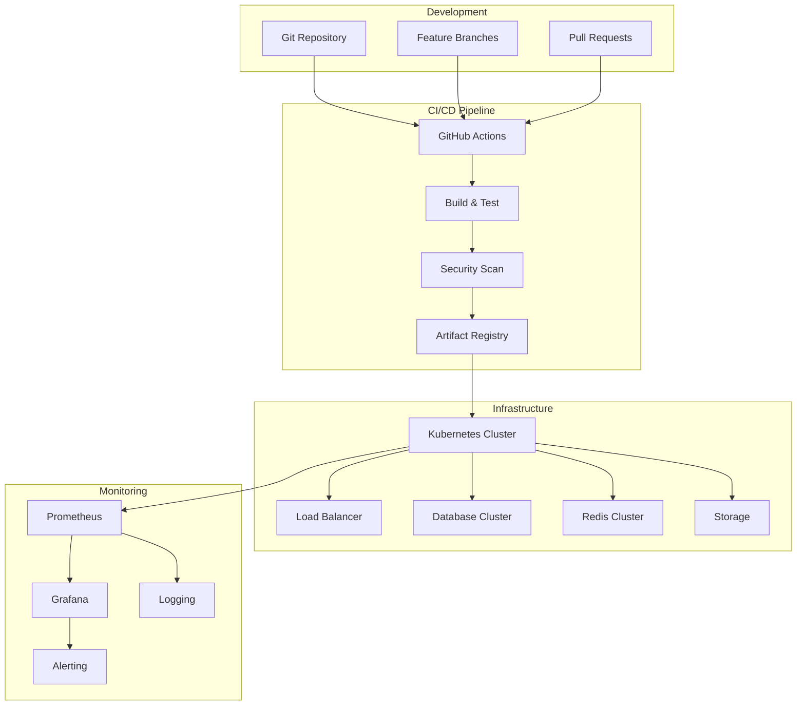

# Déploiement Veza - Documentation Complète

## Vue d'ensemble

Le système de déploiement de Veza utilise une architecture microservices avec Docker, Kubernetes, et CI/CD automatisé. Il garantit la fiabilité, la scalabilité et la sécurité de la plateforme en production.

---

## Architecture de déploiement



---

## Pipeline CI/CD

### Configuration GitHub Actions

```yaml
# .github/workflows/ci-cd.yml
name: CI/CD Pipeline

on:
  push:
    branches: [main, develop]
  pull_request:
    branches: [main]

env:
  REGISTRY: ghcr.io
  IMAGE_NAME: veza-platform

jobs:
  # Tests et qualité du code
  test:
    runs-on: ubuntu-latest
    strategy:
      matrix:
        service: [backend-api, chat-server, stream-server]
    
    steps:
    - name: Checkout code
      uses: actions/checkout@v4
    
    - name: Setup Go
      uses: actions/setup-go@v4
      with:
        go-version: '1.21'
        cache: true
    
    - name: Setup Rust
      uses: actions/setup-rust@v1
      with:
        toolchain: stable
        cache: true
    
    - name: Run tests
      run: |
        cd veza-${{ matrix.service }}
        if [ "${{ matrix.service }}" = "backend-api" ]; then
          go test -v -race -coverprofile=coverage.out ./...
          go tool cover -html=coverage.out -o coverage.html
        else
          cargo test --verbose
          cargo tarpaulin --out Html
        fi
    
    - name: Upload coverage
      uses: codecov/codecov-action@v3
      with:
        file: ./veza-${{ matrix.service }}/coverage.out
        flags: ${{ matrix.service }}
        name: ${{ matrix.service }}-coverage

  # Analyse de sécurité
  security:
    runs-on: ubuntu-latest
    needs: test
    
    steps:
    - name: Checkout code
      uses: actions/checkout@v4
    
    - name: Run Trivy vulnerability scanner
      uses: aquasecurity/trivy-action@master
      with:
        scan-type: 'fs'
        scan-ref: '.'
        format: 'sarif'
        output: 'trivy-results.sarif'
    
    - name: Upload Trivy scan results
      uses: github/codeql-action/upload-sarif@v2
      with:
        sarif_file: 'trivy-results.sarif'
    
    - name: Run Semgrep
      uses: returntocorp/semgrep-action@v1
      with:
        config: >-
          p/security-audit
          p/secrets
          p/owasp-top-ten
        outputFormat: sarif
        outputFile: semgrep-results.sarif
    
    - name: Upload Semgrep results
      uses: github/codeql-action/upload-sarif@v2
      with:
        sarif_file: 'semgrep-results.sarif'

  # Build des images Docker
  build:
    runs-on: ubuntu-latest
    needs: [test, security]
    strategy:
      matrix:
        service: [backend-api, chat-server, stream-server]
    
    steps:
    - name: Checkout code
      uses: actions/checkout@v4
    
    - name: Set up Docker Buildx
      uses: docker/setup-buildx-action@v3
    
    - name: Log in to Container Registry
      uses: docker/login-action@v3
      with:
        registry: ${{ env.REGISTRY }}
        username: ${{ github.actor }}
        password: ${{ secrets.GITHUB_TOKEN }}
    
    - name: Extract metadata
      id: meta
      uses: docker/metadata-action@v5
      with:
        images: ${{ env.REGISTRY }}/${{ github.repository }}/${{ matrix.service }}
        tags: |
          type=ref,event=branch
          type=ref,event=pr
          type=semver,pattern={{version}}
          type=semver,pattern={{major}}.{{minor}}
          type=sha,prefix={{branch}}-
    
    - name: Build and push Docker image
      uses: docker/build-push-action@v5
      with:
        context: ./veza-${{ matrix.service }}
        push: true
        tags: ${{ steps.meta.outputs.tags }}
        labels: ${{ steps.meta.outputs.labels }}
        cache-from: type=gha
        cache-to: type=gha,mode=max

  # Déploiement en staging
  deploy-staging:
    runs-on: ubuntu-latest
    needs: build
    if: github.ref == 'refs/heads/develop'
    environment: staging
    
    steps:
    - name: Checkout code
      uses: actions/checkout@v4
    
    - name: Setup kubectl
      uses: azure/setup-kubectl@v3
      with:
        version: 'latest'
    
    - name: Configure kubectl
      run: |
        echo "${{ secrets.KUBE_CONFIG_STAGING }}" | base64 -d > kubeconfig
        export KUBECONFIG=kubeconfig
    
    - name: Deploy to staging
      run: |
        kubectl apply -f k8s/staging/
        kubectl rollout status deployment/veza-backend-api -n veza-staging
        kubectl rollout status deployment/veza-chat-server -n veza-staging
        kubectl rollout status deployment/veza-stream-server -n veza-staging

  # Tests d'intégration en staging
  integration-tests:
    runs-on: ubuntu-latest
    needs: deploy-staging
    if: github.ref == 'refs/heads/develop'
    
    steps:
    - name: Checkout code
      uses: actions/checkout@v4
    
    - name: Setup kubectl
      uses: azure/setup-kubectl@v3
    
    - name: Configure kubectl
      run: |
        echo "${{ secrets.KUBE_CONFIG_STAGING }}" | base64 -d > kubeconfig
        export KUBECONFIG=kubeconfig
    
    - name: Wait for services
      run: |
        kubectl wait --for=condition=ready pod -l app=veza-backend-api -n veza-staging --timeout=300s
        kubectl wait --for=condition=ready pod -l app=veza-chat-server -n veza-staging --timeout=300s
        kubectl wait --for=condition=ready pod -l app=veza-stream-server -n veza-staging --timeout=300s
    
    - name: Run integration tests
      run: |
        cd tests/integration
        go test -v -timeout 10m ./...
    
    - name: Run performance tests
      run: |
        cd tests/performance
        k6 run load-test.js

  # Déploiement en production
  deploy-production:
    runs-on: ubuntu-latest
    needs: [build, integration-tests]
    if: github.ref == 'refs/heads/main'
    environment: production
    
    steps:
    - name: Checkout code
      uses: actions/checkout@v4
    
    - name: Setup kubectl
      uses: azure/setup-kubectl@v3
    
    - name: Configure kubectl
      run: |
        echo "${{ secrets.KUBE_CONFIG_PRODUCTION }}" | base64 -d > kubeconfig
        export KUBECONFIG=kubeconfig
    
    - name: Deploy to production
      run: |
        kubectl apply -f k8s/production/
        kubectl rollout status deployment/veza-backend-api -n veza-production
        kubectl rollout status deployment/veza-chat-server -n veza-production
        kubectl rollout status deployment/veza-stream-server -n veza-production
    
    - name: Run smoke tests
      run: |
        ./scripts/smoke-tests.sh production
    
    - name: Notify deployment
      uses: 8398a7/action-slack@v3
      with:
        status: success
        text: 'Deployment to production completed successfully!'
      env:
        SLACK_WEBHOOK_URL: ${{ secrets.SLACK_WEBHOOK_URL }}
```

---

## Configuration Docker

### Backend API Dockerfile

```dockerfile
# veza-backend-api/Dockerfile
FROM golang:1.21-alpine AS builder

# Install dependencies
RUN apk add --no-cache git ca-certificates tzdata

# Set working directory
WORKDIR /app

# Copy go mod files
COPY go.mod go.sum ./

# Download dependencies
RUN go mod download

# Copy source code
COPY . .

# Build the application
RUN CGO_ENABLED=0 GOOS=linux go build -a -installsuffix cgo -o main ./cmd/server

# Final stage
FROM alpine:latest

# Install ca-certificates for HTTPS requests
RUN apk --no-cache add ca-certificates tzdata

# Create non-root user
RUN addgroup -g 1001 -S appgroup && \
    adduser -u 1001 -S appuser -G appgroup

WORKDIR /root/

# Copy binary from builder stage
COPY --from=builder /app/main .

# Copy configuration files
COPY --from=builder /app/config/ ./config/

# Change ownership to non-root user
RUN chown -R appuser:appgroup /root/

# Switch to non-root user
USER appuser

# Expose port
EXPOSE 8080

# Health check
HEALTHCHECK --interval=30s --timeout=3s --start-period=5s --retries=3 \
    CMD wget --no-verbose --tries=1 --spider http://localhost:8080/health || exit 1

# Run the application
CMD ["./main"]
```

### Chat Server Dockerfile

```dockerfile
# veza-chat-server/Dockerfile
FROM rust:1.75-alpine AS builder

# Install dependencies
RUN apk add --no-cache musl-dev

# Set working directory
WORKDIR /app

# Copy Cargo files
COPY Cargo.toml Cargo.lock ./

# Copy source code
COPY src/ ./src/

# Build the application
RUN cargo build --release

# Final stage
FROM alpine:latest

# Install runtime dependencies
RUN apk add --no-cache ca-certificates tzdata

# Create non-root user
RUN addgroup -g 1001 -S appgroup && \
    adduser -u 1001 -S appuser -G appgroup

WORKDIR /app

# Copy binary from builder stage
COPY --from=builder /app/target/release/veza-chat-server .

# Change ownership to non-root user
RUN chown -R appuser:appgroup /app

# Switch to non-root user
USER appuser

# Expose port
EXPOSE 8081

# Health check
HEALTHCHECK --interval=30s --timeout=3s --start-period=5s --retries=3 \
    CMD wget --no-verbose --tries=1 --spider http://localhost:8081/health || exit 1

# Run the application
CMD ["./veza-chat-server"]
```

### Docker Compose pour développement

```yaml
# docker-compose.yml
version: '3.8'

services:
  # Base de données PostgreSQL
  postgres:
    image: postgres:15-alpine
    environment:
      POSTGRES_DB: veza_development
      POSTGRES_USER: veza_user
      POSTGRES_PASSWORD: veza_password
    ports:
      - "5432:5432"
    volumes:
      - postgres_data:/var/lib/postgresql/data
      - ./scripts/init-db.sql:/docker-entrypoint-initdb.d/init-db.sql
    healthcheck:
      test: ["CMD-SHELL", "pg_isready -U veza_user -d veza_development"]
      interval: 10s
      timeout: 5s
      retries: 5

  # Cache Redis
  redis:
    image: redis:7-alpine
    ports:
      - "6379:6379"
    volumes:
      - redis_data:/data
    healthcheck:
      test: ["CMD", "redis-cli", "ping"]
      interval: 10s
      timeout: 5s
      retries: 5

  # Backend API
  backend-api:
    build:
      context: ./veza-backend-api
      dockerfile: Dockerfile
    ports:
      - "8080:8080"
    environment:
      - DB_HOST=postgres
      - DB_PORT=5432
      - DB_NAME=veza_development
      - DB_USER=veza_user
      - DB_PASSWORD=veza_password
      - REDIS_HOST=redis
      - REDIS_PORT=6379
      - ENV=development
    depends_on:
      postgres:
        condition: service_healthy
      redis:
        condition: service_healthy
    healthcheck:
      test: ["CMD", "wget", "--no-verbose", "--tries=1", "--spider", "http://localhost:8080/health"]
      interval: 30s
      timeout: 10s
      retries: 3

  # Chat Server
  chat-server:
    build:
      context: ./veza-chat-server
      dockerfile: Dockerfile
    ports:
      - "8081:8081"
    environment:
      - DB_HOST=postgres
      - DB_PORT=5432
      - DB_NAME=veza_development
      - DB_USER=veza_user
      - DB_PASSWORD=veza_password
      - REDIS_HOST=redis
      - REDIS_PORT=6379
      - ENV=development
    depends_on:
      postgres:
        condition: service_healthy
      redis:
        condition: service_healthy
    healthcheck:
      test: ["CMD", "wget", "--no-verbose", "--tries=1", "--spider", "http://localhost:8081/health"]
      interval: 30s
      timeout: 10s
      retries: 3

  # Stream Server
  stream-server:
    build:
      context: ./veza-stream-server
      dockerfile: Dockerfile
    ports:
      - "8082:8082"
    environment:
      - DB_HOST=postgres
      - DB_PORT=5432
      - DB_NAME=veza_development
      - DB_USER=veza_user
      - DB_PASSWORD=veza_password
      - REDIS_HOST=redis
      - REDIS_PORT=6379
      - ENV=development
    depends_on:
      postgres:
        condition: service_healthy
      redis:
        condition: service_healthy
    healthcheck:
      test: ["CMD", "wget", "--no-verbose", "--tries=1", "--spider", "http://localhost:8082/health"]
      interval: 30s
      timeout: 10s
      retries: 3

  # Monitoring
  prometheus:
    image: prom/prometheus:latest
    ports:
      - "9090:9090"
    volumes:
      - ./monitoring/prometheus.yml:/etc/prometheus/prometheus.yml
      - prometheus_data:/prometheus
    command:
      - '--config.file=/etc/prometheus/prometheus.yml'
      - '--storage.tsdb.path=/prometheus'
      - '--web.console.libraries=/etc/prometheus/console_libraries'
      - '--web.console.templates=/etc/prometheus/consoles'
      - '--storage.tsdb.retention.time=200h'
      - '--web.enable-lifecycle'

  grafana:
    image: grafana/grafana:latest
    ports:
      - "3000:3000"
    environment:
      - GF_SECURITY_ADMIN_PASSWORD=admin
    volumes:
      - grafana_data:/var/lib/grafana
      - ./monitoring/grafana/dashboards:/etc/grafana/provisioning/dashboards
      - ./monitoring/grafana/datasources:/etc/grafana/provisioning/datasources

volumes:
  postgres_data:
  redis_data:
  prometheus_data:
  grafana_data:
```

---

## Configuration Kubernetes

### Namespace et RBAC

```yaml
# k8s/base/namespace.yaml
apiVersion: v1
kind: Namespace
metadata:
  name: veza-production
  labels:
    name: veza-production
    environment: production
---
apiVersion: v1
kind: Namespace
metadata:
  name: veza-staging
  labels:
    name: veza-staging
    environment: staging
---
# RBAC pour les services
apiVersion: rbac.authorization.k8s.io/v1
kind: ServiceAccount
metadata:
  name: veza-service-account
  namespace: veza-production
---
apiVersion: rbac.authorization.k8s.io/v1
kind: ClusterRole
metadata:
  name: veza-app-role
rules:
- apiGroups: [""]
  resources: ["pods", "services", "endpoints"]
  verbs: ["get", "list", "watch"]
- apiGroups: [""]
  resources: ["configmaps", "secrets"]
  verbs: ["get", "list"]
---
apiVersion: rbac.authorization.k8s.io/v1
kind: ClusterRoleBinding
metadata:
  name: veza-app-binding
subjects:
- kind: ServiceAccount
  name: veza-service-account
  namespace: veza-production
roleRef:
  kind: ClusterRole
  name: veza-app-role
  apiGroup: rbac.authorization.k8s.io
```

### ConfigMaps et Secrets

```yaml
# k8s/base/config.yaml
apiVersion: v1
kind: ConfigMap
metadata:
  name: veza-config
  namespace: veza-production
data:
  # Configuration de l'application
  app.env: |
    ENV=production
    LOG_LEVEL=info
    API_PORT=8080
    GRPC_PORT=9090
    
    # Base de données
    DB_HOST=postgres-service
    DB_PORT=5432
    DB_NAME=veza_production
    DB_SSL_MODE=require
    
    # Redis
    REDIS_HOST=redis-service
    REDIS_PORT=6379
    REDIS_DB=0
    
    # JWT
    JWT_SECRET_KEY=your-jwt-secret-key
    JWT_ACCESS_TOKEN_TTL=3600
    JWT_REFRESH_TOKEN_TTL=604800
    
    # OAuth
    GOOGLE_CLIENT_ID=your-google-client-id
    GITHUB_CLIENT_ID=your-github-client-id
    DISCORD_CLIENT_ID=your-discord-client-id
    
    # Email
    SMTP_HOST=smtp.gmail.com
    SMTP_PORT=587
    SMTP_USERNAME=your-email@gmail.com
    
    # File Storage
    STORAGE_TYPE=s3
    AWS_REGION=us-west-2
    S3_BUCKET=veza-audio-files
    
    # Monitoring
    PROMETHEUS_ENABLED=true
    METRICS_PORT=9090
    
  # Configuration de la base de données
  postgres.conf: |
    max_connections = 200
    shared_buffers = 256MB
    effective_cache_size = 1GB
    maintenance_work_mem = 64MB
    checkpoint_completion_target = 0.9
    wal_buffers = 16MB
    default_statistics_target = 100
    random_page_cost = 1.1
    effective_io_concurrency = 200
    max_parallel_workers_per_gather = 4
    max_parallel_workers = 8
    work_mem = 4MB
    temp_buffers = 8MB
---
apiVersion: v1
kind: Secret
metadata:
  name: veza-secrets
  namespace: veza-production
type: Opaque
data:
  # Secrets encodés en base64
  DB_PASSWORD: dmV6YV9wcm9kdWN0aW9uX3Bhc3N3b3Jk
  JWT_SECRET_KEY: dmVyeV9zZWNyZXRfand0X2tleQ==
  GOOGLE_CLIENT_SECRET: eW91ci1nb29nbGUtY2xpZW50LXNlY3JldA==
  GITHUB_CLIENT_SECRET: eW91ci1naXRodWItY2xpZW50LXNlY3JldA==
  DISCORD_CLIENT_SECRET: eW91ci1kaXNjb3JkLWNsaWVudC1zZWNyZXQ=
  SMTP_PASSWORD: eW91ci1zbXRwLXBhc3N3b3Jk
  AWS_ACCESS_KEY_ID: eW91ci1hd3MtYWNjZXNzLWtleQ==
  AWS_SECRET_ACCESS_KEY: eW91ci1hd3Mtc2VjcmV0LWtleQ==
```

### Déploiements

```yaml
# k8s/base/deployments.yaml
apiVersion: apps/v1
kind: Deployment
metadata:
  name: veza-backend-api
  namespace: veza-production
  labels:
    app: veza-backend-api
    version: v1.0.0
spec:
  replicas: 3
  selector:
    matchLabels:
      app: veza-backend-api
  template:
    metadata:
      labels:
        app: veza-backend-api
        version: v1.0.0
    spec:
      serviceAccountName: veza-service-account
      containers:
      - name: backend-api
        image: ghcr.io/veza/backend-api:v1.0.0
        ports:
        - containerPort: 8080
          name: http
        - containerPort: 9090
          name: metrics
        env:
        - name: ENV
          valueFrom:
            configMapKeyRef:
              name: veza-config
              key: ENV
        - name: DB_PASSWORD
          valueFrom:
            secretKeyRef:
              name: veza-secrets
              key: DB_PASSWORD
        - name: JWT_SECRET_KEY
          valueFrom:
            secretKeyRef:
              name: veza-secrets
              key: JWT_SECRET_KEY
        resources:
          requests:
            memory: "256Mi"
            cpu: "250m"
          limits:
            memory: "512Mi"
            cpu: "500m"
        livenessProbe:
          httpGet:
            path: /health
            port: 8080
          initialDelaySeconds: 30
          periodSeconds: 10
        readinessProbe:
          httpGet:
            path: /ready
            port: 8080
          initialDelaySeconds: 5
          periodSeconds: 5
        volumeMounts:
        - name: config-volume
          mountPath: /app/config
      volumes:
      - name: config-volume
        configMap:
          name: veza-config
---
apiVersion: apps/v1
kind: Deployment
metadata:
  name: veza-chat-server
  namespace: veza-production
  labels:
    app: veza-chat-server
    version: v1.0.0
spec:
  replicas: 2
  selector:
    matchLabels:
      app: veza-chat-server
  template:
    metadata:
      labels:
        app: veza-chat-server
        version: v1.0.0
    spec:
      serviceAccountName: veza-service-account
      containers:
      - name: chat-server
        image: ghcr.io/veza/chat-server:v1.0.0
        ports:
        - containerPort: 8081
          name: http
        - containerPort: 9091
          name: metrics
        env:
        - name: ENV
          valueFrom:
            configMapKeyRef:
              name: veza-config
              key: ENV
        resources:
          requests:
            memory: "128Mi"
            cpu: "100m"
          limits:
            memory: "256Mi"
            cpu: "200m"
        livenessProbe:
          httpGet:
            path: /health
            port: 8081
          initialDelaySeconds: 30
          periodSeconds: 10
        readinessProbe:
          httpGet:
            path: /ready
            port: 8081
          initialDelaySeconds: 5
          periodSeconds: 5
---
apiVersion: apps/v1
kind: Deployment
metadata:
  name: veza-stream-server
  namespace: veza-production
  labels:
    app: veza-stream-server
    version: v1.0.0
spec:
  replicas: 2
  selector:
    matchLabels:
      app: veza-stream-server
  template:
    metadata:
      labels:
        app: veza-stream-server
        version: v1.0.0
    spec:
      serviceAccountName: veza-service-account
      containers:
      - name: stream-server
        image: ghcr.io/veza/stream-server:v1.0.0
        ports:
        - containerPort: 8082
          name: http
        - containerPort: 9092
          name: metrics
        env:
        - name: ENV
          valueFrom:
            configMapKeyRef:
              name: veza-config
              key: ENV
        resources:
          requests:
            memory: "512Mi"
            cpu: "500m"
          limits:
            memory: "1Gi"
            cpu: "1000m"
        livenessProbe:
          httpGet:
            path: /health
            port: 8082
          initialDelaySeconds: 30
          periodSeconds: 10
        readinessProbe:
          httpGet:
            path: /ready
            port: 8082
          initialDelaySeconds: 5
          periodSeconds: 5
```

### Services et Ingress

```yaml
# k8s/base/services.yaml
apiVersion: v1
kind: Service
metadata:
  name: veza-backend-api-service
  namespace: veza-production
  labels:
    app: veza-backend-api
spec:
  selector:
    app: veza-backend-api
  ports:
  - name: http
    port: 80
    targetPort: 8080
    protocol: TCP
  - name: metrics
    port: 9090
    targetPort: 9090
    protocol: TCP
  type: ClusterIP
---
apiVersion: v1
kind: Service
metadata:
  name: veza-chat-server-service
  namespace: veza-production
  labels:
    app: veza-chat-server
spec:
  selector:
    app: veza-chat-server
  ports:
  - name: http
    port: 80
    targetPort: 8081
    protocol: TCP
  - name: websocket
    port: 8081
    targetPort: 8081
    protocol: TCP
  - name: metrics
    port: 9091
    targetPort: 9091
    protocol: TCP
  type: ClusterIP
---
apiVersion: v1
kind: Service
metadata:
  name: veza-stream-server-service
  namespace: veza-production
  labels:
    app: veza-stream-server
spec:
  selector:
    app: veza-stream-server
  ports:
  - name: http
    port: 80
    targetPort: 8082
    protocol: TCP
  - name: metrics
    port: 9092
    targetPort: 9092
    protocol: TCP
  type: ClusterIP
---
# Ingress pour l'API
apiVersion: networking.k8s.io/v1
kind: Ingress
metadata:
  name: veza-api-ingress
  namespace: veza-production
  annotations:
    kubernetes.io/ingress.class: nginx
    cert-manager.io/cluster-issuer: letsencrypt-prod
    nginx.ingress.kubernetes.io/ssl-redirect: "true"
    nginx.ingress.kubernetes.io/force-ssl-redirect: "true"
    nginx.ingress.kubernetes.io/proxy-body-size: "100m"
    nginx.ingress.kubernetes.io/proxy-read-timeout: "300"
    nginx.ingress.kubernetes.io/proxy-send-timeout: "300"
spec:
  tls:
  - hosts:
    - api.veza.app
    secretName: veza-api-tls
  rules:
  - host: api.veza.app
    http:
      paths:
      - path: /
        pathType: Prefix
        backend:
          service:
            name: veza-backend-api-service
            port:
              number: 80
---
# Ingress pour le chat WebSocket
apiVersion: networking.k8s.io/v1
kind: Ingress
metadata:
  name: veza-chat-ingress
  namespace: veza-production
  annotations:
    kubernetes.io/ingress.class: nginx
    cert-manager.io/cluster-issuer: letsencrypt-prod
    nginx.ingress.kubernetes.io/ssl-redirect: "true"
    nginx.ingress.kubernetes.io/force-ssl-redirect: "true"
    nginx.ingress.kubernetes.io/proxy-read-timeout: "3600"
    nginx.ingress.kubernetes.io/proxy-send-timeout: "3600"
    nginx.ingress.kubernetes.io/proxy-connect-timeout: "3600"
spec:
  tls:
  - hosts:
    - chat.veza.app
    secretName: veza-chat-tls
  rules:
  - host: chat.veza.app
    http:
      paths:
      - path: /
        pathType: Prefix
        backend:
          service:
            name: veza-chat-server-service
            port:
              number: 80
```

---

## Monitoring et observabilité

### Configuration Prometheus

```yaml
# monitoring/prometheus.yml
global:
  scrape_interval: 15s
  evaluation_interval: 15s

rule_files:
  - "alert_rules.yml"

alerting:
  alertmanagers:
    - static_configs:
        - targets:
          - alertmanager:9093

scrape_configs:
  # Backend API
  - job_name: 'veza-backend-api'
    static_configs:
      - targets: ['veza-backend-api-service:9090']
    scrape_interval: 10s
    metrics_path: '/metrics'
    scrape_timeout: 5s

  # Chat Server
  - job_name: 'veza-chat-server'
    static_configs:
      - targets: ['veza-chat-server-service:9091']
    scrape_interval: 10s
    metrics_path: '/metrics'
    scrape_timeout: 5s

  # Stream Server
  - job_name: 'veza-stream-server'
    static_configs:
      - targets: ['veza-stream-server-service:9092']
    scrape_interval: 10s
    metrics_path: '/metrics'
    scrape_timeout: 5s

  # PostgreSQL
  - job_name: 'postgres'
    static_configs:
      - targets: ['postgres-exporter:9187']
    scrape_interval: 30s

  # Redis
  - job_name: 'redis'
    static_configs:
      - targets: ['redis-exporter:9121']
    scrape_interval: 30s

  # Kubernetes
  - job_name: 'kubernetes-pods'
    kubernetes_sd_configs:
      - role: pod
    relabel_configs:
      - source_labels: [__meta_kubernetes_pod_annotation_prometheus_io_scrape]
        action: keep
        regex: true
      - source_labels: [__meta_kubernetes_pod_annotation_prometheus_io_path]
        action: replace
        target_label: __metrics_path__
        regex: (.+)
      - source_labels: [__address__, __meta_kubernetes_pod_annotation_prometheus_io_port]
        action: replace
        regex: ([^:]+)(?::\d+)?;(\d+)
        replacement: $1:$2
        target_label: __address__
      - action: labelmap
        regex: __meta_kubernetes_pod_label_(.+)
      - source_labels: [__meta_kubernetes_namespace]
        action: replace
        target_label: kubernetes_namespace
      - source_labels: [__meta_kubernetes_pod_name]
        action: replace
        target_label: kubernetes_pod_name
```

### Règles d'alerte

```yaml
# monitoring/alert_rules.yml
groups:
  - name: veza_alerts
    rules:
      # Alertes de disponibilité
      - alert: ServiceDown
        expr: up == 0
        for: 1m
        labels:
          severity: critical
        annotations:
          summary: "Service {{ $labels.job }} is down"
          description: "Service {{ $labels.job }} has been down for more than 1 minute"

      # Alertes de performance
      - alert: HighResponseTime
        expr: histogram_quantile(0.95, rate(http_request_duration_seconds_bucket[5m])) > 0.5
        for: 2m
        labels:
          severity: warning
        annotations:
          summary: "High response time detected"
          description: "P95 response time is {{ $value }}s"

      - alert: HighErrorRate
        expr: rate(http_requests_total{status=~"5.."}[5m]) / rate(http_requests_total[5m]) > 0.05
        for: 1m
        labels:
          severity: critical
        annotations:
          summary: "High error rate detected"
          description: "Error rate is {{ $value }}%"

      # Alertes de base de données
      - alert: DatabaseSlowQueries
        expr: histogram_quantile(0.95, rate(pg_stat_activity_max_tx_duration{datname="veza_production"}[5m])) > 10
        for: 2m
        labels:
          severity: warning
        annotations:
          summary: "Slow database queries detected"
          description: "P95 query time is {{ $value }}s"

      - alert: DatabaseConnectionsHigh
        expr: pg_stat_activity_count{datname="veza_production"} > 150
        for: 2m
        labels:
          severity: warning
        annotations:
          summary: "High database connection count"
          description: "{{ $value }} active connections"

      # Alertes de mémoire
      - alert: HighMemoryUsage
        expr: (node_memory_MemTotal_bytes - node_memory_MemAvailable_bytes) / node_memory_MemTotal_bytes > 0.9
        for: 5m
        labels:
          severity: warning
        annotations:
          summary: "High memory usage"
          description: "Memory usage is {{ $value | humanizePercentage }}"

      # Alertes de CPU
      - alert: HighCPUUsage
        expr: 100 - (avg by(instance) (irate(node_cpu_seconds_total{mode="idle"}[5m])) * 100) > 80
        for: 5m
        labels:
          severity: warning
        annotations:
          summary: "High CPU usage"
          description: "CPU usage is {{ $value }}%"

      # Alertes de disque
      - alert: DiskSpaceFilling
        expr: (node_filesystem_size_bytes - node_filesystem_free_bytes) / node_filesystem_size_bytes > 0.85
        for: 5m
        labels:
          severity: warning
        annotations:
          summary: "Disk space filling up"
          description: "Disk usage is {{ $value | humanizePercentage }}"
```

---

## Scripts de déploiement

### Script de déploiement automatisé

```bash
#!/bin/bash
# scripts/deploy.sh

set -e

# Configuration
ENVIRONMENT=$1
VERSION=$2
NAMESPACE="veza-${ENVIRONMENT}"

if [ -z "$ENVIRONMENT" ] || [ -z "$VERSION" ]; then
    echo "Usage: $0 <environment> <version>"
    echo "Example: $0 production v1.0.0"
    exit 1
fi

echo "Deploying Veza version $VERSION to $ENVIRONMENT..."

# Vérification de l'environnement
if [ "$ENVIRONMENT" != "staging" ] && [ "$ENVIRONMENT" != "production" ]; then
    echo "Invalid environment: $ENVIRONMENT"
    exit 1
fi

# Vérification de la version
if ! [[ $VERSION =~ ^v[0-9]+\.[0-9]+\.[0-9]+$ ]]; then
    echo "Invalid version format: $VERSION"
    exit 1
fi

# Backup de la base de données (production uniquement)
if [ "$ENVIRONMENT" = "production" ]; then
    echo "Creating database backup..."
    ./scripts/backup-db.sh production
fi

# Mise à jour des images
echo "Updating container images..."
kubectl set image deployment/veza-backend-api backend-api=ghcr.io/veza/backend-api:$VERSION -n $NAMESPACE
kubectl set image deployment/veza-chat-server chat-server=ghcr.io/veza/chat-server:$VERSION -n $NAMESPACE
kubectl set image deployment/veza-stream-server stream-server=ghcr.io/veza/stream-server:$VERSION -n $NAMESPACE

# Attendre le déploiement
echo "Waiting for deployment to complete..."
kubectl rollout status deployment/veza-backend-api -n $NAMESPACE --timeout=300s
kubectl rollout status deployment/veza-chat-server -n $NAMESPACE --timeout=300s
kubectl rollout status deployment/veza-stream-server -n $NAMESPACE --timeout=300s

# Tests de santé
echo "Running health checks..."
./scripts/health-check.sh $ENVIRONMENT

# Tests de smoke
echo "Running smoke tests..."
./scripts/smoke-tests.sh $ENVIRONMENT

# Notification
echo "Deployment completed successfully!"
./scripts/notify.sh "Deployment of Veza $VERSION to $ENVIRONMENT completed successfully"

# Rollback automatique en cas d'échec
if [ $? -ne 0 ]; then
    echo "Deployment failed, rolling back..."
    kubectl rollout undo deployment/veza-backend-api -n $NAMESPACE
    kubectl rollout undo deployment/veza-chat-server -n $NAMESPACE
    kubectl rollout undo deployment/veza-stream-server -n $NAMESPACE
    
    ./scripts/notify.sh "Deployment of Veza $VERSION to $ENVIRONMENT failed and was rolled back"
    exit 1
fi
```

### Script de health check

```bash
#!/bin/bash
# scripts/health-check.sh

ENVIRONMENT=$1
NAMESPACE="veza-${ENVIRONMENT}"

if [ -z "$ENVIRONMENT" ]; then
    echo "Usage: $0 <environment>"
    exit 1
fi

echo "Running health checks for $ENVIRONMENT..."

# Vérification des pods
echo "Checking pod status..."
kubectl get pods -n $NAMESPACE -o wide

# Vérification des services
echo "Checking service endpoints..."
kubectl get endpoints -n $NAMESPACE

# Tests de connectivité
echo "Testing service connectivity..."

# Backend API
API_URL=$(kubectl get service veza-backend-api-service -n $NAMESPACE -o jsonpath='{.status.loadBalancer.ingress[0].ip}')
if [ -n "$API_URL" ]; then
    echo "Testing backend API at $API_URL..."
    curl -f -s "http://$API_URL/health" || exit 1
    curl -f -s "http://$API_URL/ready" || exit 1
fi

# Chat Server
CHAT_URL=$(kubectl get service veza-chat-server-service -n $NAMESPACE -o jsonpath='{.status.loadBalancer.ingress[0].ip}')
if [ -n "$CHAT_URL" ]; then
    echo "Testing chat server at $CHAT_URL..."
    curl -f -s "http://$CHAT_URL/health" || exit 1
    curl -f -s "http://$CHAT_URL/ready" || exit 1
fi

# Stream Server
STREAM_URL=$(kubectl get service veza-stream-server-service -n $NAMESPACE -o jsonpath='{.status.loadBalancer.ingress[0].ip}')
if [ -n "$STREAM_URL" ]; then
    echo "Testing stream server at $STREAM_URL..."
    curl -f -s "http://$STREAM_URL/health" || exit 1
    curl -f -s "http://$STREAM_URL/ready" || exit 1
fi

# Vérification des métriques
echo "Checking metrics endpoints..."
kubectl port-forward service/veza-backend-api-service 9090:9090 -n $NAMESPACE &
BACKEND_PID=$!
sleep 5
curl -f -s "http://localhost:9090/metrics" || exit 1
kill $BACKEND_PID

echo "Health checks completed successfully!"
```

---

## Liens croisés

- [API backend](../api/)
- [Base de données](../database/)
- [Tests d'intégration](../testing/integration/)
- [Monitoring](../monitoring/)
- [Sécurité](../security/)
- [CI/CD](./ci-cd/)

---

## Pour aller plus loin

- [Guide CI/CD](./ci-cd/README.md)
- [Configuration Kubernetes](./kubernetes/README.md)
- [Monitoring et alertes](../monitoring/)
- [Sécurité du déploiement](../security/deployment/)
- [FAQ et troubleshooting](../reference/) 