# Diagrammes de Séquence API - Veza Platform

> **Séquences d'interaction pour les principales APIs de Veza**

## Authentification et Autorisation

### Connexion Utilisateur

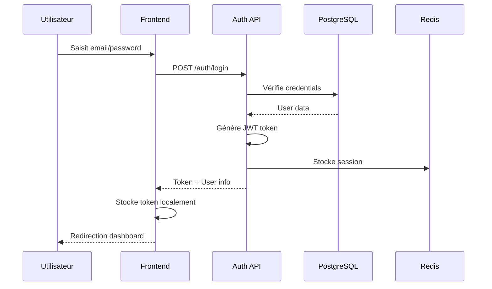

### Validation Token

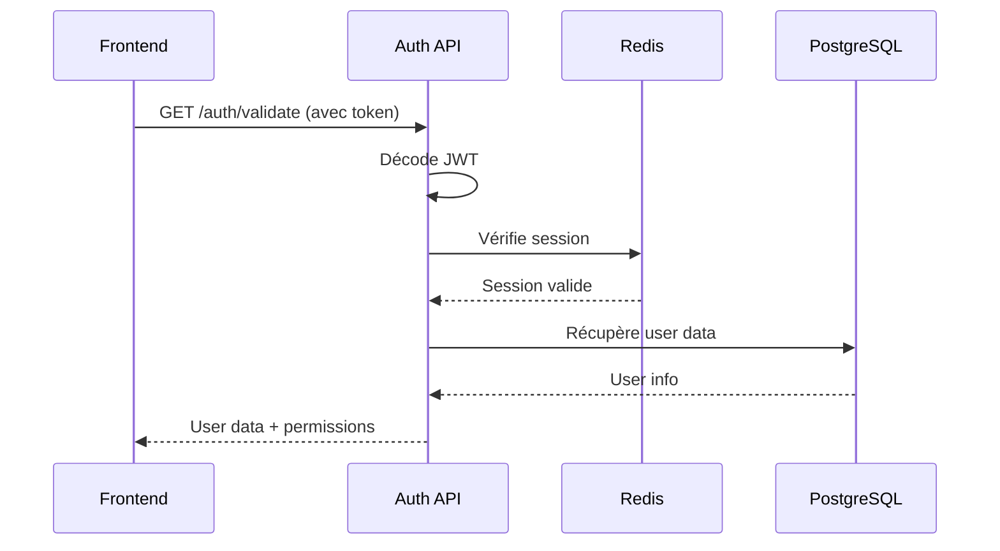

## Chat en Temps Réel

### Envoi de Message

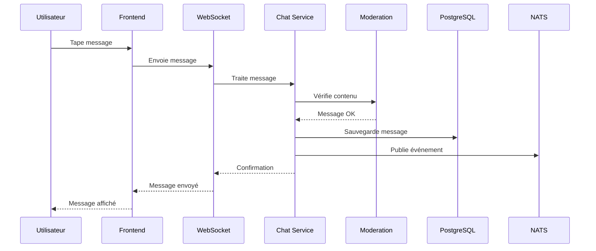

### Réception de Messages

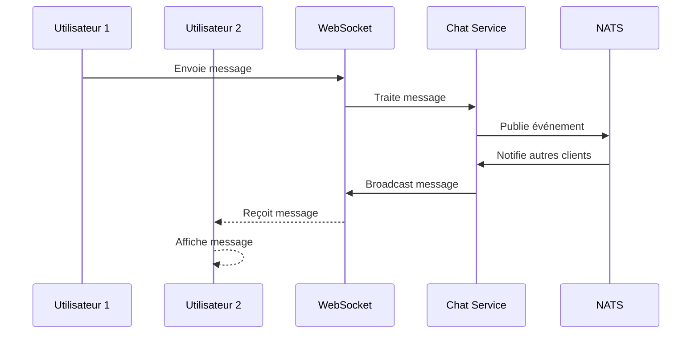

## Streaming Audio

### Démarrage d'un Stream

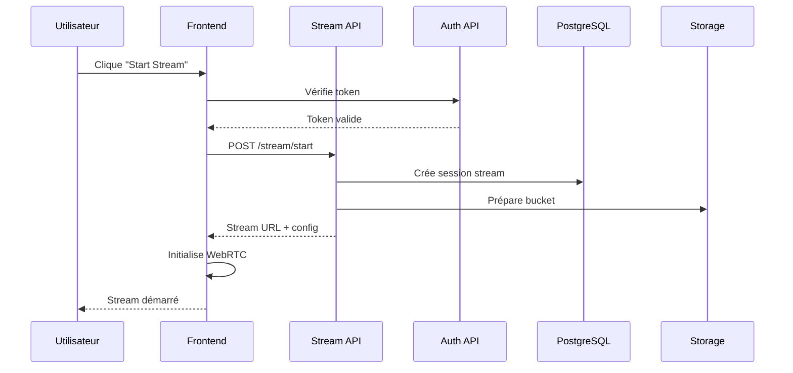

### Upload de Fichier Audio

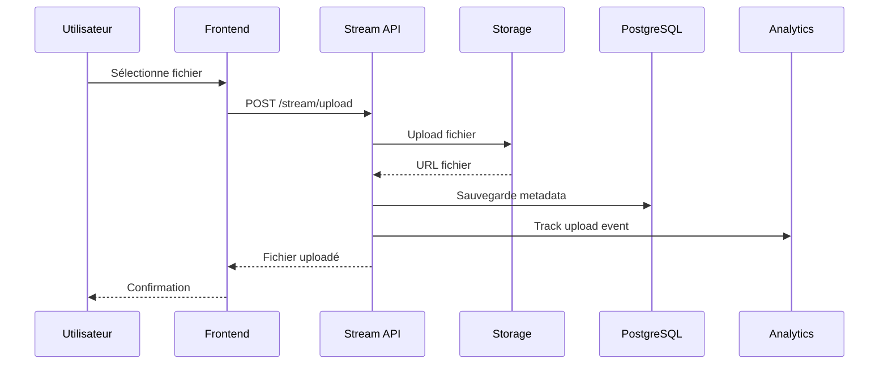

## Gestion des Utilisateurs

### Création de Compte

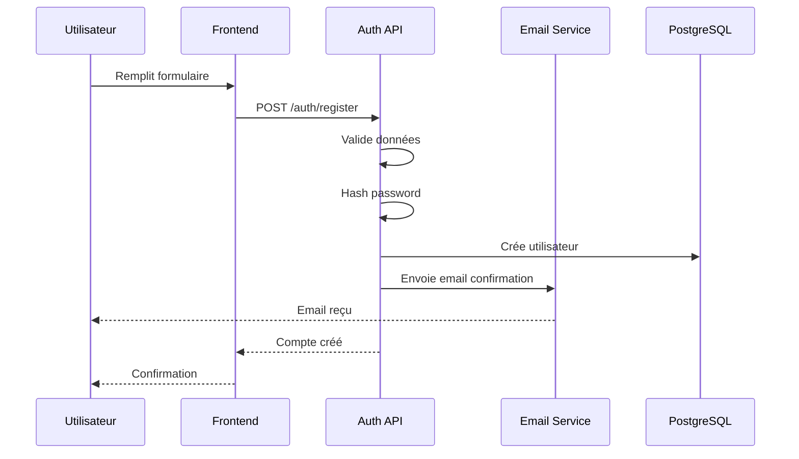

### Mise à Jour de Profil

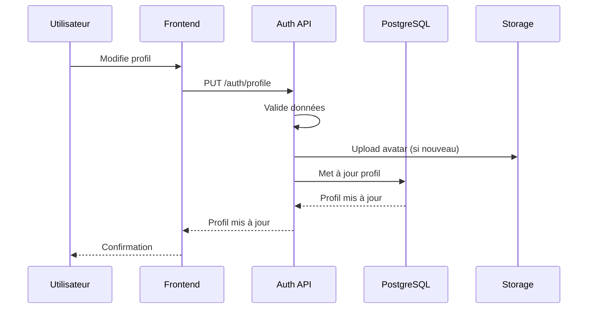

## Modération et Sécurité

### Modération Automatique

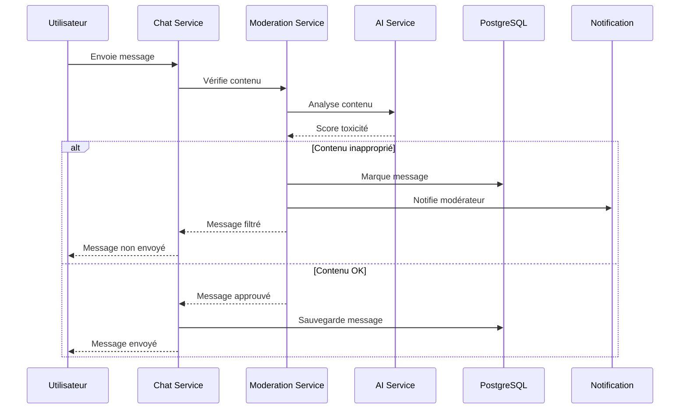

### Signalement de Contenu

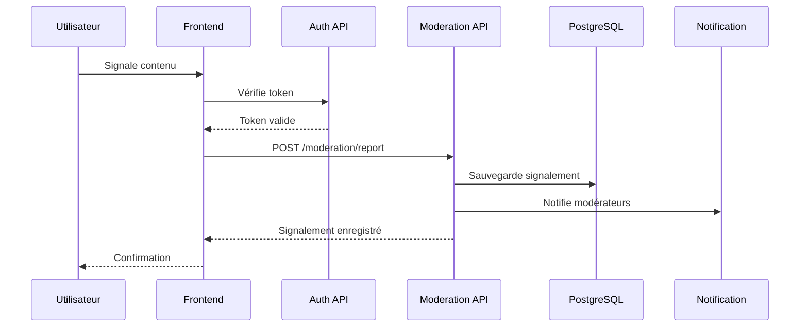

## Analytics et Monitoring

### Collecte de Métriques

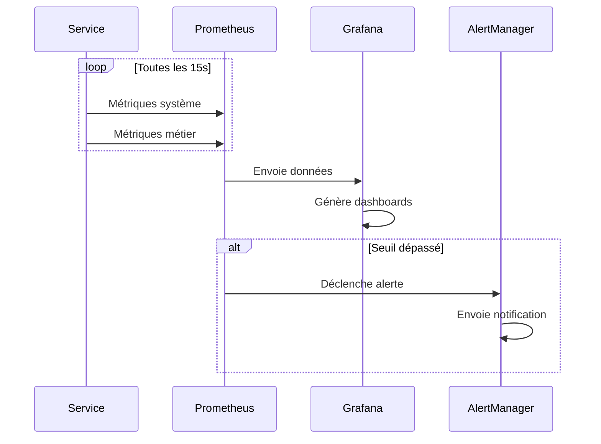

### Traçage des Requêtes

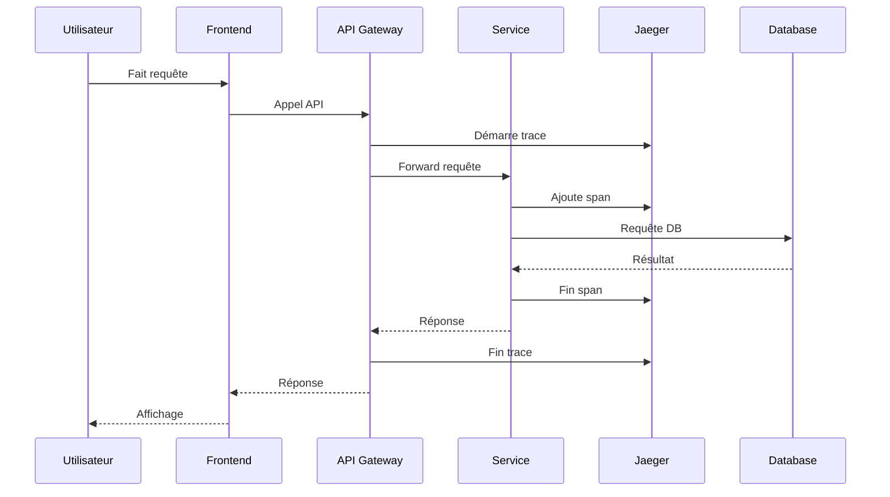

## Gestion des Erreurs

### Gestion d'Erreur API

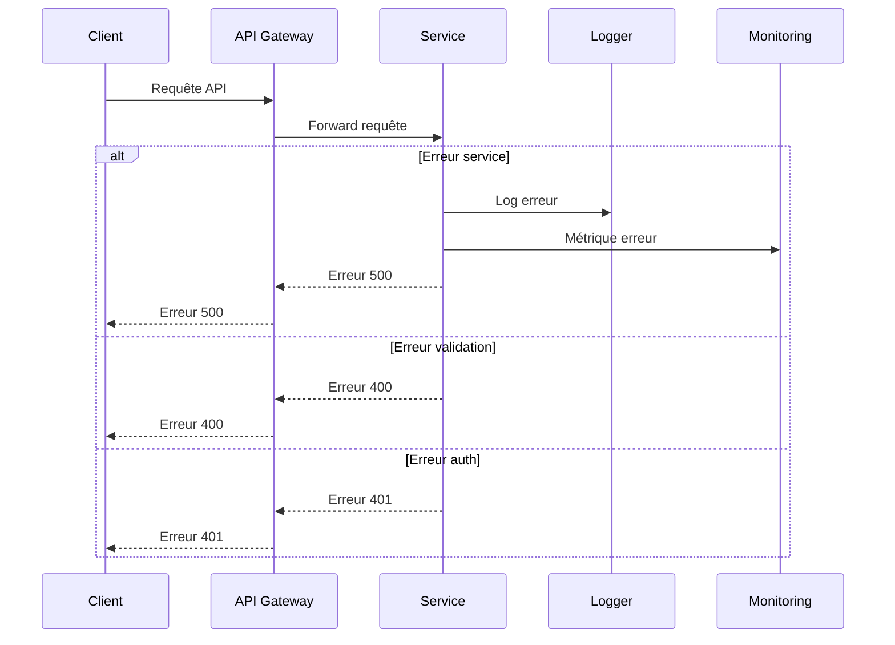

### Circuit Breaker

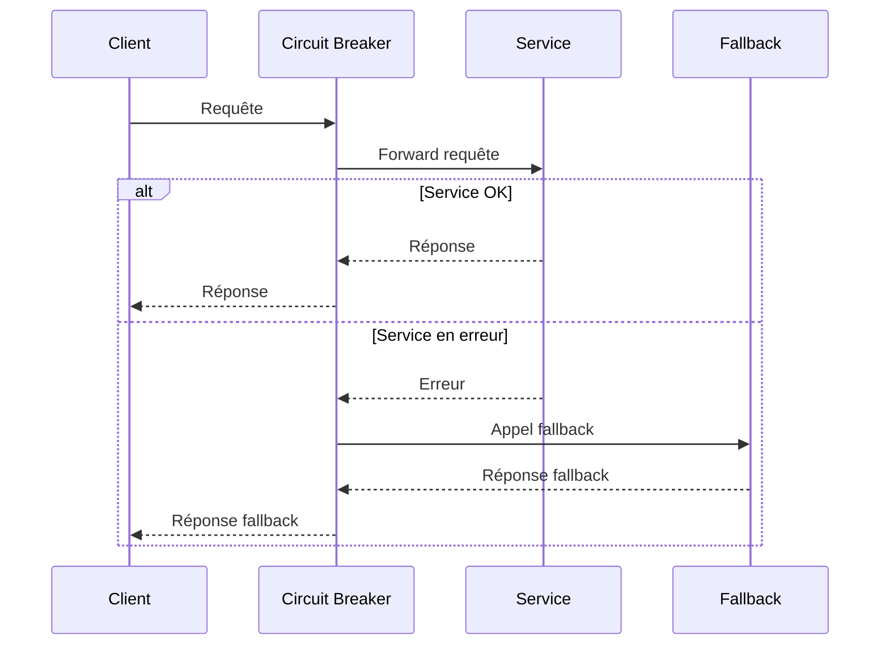

---

## 🔗 Liens croisés

- [Architecture C4](./c4-model.md)
- [Flux de Données](./data-flow.md)
- [API REST](../api/endpoints-reference.md)
- [gRPC API](../api/grpc/README.md)
- [WebSocket API](../api/websocket/README.md)

---

## Pour aller plus loin

- [Guide de Déploiement](../deployment/README.md)
- [Monitoring](../monitoring/README.md)
- [Sécurité](../security/README.md)
- [Tests](../testing/README.md) 