# Diagrammes de Séquence API - Veza Platform

> **Séquences d'interaction pour les principales APIs de Veza**

## Authentification et Autorisation

### Connexion Utilisateur

```mermaid
sequenceDiagram
    participant U as Utilisateur
    participant F as Frontend
    participant A as Auth API
    participant DB as PostgreSQL
    participant R as Redis
    
    U->>F: Saisit email/password
    F->>A: POST /auth/login
    A->>DB: Vérifie credentials
    DB-->>A: User data
    A->>A: Génère JWT token
    A->>R: Stocke session
    A-->>F: Token + User info
    F->>F: Stocke token localement
    F-->>U: Redirection dashboard
```

### Validation Token

```mermaid
sequenceDiagram
    participant F as Frontend
    participant A as Auth API
    participant R as Redis
    participant DB as PostgreSQL
    
    F->>A: GET /auth/validate (avec token)
    A->>A: Décode JWT
    A->>R: Vérifie session
    R-->>A: Session valide
    A->>DB: Récupère user data
    DB-->>A: User info
    A-->>F: User data + permissions
```

## Chat en Temps Réel

### Envoi de Message

```mermaid
sequenceDiagram
    participant U as Utilisateur
    participant F as Frontend
    participant WS as WebSocket
    participant C as Chat Service
    participant M as Moderation
    participant DB as PostgreSQL
    participant N as NATS
    
    U->>F: Tape message
    F->>WS: Envoie message
    WS->>C: Traite message
    C->>M: Vérifie contenu
    M-->>C: Message OK
    C->>DB: Sauvegarde message
    C->>N: Publie événement
    C-->>WS: Confirmation
    WS-->>F: Message envoyé
    F-->>U: Message affiché
```

### Réception de Messages

```mermaid
sequenceDiagram
    participant U1 as Utilisateur 1
    participant U2 as Utilisateur 2
    participant WS as WebSocket
    participant C as Chat Service
    participant N as NATS
    
    U1->>WS: Envoie message
    WS->>C: Traite message
    C->>N: Publie événement
    N->>C: Notifie autres clients
    C->>WS: Broadcast message
    WS-->>U2: Reçoit message
    U2-->>U2: Affiche message
```

## Streaming Audio

### Démarrage d'un Stream

```mermaid
sequenceDiagram
    participant U as Utilisateur
    participant F as Frontend
    participant S as Stream API
    participant A as Auth API
    participant DB as PostgreSQL
    participant ST as Storage
    
    U->>F: Clique "Start Stream"
    F->>A: Vérifie token
    A-->>F: Token valide
    F->>S: POST /stream/start
    S->>DB: Crée session stream
    S->>ST: Prépare bucket
    S-->>F: Stream URL + config
    F->>F: Initialise WebRTC
    F-->>U: Stream démarré
```

### Upload de Fichier Audio

```mermaid
sequenceDiagram
    participant U as Utilisateur
    participant F as Frontend
    participant S as Stream API
    participant ST as Storage
    participant DB as PostgreSQL
    participant A as Analytics
    
    U->>F: Sélectionne fichier
    F->>S: POST /stream/upload
    S->>ST: Upload fichier
    ST-->>S: URL fichier
    S->>DB: Sauvegarde metadata
    S->>A: Track upload event
    S-->>F: Fichier uploadé
    F-->>U: Confirmation
```

## Gestion des Utilisateurs

### Création de Compte

```mermaid
sequenceDiagram
    participant U as Utilisateur
    participant F as Frontend
    participant A as Auth API
    participant E as Email Service
    participant DB as PostgreSQL
    
    U->>F: Remplit formulaire
    F->>A: POST /auth/register
    A->>A: Valide données
    A->>A: Hash password
    A->>DB: Crée utilisateur
    A->>E: Envoie email confirmation
    E-->>U: Email reçu
    A-->>F: Compte créé
    F-->>U: Confirmation
```

### Mise à Jour de Profil

```mermaid
sequenceDiagram
    participant U as Utilisateur
    participant F as Frontend
    participant A as Auth API
    participant DB as PostgreSQL
    participant ST as Storage
    
    U->>F: Modifie profil
    F->>A: PUT /auth/profile
    A->>A: Valide données
    A->>ST: Upload avatar (si nouveau)
    A->>DB: Met à jour profil
    DB-->>A: Profil mis à jour
    A-->>F: Profil mis à jour
    F-->>U: Confirmation
```

## Modération et Sécurité

### Modération Automatique

```mermaid
sequenceDiagram
    participant U as Utilisateur
    participant C as Chat Service
    participant M as Moderation Service
    participant AI as AI Service
    participant DB as PostgreSQL
    participant N as Notification
    
    U->>C: Envoie message
    C->>M: Vérifie contenu
    M->>AI: Analyse contenu
    AI-->>M: Score toxicité
    alt Contenu inapproprié
        M->>DB: Marque message
        M->>N: Notifie modérateur
        M-->>C: Message filtré
        C-->>U: Message non envoyé
    else Contenu OK
        M-->>C: Message approuvé
        C->>DB: Sauvegarde message
        C-->>U: Message envoyé
    end
```

### Signalement de Contenu

```mermaid
sequenceDiagram
    participant U as Utilisateur
    participant F as Frontend
    participant A as Auth API
    participant M as Moderation API
    participant DB as PostgreSQL
    participant N as Notification
    
    U->>F: Signale contenu
    F->>A: Vérifie token
    A-->>F: Token valide
    F->>M: POST /moderation/report
    M->>DB: Sauvegarde signalement
    M->>N: Notifie modérateurs
    M-->>F: Signalement enregistré
    F-->>U: Confirmation
```

## Analytics et Monitoring

### Collecte de Métriques

```mermaid
sequenceDiagram
    participant S as Service
    participant P as Prometheus
    participant G as Grafana
    participant A as AlertManager
    
    loop Toutes les 15s
        S->>P: Métriques système
        S->>P: Métriques métier
    end
    
    P->>G: Envoie données
    G->>G: Génère dashboards
    
    alt Seuil dépassé
        P->>A: Déclenche alerte
        A->>A: Envoie notification
    end
```

### Traçage des Requêtes

```mermaid
sequenceDiagram
    participant U as Utilisateur
    participant F as Frontend
    participant A as API Gateway
    participant S as Service
    participant J as Jaeger
    participant DB as Database
    
    U->>F: Fait requête
    F->>A: Appel API
    A->>J: Démarre trace
    A->>S: Forward requête
    S->>J: Ajoute span
    S->>DB: Requête DB
    DB-->>S: Résultat
    S->>J: Fin span
    S-->>A: Réponse
    A->>J: Fin trace
    A-->>F: Réponse
    F-->>U: Affichage
```

## Gestion des Erreurs

### Gestion d'Erreur API

```mermaid
sequenceDiagram
    participant C as Client
    participant A as API Gateway
    participant S as Service
    participant L as Logger
    participant M as Monitoring
    
    C->>A: Requête API
    A->>S: Forward requête
    
    alt Erreur service
        S->>L: Log erreur
        S->>M: Métrique erreur
        S-->>A: Erreur 500
        A-->>C: Erreur 500
    else Erreur validation
        S-->>A: Erreur 400
        A-->>C: Erreur 400
    else Erreur auth
        S-->>A: Erreur 401
        A-->>C: Erreur 401
    end
```

### Circuit Breaker

```mermaid
sequenceDiagram
    participant C as Client
    participant CB as Circuit Breaker
    participant S as Service
    participant F as Fallback
    
    C->>CB: Requête
    CB->>S: Forward requête
    
    alt Service OK
        S-->>CB: Réponse
        CB-->>C: Réponse
    else Service en erreur
        S-->>CB: Erreur
        CB->>F: Appel fallback
        F-->>CB: Réponse fallback
        CB-->>C: Réponse fallback
    end
```

---

## 🔗 Liens croisés

- [Architecture C4](./c4-model.md)
- [Flux de Données](./data-flow.md)
- [API REST](../api/endpoints-reference.md)
- [gRPC API](../api/grpc/README.md)
- [WebSocket API](../api/websocket/README.md)

---

## Pour aller plus loin

- [Guide de Déploiement](../deployment/README.md)
- [Monitoring](../monitoring/README.md)
- [Sécurité](../security/README.md)
- [Tests](../testing/README.md) 