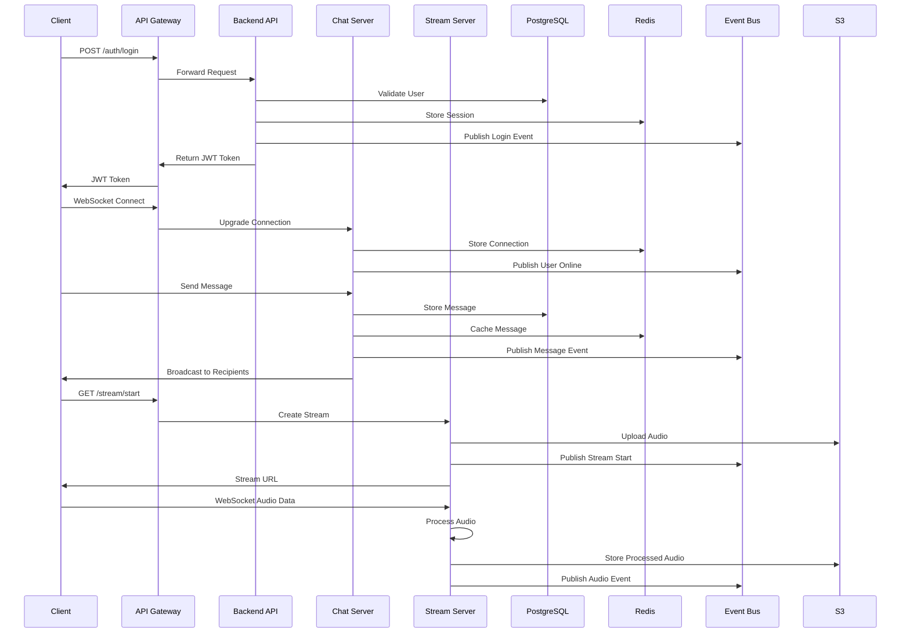
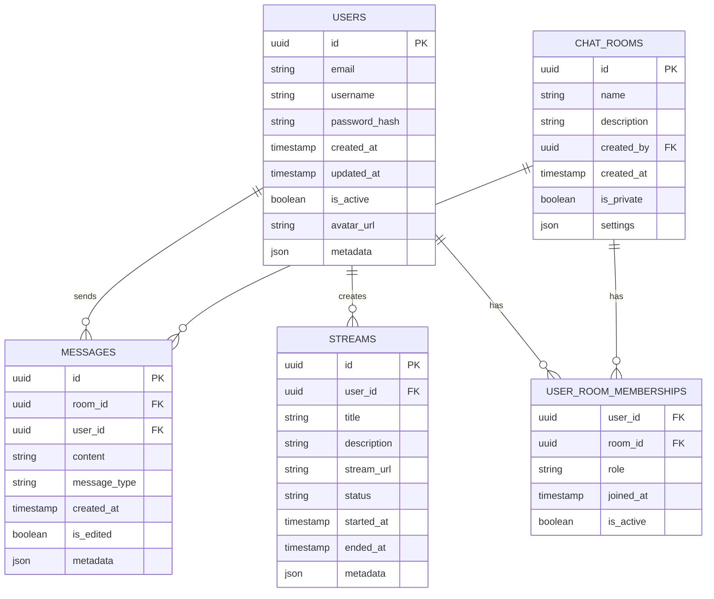

# Architecture Globale - Veza Platform

## Vue d'ensemble de l'Architecture

L'architecture de Veza suit le pattern **Hexagonal Architecture** (Clean Architecture) avec une séparation claire entre les couches métier, infrastructure et présentation.

## Diagramme d'Architecture Principal

```mermaid
graph TB
    subgraph "Frontend Layer"
        Web[🌐 Web App<br/>React/Next.js]
        Mobile[📱 Mobile App<br/>React Native]
        Desktop[💻 Desktop App<br/>Electron]
    end
    
    subgraph "API Gateway Layer"
        LB[⚖️ Load Balancer<br/>Nginx/Traefik]
        CDN[🌍 CDN<br/>Cloudflare]
    end
    
    subgraph "Backend Services Layer"
        subgraph "veza-backend-api"
            API[🔧 REST API<br/>Go/Gin]
            Auth[🔐 Auth Service<br/>JWT/OAuth2]
            User[👤 User Service<br/>CRUD]
            ChatAPI[💬 Chat API<br/>WebSocket Proxy]
            StreamAPI[🎵 Stream API<br/>Media Proxy]
        end
        
        subgraph "veza-chat-server"
            ChatWS[🔌 WebSocket Server<br/>Rust/Tokio]
            ChatCore[🧠 Chat Core<br/>Message Handling]
            ChatHub[🔄 Connection Hub<br/>Real-time]
        end
        
        subgraph "veza-stream-server"
            StreamCore[🎼 Stream Core<br/>Audio Processing]
            StreamWS[🔌 Stream WebSocket<br/>Live Streaming]
            Transcode[🔄 Transcoder<br/>Codec Conversion]
        end
    end
    
    subgraph "Business Logic Layer"
        subgraph "Core Domain"
            UserDomain[👤 User Domain<br/>Business Rules]
            ChatDomain[💬 Chat Domain<br/>Message Logic]
            StreamDomain[🎵 Stream Domain<br/>Audio Logic]
            PaymentDomain[💰 Payment Domain<br/>Billing]
        end
        
        subgraph "Application Services"
            AuthService[🔐 Authentication<br/>Service]
            NotificationService[📢 Notification<br/>Service]
            AnalyticsService[📊 Analytics<br/>Service]
            ModerationService[🛡️ Moderation<br/>Service]
        end
    end
    
    subgraph "Infrastructure Layer"
        subgraph "Data Storage"
            PostgreSQL[(🗄️ PostgreSQL<br/>Primary DB)]
            Redis[(⚡ Redis<br/>Cache/Session)]
            S3[(☁️ S3 Storage<br/>Media Files)]
        end
        
        subgraph "Message Queue"
            NATS[🔄 NATS<br/>Event Bus]
            RedisMQ[📨 Redis Queue<br/>Background Jobs]
        end
        
        subgraph "External Services"
            Email[📧 Email Service<br/>SMTP/SendGrid]
            SMS[📱 SMS Service<br/>Twilio]
            Payment[💳 Payment Gateway<br/>Stripe]
            CDN2[🌍 Media CDN<br/>CloudFront]
        end
    end
    
    subgraph "Monitoring & Observability"
        Prometheus[📈 Prometheus<br/>Metrics]
        Grafana[📊 Grafana<br/>Dashboards]
        Jaeger[🔍 Jaeger<br/>Distributed Tracing]
        ELK[📝 ELK Stack<br/>Logs]
    end
    
    %% Frontend to Gateway
    Web --> LB
    Mobile --> LB
    Desktop --> LB
    CDN --> LB
    
    %% Gateway to Services
    LB --> API
    LB --> ChatWS
    LB --> StreamWS
    
    %% API Internal
    API --> Auth
    API --> User
    API --> ChatAPI
    API --> StreamAPI
    
    %% Chat Server Internal
    ChatWS --> ChatCore
    ChatWS --> ChatHub
    
    %% Stream Server Internal
    StreamWS --> StreamCore
    StreamCore --> Transcode
    
    %% Business Logic Connections
    Auth --> AuthService
    User --> UserDomain
    ChatCore --> ChatDomain
    StreamCore --> StreamDomain
    
    %% Application Services
    AuthService --> NotificationService
    ChatDomain --> ModerationService
    StreamDomain --> AnalyticsService
    
    %% Infrastructure Connections
    UserDomain --> PostgreSQL
    ChatDomain --> PostgreSQL
    StreamDomain --> S3
    
    AuthService --> Redis
    ChatHub --> Redis
    StreamCore --> Redis
    
    %% Message Queue
    AuthService --> NATS
    ChatCore --> NATS
    StreamCore --> NATS
    NotificationService --> RedisMQ
    
    %% External Services
    NotificationService --> Email
    NotificationService --> SMS
    PaymentDomain --> Payment
    StreamCore --> CDN2
    
    %% Monitoring
    API --> Prometheus
    ChatWS --> Prometheus
    StreamWS --> Prometheus
    Prometheus --> Grafana
    API --> Jaeger
    ChatWS --> Jaeger
    StreamWS --> Jaeger
    API --> ELK
    ChatWS --> ELK
    StreamWS --> ELK
```

## Flux de Données Principal

## Architecture des Données

## Patterns d'Architecture Utilisés

### 1. Hexagonal Architecture (Clean Architecture)
- **Domain Layer** : Logique métier pure
- **Application Layer** : Cas d'usage et orchestration
- **Infrastructure Layer** : Accès aux données et services externes

### 2. Event-Driven Architecture
- **NATS** : Bus d'événements principal
- **Redis Pub/Sub** : Événements temps réel
- **Event Sourcing** : Audit trail complet

### 3. CQRS (Command Query Responsibility Segregation)
- **Commands** : Modifications d'état
- **Queries** : Lectures optimisées
- **Event Store** : Source de vérité

### 4. Microservices
- **Service Discovery** : Auto-découverte
- **Circuit Breaker** : Résilience
- **API Gateway** : Point d'entrée unique

## Sécurité et Performance

### Sécurité
- **JWT** : Authentification stateless
- **OAuth2** : Authentification tierce
- **RBAC** : Contrôle d'accès granulaire
- **Rate Limiting** : Protection contre les abus
- **TLS 1.3** : Chiffrement en transit

### Performance
- **Redis Cache** : Cache distribué
- **Connection Pooling** : Optimisation DB
- **CDN** : Distribution de contenu
- **Load Balancing** : Répartition de charge
- **Horizontal Scaling** : Évolutivité

## Monitoring et Observabilité

### Métriques
- **Prometheus** : Collecte de métriques
- **Grafana** : Visualisation
- **Alerting** : Notifications automatiques

### Traçage
- **Jaeger** : Traçage distribué
- **OpenTelemetry** : Standardisation
- **Correlation IDs** : Suivi des requêtes

### Logs
- **Structured Logging** : Logs structurés
- **Centralized Logging** : Agrégation
- **Log Levels** : Niveaux de détail

---

**Dernière mise à jour** : $(date)
**Version du diagramme** : 1.0.0 