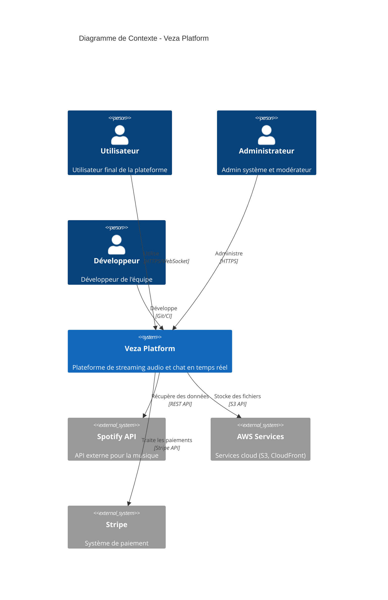
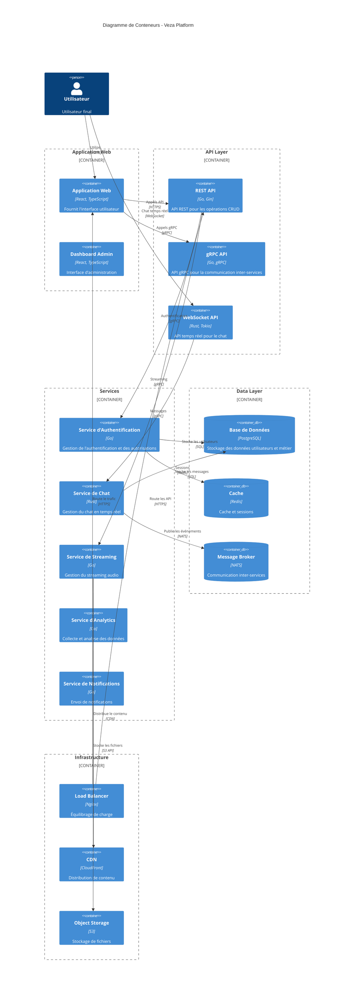
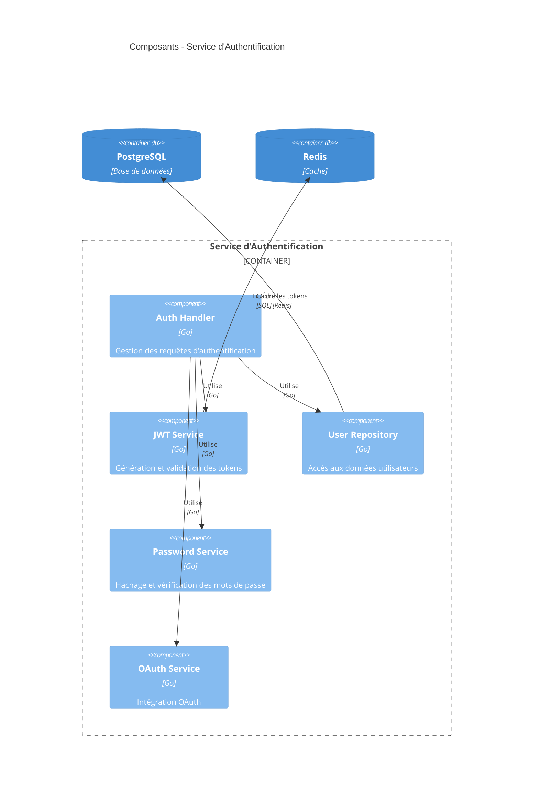
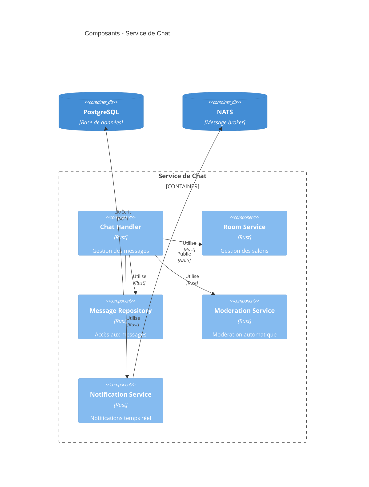
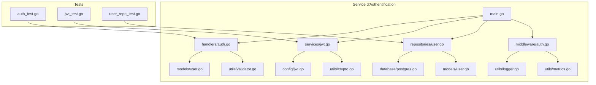
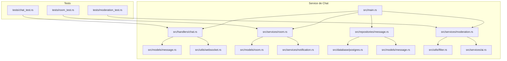
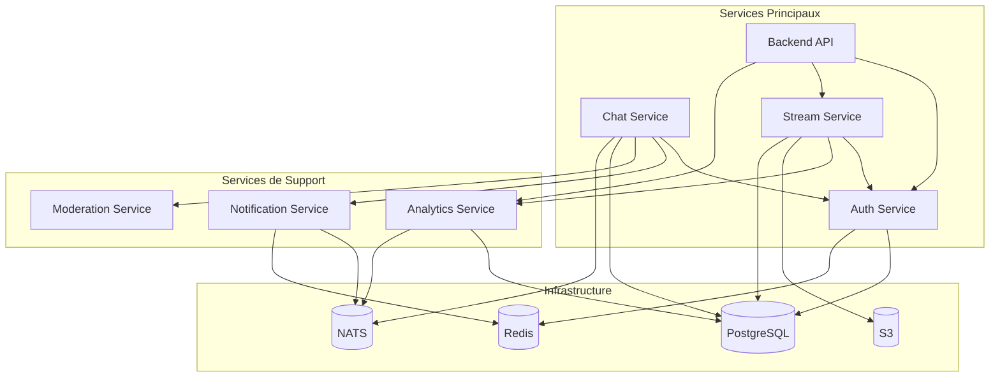
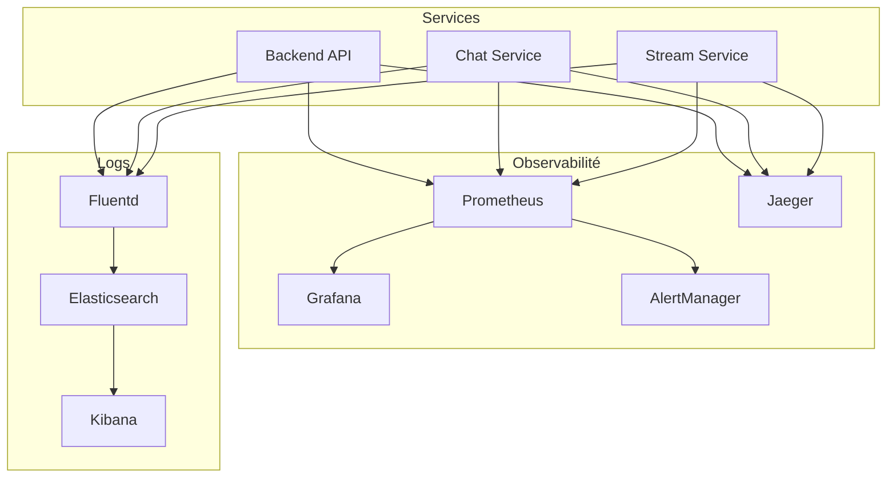

# Modèle C4 - Veza Platform

> **Architecture C4 complète de la plateforme Veza**

## Vue d'ensemble

Le modèle C4 fournit une vue hiérarchique de l'architecture de Veza, du contexte système jusqu'au niveau du code.

## Niveau 1 : Contexte Système

## Niveau 2 : Conteneurs

## Niveau 3 : Composants

### Composants du Service d'Authentification

### Composants du Service de Chat

## Niveau 4 : Code

### Structure du Code - Service d'Authentification

### Structure du Code - Service de Chat

## Relations Inter-Services

## Métriques et Observabilité

---

## 🔗 Liens croisés

- [Architecture Globale](./architecture-overview.md)
- [Flux de Données](./data-flow.md)
- [API REST](../api/endpoints-reference.md)
- [gRPC API](../api/grpc/README.md)
- [WebSocket API](../api/websocket/README.md)

---

## Pour aller plus loin

- [Guide de Déploiement](../deployment/README.md)
- [Monitoring](../monitoring/README.md)
- [Sécurité](../security/README.md)
- [Tests](../testing/README.md) 