# Modèle C4 - Veza Platform

> **Architecture C4 complète de la plateforme Veza**

## Vue d'ensemble

Le modèle C4 fournit une vue hiérarchique de l'architecture de Veza, du contexte système jusqu'au niveau du code.

## Niveau 1 : Contexte Système

```mermaid
C4Context
    title Diagramme de Contexte - Veza Platform
    
    Person(user, "Utilisateur", "Utilisateur final de la plateforme")
    Person(admin, "Administrateur", "Admin système et modérateur")
    Person(developer, "Développeur", "Développeur de l'équipe")
    
    System(veza, "Veza Platform", "Plateforme de streaming audio et chat en temps réel")
    System_Ext(spotify, "Spotify API", "API externe pour la musique")
    System_Ext(aws, "AWS Services", "Services cloud (S3, CloudFront)")
    System_Ext(payment, "Stripe", "Système de paiement")
    
    Rel(user, veza, "Utilise", "HTTPS/WebSocket")
    Rel(admin, veza, "Administre", "HTTPS")
    Rel(developer, veza, "Développe", "Git/CI")
    Rel(veza, spotify, "Récupère des données", "REST API")
    Rel(veza, aws, "Stocke des fichiers", "S3 API")
    Rel(veza, payment, "Traite les paiements", "Stripe API")
```

## Niveau 2 : Conteneurs

```mermaid
C4Container
    title Diagramme de Conteneurs - Veza Platform
    
    Person(user, "Utilisateur", "Utilisateur final")
    
    Container_Boundary(web, "Application Web") {
        Container(webapp, "Application Web", "React, TypeScript", "Fournit l'interface utilisateur")
        Container(admin, "Dashboard Admin", "React, TypeScript", "Interface d'administration")
    }
    
    Container_Boundary(api, "API Layer") {
        Container(restapi, "REST API", "Go, Gin", "API REST pour les opérations CRUD")
        Container(grpcapi, "gRPC API", "Go, gRPC", "API gRPC pour la communication inter-services")
        Container(websocket, "WebSocket API", "Rust, Tokio", "API temps réel pour le chat")
    }
    
    Container_Boundary(services, "Services") {
        Container(auth, "Service d'Authentification", "Go", "Gestion de l'authentification et des autorisations")
        Container(chat, "Service de Chat", "Rust", "Gestion du chat en temps réel")
        Container(stream, "Service de Streaming", "Go", "Gestion du streaming audio")
        Container(analytics, "Service d'Analytics", "Go", "Collecte et analyse des données")
        Container(notification, "Service de Notifications", "Go", "Envoi de notifications")
    }
    
    Container_Boundary(data, "Data Layer") {
        ContainerDb(postgres, "Base de Données", "PostgreSQL", "Stockage des données utilisateurs et métier")
        ContainerDb(redis, "Cache", "Redis", "Cache et sessions")
        ContainerDb(nats, "Message Broker", "NATS", "Communication inter-services")
    }
    
    Container_Boundary(infra, "Infrastructure") {
        Container(loadbalancer, "Load Balancer", "Nginx", "Équilibrage de charge")
        Container(cdn, "CDN", "CloudFront", "Distribution de contenu")
        Container(storage, "Object Storage", "S3", "Stockage de fichiers")
    }
    
    Rel(user, webapp, "Utilise", "HTTPS")
    Rel(user, websocket, "Chat temps réel", "WebSocket")
    Rel(webapp, restapi, "Appels API", "HTTPS")
    Rel(webapp, grpcapi, "Appels gRPC", "gRPC")
    Rel(restapi, auth, "Authentification", "gRPC")
    Rel(restapi, stream, "Streaming", "gRPC")
    Rel(websocket, chat, "Messages", "gRPC")
    Rel(auth, postgres, "Stocke les utilisateurs", "SQL")
    Rel(auth, redis, "Sessions", "Redis")
    Rel(chat, postgres, "Stocke les messages", "SQL")
    Rel(chat, nats, "Publie les événements", "NATS")
    Rel(stream, storage, "Stocke les fichiers", "S3 API")
    Rel(stream, cdn, "Distribue le contenu", "CDN")
    Rel(loadbalancer, webapp, "Route le trafic", "HTTPS")
    Rel(loadbalancer, restapi, "Route les API", "HTTPS")
```

## Niveau 3 : Composants

### Composants du Service d'Authentification

```mermaid
C4Component
    title Composants - Service d'Authentification
    
    Container_Boundary(auth, "Service d'Authentification") {
        Component(auth_handler, "Auth Handler", "Go", "Gestion des requêtes d'authentification")
        Component(jwt_service, "JWT Service", "Go", "Génération et validation des tokens")
        Component(user_repo, "User Repository", "Go", "Accès aux données utilisateurs")
        Component(password_service, "Password Service", "Go", "Hachage et vérification des mots de passe")
        Component(oauth_service, "OAuth Service", "Go", "Intégration OAuth")
    }
    
    ContainerDb(postgres, "PostgreSQL", "Base de données")
    ContainerDb(redis, "Redis", "Cache")
    
    Rel(auth_handler, jwt_service, "Utilise", "Go")
    Rel(auth_handler, user_repo, "Utilise", "Go")
    Rel(auth_handler, password_service, "Utilise", "Go")
    Rel(auth_handler, oauth_service, "Utilise", "Go")
    Rel(user_repo, postgres, "Lit/Écrit", "SQL")
    Rel(jwt_service, redis, "Cache les tokens", "Redis")
```

### Composants du Service de Chat

## Niveau 4 : Code

### Structure du Code - Service d'Authentification

### Structure du Code - Service de Chat

## Relations Inter-Services

## Métriques et Observabilité

---

## 🔗 Liens croisés

- [Architecture Globale](./architecture-overview.md)
- [Flux de Données](./data-flow.md)
- [API REST](../api/endpoints-reference.md)
- [gRPC API](../api/grpc/README.md)
- [WebSocket API](../api/websocket/README.md)

---

## Pour aller plus loin

- [Guide de Déploiement](../deployment/README.md)
- [Monitoring](../monitoring/README.md)
- [Sécurité](../security/README.md)
- [Tests](../testing/README.md) 