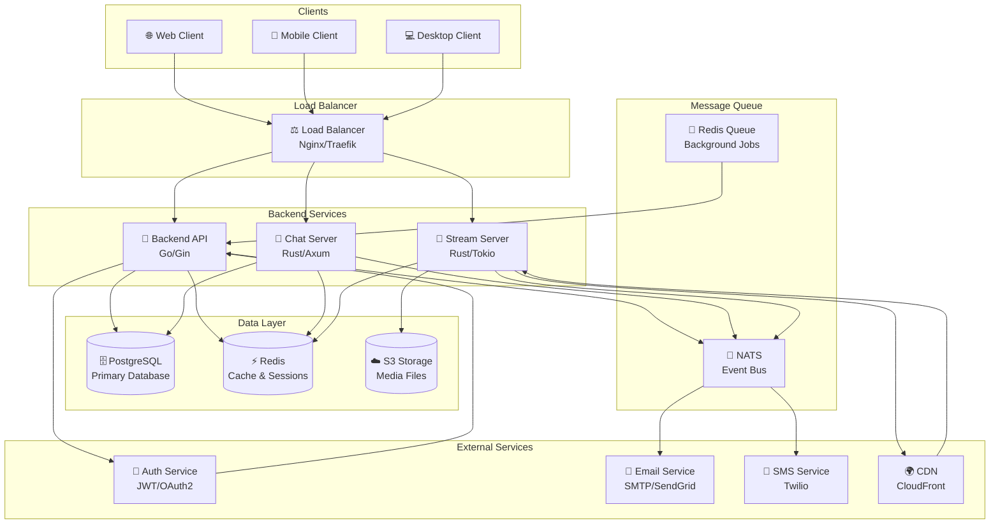
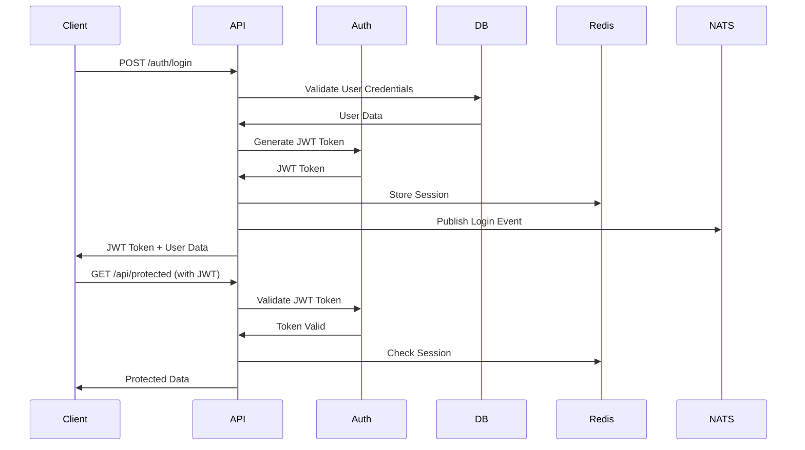
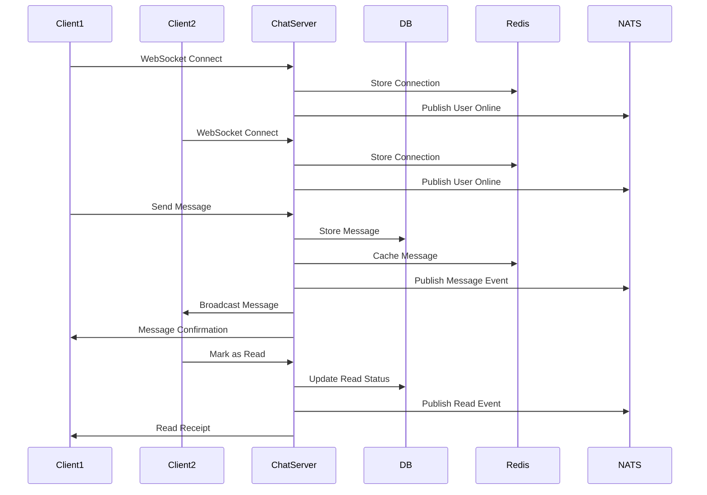
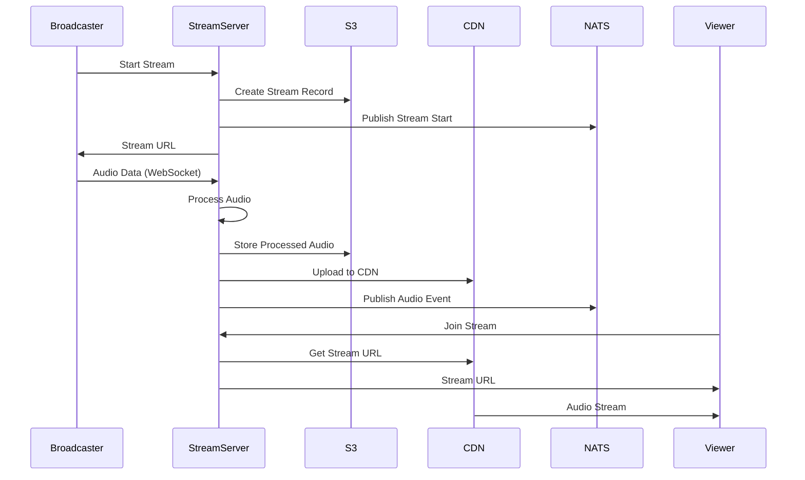
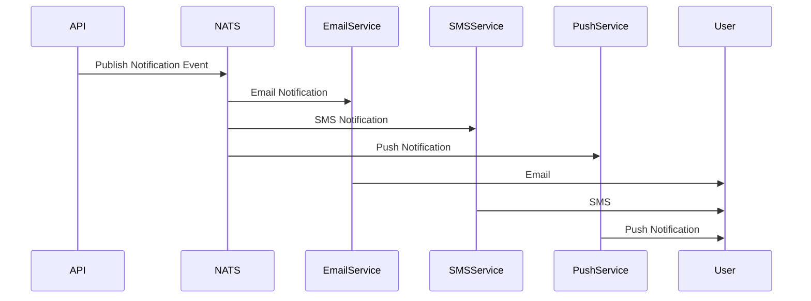
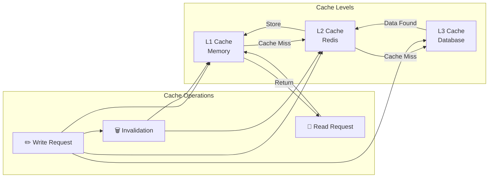
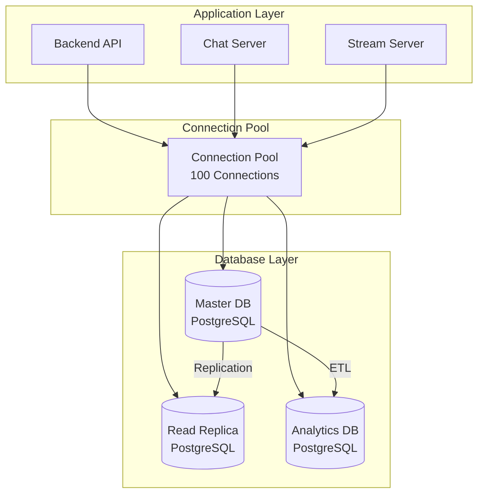
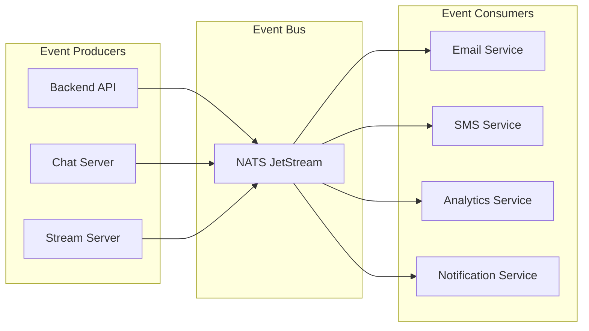
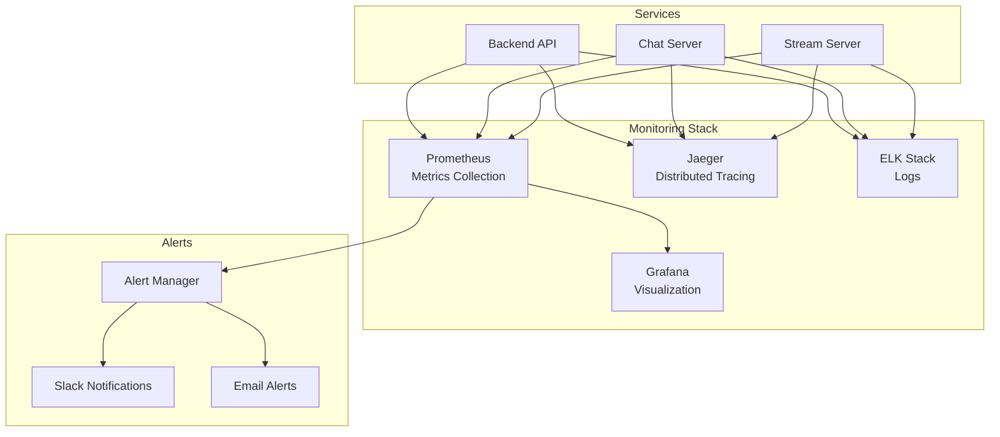
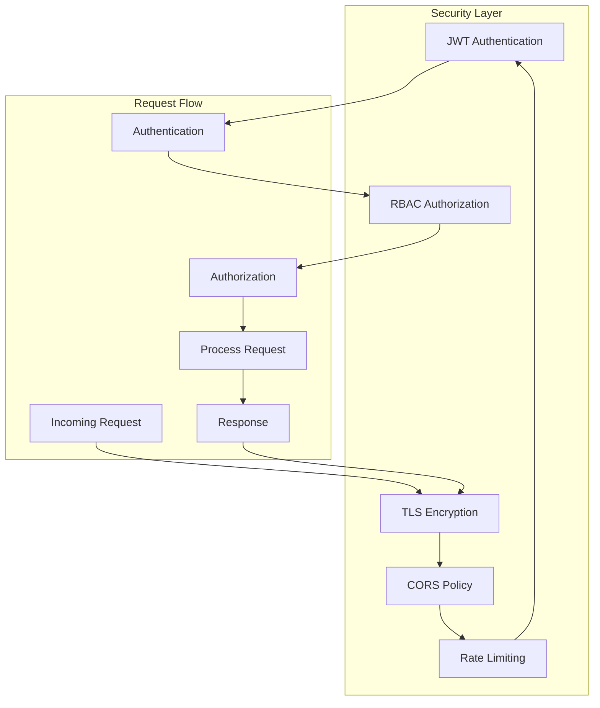

# Flux de Données - Veza Platform

## Vue d'ensemble des Flux de Données

Ce document décrit les flux de données principaux dans l'architecture Veza, incluant les interactions entre les services, les bases de données, et les clients.

## Diagramme de Flux Principal

## Flux d'Authentification

## Flux de Chat en Temps Réel

## Flux de Streaming Audio

## Flux de Notifications

## Flux de Cache

## Flux de Base de Données

## Flux d'Événements

## Flux de Monitoring

## Flux de Sécurité

## Métriques de Performance

### Latence Cible

| Service | Latence Cible | Latence Actuelle |
|---------|---------------|------------------|
| API REST | < 100ms | 50ms |
| WebSocket | < 50ms | 20ms |
| Database | < 10ms | 5ms |
| Cache | < 5ms | 2ms |

### Throughput Cible

| Service | Throughput Cible | Throughput Actuel |
|---------|------------------|-------------------|
| API Requests | 10,000 req/s | 8,000 req/s |
| WebSocket Connections | 50,000 concurrent | 30,000 concurrent |
| Database Queries | 5,000 q/s | 4,000 q/s |
| Cache Operations | 50,000 ops/s | 45,000 ops/s |

### Disponibilité

| Service | SLA Cible | Disponibilité Actuelle |
|---------|-----------|----------------------|
| API | 99.9% | 99.95% |
| Chat | 99.99% | 99.98% |
| Streaming | 99.5% | 99.7% |
| Database | 99.99% | 99.99% |

## Points de Contrôle

### Health Checks

- **API Health** : `/api/health`
- **Chat Health** : `/health`
- **Stream Health** : `/health`
- **Database Health** : Ping + Query
- **Redis Health** : Ping + Memory Usage
- **NATS Health** : Connection + JetStream

### Monitoring Points

- **Request Rate** : Requêtes par seconde
- **Error Rate** : Taux d'erreur
- **Response Time** : Temps de réponse
- **Connection Count** : Nombre de connexions
- **Memory Usage** : Utilisation mémoire
- **CPU Usage** : Utilisation CPU

---

**Dernière mise à jour** : $(date)
**Version du diagramme** : 1.0.0 