# Flux de Données - Veza Platform

## Vue d'ensemble des Flux de Données

Ce document décrit les flux de données principaux dans l'architecture Veza, incluant les interactions entre les services, les bases de données, et les clients.

## Diagramme de Flux Principal

```mermaid
flowchart TD
    subgraph "Clients"
        Web[🌐 Web Client]
        Mobile[📱 Mobile Client]
        Desktop[💻 Desktop Client]
    end
    
    subgraph "Load Balancer"
        LB[⚖️ Load Balancer<br/>Nginx/Traefik]
    end
    
    subgraph "Backend Services"
        API[🔧 Backend API<br/>Go/Gin]
        Chat[💬 Chat Server<br/>Rust/Axum]
        Stream[🎵 Stream Server<br/>Rust/Tokio]
    end
    
    subgraph "Data Layer"
        PostgreSQL[(🗄️ PostgreSQL<br/>Primary Database)]
        Redis[(⚡ Redis<br/>Cache & Sessions)]
        S3[(☁️ S3 Storage<br/>Media Files)]
    end
    
    subgraph "Message Queue"
        NATS[🔄 NATS<br/>Event Bus]
        RedisQ[📨 Redis Queue<br/>Background Jobs]
    end
    
    subgraph "External Services"
        Auth[🔐 Auth Service<br/>JWT/OAuth2]
        Email[📧 Email Service<br/>SMTP/SendGrid]
        SMS[📱 SMS Service<br/>Twilio]
        CDN[🌍 CDN<br/>CloudFront]
    end
    
    %% Client to Load Balancer
    Web --> LB
    Mobile --> LB
    Desktop --> LB
    
    %% Load Balancer to Services
    LB --> API
    LB --> Chat
    LB --> Stream
    
    %% API Data Flow
    API --> PostgreSQL
    API --> Redis
    API --> NATS
    API --> Auth
    
    %% Chat Server Data Flow
    Chat --> PostgreSQL
    Chat --> Redis
    Chat --> NATS
    
    %% Stream Server Data Flow
    Stream --> S3
    Stream --> Redis
    Stream --> NATS
    Stream --> CDN
    
    %% Message Queue Flow
    NATS --> Email
    NATS --> SMS
    RedisQ --> API
    
    %% External Service Flow
    Auth --> API
    CDN --> Stream
```

## Flux d'Authentification

## Flux de Chat en Temps Réel

## Flux de Streaming Audio

## Flux de Notifications

## Flux de Cache

```mermaid
flowchart LR
    subgraph "Cache Levels"
        L1[L1 Cache<br/>Memory]
        L2[L2 Cache<br/>Redis]
        L3[L3 Cache<br/>Database]
    end
    
    subgraph "Cache Operations"
        Read[📖 Read Request]
        Write[✏️ Write Request]
        Invalidate[🗑️ Invalidation]
    end
    
    Read --> L1
    L1 -->|Cache Miss| L2
    L2 -->|Cache Miss| L3
    L3 -->|Data Found| L2
    L2 -->|Store| L1
    L1 -->|Return| Read
    
    Write --> L1
    Write --> L2
    Write --> L3
    Write --> Invalidate
    
    Invalidate --> L1
    Invalidate --> L2
```

## Flux de Base de Données

## Flux d'Événements

## Flux de Monitoring

## Flux de Sécurité

## Métriques de Performance

### Latence Cible

| Service | Latence Cible | Latence Actuelle |
|---------|---------------|------------------|
| API REST | < 100ms | 50ms |
| WebSocket | < 50ms | 20ms |
| Database | < 10ms | 5ms |
| Cache | < 5ms | 2ms |

### Throughput Cible

| Service | Throughput Cible | Throughput Actuel |
|---------|------------------|-------------------|
| API Requests | 10,000 req/s | 8,000 req/s |
| WebSocket Connections | 50,000 concurrent | 30,000 concurrent |
| Database Queries | 5,000 q/s | 4,000 q/s |
| Cache Operations | 50,000 ops/s | 45,000 ops/s |

### Disponibilité

| Service | SLA Cible | Disponibilité Actuelle |
|---------|-----------|----------------------|
| API | 99.9% | 99.95% |
| Chat | 99.99% | 99.98% |
| Streaming | 99.5% | 99.7% |
| Database | 99.99% | 99.99% |

## Points de Contrôle

### Health Checks

- **API Health** : `/api/health`
- **Chat Health** : `/health`
- **Stream Health** : `/health`
- **Database Health** : Ping + Query
- **Redis Health** : Ping + Memory Usage
- **NATS Health** : Connection + JetStream

### Monitoring Points

- **Request Rate** : Requêtes par seconde
- **Error Rate** : Taux d'erreur
- **Response Time** : Temps de réponse
- **Connection Count** : Nombre de connexions
- **Memory Usage** : Utilisation mémoire
- **CPU Usage** : Utilisation CPU

---

**Dernière mise à jour** : $(date)
**Version du diagramme** : 1.0.0 