# Gestion d'État - Veza Platform

> **Architecture de gestion d'état pour l'application Veza**

## Vue d'ensemble

La plateforme Veza utilise une architecture de gestion d'état distribuée avec plusieurs couches de cache et de synchronisation.

## Architecture Globale de l'État

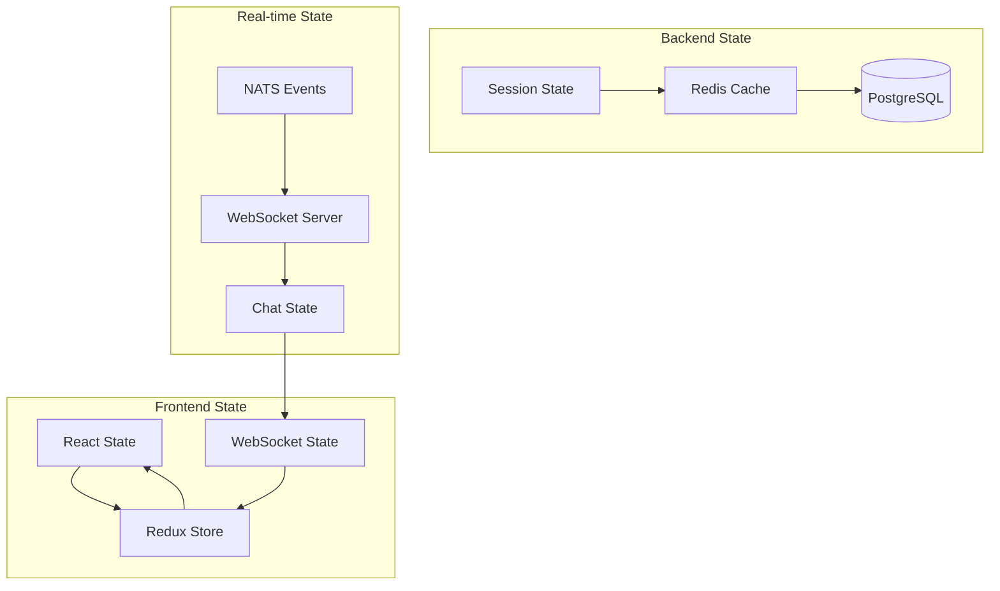

## Flux de Synchronisation d'État

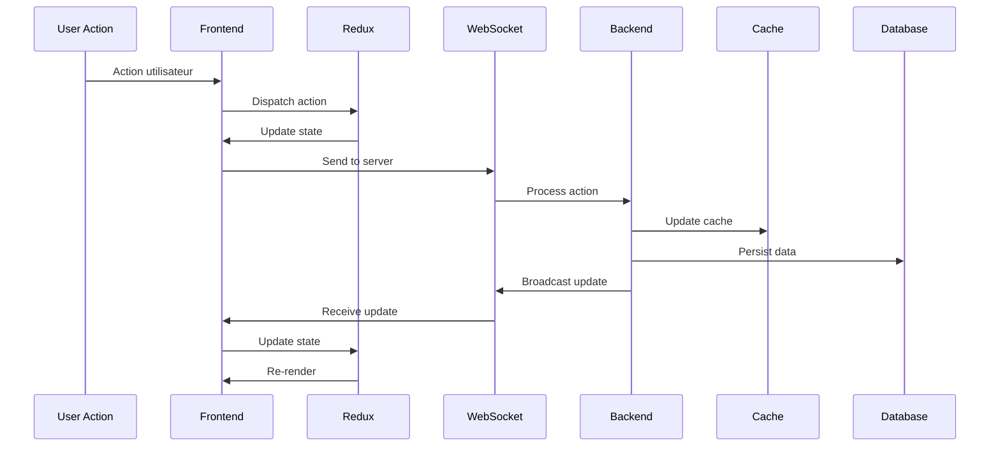

## États par Module

### État d'Authentification

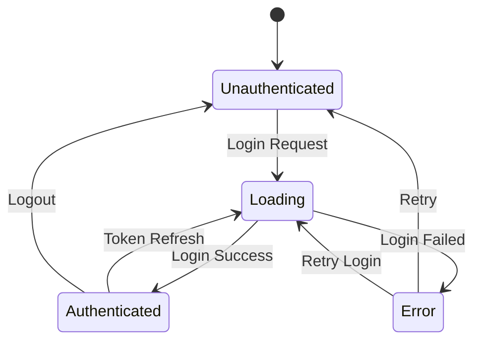

### État de Chat

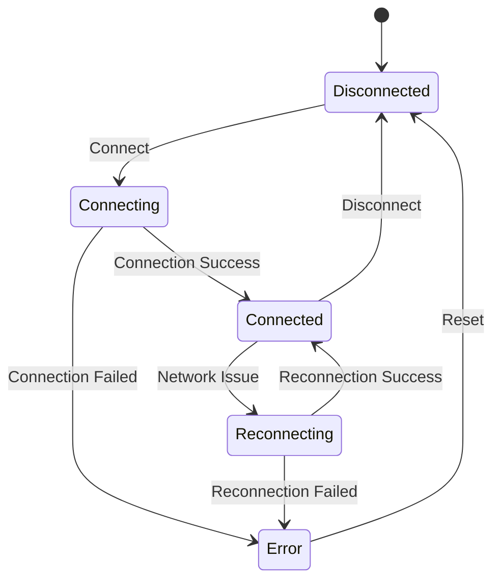

### État de Streaming

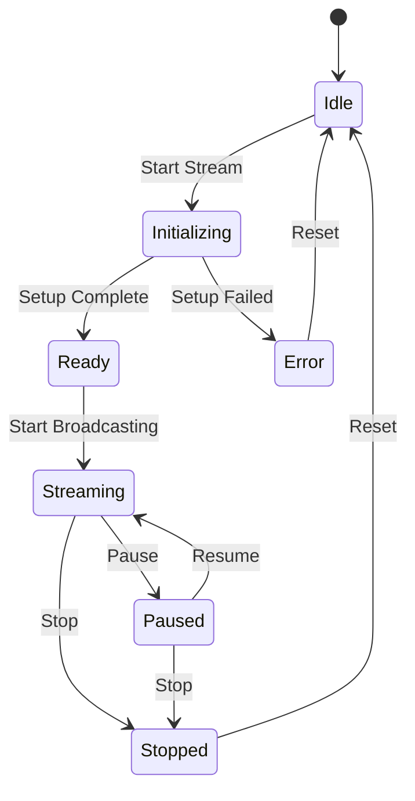

## Gestion du Cache

### Hiérarchie du Cache

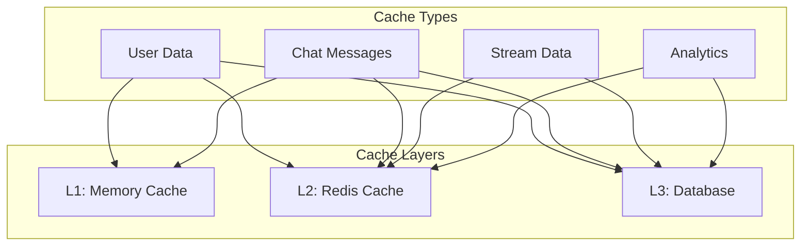

### Stratégies de Cache

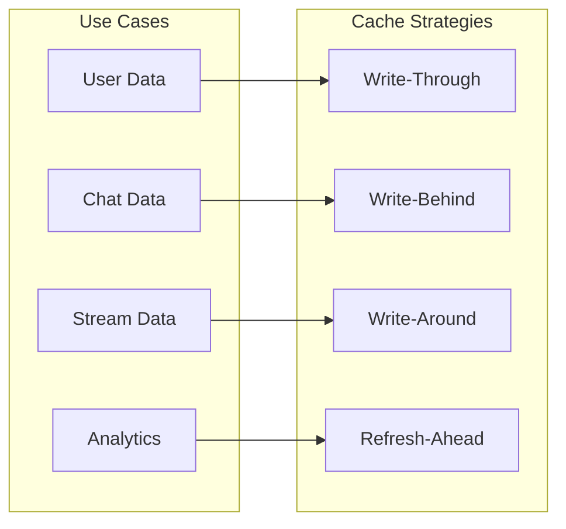

## Synchronisation Temps Réel

### Événements NATS

```mermaid
graph TB
    subgraph "Event Types"
        USER_EVENT[User Events]
        CHAT_EVENT[Chat Events]
        STREAM_EVENT[Stream Events]
        SYSTEM_EVENT[System Events]
    end
    
    subgraph "Event Handlers"
        AUTH_HANDLER[Auth Handler]
        CHAT_HANDLER[Chat Handler]
        STREAM_HANDLER[Stream Handler]
        NOTIFICATION_HANDLER[Notification Handler]
    end
    
    USER_EVENT --> AUTH_HANDLER
    CHAT_EVENT --> CHAT_HANDLER
    STREAM_EVENT --> STREAM_HANDLER
    SYSTEM_EVENT --> NOTIFICATION_HANDLER
```

### WebSocket State Management

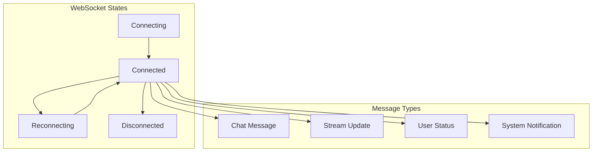

## Optimistic Updates

### Stratégie Optimistic

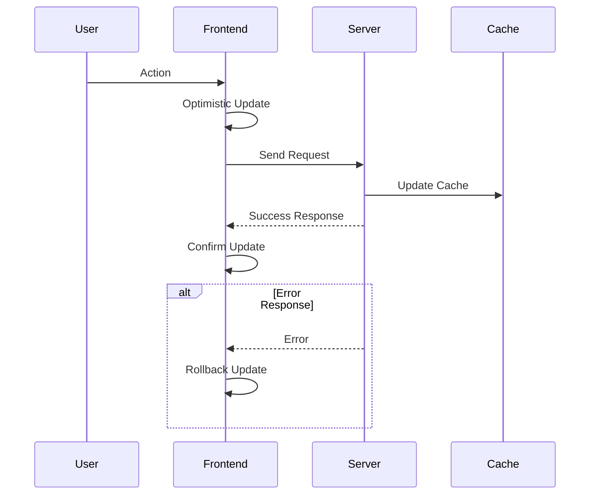

## Gestion des Conflits

### Résolution de Conflits

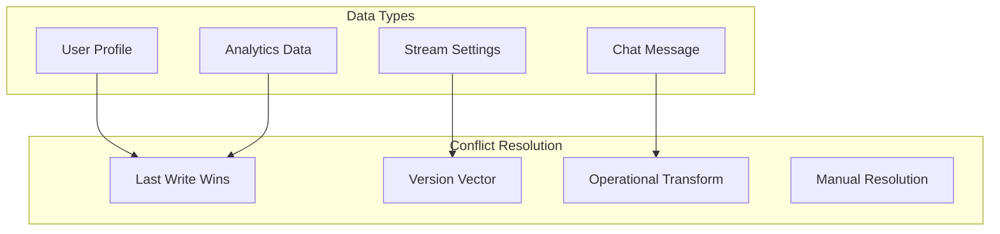

## Performance et Optimisation

### Métriques de Performance

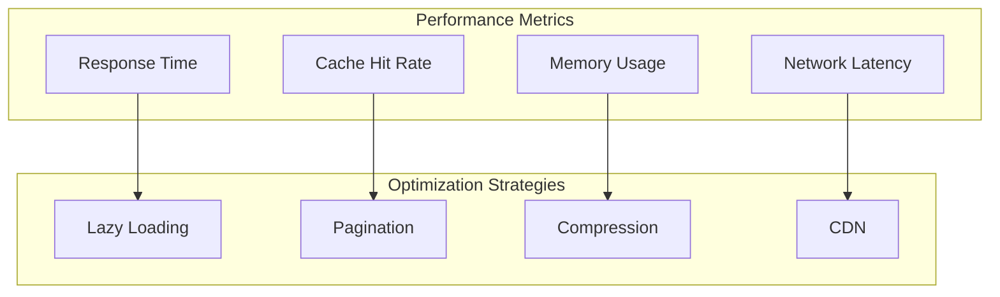

## Monitoring d'État

### Métriques d'État

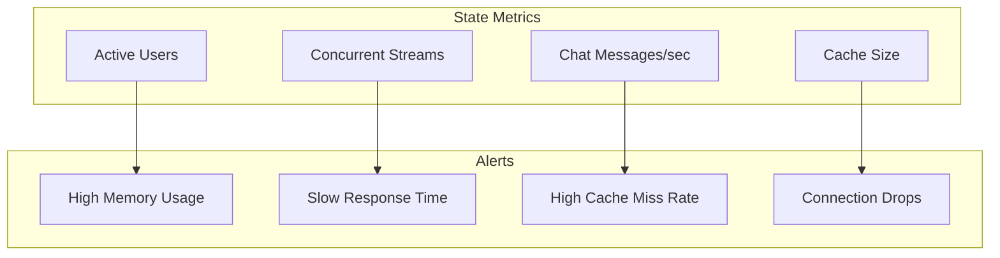

---

## 🔗 Liens croisés

- [Architecture C4](./c4-model.md)
- [Flux de Données](./data-flow.md)
- [API REST](../api/endpoints-reference.md)
- [gRPC API](../api/grpc/README.md)
- [WebSocket API](../api/websocket/README.md)

---

## Pour aller plus loin

- [Guide de Déploiement](../deployment/README.md)
- [Monitoring](../monitoring/README.md)
- [Sécurité](../security/README.md)
- [Tests](../testing/README.md) 