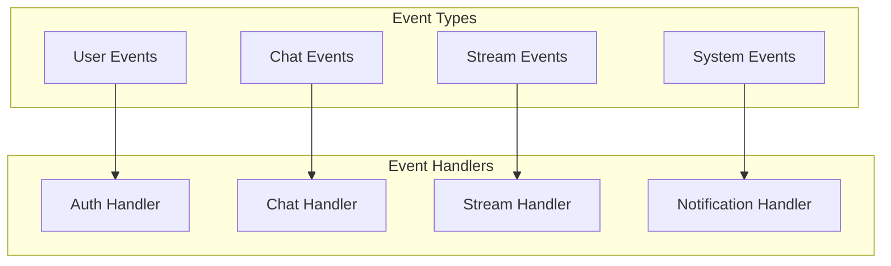

# Gestion d'État - Veza Platform

> **Architecture de gestion d'état pour l'application Veza**

## Vue d'ensemble

La plateforme Veza utilise une architecture de gestion d'état distribuée avec plusieurs couches de cache et de synchronisation.

## Architecture Globale de l'État

## Flux de Synchronisation d'État

## États par Module

### État d'Authentification

### État de Chat

### État de Streaming

## Gestion du Cache

### Hiérarchie du Cache

### Stratégies de Cache

## Synchronisation Temps Réel

### Événements NATS

### WebSocket State Management

## Optimistic Updates

### Stratégie Optimistic

## Gestion des Conflits

### Résolution de Conflits

## Performance et Optimisation

### Métriques de Performance

## Monitoring d'État

### Métriques d'État

---

## 🔗 Liens croisés

- [Architecture C4](./c4-model.md)
- [Flux de Données](./data-flow.md)
- [API REST](../api/endpoints-reference.md)
- [gRPC API](../api/grpc/README.md)
- [WebSocket API](../api/websocket/README.md)

---

## Pour aller plus loin

- [Guide de Déploiement](../deployment/README.md)
- [Monitoring](../monitoring/README.md)
- [Sécurité](../security/README.md)
- [Tests](../testing/README.md) 