# 🎨 Design d'API

Ce guide présente les principes de conception d'API pour Veza.

## Vue d'ensemble

Ce guide détaille les principes et bonnes pratiques pour la conception d'API RESTful dans la plateforme Veza, couvrant l'architecture, les patterns, la documentation et les outils de développement.

## Table des matières

- [Principes REST](#principes-rest)
- [Architecture API](#architecture-api)
- [Patterns de Conception](#patterns-de-conception)
- [Bonnes Pratiques](#bonnes-pratiques)
- [Pièges à Éviter](#pièges-à-éviter)
- [Documentation](#documentation)
- [Tests](#tests)
- [Ressources](#ressources)

## Principes REST

### 1. Principes Fondamentaux

```mermaid
graph TB
    subgraph "Principes REST"
        Stateless[🔄 Stateless]
        Cacheable[💾 Cacheable]
        Uniform[🎯 Uniform Interface]
        Layered[🏗️ Layered System]
        Client_Server[👥 Client-Server]
        Code_On_Demand[📦 Code on Demand]
    end
    
    subgraph "Méthodes HTTP"
        GET[📖 GET]
        POST[➕ POST]
        PUT[✏️ PUT]
        DELETE[🗑️ DELETE]
        PATCH[🔧 PATCH]
    end
    
    subgraph "Codes de Statut"
        Success[✅ 2xx Success]
        Redirection[🔄 3xx Redirection]
        Client_Error[❌ 4xx Client Error]
        Server_Error[💥 5xx Server Error]
    end
    
    Stateless --> GET
    Cacheable --> Success
    Uniform --> Client_Error
    Layered --> Server_Error
```



### 2. Méthodes HTTP Standard

```yaml
# api-design/http-methods.yaml
apiVersion: v1
kind: ConfigMap
metadata:
  name: veza-http-methods
  namespace: veza
data:
  # Méthodes HTTP et leurs usages
  http_methods:
    GET:
      description: "Récupérer des ressources"
      idempotent: true
      safe: true
      examples:
        - "GET /api/users"
        - "GET /api/users/123"
        - "GET /api/users?page=1&limit=10"
    
    POST:
      description: "Créer une nouvelle ressource"
      idempotent: false
      safe: false
      examples:
        - "POST /api/users"
        - "POST /api/users/123/orders"
    
    PUT:
      description: "Remplacer complètement une ressource"
      idempotent: true
      safe: false
      examples:
        - "PUT /api/users/123"
    
    PATCH:
      description: "Modifier partiellement une ressource"
      idempotent: false
      safe: false
      examples:
        - "PATCH /api/users/123"
    
    DELETE:
      description: "Supprimer une ressource"
      idempotent: true
      safe: false
      examples:
        - "DELETE /api/users/123"
```

## Architecture API

### 1. Structure des Endpoints

```mermaid
graph TB
    subgraph "API Structure"
        Root[🌐 /api/v1]
        Auth[🔐 /auth]
        Users[👥 /users]
        Chat[💬 /chat]
        Stream[🎵 /stream]
        Admin[⚙️ /admin]
    end
    
    subgraph "User Endpoints"
        Users_List[📋 /users]
        Users_Detail[👤 /users/:id]
        Users_Profile[📝 /users/:id/profile]
        Users_Settings[⚙️ /users/:id/settings]
    end
    
    subgraph "Chat Endpoints"
        Chat_Rooms[🏠 /chat/rooms]
        Chat_Messages[💭 /chat/rooms/:id/messages]
        Chat_Participants[👥 /chat/rooms/:id/participants]
    end
    
    subgraph "Stream Endpoints"
        Stream_Sessions[🎵 /stream/sessions]
        Stream_Playlists[📜 /stream/playlists]
        Stream_Uploads[📤 /stream/uploads]
    end
    
    Root --> Auth
    Root --> Users
    Root --> Chat
    Root --> Stream
    Root --> Admin
    
    Users --> Users_List
    Users --> Users_Detail
    Users --> Users_Profile
    Users --> Users_Settings
    
    Chat --> Chat_Rooms
    Chat --> Chat_Messages
    Chat --> Chat_Participants
    
    Stream --> Stream_Sessions
    Stream --> Stream_Playlists
    Stream --> Stream_Uploads
```



### 2. Versioning des API

```yaml
# api-design/versioning.yaml
apiVersion: v1
kind: ConfigMap
metadata:
  name: veza-api-versioning
  namespace: veza
data:
  # Stratégies de versioning
  versioning_strategies:
    url_versioning:
      description: "Version dans l'URL"
      examples:
        - "/api/v1/users"
        - "/api/v2/users"
      pros:
        - "Simple et explicite"
        - "Facile à comprendre"
        - "Cache-friendly"
      cons:
        - "URLs plus longues"
        - "Breaking changes visibles"
    
    header_versioning:
      description: "Version dans les headers"
      examples:
        - "Accept: application/vnd.veza.v1+json"
        - "X-API-Version: v1"
      pros:
        - "URLs propres"
        - "Flexible"
      cons:
        - "Moins visible"
        - "Plus complexe"
    
    content_type_versioning:
      description: "Version dans le Content-Type"
      examples:
        - "Content-Type: application/vnd.veza.v1+json"
      pros:
        - "Standard REST"
        - "Content negotiation"
      cons:
        - "Complexe à implémenter"
        - "Moins supporté"
  
  # Politique de versioning
  versioning_policy:
    - "Version majeure pour breaking changes"
    - "Version mineure pour nouvelles fonctionnalités"
    - "Version patch pour corrections"
    - "Support de 2 versions majeures"
    - "Dépréciation avec 6 mois de notice"
```

## Patterns de Conception

### 1. Pattern Repository

```typescript
// api-design/patterns/repository-pattern.ts
interface UserRepository {
    findAll(): Promise<User[]>;
    findById(id: string): Promise<User | null>;
    create(user: CreateUserDto): Promise<User>;
    update(id: string, user: UpdateUserDto): Promise<User | null>;
    delete(id: string): Promise<boolean>;
}

class UserRepositoryImpl implements UserRepository {
    constructor(private db: Database) {}

    async findAll(): Promise<User[]> {
        return await this.db.query('SELECT * FROM users');
    }

    async findById(id: string): Promise<User | null> {
        const result = await this.db.query(
            'SELECT * FROM users WHERE id = $1',
            [id]
        );
        return result.length > 0 ? result[0] : null;
    }

    async create(user: CreateUserDto): Promise<User> {
        const result = await this.db.query(
            'INSERT INTO users (name, email) VALUES ($1, $2) RETURNING *',
            [user.name, user.email]
        );
        return result[0];
    }

    async update(id: string, user: UpdateUserDto): Promise<User | null> {
        const result = await this.db.query(
            'UPDATE users SET name = $1, email = $2 WHERE id = $3 RETURNING *',
            [user.name, user.email, id]
        );
        return result.length > 0 ? result[0] : null;
    }

    async delete(id: string): Promise<boolean> {
        const result = await this.db.query(
            'DELETE FROM users WHERE id = $1',
            [id]
        );
        return result.rowCount > 0;
    }
}
```

### 2. Pattern Service Layer

```typescript
// api-design/patterns/service-pattern.ts
interface UserService {
    getAllUsers(): Promise<User[]>;
    getUserById(id: string): Promise<User>;
    createUser(userData: CreateUserDto): Promise<User>;
    updateUser(id: string, userData: UpdateUserDto): Promise<User>;
    deleteUser(id: string): Promise<void>;
}

class UserServiceImpl implements UserService {
    constructor(
        private userRepository: UserRepository,
        private emailService: EmailService,
        private logger: Logger
    ) {}

    async getAllUsers(): Promise<User[]> {
        try {
            this.logger.info('Fetching all users');
            return await this.userRepository.findAll();
        } catch (error) {
            this.logger.error('Error fetching users', error);
            throw new ApiError('Failed to fetch users', 500);
        }
    }

    async getUserById(id: string): Promise<User> {
        try {
            this.logger.info(`Fetching user with id: ${id}`);
            const user = await this.userRepository.findById(id);
            
            if (!user) {
                throw new ApiError('User not found', 404);
            }
            
            return user;
        } catch (error) {
            this.logger.error(`Error fetching user ${id}`, error);
            throw error;
        }
    }

    async createUser(userData: CreateUserDto): Promise<User> {
        try {
            this.logger.info('Creating new user', userData);
            
            // Validation
            await this.validateUserData(userData);
            
            // Check if user already exists
            const existingUser = await this.userRepository.findByEmail(userData.email);
            if (existingUser) {
                throw new ApiError('User already exists', 409);
            }
            
            // Create user
            const user = await this.userRepository.create(userData);
            
            // Send welcome email
            await this.emailService.sendWelcomeEmail(user.email);
            
            this.logger.info(`User created successfully: ${user.id}`);
            return user;
        } catch (error) {
            this.logger.error('Error creating user', error);
            throw error;
        }
    }

    async updateUser(id: string, userData: UpdateUserDto): Promise<User> {
        try {
            this.logger.info(`Updating user ${id}`, userData);
            
            // Check if user exists
            const existingUser = await this.userRepository.findById(id);
            if (!existingUser) {
                throw new ApiError('User not found', 404);
            }
            
            // Update user
            const updatedUser = await this.userRepository.update(id, userData);
            if (!updatedUser) {
                throw new ApiError('Failed to update user', 500);
            }
            
            this.logger.info(`User updated successfully: ${id}`);
            return updatedUser;
        } catch (error) {
            this.logger.error(`Error updating user ${id}`, error);
            throw error;
        }
    }

    async deleteUser(id: string): Promise<void> {
        try {
            this.logger.info(`Deleting user ${id}`);
            
            // Check if user exists
            const existingUser = await this.userRepository.findById(id);
            if (!existingUser) {
                throw new ApiError('User not found', 404);
            }
            
            // Delete user
            const deleted = await this.userRepository.delete(id);
            if (!deleted) {
                throw new ApiError('Failed to delete user', 500);
            }
            
            this.logger.info(`User deleted successfully: ${id}`);
        } catch (error) {
            this.logger.error(`Error deleting user ${id}`, error);
            throw error;
        }
    }

    private async validateUserData(userData: CreateUserDto): Promise<void> {
        // Validation logic
        if (!userData.name || userData.name.trim().length === 0) {
            throw new ApiError('Name is required', 400);
        }
        
        if (!userData.email || !this.isValidEmail(userData.email)) {
            throw new ApiError('Valid email is required', 400);
        }
    }

    private isValidEmail(email: string): boolean {
        const emailRegex = /^[^\s@]+@[^\s@]+\.[^\s@]+$/;
        return emailRegex.test(email);
    }
}
```

### 3. Pattern Controller

```typescript
// api-design/patterns/controller-pattern.ts
@Controller('/users')
export class UserController {
    constructor(private userService: UserService) {}

    @Get()
    async getAllUsers(
        @Query('page') page: number = 1,
        @Query('limit') limit: number = 10,
        @Query('search') search?: string
    ): Promise<ApiResponse<User[]>> {
        try {
            const users = await this.userService.getAllUsers({
                page,
                limit,
                search
            });
            
            return {
                success: true,
                data: users,
                pagination: {
                    page,
                    limit,
                    total: users.length
                }
            };
        } catch (error) {
            throw new ApiError('Failed to fetch users', 500);
        }
    }

    @Get('/:id')
    async getUserById(@Param('id') id: string): Promise<ApiResponse<User>> {
        try {
            const user = await this.userService.getUserById(id);
            
            return {
                success: true,
                data: user
            };
        } catch (error) {
            if (error instanceof ApiError) {
                throw error;
            }
            throw new ApiError('Failed to fetch user', 500);
        }
    }

    @Post()
    async createUser(@Body() userData: CreateUserDto): Promise<ApiResponse<User>> {
        try {
            const user = await this.userService.createUser(userData);
            
            return {
                success: true,
                data: user,
                message: 'User created successfully'
            };
        } catch (error) {
            if (error instanceof ApiError) {
                throw error;
            }
            throw new ApiError('Failed to create user', 500);
        }
    }

    @Put('/:id')
    async updateUser(
        @Param('id') id: string,
        @Body() userData: UpdateUserDto
    ): Promise<ApiResponse<User>> {
        try {
            const user = await this.userService.updateUser(id, userData);
            
            return {
                success: true,
                data: user,
                message: 'User updated successfully'
            };
        } catch (error) {
            if (error instanceof ApiError) {
                throw error;
            }
            throw new ApiError('Failed to update user', 500);
        }
    }

    @Delete('/:id')
    async deleteUser(@Param('id') id: string): Promise<ApiResponse<void>> {
        try {
            await this.userService.deleteUser(id);
            
            return {
                success: true,
                message: 'User deleted successfully'
            };
        } catch (error) {
            if (error instanceof ApiError) {
                throw error;
            }
            throw new ApiError('Failed to delete user', 500);
        }
    }
}
```

## Bonnes Pratiques

### 1. Design des Endpoints

```yaml
# api-design/best-practices/endpoint-design.yaml
apiVersion: v1
kind: ConfigMap
metadata:
  name: veza-endpoint-design
  namespace: veza
data:
  # Conventions de nommage
  naming_conventions:
    resources:
      - "Utiliser des noms au pluriel"
      - "Utiliser des noms descriptifs"
      - "Éviter les abréviations"
      - "Utiliser kebab-case pour les URLs"
    
    examples:
      - "GET /api/users"
      - "GET /api/user-profiles"
      - "GET /api/chat-rooms"
      - "GET /api/stream-sessions"
  
  # Structure des URLs
  url_structure:
    - "Ressource principale: /api/resource"
    - "Ressource spécifique: /api/resource/:id"
    - "Sous-ressource: /api/resource/:id/sub-resource"
    - "Action: /api/resource/:id/action"
    - "Version: /api/v1/resource"
  
  # Paramètres de requête
  query_parameters:
    pagination:
      - "page: numéro de page"
      - "limit: nombre d'éléments par page"
      - "offset: décalage"
    
    filtering:
      - "search: recherche textuelle"
      - "filter: filtres spécifiques"
      - "sort: tri"
      - "order: ordre de tri"
    
    examples:
      - "GET /api/users?page=1&limit=10"
      - "GET /api/users?search=john&filter=active"
      - "GET /api/users?sort=name&order=asc"
```

### 2. Gestion des Erreurs

```typescript
// api-design/error-handling/error-types.ts
export class ApiError extends Error {
    constructor(
        message: string,
        public statusCode: number,
        public code?: string,
        public details?: any
    ) {
        super(message);
        this.name = 'ApiError';
    }
}

export class ValidationError extends ApiError {
    constructor(message: string, details?: any) {
        super(message, 400, 'VALIDATION_ERROR', details);
        this.name = 'ValidationError';
    }
}

export class NotFoundError extends ApiError {
    constructor(resource: string) {
        super(`${resource} not found`, 404, 'NOT_FOUND');
        this.name = 'NotFoundError';
    }
}

export class UnauthorizedError extends ApiError {
    constructor(message: string = 'Unauthorized') {
        super(message, 401, 'UNAUTHORIZED');
        this.name = 'UnauthorizedError';
    }
}

export class ForbiddenError extends ApiError {
    constructor(message: string = 'Forbidden') {
        super(message, 403, 'FORBIDDEN');
        this.name = 'ForbiddenError';
    }
}

export class ConflictError extends ApiError {
    constructor(message: string, details?: any) {
        super(message, 409, 'CONFLICT', details);
        this.name = 'ConflictError';
    }
}

export class InternalServerError extends ApiError {
    constructor(message: string = 'Internal server error') {
        super(message, 500, 'INTERNAL_SERVER_ERROR');
        this.name = 'InternalServerError';
    }
}
```

### 3. Validation des Données

```typescript
// api-design/validation/validation-schemas.ts
import Joi from 'joi';

export const userSchemas = {
    createUser: Joi.object({
        name: Joi.string()
            .min(2)
            .max(50)
            .required()
            .messages({
                'string.min': 'Name must be at least 2 characters long',
                'string.max': 'Name must not exceed 50 characters',
                'any.required': 'Name is required'
            }),
        email: Joi.string()
            .email()
            .required()
            .messages({
                'string.email': 'Please provide a valid email address',
                'any.required': 'Email is required'
            }),
        password: Joi.string()
            .min(8)
            .pattern(/^(?=.*[a-z])(?=.*[A-Z])(?=.*\d)/)
            .required()
            .messages({
                'string.min': 'Password must be at least 8 characters long',
                'string.pattern.base': 'Password must contain at least one lowercase letter, one uppercase letter, and one number',
                'any.required': 'Password is required'
            }),
        role: Joi.string()
            .valid('user', 'admin', 'moderator')
            .default('user')
            .messages({
                'any.only': 'Role must be one of: user, admin, moderator'
            })
    }),

    updateUser: Joi.object({
        name: Joi.string()
            .min(2)
            .max(50)
            .optional()
            .messages({
                'string.min': 'Name must be at least 2 characters long',
                'string.max': 'Name must not exceed 50 characters'
            }),
        email: Joi.string()
            .email()
            .optional()
            .messages({
                'string.email': 'Please provide a valid email address'
            }),
        role: Joi.string()
            .valid('user', 'admin', 'moderator')
            .optional()
            .messages({
                'any.only': 'Role must be one of: user, admin, moderator'
            })
    }),

    userId: Joi.object({
        id: Joi.string()
            .uuid()
            .required()
            .messages({
                'string.guid': 'User ID must be a valid UUID',
                'any.required': 'User ID is required'
            })
    })
};

export const chatSchemas = {
    createRoom: Joi.object({
        name: Joi.string()
            .min(1)
            .max(100)
            .required()
            .messages({
                'string.min': 'Room name must not be empty',
                'string.max': 'Room name must not exceed 100 characters',
                'any.required': 'Room name is required'
            }),
        description: Joi.string()
            .max(500)
            .optional()
            .messages({
                'string.max': 'Description must not exceed 500 characters'
            }),
        isPrivate: Joi.boolean()
            .default(false),
        maxParticipants: Joi.number()
            .integer()
            .min(2)
            .max(1000)
            .default(100)
            .messages({
                'number.min': 'Maximum participants must be at least 2',
                'number.max': 'Maximum participants must not exceed 1000'
            })
    }),

    sendMessage: Joi.object({
        content: Joi.string()
            .min(1)
            .max(1000)
            .required()
            .messages({
                'string.min': 'Message content must not be empty',
                'string.max': 'Message content must not exceed 1000 characters',
                'any.required': 'Message content is required'
            }),
        type: Joi.string()
            .valid('text', 'image', 'file', 'audio')
            .default('text')
            .messages({
                'any.only': 'Message type must be one of: text, image, file, audio'
            }),
        replyTo: Joi.string()
            .uuid()
            .optional()
            .messages({
                'string.guid': 'Reply to message ID must be a valid UUID'
            })
    })
};
```

## Pièges à Éviter

### 1. Over-Engineering

❌ **Mauvais** :
```typescript
// API trop complexe
@Get('/users/:id/profile/settings/preferences/notifications/email/frequency')
async getUserEmailNotificationFrequency(@Param('id') id: string) {
    // Logique complexe et spécifique
}
```

✅ **Bon** :
```typescript
// API simple et claire
@Get('/users/:id/preferences')
async getUserPreferences(@Param('id') id: string) {
    // Logique simple et réutilisable
}

@Get('/users/:id/notifications')
async getUserNotifications(@Param('id') id: string) {
    // Logique simple et réutilisable
}
```

### 2. Pas de Validation

❌ **Mauvais** :
```typescript
@Post('/users')
async createUser(@Body() userData: any) {
    // Pas de validation
    return await this.userService.createUser(userData);
}
```

✅ **Bon** :
```typescript
@Post('/users')
async createUser(@Body() userData: CreateUserDto) {
    // Validation avec DTO
    const validatedData = await this.validateUserData(userData);
    return await this.userService.createUser(validatedData);
}
```

### 3. Pas de Gestion d'Erreurs

❌ **Mauvais** :
```typescript
@Get('/users/:id')
async getUserById(@Param('id') id: string) {
    const user = await this.userService.getUserById(id);
    return user; // Pas de gestion d'erreur
}
```

✅ **Bon** :
```typitten
@Get('/users/:id')
async getUserById(@Param('id') id: string) {
    try {
        const user = await this.userService.getUserById(id);
        return { success: true, data: user };
    } catch (error) {
        if (error instanceof NotFoundError) {
            throw new ApiError('User not found', 404);
        }
        throw new ApiError('Internal server error', 500);
    }
}
```

## Documentation

### 1. Swagger/OpenAPI

```yaml
# api-design/documentation/swagger.yaml
openapi: 3.0.0
info:
  title: Veza Platform API
  description: API documentation for Veza platform
  version: 1.0.0
  contact:
    name: Veza Development Team
    email: dev@veza.com

servers:
  - url: https://api.veza.com/v1
    description: Production server
  - url: https://staging-api.veza.com/v1
    description: Staging server
  - url: http://localhost:3000/v1
    description: Development server

paths:
  /users:
    get:
      summary: Get all users
      description: Retrieve a list of all users with pagination
      tags:
        - Users
      parameters:
        - name: page
          in: query
          description: Page number
          required: false
          schema:
            type: integer
            default: 1
            minimum: 1
        - name: limit
          in: query
          description: Number of items per page
          required: false
          schema:
            type: integer
            default: 10
            minimum: 1
            maximum: 100
        - name: search
          in: query
          description: Search term
          required: false
          schema:
            type: string
      responses:
        '200':
          description: Successful response
          content:
            application/json:
              schema:
                $ref: '#/components/schemas/UserListResponse'
        '400':
          description: Bad request
          content:
            application/json:
              schema:
                $ref: '#/components/schemas/ErrorResponse'
        '500':
          description: Internal server error
          content:
            application/json:
              schema:
                $ref: '#/components/schemas/ErrorResponse'
    
    post:
      summary: Create a new user
      description: Create a new user account
      tags:
        - Users
      requestBody:
        required: true
        content:
          application/json:
            schema:
              $ref: '#/components/schemas/CreateUserRequest'
      responses:
        '201':
          description: User created successfully
          content:
            application/json:
              schema:
                $ref: '#/components/schemas/UserResponse'
        '400':
          description: Validation error
          content:
            application/json:
              schema:
                $ref: '#/components/schemas/ValidationErrorResponse'
        '409':
          description: User already exists
          content:
            application/json:
              schema:
                $ref: '#/components/schemas/ErrorResponse'

  /users/{id}:
    get:
      summary: Get user by ID
      description: Retrieve a specific user by their ID
      tags:
        - Users
      parameters:
        - name: id
          in: path
          description: User ID
          required: true
          schema:
            type: string
            format: uuid
      responses:
        '200':
          description: Successful response
          content:
            application/json:
              schema:
                $ref: '#/components/schemas/UserResponse'
        '404':
          description: User not found
          content:
            application/json:
              schema:
                $ref: '#/components/schemas/ErrorResponse'

components:
  schemas:
    User:
      type: object
      properties:
        id:
          type: string
          format: uuid
          description: User unique identifier
        name:
          type: string
          description: User full name
        email:
          type: string
          format: email
          description: User email address
        role:
          type: string
          enum: [user, admin, moderator]
          description: User role
        createdAt:
          type: string
          format: date-time
          description: User creation timestamp
        updatedAt:
          type: string
          format: date-time
          description: User last update timestamp
      required:
        - id
        - name
        - email
        - role
        - createdAt
        - updatedAt

    CreateUserRequest:
      type: object
      properties:
        name:
          type: string
          minLength: 2
          maxLength: 50
          description: User full name
        email:
          type: string
          format: email
          description: User email address
        password:
          type: string
          minLength: 8
          description: User password
        role:
          type: string
          enum: [user, admin, moderator]
          default: user
          description: User role
      required:
        - name
        - email
        - password

    UserResponse:
      type: object
      properties:
        success:
          type: boolean
          example: true
        data:
          $ref: '#/components/schemas/User'
        message:
          type: string
          example: "User retrieved successfully"

    UserListResponse:
      type: object
      properties:
        success:
          type: boolean
          example: true
        data:
          type: array
          items:
            $ref: '#/components/schemas/User'
        pagination:
          type: object
          properties:
            page:
              type: integer
              example: 1
            limit:
              type: integer
              example: 10
            total:
              type: integer
              example: 100
            totalPages:
              type: integer
              example: 10

    ErrorResponse:
      type: object
      properties:
        success:
          type: boolean
          example: false
        error:
          type: string
          description: Error message
        code:
          type: string
          description: Error code
        details:
          type: object
          description: Additional error details

    ValidationErrorResponse:
      allOf:
        - $ref: '#/components/schemas/ErrorResponse'
        - type: object
          properties:
            details:
              type: array
              items:
                type: object
                properties:
                  field:
                    type: string
                    description: Field name
                  message:
                    type: string
                    description: Validation message
```

## Tests

### 1. Tests d'API

```typescript
// api-design/testing/api-tests.ts
import request from 'supertest';
import { app } from '../app';
import { UserService } from '../services/user.service';
import { Database } from '../database/database';

describe('User API', () => {
    let userService: UserService;
    let database: Database;

    beforeAll(async () => {
        database = new Database();
        await database.connect();
        userService = new UserService(database);
    });

    afterAll(async () => {
        await database.disconnect();
    });

    beforeEach(async () => {
        await database.clear();
    });

    describe('GET /api/users', () => {
        it('should return empty array when no users exist', async () => {
            const response = await request(app)
                .get('/api/users')
                .expect(200);

            expect(response.body).toEqual({
                success: true,
                data: [],
                pagination: {
                    page: 1,
                    limit: 10,
                    total: 0,
                    totalPages: 0
                }
            });
        });

        it('should return users with pagination', async () => {
            // Create test users
            await userService.createUser({
                name: 'John Doe',
                email: 'john@example.com',
                password: 'password123'
            });

            await userService.createUser({
                name: 'Jane Doe',
                email: 'jane@example.com',
                password: 'password123'
            });

            const response = await request(app)
                .get('/api/users?page=1&limit=1')
                .expect(200);

            expect(response.body.success).toBe(true);
            expect(response.body.data).toHaveLength(1);
            expect(response.body.pagination.total).toBe(2);
        });

        it('should filter users by search term', async () => {
            await userService.createUser({
                name: 'John Doe',
                email: 'john@example.com',
                password: 'password123'
            });

            await userService.createUser({
                name: 'Jane Smith',
                email: 'jane@example.com',
                password: 'password123'
            });

            const response = await request(app)
                .get('/api/users?search=john')
                .expect(200);

            expect(response.body.data).toHaveLength(1);
            expect(response.body.data[0].name).toBe('John Doe');
        });
    });

    describe('POST /api/users', () => {
        it('should create a new user successfully', async () => {
            const userData = {
                name: 'John Doe',
                email: 'john@example.com',
                password: 'password123'
            };

            const response = await request(app)
                .post('/api/users')
                .send(userData)
                .expect(201);

            expect(response.body.success).toBe(true);
            expect(response.body.data.name).toBe(userData.name);
            expect(response.body.data.email).toBe(userData.email);
            expect(response.body.data.id).toBeDefined();
        });

        it('should return 400 for invalid data', async () => {
            const invalidData = {
                name: '',
                email: 'invalid-email',
                password: '123'
            };

            const response = await request(app)
                .post('/api/users')
                .send(invalidData)
                .expect(400);

            expect(response.body.success).toBe(false);
            expect(response.body.details).toBeDefined();
        });

        it('should return 409 for duplicate email', async () => {
            const userData = {
                name: 'John Doe',
                email: 'john@example.com',
                password: 'password123'
            };

            // Create first user
            await request(app)
                .post('/api/users')
                .send(userData)
                .expect(201);

            // Try to create second user with same email
            const response = await request(app)
                .post('/api/users')
                .send(userData)
                .expect(409);

            expect(response.body.success).toBe(false);
            expect(response.body.error).toContain('already exists');
        });
    });

    describe('GET /api/users/:id', () => {
        it('should return user by ID', async () => {
            const userData = {
                name: 'John Doe',
                email: 'john@example.com',
                password: 'password123'
            };

            const createResponse = await request(app)
                .post('/api/users')
                .send(userData)
                .expect(201);

            const userId = createResponse.body.data.id;

            const response = await request(app)
                .get(`/api/users/${userId}`)
                .expect(200);

            expect(response.body.success).toBe(true);
            expect(response.body.data.id).toBe(userId);
            expect(response.body.data.name).toBe(userData.name);
        });

        it('should return 404 for non-existent user', async () => {
            const response = await request(app)
                .get('/api/users/non-existent-id')
                .expect(404);

            expect(response.body.success).toBe(false);
            expect(response.body.error).toContain('not found');
        });
    });

    describe('PUT /api/users/:id', () => {
        it('should update user successfully', async () => {
            const userData = {
                name: 'John Doe',
                email: 'john@example.com',
                password: 'password123'
            };

            const createResponse = await request(app)
                .post('/api/users')
                .send(userData)
                .expect(201);

            const userId = createResponse.body.data.id;

            const updateData = {
                name: 'John Updated',
                email: 'john.updated@example.com'
            };

            const response = await request(app)
                .put(`/api/users/${userId}`)
                .send(updateData)
                .expect(200);

            expect(response.body.success).toBe(true);
            expect(response.body.data.name).toBe(updateData.name);
            expect(response.body.data.email).toBe(updateData.email);
        });

        it('should return 404 for non-existent user', async () => {
            const updateData = {
                name: 'John Updated',
                email: 'john.updated@example.com'
            };

            const response = await request(app)
                .put('/api/users/non-existent-id')
                .send(updateData)
                .expect(404);

            expect(response.body.success).toBe(false);
            expect(response.body.error).toContain('not found');
        });
    });

    describe('DELETE /api/users/:id', () => {
        it('should delete user successfully', async () => {
            const userData = {
                name: 'John Doe',
                email: 'john@example.com',
                password: 'password123'
            };

            const createResponse = await request(app)
                .post('/api/users')
                .send(userData)
                .expect(201);

            const userId = createResponse.body.data.id;

            const response = await request(app)
                .delete(`/api/users/${userId}`)
                .expect(200);

            expect(response.body.success).toBe(true);
            expect(response.body.message).toContain('deleted successfully');

            // Verify user is deleted
            const getResponse = await request(app)
                .get(`/api/users/${userId}`)
                .expect(404);
        });

        it('should return 404 for non-existent user', async () => {
            const response = await request(app)
                .delete('/api/users/non-existent-id')
                .expect(404);

            expect(response.body.success).toBe(false);
            expect(response.body.error).toContain('not found');
        });
    });
});
```

## Ressources

### Documentation Interne

- [Guide de Développement](./development-guide.md)
- [Guide de Tests](../testing/README.md)
- [Guide de Sécurité](../security/README.md)
- [Guide de Déploiement](../deployment/README.md)

### Outils Recommandés

- **Swagger/OpenAPI** : Documentation API
- **Joi** : Validation des données
- **Supertest** : Tests d'API
- **Postman** : Tests manuels
- **Insomnia** : Client API

### Commandes Utiles

```bash
# Génération de documentation
npm run docs:generate
npm run docs:serve

# Tests d'API
npm run test:api
npm run test:coverage

# Validation des schémas
npm run validate:schemas

# Linting
npm run lint:api
```

---

**Dernière mise à jour** : $(date)
**Version du guide** : 1.0.0
**Mainteneur** : Équipe API Development Veza 