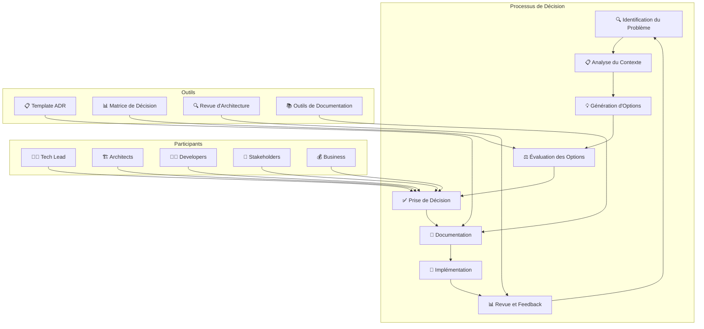
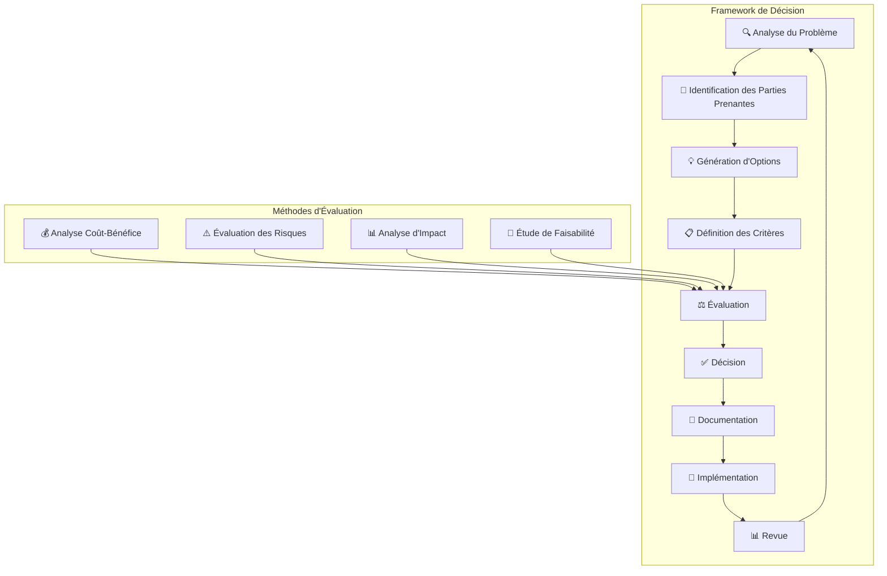

# Guide des Décisions d'Architecture - Veza Platform

## Vue d'ensemble

Ce guide détaille le processus de prise de décisions d'architecture pour la plateforme Veza, couvrant les méthodologies, les templates, les bonnes pratiques et la documentation des décisions.

## Table des matières

- [Processus de Décision](#processus-de-décision)
- [Templates de Décision](#templates-de-décision)
- [Méthodologies](#méthodologies)
- [Bonnes Pratiques](#bonnes-pratiques)
- [Pièges à Éviter](#pièges-à-éviter)
- [Documentation](#documentation)
- [Ressources](#ressources)

## Processus de Décision

### 1. Workflow de Décision d'Architecture



### 2. Critères d'Évaluation

```yaml
# architecture-decisions/evaluation-criteria.yaml
apiVersion: v1
kind: ConfigMap
metadata:
  name: veza-architecture-evaluation-criteria
  namespace: veza
data:
  # Critères techniques
  technical_criteria:
    performance:
      - "Latence"
      - "Throughput"
      - "Scalabilité"
      - "Efficacité"
    
    reliability:
      - "Disponibilité"
      - "Résilience"
      - "Récupération"
      - "Monitoring"
    
    security:
      - "Authentification"
      - "Autorisation"
      - "Chiffrement"
      - "Audit"
    
    maintainability:
      - "Complexité"
      - "Documentation"
      - "Testabilité"
      - "Évolutivité"
  
  # Critères business
  business_criteria:
    cost:
      - "Coût de développement"
      - "Coût d'exploitation"
      - "Coût de maintenance"
      - "ROI"
    
    time:
      - "Time to market"
      - "Délai de développement"
      - "Délai de déploiement"
      - "Délai de récupération"
    
    risk:
      - "Risque technique"
      - "Risque business"
      - "Risque de sécurité"
      - "Risque de conformité"
  
  # Critères équipe
  team_criteria:
    expertise:
      - "Compétences disponibles"
      - "Courbe d'apprentissage"
      - "Formation nécessaire"
      - "Support requis"
    
    collaboration:
      - "Communication"
      - "Coordination"
      - "Partage de connaissances"
      - "Culture d'équipe"
```

## Templates de Décision

### 1. Template ADR (Architecture Decision Record)

```markdown
# ADR-0001: Utilisation de Microservices pour la Plateforme Veza

## Statut
[Proposé | Accepté | Rejeté | Déprécié | Remplacé]

## Contexte
Décrire le problème ou la situation qui nécessite une décision d'architecture.

## Décision
Décrire la décision prise et ses justifications.

## Conséquences
### Positives
- Avantage 1
- Avantage 2
- Avantage 3

### Négatives
- Inconvénient 1
- Inconvénient 2
- Inconvénient 3

### Neutres
- Impact neutre 1
- Impact neutre 2

## Alternatives Considérées
### Alternative 1: Monolithique
- **Avantages**: Simplicité, déploiement unique
- **Inconvénients**: Scalabilité limitée, couplage fort
- **Pourquoi rejetée**: Ne répond pas aux besoins de scalabilité

### Alternative 2: SOA
- **Avantages**: Réutilisabilité, standards
- **Inconvénients**: Complexité, overhead
- **Pourquoi rejetée**: Trop complexe pour nos besoins

## Implémentation
Décrire les étapes d'implémentation et les considérations techniques.

## Monitoring et Métriques
Définir comment mesurer le succès de cette décision.

## Révision
Date de révision prévue et critères de réévaluation.
```

### 2. Template de Matrice de Décision

```yaml
# architecture-decisions/decision-matrix-template.yaml
apiVersion: v1
kind: ConfigMap
metadata:
  name: veza-decision-matrix-template
  namespace: veza
data:
  # Structure de la matrice de décision
  decision_matrix:
    options:
      - "Option A"
      - "Option B"
      - "Option C"
    
    criteria:
      technical:
        - "Performance"
        - "Scalabilité"
        - "Sécurité"
        - "Maintenabilité"
      
      business:
        - "Coût"
        - "Time to market"
        - "ROI"
        - "Risque"
      
      team:
        - "Expertise"
        - "Courbe d'apprentissage"
        - "Support"
        - "Collaboration"
    
    weights:
      technical: 0.4
      business: 0.4
      team: 0.2
    
    scoring:
      scale: "1-5"
      description: "1=Très mauvais, 5=Excellent"
```

### 3. Script de Génération d'ADR

```python
# architecture-decisions/scripts/adr_generator.py
#!/usr/bin/env python3

import json
import logging
from datetime import datetime
from typing import Dict, List, Optional

class ADRGenerator:
    def __init__(self):
        self.logger = self.setup_logger()
        self.adr_counter = self.get_next_adr_number()
    
    def setup_logger(self) -> logging.Logger:
        """Configure le logger"""
        logging.basicConfig(
            level=logging.INFO,
            format='%(asctime)s - %(levelname)s - %(message)s',
            handlers=[
                logging.FileHandler('adr_generator.log'),
                logging.StreamHandler()
            ]
        )
        return logging.getLogger(__name__)
    
    def get_next_adr_number(self) -> int:
        """Obtient le prochain numéro d'ADR"""
        try:
            with open('adr_counter.json', 'r') as f:
                data = json.load(f)
                return data.get('next_number', 1)
        except FileNotFoundError:
            return 1
    
    def increment_adr_counter(self):
        """Incrémente le compteur d'ADR"""
        with open('adr_counter.json', 'w') as f:
            json.dump({'next_number': self.adr_counter + 1}, f)
    
    def generate_adr(self, adr_data: Dict) -> str:
        """Génère un ADR basé sur les données fournies"""
        adr_number = f"ADR-{self.adr_counter:04d}"
        
        adr_content = f"""# {adr_number}: {adr_data['title']}

## Statut
{adr_data.get('status', 'Proposé')}

## Contexte
{adr_data.get('context', 'À compléter')}

## Décision
{adr_data.get('decision', 'À compléter')}

## Conséquences

### Positives
"""
        
        for positive in adr_data.get('positive_consequences', []):
            adr_content += f"- {positive}\n"
        
        adr_content += "\n### Négatives\n"
        
        for negative in adr_data.get('negative_consequences', []):
            adr_content += f"- {negative}\n"
        
        adr_content += "\n### Neutres\n"
        
        for neutral in adr_data.get('neutral_consequences', []):
            adr_content += f"- {neutral}\n"
        
        adr_content += "\n## Alternatives Considérées\n"
        
        for alternative in adr_data.get('alternatives', []):
            adr_content += f"""### {alternative['name']}
- **Avantages**: {alternative.get('advantages', 'À compléter')}
- **Inconvénients**: {alternative.get('disadvantages', 'À compléter')}
- **Pourquoi rejetée**: {alternative.get('rejection_reason', 'À compléter')}

"""
        
        adr_content += f"""## Implémentation
{adr_data.get('implementation', 'À compléter')}

## Monitoring et Métriques
{adr_data.get('monitoring', 'À compléter')}

## Révision
{adr_data.get('review', 'À compléter')}

---
**Date de création**: {datetime.now().strftime('%Y-%m-%d')}
**Auteur**: {adr_data.get('author', 'À compléter')}
**Révision**: {adr_data.get('revision', '1.0')}
"""
        
        return adr_content
    
    def create_decision_matrix(self, options: List[str], criteria: Dict) -> Dict:
        """Crée une matrice de décision"""
        matrix = {
            'options': options,
            'criteria': criteria,
            'scores': {},
            'weights': {
                'technical': 0.4,
                'business': 0.4,
                'team': 0.2
            }
        }
        
        # Initialiser les scores
        for option in options:
            matrix['scores'][option] = {}
            for category, category_criteria in criteria.items():
                matrix['scores'][option][category] = {}
                for criterion in category_criteria:
                    matrix['scores'][option][category][criterion] = 0
        
        return matrix
    
    def calculate_weighted_score(self, matrix: Dict, option: str) -> float:
        """Calcule le score pondéré pour une option"""
        total_score = 0
        
        for category, weight in matrix['weights'].items():
            category_score = 0
            category_criteria = matrix['criteria'][category]
            
            for criterion in category_criteria:
                score = matrix['scores'][option][category][criterion]
                category_score += score
            
            # Moyenne des scores de la catégorie
            if category_criteria:
                category_average = category_score / len(category_criteria)
                total_score += category_average * weight
        
        return total_score
    
    def generate_matrix_report(self, matrix: Dict) -> str:
        """Génère un rapport de la matrice de décision"""
        report = "# Matrice de Décision d'Architecture\n\n"
        
        report += "## Options Évaluées\n"
        for option in matrix['options']:
            report += f"- {option}\n"
        
        report += "\n## Critères d'Évaluation\n"
        
        for category, criteria in matrix['criteria'].items():
            report += f"\n### {category.title()}\n"
            for criterion in criteria:
                report += f"- {criterion}\n"
        
        report += "\n## Scores Pondérés\n"
        
        scores = {}
        for option in matrix['options']:
            score = self.calculate_weighted_score(matrix, option)
            scores[option] = score
            report += f"- {option}: {score:.2f}\n"
        
        # Trouver la meilleure option
        best_option = max(scores, key=scores.get)
        report += f"\n## Recommandation\n"
        report += f"**Option recommandée**: {best_option} (Score: {scores[best_option]:.2f})\n"
        
        return report
    
    def save_adr(self, adr_content: str, adr_number: str):
        """Sauvegarde l'ADR"""
        filename = f"adr/{adr_number.lower().replace('-', '_')}.md"
        
        with open(filename, 'w') as f:
            f.write(adr_content)
        
        self.logger.info(f"ADR sauvegardé: {filename}")
    
    def save_matrix(self, matrix: Dict, filename: str):
        """Sauvegarde la matrice de décision"""
        with open(filename, 'w') as f:
            json.dump(matrix, f, indent=2)
        
        self.logger.info(f"Matrice de décision sauvegardée: {filename}")

if __name__ == "__main__":
    import sys
    
    if len(sys.argv) < 2:
        print("Usage: python3 adr_generator.py <command> [options]")
        print("Commands: generate-adr, create-matrix")
        sys.exit(1)
    
    command = sys.argv[1]
    generator = ADRGenerator()
    
    if command == "generate-adr":
        # Exemple de données d'ADR
        adr_data = {
            'title': 'Utilisation de Microservices',
            'status': 'Proposé',
            'context': 'La plateforme Veza nécessite une architecture scalable pour supporter la croissance.',
            'decision': 'Adopter une architecture microservices pour améliorer la scalabilité et la maintenabilité.',
            'positive_consequences': [
                'Scalabilité horizontale',
                'Déploiement indépendant',
                'Technologies hétérogènes'
            ],
            'negative_consequences': [
                'Complexité accrue',
                'Latence réseau',
                'Gestion de la cohérence'
            ],
            'neutral_consequences': [
                'Changement de paradigme',
                'Nouveaux patterns'
            ],
            'alternatives': [
                {
                    'name': 'Architecture Monolithique',
                    'advantages': 'Simplicité, déploiement unique',
                    'disadvantages': 'Scalabilité limitée, couplage fort',
                    'rejection_reason': 'Ne répond pas aux besoins de scalabilité'
                }
            ],
            'implementation': 'Migration progressive vers microservices',
            'monitoring': 'Métriques de performance et disponibilité',
            'review': 'Révision dans 6 mois',
            'author': 'Équipe Architecture',
            'revision': '1.0'
        }
        
        adr_content = generator.generate_adr(adr_data)
        adr_number = f"ADR-{generator.adr_counter:04d}"
        generator.save_adr(adr_content, adr_number)
        generator.increment_adr_counter()
        
        print(f"ADR généré: {adr_number}")
    
    elif command == "create-matrix":
        options = ["Microservices", "Monolithique", "SOA"]
        criteria = {
            'technical': ["Performance", "Scalabilité", "Sécurité", "Maintenabilité"],
            'business': ["Coût", "Time to market", "ROI", "Risque"],
            'team': ["Expertise", "Courbe d'apprentissage", "Support", "Collaboration"]
        }
        
        matrix = generator.create_decision_matrix(options, criteria)
        
        # Exemple de scores
        matrix['scores']['Microservices']['technical']['Performance'] = 4
        matrix['scores']['Microservices']['technical']['Scalabilité'] = 5
        matrix['scores']['Microservices']['business']['Coût'] = 3
        matrix['scores']['Microservices']['business']['ROI'] = 4
        
        matrix['scores']['Monolithique']['technical']['Performance'] = 3
        matrix['scores']['Monolithique']['technical']['Scalabilité'] = 2
        matrix['scores']['Monolithique']['business']['Coût'] = 4
        matrix['scores']['Monolithique']['business']['ROI'] = 3
        
        matrix['scores']['SOA']['technical']['Performance'] = 3
        matrix['scores']['SOA']['technical']['Scalabilité'] = 4
        matrix['scores']['SOA']['business']['Coût'] = 2
        matrix['scores']['SOA']['business']['ROI'] = 3
        
        report = generator.generate_matrix_report(matrix)
        
        with open('decision_matrix_report.md', 'w') as f:
            f.write(report)
        
        generator.save_matrix(matrix, 'decision_matrix.json')
        
        print("Matrice de décision créée: decision_matrix.json")
        print("Rapport généré: decision_matrix_report.md")
    
    else:
        print(f"Commande inconnue: {command}")
        sys.exit(1)
```

## Méthodologies

### 1. Architecture Decision Framework



### 2. Processus de Revue d'Architecture

```yaml
# architecture-decisions/review-process.yaml
apiVersion: v1
kind: ConfigMap
metadata:
  name: veza-architecture-review-process
  namespace: veza
data:
  # Étapes de revue
  review_steps:
    - "Soumission de la proposition"
    - "Revue préliminaire"
    - "Analyse approfondie"
    - "Discussion et feedback"
    - "Décision finale"
    - "Documentation"
  
  # Participants
  participants:
    mandatory:
      - "Architecte principal"
      - "Tech lead"
      - "Responsable produit"
    optional:
      - "Développeurs seniors"
      - "DevOps engineer"
      - "Security engineer"
      - "Business analyst"
  
  # Critères de revue
  review_criteria:
    technical:
      - "Faisabilité technique"
      - "Performance"
      - "Scalabilité"
      - "Sécurité"
      - "Maintenabilité"
    
    business:
      - "Alignement stratégique"
      - "ROI"
      - "Time to market"
      - "Risque business"
    
    operational:
      - "Complexité opérationnelle"
      - "Monitoring"
      - "Support"
      - "Formation"
```

## Bonnes Pratiques

### 1. Principes de Décision d'Architecture

```yaml
# architecture-decisions/best-practices/decision-principles.yaml
apiVersion: v1
kind: ConfigMap
metadata:
  name: veza-architecture-decision-principles
  namespace: veza
data:
  # Principes fondamentaux
  fundamental_principles:
    - "Simplicité avant complexité"
    - "Évolutivité et flexibilité"
    - "Sécurité par défaut"
    - "Performance et scalabilité"
    - "Maintenabilité et testabilité"
    - "Standards et conventions"
  
  # Principes de décision
  decision_principles:
    - "Décisions basées sur les données"
    - "Considération du long terme"
    - "Équilibre coût-bénéfice"
    - "Alignement business-technique"
    - "Documentation complète"
    - "Révision régulière"
  
  # Principes de communication
  communication_principles:
    - "Transparence dans les décisions"
    - "Communication claire et concise"
    - "Feedback et itération"
    - "Partage de connaissances"
    - "Formation et sensibilisation"
```

### 2. Checklist de Décision

```yaml
# architecture-decisions/checklist/decision-checklist.yaml
apiVersion: v1
kind: ConfigMap
metadata:
  name: veza-decision-checklist
  namespace: veza
data:
  # Checklist pré-décision
  pre_decision_checklist:
    problem_analysis:
      - "Problème clairement défini"
      - "Contexte documenté"
      - "Contraintes identifiées"
      - "Objectifs définis"
    
    stakeholder_analysis:
      - "Parties prenantes identifiées"
      - "Rôles et responsabilités définis"
      - "Communication établie"
      - "Feedback collecté"
    
    option_generation:
      - "Alternatives explorées"
      - "Recherche effectuée"
      - "Expertise consultée"
      - "Innovation considérée"
  
  # Checklist d'évaluation
  evaluation_checklist:
    technical_evaluation:
      - "Faisabilité technique"
      - "Performance évaluée"
      - "Sécurité analysée"
      - "Scalabilité testée"
    
    business_evaluation:
      - "ROI calculé"
      - "Risques évalués"
      - "Impact business analysé"
      - "Alignement stratégique vérifié"
    
    team_evaluation:
      - "Expertise disponible"
      - "Formation nécessaire"
      - "Support requis"
      - "Collaboration facilitée"
  
  # Checklist post-décision
  post_decision_checklist:
    documentation:
      - "ADR créé"
      - "Décision documentée"
      - "Rationale expliqué"
      - "Alternatives documentées"
    
    communication:
      - "Équipe informée"
      - "Stakeholders notifiés"
      - "Formation planifiée"
      - "Feedback collecté"
    
    implementation:
      - "Plan d'implémentation"
      - "Timeline définie"
      - "Ressources allouées"
      - "Monitoring configuré"
```

## Pièges à Éviter

### 1. Décisions Précipitées

❌ **Mauvais** :
```yaml
# Décision précipitée
decision_process:
  analysis: "minimal"
  stakeholder_involvement: "none"
  documentation: "incomplete"
  review: "skipped"
```

✅ **Bon** :
```yaml
# Décision réfléchie
decision_process:
  analysis: "thorough"
  stakeholder_involvement: "comprehensive"
  documentation: "complete"
  review: "mandatory"
```

### 2. Pas de Documentation

❌ **Mauvais** :
```yaml
# Pas de documentation
documentation:
  adr: "none"
  rationale: "none"
  alternatives: "none"
  implementation: "none"
```

✅ **Bon** :
```yaml
# Documentation complète
documentation:
  adr: "mandatory"
  rationale: "detailed"
  alternatives: "documented"
  implementation: "planned"
```

### 3. Pas de Révision

❌ **Mauvais** :
```yaml
# Pas de révision
review_process:
  frequency: "never"
  criteria: "none"
  feedback: "none"
  improvement: "none"
```

✅ **Bon** :
```yaml
# Révision régulière
review_process:
  frequency: "quarterly"
  criteria: "defined"
  feedback: "collected"
  improvement: "implemented"
```

## Documentation

### 1. Structure de Documentation

```yaml
# architecture-decisions/documentation/structure.yaml
apiVersion: v1
kind: ConfigMap
metadata:
  name: veza-architecture-documentation-structure
  namespace: veza
data:
  # Structure des ADRs
  adr_structure:
    - "adr/"
      - "0001-microservices.md"
      - "0002-database-choice.md"
      - "0003-api-design.md"
      - "0004-security-architecture.md"
      - "0005-monitoring-strategy.md"
  
  # Structure de la documentation
  documentation_structure:
    - "architecture/"
      - "overview.md"
      - "principles.md"
      - "patterns.md"
      - "decisions.md"
    
    - "decisions/"
      - "process.md"
      - "templates.md"
      - "criteria.md"
      - "review.md"
    
    - "reviews/"
      - "meeting-notes.md"
      - "feedback.md"
      - "action-items.md"
      - "follow-up.md"
```

### 2. Template de Documentation

```markdown
# Template de Documentation d'Architecture

## Vue d'ensemble
Description générale de l'architecture et de ses composants.

## Principes
Les principes fondamentaux qui guident les décisions d'architecture.

## Composants
Description détaillée des composants de l'architecture.

## Décisions
Résumé des décisions d'architecture importantes.

## Patterns
Les patterns architecturaux utilisés.

## Considérations
Les considérations techniques, business et opérationnelles.

## Évolution
Plan d'évolution de l'architecture.

## Références
Liens vers la documentation détaillée et les ADRs.
```

## Ressources

### Documentation Interne

- [Guide d'Architecture](../architecture/README.md)
- [Guide de Leadership Technique](./technical-leadership.md)
- [Guide de Code Review](./code-review-leadership.md)
- [Guide de Développement](./development-guide.md)

### Outils Recommandés

- **ADR Tools** : Outils de génération d'ADR
- **Decision Matrix** : Matrices de décision
- **Architecture Review** : Processus de revue
- **Documentation Tools** : Outils de documentation
- **Collaboration Tools** : Outils de collaboration

### Commandes Utiles

```bash
# Génération d'ADR
python3 adr_generator.py generate-adr
python3 adr_generator.py create-matrix

# Documentation
git add adr/
git commit -m "Add new architecture decision"
git push origin main

# Revue d'architecture
python3 architecture_review.py schedule
python3 architecture_review.py generate-report
```

---

**Dernière mise à jour** : $(date)
**Version du guide** : 1.0.0
**Mainteneur** : Équipe Architecture Veza 