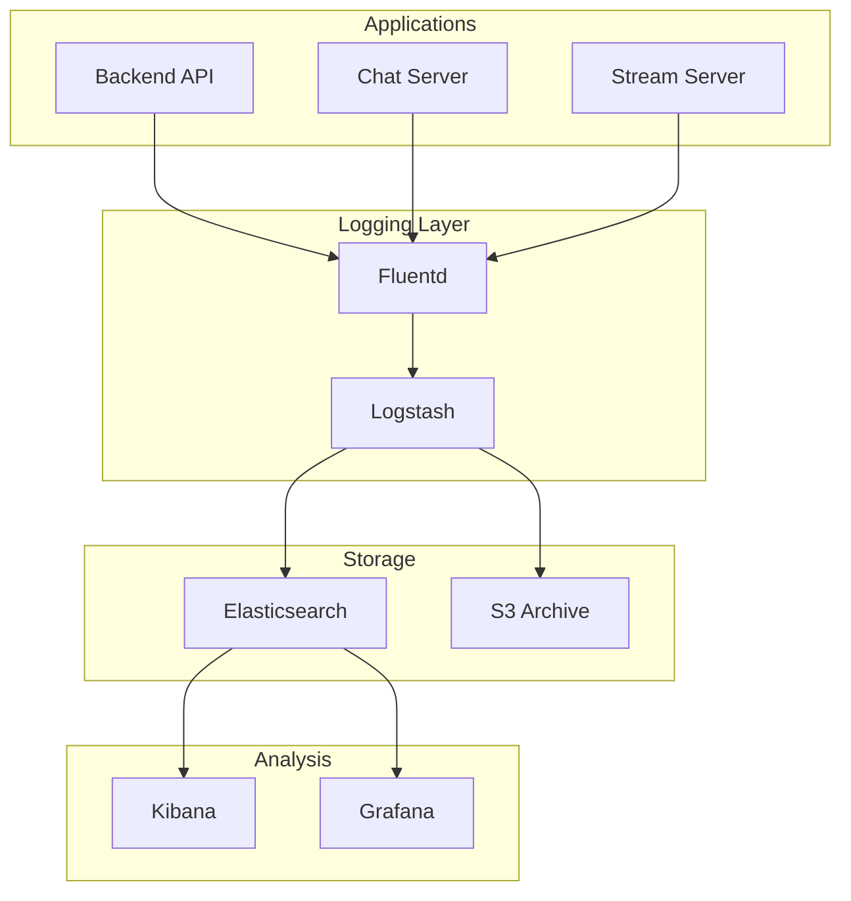

# 🕵️ Audit Logging

Ce guide explique la gestion des logs d'audit sur Veza.

## Vue d'ensemble

Ce guide détaille la configuration complète du système de logging et d'audit de la plateforme Veza, incluant la collecte, le stockage, l'analyse et la conformité.

## 📊 **Architecture de Logging**

### Flux de Logging



## 🔧 **Configuration du Logging**

### Configuration Structurée

```go
// internal/infrastructure/logger/logger.go
package logger

import (
    "os"
    "time"
    "github.com/sirupsen/logrus"
    "gopkg.in/natefinch/lumberjack.v2"
)

type LogConfig struct {
    Level      string `env:"LOG_LEVEL" default:"info"`
    Format     string `env:"LOG_FORMAT" default:"json"`
    Output     string `env:"LOG_OUTPUT" default:"stdout"`
    MaxSize    int    `env:"LOG_MAX_SIZE" default:"100"`
    MaxBackups int    `env:"LOG_MAX_BACKUPS" default:"3"`
    MaxAge     int    `env:"LOG_MAX_AGE" default:"28"`
    Compress   bool   `env:"LOG_COMPRESS" default:"true"`
}

func NewLogger(config LogConfig) *logrus.Logger {
    logger := logrus.New()
    
    // Set log level
    level, err := logrus.ParseLevel(config.Level)
    if err != nil {
        level = logrus.InfoLevel
    }
    logger.SetLevel(level)
    
    // Set log format
    switch config.Format {
    case "json":
        logger.SetFormatter(&logrus.JSONFormatter{
            TimestampFormat: time.RFC3339,
            FieldMap: logrus.FieldMap{
                logrus.FieldKeyTime:  "timestamp",
                logrus.FieldKeyLevel: "level",
                logrus.FieldKeyMsg:   "message",
            },
        })
    case "text":
        logger.SetFormatter(&logrus.TextFormatter{
            TimestampFormat: time.RFC3339,
            FullTimestamp:   true,
        })
    }
    
    // Set output
    switch config.Output {
    case "file":
        logger.SetOutput(&lumberjack.Logger{
            Filename:   "/var/log/veza/application.log",
            MaxSize:    config.MaxSize,
            MaxBackups: config.MaxBackups,
            MaxAge:     config.MaxAge,
            Compress:   config.Compress,
        })
    default:
        logger.SetOutput(os.Stdout)
    }
    
    return logger
}
```

### Middleware de Logging

```go
// internal/middleware/logging.go
package middleware

import (
    "time"
    "github.com/gin-gonic/gin"
    "github.com/sirupsen/logrus"
)

func LoggingMiddleware(logger *logrus.Logger) gin.HandlerFunc {
    return gin.LoggerWithFormatter(func(param gin.LogFormatterParams) string {
        logger.WithFields(logrus.Fields{
            "client_ip":    param.ClientIP,
            "timestamp":    param.TimeStamp.Format(time.RFC3339),
            "method":       param.Method,
            "path":         param.Path,
            "protocol":     param.Request.Proto,
            "status_code":  param.StatusCode,
            "latency":      param.Latency,
            "user_agent":   param.Request.UserAgent(),
            "error":        param.ErrorMessage,
        }).Info("HTTP Request")
        
        return ""
    })
}

func AuditMiddleware(logger *logrus.Logger) gin.HandlerFunc {
    return func(c *gin.Context) {
        start := time.Now()
        
        // Log request
        logger.WithFields(logrus.Fields{
            "event":      "request_start",
            "method":     c.Request.Method,
            "path":       c.Request.URL.Path,
            "user_id":    c.GetString("user_id"),
            "ip":         c.ClientIP(),
            "user_agent": c.Request.UserAgent(),
        }).Info("Request started")
        
        c.Next()
        
        // Log response
        duration := time.Since(start)
        logger.WithFields(logrus.Fields{
            "event":     "request_end",
            "method":    c.Request.Method,
            "path":      c.Request.URL.Path,
            "status":    c.Writer.Status(),
            "duration":  duration,
            "user_id":   c.GetString("user_id"),
        }).Info("Request completed")
    }
}
```

## 🔍 **Audit Trail**

### Service d'Audit

```go
// internal/infrastructure/audit/audit.go
package audit

import (
    "time"
    "github.com/sirupsen/logrus"
)

type AuditEvent struct {
    ID          string                 `json:"id"`
    Timestamp   time.Time              `json:"timestamp"`
    UserID      string                 `json:"user_id"`
    Username    string                 `json:"username"`
    Action      string                 `json:"action"`
    Resource    string                 `json:"resource"`
    ResourceID  string                 `json:"resource_id"`
    IP          string                 `json:"ip"`
    UserAgent   string                 `json:"user_agent"`
    Details     map[string]interface{} `json:"details"`
    Success     bool                   `json:"success"`
    Error       string                 `json:"error,omitempty"`
}

type AuditService struct {
    logger *logrus.Logger
    db     AuditRepository
}

func NewAuditService(logger *logrus.Logger, db AuditRepository) *AuditService {
    return &AuditService{
        logger: logger,
        db:     db,
    }
}

func (s *AuditService) LogEvent(event AuditEvent) error {
    // Log to structured logger
    s.logger.WithFields(logrus.Fields{
        "audit_id":     event.ID,
        "user_id":      event.UserID,
        "username":     event.Username,
        "action":       event.Action,
        "resource":     event.Resource,
        "resource_id":  event.ResourceID,
        "ip":           event.IP,
        "user_agent":   event.UserAgent,
        "success":      event.Success,
        "error":        event.Error,
        "details":      event.Details,
    }).Info("Audit event")
    
    // Store in database
    return s.db.StoreEvent(event)
}
```

### Middleware d'Audit

```go
// internal/middleware/audit.go
package middleware

import (
    "github.com/gin-gonic/gin"
    "github.com/google/uuid"
)

func AuditMiddleware(auditService *AuditService) gin.HandlerFunc {
    return func(c *gin.Context) {
        // Skip audit for health checks and metrics
        if c.Request.URL.Path == "/health" || c.Request.URL.Path == "/metrics" {
            c.Next()
            return
        }
        
        userID := c.GetString("user_id")
        username := c.GetString("username")
        
        event := AuditEvent{
            ID:        uuid.New().String(),
            Timestamp: time.Now(),
            UserID:    userID,
            Username:  username,
            Action:    c.Request.Method,
            Resource:  c.Request.URL.Path,
            IP:        c.ClientIP(),
            UserAgent: c.Request.UserAgent(),
            Success:   true,
        }
        
        c.Set("audit_event", &event)
        c.Next()
        
        // Update event with response status
        if c.Writer.Status() >= 400 {
            event.Success = false
            event.Error = c.Errors.String()
        }
        
        auditService.LogEvent(event)
    }
}
```

## 📊 **Logs Spécialisés**

### Logs de Sécurité

```go
// internal/infrastructure/logger/security_logger.go
package logger

import (
    "time"
    "github.com/sirupsen/logrus"
)

type SecurityLogger struct {
    logger *logrus.Logger
}

func (l *SecurityLogger) LogAuthentication(userID, username, ip string, success bool, details map[string]interface{}) {
    l.logger.WithFields(logrus.Fields{
        "event":     "authentication",
        "user_id":   userID,
        "username":  username,
        "ip":        ip,
        "success":   success,
        "details":   details,
        "timestamp": time.Now(),
    }).Info("Authentication attempt")
}

func (l *SecurityLogger) LogAuthorization(userID, username, resource, action string, granted bool) {
    l.logger.WithFields(logrus.Fields{
        "event":     "authorization",
        "user_id":   userID,
        "username":  username,
        "resource":  resource,
        "action":    action,
        "granted":   granted,
        "timestamp": time.Now(),
    }).Info("Authorization check")
}

func (l *SecurityLogger) LogSecurityViolation(userID, username, ip, violation string, details map[string]interface{}) {
    l.logger.WithFields(logrus.Fields{
        "event":      "security_violation",
        "user_id":    userID,
        "username":   username,
        "ip":         ip,
        "violation":  violation,
        "details":    details,
        "timestamp":  time.Now(),
        "severity":   "high",
    }).Warn("Security violation detected")
}
```

### Logs de Performance

```go
// internal/infrastructure/logger/performance_logger.go
package logger

import (
    "time"
    "github.com/sirupsen/logrus"
)

type PerformanceLogger struct {
    logger *logrus.Logger
}

func (l *PerformanceLogger) LogDatabaseQuery(query string, duration time.Duration, rows int, error error) {
    fields := logrus.Fields{
        "event":     "database_query",
        "query":     query,
        "duration":  duration,
        "rows":      rows,
        "timestamp": time.Now(),
    }
    
    if error != nil {
        fields["error"] = error.Error()
        l.logger.WithFields(fields).Error("Database query failed")
    } else {
        l.logger.WithFields(fields).Debug("Database query executed")
    }
}

func (l *PerformanceLogger) LogCacheOperation(operation, key string, hit bool, duration time.Duration) {
    l.logger.WithFields(logrus.Fields{
        "event":      "cache_operation",
        "operation":  operation,
        "key":        key,
        "hit":        hit,
        "duration":   duration,
        "timestamp":  time.Now(),
    }).Debug("Cache operation")
}

func (l *PerformanceLogger) LogExternalAPI(service, endpoint string, duration time.Duration, status int, error error) {
    fields := logrus.Fields{
        "event":     "external_api",
        "service":   service,
        "endpoint":  endpoint,
        "duration":  duration,
        "status":    status,
        "timestamp": time.Now(),
    }
    
    if error != nil {
        fields["error"] = error.Error()
        l.logger.WithFields(fields).Error("External API call failed")
    } else {
        l.logger.WithFields(fields).Info("External API call completed")
    }
}
```

## 🗄️ **Stockage et Rétention**

### Configuration Elasticsearch

```yaml
# elasticsearch.yml
cluster:
  name: veza-logs

node:
  name: veza-log-node-1

path:
  data: /var/lib/elasticsearch
  logs: /var/log/elasticsearch

network:
  host: 0.0.0.0
  port: 9200

discovery:
  seed_hosts: ["localhost"]

xpack:
  security:
    enabled: true
    transport:
      ssl:
        enabled: true
        keystore:
          path: elastic-certificates.p12
        truststore:
          path: elastic-certificates.p12
```

### Index Templates

```json
{
  "index_patterns": ["veza-logs-*"],
  "settings": {
    "number_of_shards": 3,
    "number_of_replicas": 1,
    "index.lifecycle.name": "veza-logs-policy",
    "index.lifecycle.rollover_alias": "veza-logs"
  },
  "mappings": {
    "properties": {
      "timestamp": {
        "type": "date"
      },
      "level": {
        "type": "keyword"
      },
      "service": {
        "type": "keyword"
      },
      "user_id": {
        "type": "keyword"
      },
      "action": {
        "type": "keyword"
      },
      "resource": {
        "type": "keyword"
      },
      "ip": {
        "type": "ip"
      },
      "duration": {
        "type": "long"
      },
      "status_code": {
        "type": "integer"
      }
    }
  }
}
```

### Politique de Rétention

```json
{
  "policy": {
    "phases": {
      "hot": {
        "min_age": "0ms",
        "actions": {
          "rollover": {
            "max_age": "1d",
            "max_size": "50gb"
          }
        }
      },
      "warm": {
        "min_age": "1d",
        "actions": {
          "forcemerge": {
            "max_num_segments": 1
          },
          "shrink": {
            "number_of_shards": 1
          }
        }
      },
      "cold": {
        "min_age": "7d",
        "actions": {
          "freeze": {}
        }
      },
      "delete": {
        "min_age": "30d",
        "actions": {
          "delete": {}
        }
      }
    }
  }
}
```

## 📈 **Monitoring et Alerting**

### Dashboards Kibana

```json
{
  "dashboard": {
    "title": "Veza Platform Logs",
    "panels": [
      {
        "title": "Request Rate",
        "type": "visualization",
        "visualization": {
          "type": "line",
          "params": {
            "index_pattern": "veza-logs-*",
            "query": "*",
            "aggregation": "count",
            "field": "timestamp",
            "interval": "1m"
          }
        }
      },
      {
        "title": "Error Rate",
        "type": "visualization",
        "visualization": {
          "type": "line",
          "params": {
            "index_pattern": "veza-logs-*",
            "query": "level:error",
            "aggregation": "count",
            "field": "timestamp",
            "interval": "5m"
          }
        }
      },
      {
        "title": "Top Endpoints",
        "type": "visualization",
        "visualization": {
          "type": "table",
          "params": {
            "index_pattern": "veza-logs-*",
            "query": "*",
            "aggregation": "terms",
            "field": "resource",
            "size": 10
          }
        }
      }
    ]
  }
}
```

### Alertes Prometheus

```yaml
# prometheus/alerts.yml
groups:
- name: veza_logging_alerts
  rules:
  - alert: HighErrorRate
    expr: rate(veza_logs_total{level="error"}[5m]) > 0.1
    for: 2m
    labels:
      severity: warning
    annotations:
      summary: "Taux d'erreur élevé"
      description: "Le taux d'erreur dans les logs est supérieur à 10%"
      
  - alert: LogBacklog
    expr: increase(veza_logs_total[5m]) < 1
    for: 5m
    labels:
      severity: critical
    annotations:
      summary: "Backlog de logs détecté"
      description: "Aucun nouveau log reçu depuis 5 minutes"
      
  - alert: SecurityViolation
    expr: rate(veza_security_violations_total[5m]) > 0
    for: 1m
    labels:
      severity: critical
    annotations:
      summary: "Violation de sécurité détectée"
      description: "Une violation de sécurité a été détectée"
```

## 🔒 **Conformité et Audit**

### Conformité RGPD

```go
// internal/infrastructure/audit/gdpr.go
package audit

import (
    "time"
    "github.com/sirupsen/logrus"
)

type GDPRLogger struct {
    logger *logrus.Logger
}

func (l *GDPRLogger) LogDataAccess(userID, dataType, purpose string, details map[string]interface{}) {
    l.logger.WithFields(logrus.Fields{
        "event":      "gdpr_data_access",
        "user_id":    userID,
        "data_type":  dataType,
        "purpose":    purpose,
        "details":    details,
        "timestamp":  time.Now(),
        "compliance": "gdpr",
    }).Info("GDPR data access")
}

func (l *GDPRLogger) LogDataDeletion(userID, dataType string, details map[string]interface{}) {
    l.logger.WithFields(logrus.Fields{
        "event":      "gdpr_data_deletion",
        "user_id":    userID,
        "data_type":  dataType,
        "details":    details,
        "timestamp":  time.Now(),
        "compliance": "gdpr",
    }).Info("GDPR data deletion")
}

func (l *GDPRLogger) LogConsentChange(userID, consentType, action string, details map[string]interface{}) {
    l.logger.WithFields(logrus.Fields{
        "event":       "gdpr_consent_change",
        "user_id":     userID,
        "consent_type": consentType,
        "action":      action,
        "details":     details,
        "timestamp":   time.Now(),
        "compliance":  "gdpr",
    }).Info("GDPR consent change")
}
```

### Conformité SOC2

```go
// internal/infrastructure/audit/soc2.go
package audit

import (
    "time"
    "github.com/sirupsen/logrus"
)

type SOC2Logger struct {
    logger *logrus.Logger
}

func (l *SOC2Logger) LogAccessControl(userID, resource, action string, granted bool) {
    l.logger.WithFields(logrus.Fields{
        "event":     "soc2_access_control",
        "user_id":   userID,
        "resource":  resource,
        "action":    action,
        "granted":   granted,
        "timestamp": time.Now(),
        "compliance": "soc2",
    }).Info("SOC2 access control")
}

func (l *SOC2Logger) LogSystemChange(adminID, system, change string, details map[string]interface{}) {
    l.logger.WithFields(logrus.Fields{
        "event":      "soc2_system_change",
        "admin_id":   adminID,
        "system":     system,
        "change":     change,
        "details":    details,
        "timestamp":  time.Now(),
        "compliance": "soc2",
    }).Info("SOC2 system change")
}
```

## 🛠️ **Outils et Scripts**

### Script de Rotation des Logs

```bash
#!/bin/bash
# rotate_logs.sh

LOG_DIR="/var/log/veza"
RETENTION_DAYS=30
COMPRESS_DAYS=7

echo "=== Rotation des logs Veza ==="

# Compresser les anciens logs
find $LOG_DIR -name "*.log" -mtime +$COMPRESS_DAYS -exec gzip {} \;

# Supprimer les logs très anciens
find $LOG_DIR -name "*.log.gz" -mtime +$RETENTION_DAYS -delete

# Redémarrer les services pour recharger les handles de fichiers
docker-compose restart veza-backend-api veza-chat-server veza-stream-server

echo "✅ Rotation terminée"
```

### Script d'Analyse des Logs

```bash
#!/bin/bash
# analyze_logs.sh

LOG_FILE="/var/log/veza/application.log"
OUTPUT_DIR="/var/log/veza/analysis"

mkdir -p $OUTPUT_DIR

echo "=== Analyse des logs Veza ==="

# Statistiques générales
echo "Statistiques générales:" > $OUTPUT_DIR/stats.txt
grep -c "ERROR" $LOG_FILE >> $OUTPUT_DIR/stats.txt
grep -c "WARN" $LOG_FILE >> $OUTPUT_DIR/stats.txt
grep -c "INFO" $LOG_FILE >> $OUTPUT_DIR/stats.txt

# Top des erreurs
echo "Top des erreurs:" > $OUTPUT_DIR/errors.txt
grep "ERROR" $LOG_FILE | cut -d' ' -f4- | sort | uniq -c | sort -nr | head -10 >> $OUTPUT_DIR/errors.txt

# Top des utilisateurs
echo "Top des utilisateurs:" > $OUTPUT_DIR/users.txt
grep -o 'user_id":"[^"]*"' $LOG_FILE | cut -d'"' -f3 | sort | uniq -c | sort -nr | head -10 >> $OUTPUT_DIR/users.txt

# Top des endpoints
echo "Top des endpoints:" > $OUTPUT_DIR/endpoints.txt
grep -o 'path":"[^"]*"' $LOG_FILE | cut -d'"' -f3 | sort | uniq -c | sort -nr | head -10 >> $OUTPUT_DIR/endpoints.txt

echo "✅ Analyse terminée"
```

## 📚 **Documentation et Formation**

### Guide d'Utilisation

```markdown
# Guide d'Utilisation des Logs Veza

## Recherche dans Kibana

### Requêtes Utiles

1. **Tous les logs d'un utilisateur**
```
user_id: "user-123"
```

2. **Erreurs récentes**
```
level: "error" AND timestamp: [now-1h TO now]
```

3. **Requêtes lentes**
```
duration: > 1000
```

4. **Violations de sécurité**
```
event: "security_violation"
```

### Dashboards Recommandés

- **Monitoring Général** : Vue d'ensemble de la plateforme
- **Sécurité** : Événements de sécurité et violations
- **Performance** : Métriques de performance et latence
- **Audit** : Traçabilité des actions utilisateur
```

---

**Dernière mise à jour** : $(date)
**Version** : 1.0.0 