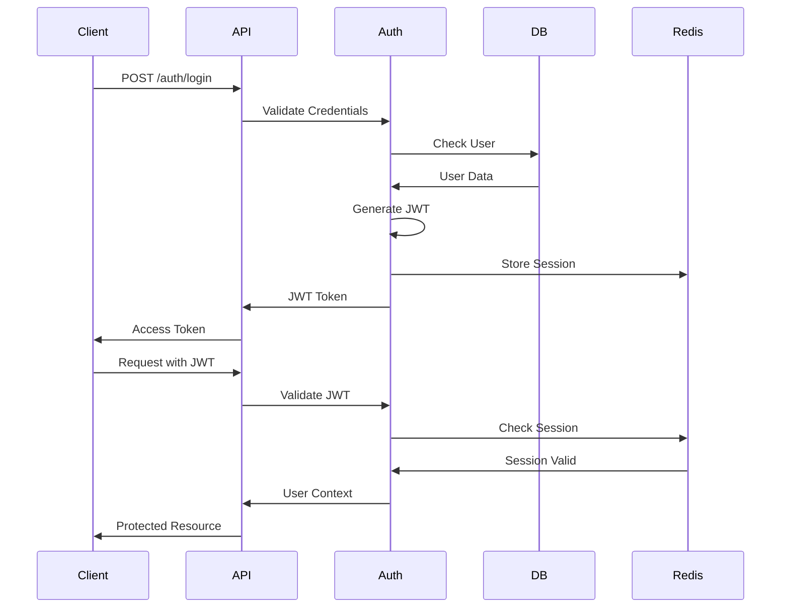

# 🔑 Configuration Authentification

Ce guide explique comment configurer l'authentification sur Veza.

## Vue d'ensemble

Ce guide détaille la configuration complète du système d'authentification de la plateforme Veza, incluant JWT, OAuth2, et les mécanismes de sécurité associés.

## 🔐 **Architecture d'Authentification**

### Flux d'Authentification Principal



## ⚙️ **Configuration JWT**

### Configuration du Serveur

```go
// internal/infrastructure/jwt/jwt.go
package jwt

import (
    "time"
    "github.com/golang-jwt/jwt/v4"
)

type JWTConfig struct {
    SecretKey     string        `env:"JWT_SECRET_KEY" required:"true"`
    AccessExpiry  time.Duration `env:"JWT_ACCESS_EXPIRY" default:"15m"`
    RefreshExpiry time.Duration `env:"JWT_REFRESH_EXPIRY" default:"7d"`
    Issuer        string        `env:"JWT_ISSUER" default:"veza-platform"`
}

type Claims struct {
    UserID   string `json:"user_id"`
    Username string `json:"username"`
    Role     string `json:"role"`
    jwt.RegisteredClaims
}

func GenerateToken(userID, username, role string, config JWTConfig) (string, error) {
    claims := Claims{
        UserID:   userID,
        Username: username,
        Role:     role,
        RegisteredClaims: jwt.RegisteredClaims{
            ExpiresAt: jwt.NewNumericDate(time.Now().Add(config.AccessExpiry)),
            IssuedAt:  jwt.NewNumericDate(time.Now()),
            Issuer:    config.Issuer,
        },
    }
    
    token := jwt.NewWithClaims(jwt.SigningMethodHS256, claims)
    return token.SignedString([]byte(config.SecretKey))
}
```

### Configuration des Variables d'Environnement

```bash
# .env
JWT_SECRET_KEY=your-super-secret-key-here
JWT_ACCESS_EXPIRY=15m
JWT_REFRESH_EXPIRY=7d
JWT_ISSUER=veza-platform

# Redis pour les sessions
REDIS_HOST=localhost
REDIS_PORT=6379
REDIS_PASSWORD=
REDIS_DB=0
```

## 🔑 **OAuth2 Configuration**

### Configuration Google OAuth2

```go
// internal/infrastructure/auth/oauth.go
package auth

import (
    "golang.org/x/oauth2"
    "golang.org/x/oauth2/google"
)

type OAuthConfig struct {
    GoogleClientID     string `env:"GOOGLE_CLIENT_ID"`
    GoogleClientSecret string `env:"GOOGLE_CLIENT_SECRET"`
    RedirectURL        string `env:"OAUTH_REDIRECT_URL"`
}

func NewGoogleOAuthConfig(config OAuthConfig) *oauth2.Config {
    return &oauth2.Config{
        ClientID:     config.GoogleClientID,
        ClientSecret: config.GoogleClientSecret,
        RedirectURL:  config.RedirectURL,
        Scopes: []string{
            "https://www.googleapis.com/auth/userinfo.email",
            "https://www.googleapis.com/auth/userinfo.profile",
        },
        Endpoint: google.Endpoint,
    }
}
```

### Configuration GitHub OAuth2

```go
func NewGitHubOAuthConfig(config OAuthConfig) *oauth2.Config {
    return &oauth2.Config{
        ClientID:     config.GitHubClientID,
        ClientSecret: config.GitHubClientSecret,
        RedirectURL:  config.RedirectURL,
        Scopes: []string{
            "user:email",
            "read:user",
        },
        Endpoint: oauth2.Endpoint{
            AuthURL:  "https://github.com/login/oauth/authorize",
            TokenURL: "https://github.com/login/oauth/access_token",
        },
    }
}
```

## 🛡️ **Middleware d'Authentification**

### Middleware JWT

```go
// internal/middleware/auth.go
package middleware

import (
    "net/http"
    "strings"
    "github.com/gin-gonic/gin"
)

func JWTAuthMiddleware(jwtService JWTService) gin.HandlerFunc {
    return func(c *gin.Context) {
        authHeader := c.GetHeader("Authorization")
        if authHeader == "" {
            c.JSON(http.StatusUnauthorized, gin.H{"error": "Authorization header required"})
            c.Abort()
            return
        }
        
        tokenString := strings.TrimPrefix(authHeader, "Bearer ")
        if tokenString == authHeader {
            c.JSON(http.StatusUnauthorized, gin.H{"error": "Bearer token required"})
            c.Abort()
            return
        }
        
        claims, err := jwtService.ValidateToken(tokenString)
        if err != nil {
            c.JSON(http.StatusUnauthorized, gin.H{"error": "Invalid token"})
            c.Abort()
            return
        }
        
        // Vérifier la session Redis
        if !jwtService.IsSessionValid(claims.UserID, tokenString) {
            c.JSON(http.StatusUnauthorized, gin.H{"error": "Session expired"})
            c.Abort()
            return
        }
        
        c.Set("user_id", claims.UserID)
        c.Set("username", claims.Username)
        c.Set("role", claims.Role)
        c.Next()
    }
}
```

### Middleware RBAC

```go
func RBACMiddleware(requiredRoles ...string) gin.HandlerFunc {
    return func(c *gin.Context) {
        userRole, exists := c.Get("role")
        if !exists {
            c.JSON(http.StatusForbidden, gin.H{"error": "Role not found"})
            c.Abort()
            return
        }
        
        hasRole := false
        for _, role := range requiredRoles {
            if role == userRole.(string) {
                hasRole = true
                break
            }
        }
        
        if !hasRole {
            c.JSON(http.StatusForbidden, gin.H{"error": "Insufficient permissions"})
            c.Abort()
            return
        }
        
        c.Next()
    }
}
```

## 🔄 **Gestion des Sessions**

### Service de Session Redis

```go
// internal/infrastructure/auth/session.go
package auth

import (
    "context"
    "time"
    "github.com/go-redis/redis/v8"
)

type SessionService struct {
    redis *redis.Client
}

func NewSessionService(redis *redis.Client) *SessionService {
    return &SessionService{redis: redis}
}

func (s *SessionService) StoreSession(userID, token string, expiry time.Duration) error {
    key := "session:" + userID
    return s.redis.Set(context.Background(), key, token, expiry).Err()
}

func (s *SessionService) IsSessionValid(userID, token string) bool {
    key := "session:" + userID
    storedToken, err := s.redis.Get(context.Background(), key).Result()
    if err != nil {
        return false
    }
    return storedToken == token
}

func (s *SessionService) InvalidateSession(userID string) error {
    key := "session:" + userID
    return s.redis.Del(context.Background(), key).Err()
}

func (s *SessionService) BlacklistToken(token string, expiry time.Duration) error {
    key := "blacklist:" + token
    return s.redis.Set(context.Background(), key, "revoked", expiry).Err()
}
```

## 🚀 **Endpoints d'Authentification**

### Routes d'Authentification

```go
// internal/api/auth/routes.go
package auth

import (
    "github.com/gin-gonic/gin"
)

func SetupAuthRoutes(r *gin.RouterGroup, authService AuthService) {
    auth := r.Group("/auth")
    {
        auth.POST("/login", authService.Login)
        auth.POST("/register", authService.Register)
        auth.POST("/refresh", authService.RefreshToken)
        auth.POST("/logout", authService.Logout)
        
        // OAuth routes
        auth.GET("/google", authService.GoogleLogin)
        auth.GET("/google/callback", authService.GoogleCallback)
        auth.GET("/github", authService.GitHubLogin)
        auth.GET("/github/callback", authService.GitHubCallback)
    }
}
```

### Implémentation des Handlers

```go
// internal/api/auth/handlers.go
package auth

import (
    "net/http"
    "github.com/gin-gonic/gin"
)

type AuthHandler struct {
    authService AuthService
    jwtService  JWTService
}

func (h *AuthHandler) Login(c *gin.Context) {
    var req LoginRequest
    if err := c.ShouldBindJSON(&req); err != nil {
        c.JSON(http.StatusBadRequest, gin.H{"error": err.Error()})
        return
    }
    
    user, err := h.authService.Authenticate(req.Email, req.Password)
    if err != nil {
        c.JSON(http.StatusUnauthorized, gin.H{"error": "Invalid credentials"})
        return
    }
    
    accessToken, err := h.jwtService.GenerateToken(user.ID, user.Username, user.Role)
    if err != nil {
        c.JSON(http.StatusInternalServerError, gin.H{"error": "Token generation failed"})
        return
    }
    
    refreshToken, err := h.jwtService.GenerateRefreshToken(user.ID)
    if err != nil {
        c.JSON(http.StatusInternalServerError, gin.H{"error": "Refresh token generation failed"})
        return
    }
    
    c.JSON(http.StatusOK, gin.H{
        "access_token":  accessToken,
        "refresh_token": refreshToken,
        "user":         user,
    })
}

func (h *AuthHandler) RefreshToken(c *gin.Context) {
    var req RefreshRequest
    if err := c.ShouldBindJSON(&req); err != nil {
        c.JSON(http.StatusBadRequest, gin.H{"error": err.Error()})
        return
    }
    
    claims, err := h.jwtService.ValidateRefreshToken(req.RefreshToken)
    if err != nil {
        c.JSON(http.StatusUnauthorized, gin.H{"error": "Invalid refresh token"})
        return
    }
    
    newAccessToken, err := h.jwtService.GenerateToken(claims.UserID, claims.Username, claims.Role)
    if err != nil {
        c.JSON(http.StatusInternalServerError, gin.H{"error": "Token generation failed"})
        return
    }
    
    c.JSON(http.StatusOK, gin.H{
        "access_token": newAccessToken,
    })
}
```

## 🔒 **Sécurité et Bonnes Pratiques**

### Configuration de Sécurité

```go
// internal/infrastructure/security/security.go
package security

import (
    "crypto/rand"
    "encoding/base64"
)

type SecurityConfig struct {
    PasswordMinLength int    `env:"PASSWORD_MIN_LENGTH" default:"8"`
    PasswordMaxLength int    `env:"PASSWORD_MAX_LENGTH" default:"128"`
    RequireUppercase  bool   `env:"PASSWORD_REQUIRE_UPPERCASE" default:"true"`
    RequireLowercase  bool   `env:"PASSWORD_REQUIRE_LOWERCASE" default:"true"`
    RequireNumbers    bool   `env:"PASSWORD_REQUIRE_NUMBERS" default:"true"`
    RequireSpecial    bool   `env:"PASSWORD_REQUIRE_SPECIAL" default:"true"`
}

func GenerateSecureToken(length int) (string, error) {
    bytes := make([]byte, length)
    if _, err := rand.Read(bytes); err != nil {
        return "", err
    }
    return base64.URLEncoding.EncodeToString(bytes), nil
}

func ValidatePassword(password string, config SecurityConfig) error {
    if len(password) < config.PasswordMinLength {
        return errors.New("password too short")
    }
    
    if len(password) > config.PasswordMaxLength {
        return errors.New("password too long")
    }
    
    // Validation des critères de complexité
    if config.RequireUppercase && !hasUppercase(password) {
        return errors.New("password must contain uppercase letter")
    }
    
    if config.RequireLowercase && !hasLowercase(password) {
        return errors.New("password must contain lowercase letter")
    }
    
    if config.RequireNumbers && !hasNumbers(password) {
        return errors.New("password must contain number")
    }
    
    if config.RequireSpecial && !hasSpecial(password) {
        return errors.New("password must contain special character")
    }
    
    return nil
}
```

### Rate Limiting

```go
// internal/middleware/rate_limit.go
package middleware

import (
    "github.com/gin-gonic/gin"
    "golang.org/x/time/rate"
    "sync"
)

type IPRateLimiter struct {
    ips    map[string]*rate.Limiter
    mu     *sync.RWMutex
    rate   rate.Limit
    burst  int
}

func NewIPRateLimiter(r rate.Limit, b int) *IPRateLimiter {
    return &IPRateLimiter{
        ips:   make(map[string]*rate.Limiter),
        mu:    &sync.RWMutex{},
        rate:  r,
        burst: b,
    }
}

func (i *IPRateLimiter) GetLimiter(ip string) *rate.Limiter {
    i.mu.Lock()
    defer i.mu.Unlock()
    
    limiter, exists := i.ips[ip]
    if !exists {
        limiter = rate.NewLimiter(i.rate, i.burst)
        i.ips[ip] = limiter
    }
    
    return limiter
}

func RateLimitMiddleware(limiter *IPRateLimiter) gin.HandlerFunc {
    return func(c *gin.Context) {
        ip := c.ClientIP()
        limiter := limiter.GetLimiter(ip)
        
        if !limiter.Allow() {
            c.JSON(429, gin.H{"error": "Too many requests"})
            c.Abort()
            return
        }
        
        c.Next()
    }
}
```

## 📊 **Monitoring et Audit**

### Logs d'Authentification

```go
// internal/infrastructure/logger/auth_logger.go
package logger

import (
    "time"
    "github.com/sirupsen/logrus"
)

type AuthLogger struct {
    logger *logrus.Logger
}

func (l *AuthLogger) LogLogin(userID, username, ip string, success bool) {
    l.logger.WithFields(logrus.Fields{
        "event":     "login",
        "user_id":   userID,
        "username":  username,
        "ip":        ip,
        "success":   success,
        "timestamp": time.Now(),
    }).Info("Authentication attempt")
}

func (l *AuthLogger) LogLogout(userID, username string) {
    l.logger.WithFields(logrus.Fields{
        "event":     "logout",
        "user_id":   userID,
        "username":  username,
        "timestamp": time.Now(),
    }).Info("User logout")
}

func (l *AuthLogger) LogFailedAttempt(username, ip, reason string) {
    l.logger.WithFields(logrus.Fields{
        "event":     "failed_auth",
        "username":  username,
        "ip":        ip,
        "reason":    reason,
        "timestamp": time.Now(),
    }).Warn("Failed authentication attempt")
}
```

## 🧪 **Tests d'Authentification**

### Tests Unitaires

```go
// internal/api/auth/handlers_test.go
package auth

import (
    "testing"
    "net/http"
    "net/http/httptest"
    "bytes"
    "encoding/json"
    "github.com/gin-gonic/gin"
    "github.com/stretchr/testify/assert"
)

func TestLoginHandler(t *testing.T) {
    gin.SetMode(gin.TestMode)
    
    // Setup
    authService := &MockAuthService{}
    jwtService := &MockJWTService{}
    handler := &AuthHandler{
        authService: authService,
        jwtService:  jwtService,
    }
    
    router := gin.New()
    router.POST("/auth/login", handler.Login)
    
    // Test case
    loginReq := LoginRequest{
        Email:    "test@example.com",
        Password: "password123",
    }
    
    jsonData, _ := json.Marshal(loginReq)
    req, _ := http.NewRequest("POST", "/auth/login", bytes.NewBuffer(jsonData))
    req.Header.Set("Content-Type", "application/json")
    
    w := httptest.NewRecorder()
    router.ServeHTTP(w, req)
    
    assert.Equal(t, http.StatusOK, w.Code)
    
    var response map[string]interface{}
    json.Unmarshal(w.Body.Bytes(), &response)
    
    assert.Contains(t, response, "access_token")
    assert.Contains(t, response, "refresh_token")
}
```

## 📚 **Documentation API**

### Swagger Documentation

```yaml
# swagger.yaml
paths:
  /auth/login:
    post:
      summary: Authenticate user
      tags: [Authentication]
      requestBody:
        required: true
        content:
          application/json:
            schema:
              type: object
              properties:
                email:
                  type: string
                  format: email
                password:
                  type: string
                  minLength: 8
      responses:
        '200':
          description: Login successful
          content:
            application/json:
              schema:
                type: object
                properties:
                  access_token:
                    type: string
                  refresh_token:
                    type: string
                  user:
                    $ref: '#/components/schemas/User'
        '401':
          description: Invalid credentials
        '429':
          description: Too many requests
```

## 🔧 **Configuration de Production**

### Variables d'Environnement

```bash
# Production environment
JWT_SECRET_KEY=your-production-secret-key-here
JWT_ACCESS_EXPIRY=15m
JWT_REFRESH_EXPIRY=7d
JWT_ISSUER=veza-platform

# OAuth Configuration
GOOGLE_CLIENT_ID=your-google-client-id
GOOGLE_CLIENT_SECRET=your-google-client-secret
GITHUB_CLIENT_ID=your-github-client-id
GITHUB_CLIENT_SECRET=your-github-client-secret
OAUTH_REDIRECT_URL=https://api.veza.com/auth/callback

# Redis Configuration
REDIS_HOST=redis.veza.com
REDIS_PORT=6379
REDIS_PASSWORD=your-redis-password
REDIS_DB=0

# Security Configuration
PASSWORD_MIN_LENGTH=8
PASSWORD_MAX_LENGTH=128
PASSWORD_REQUIRE_UPPERCASE=true
PASSWORD_REQUIRE_LOWERCASE=true
PASSWORD_REQUIRE_NUMBERS=true
PASSWORD_REQUIRE_SPECIAL=true

# Rate Limiting
RATE_LIMIT_REQUESTS=100
RATE_LIMIT_WINDOW=1m
```

---

**Dernière mise à jour** : $(date)
**Version** : 1.0.0 