# Guide des Pipelines CI/CD - Veza Platform

## Vue d'ensemble

Ce guide détaille l'implémentation des pipelines d'intégration continue et de déploiement continu (CI/CD) pour l'écosystème Veza, couvrant l'automatisation des tests, builds, et déploiements.

## Table des matières

- [Architecture CI/CD](#architecture-cicd)
- [GitHub Actions](#github-actions)
- [GitLab CI](#gitlab-ci)
- [Stratégies de Déploiement](#stratégies-de-déploiement)
- [Bonnes Pratiques](#bonnes-pratiques)
- [Pièges à Éviter](#pièges-à-éviter)
- [Monitoring et Observabilité](#monitoring-et-observabilité)
- [Sécurité](#sécurité)
- [Ressources](#ressources)

## Architecture CI/CD

### Flux de Travail Principal

```mermaid
graph LR
    subgraph "Development"
        Dev[👨‍💻 Developer]
        Feature[🔧 Feature Branch]
        PR[📝 Pull Request]
    end
    
    subgraph "CI Pipeline"
        Lint[🔍 Linting]
        Test[🧪 Testing]
        Build[🏗️ Build]
        Security[🛡️ Security Scan]
    end
    
    subgraph "CD Pipeline"
        Staging[🚀 Staging Deploy]
        Integration[🔗 Integration Tests]
        Production[🌐 Production Deploy]
        Monitoring[📊 Monitoring]
    end
    
    subgraph "Environments"
        DevEnv[🛠️ Development]
        StagingEnv[🧪 Staging]
        ProdEnv[🌍 Production]
    end
    
    Dev --> Feature
    Feature --> PR
    PR --> Lint
    Lint --> Test
    Test --> Build
    Build --> Security
    Security --> Staging
    Staging --> Integration
    Integration --> Production
    Production --> Monitoring
    
    Staging --> StagingEnv
    Production --> ProdEnv
    Monitoring --> ProdEnv
```



### Pipeline Multi-Service

```mermaid
graph TB
    subgraph "Trigger"
        Push[📤 Push to Main]
        PR[📝 Pull Request]
        Tag[🏷️ Git Tag]
    end
    
    subgraph "Backend API Pipeline"
        GoTest[🧪 Go Tests]
        GoBuild[🏗️ Go Build]
        GoDocker[🐳 Docker Build]
        GoDeploy[🚀 Deploy API]
    end
    
    subgraph "Chat Server Pipeline"
        RustTest[🧪 Rust Tests]
        RustBuild[🏗️ Rust Build]
        RustDocker[🐳 Docker Build]
        RustDeploy[🚀 Deploy Chat]
    end
    
    subgraph "Stream Server Pipeline"
        StreamTest[🧪 Stream Tests]
        StreamBuild[🏗️ Stream Build]
        StreamDocker[🐳 Docker Build]
        StreamDeploy[🚀 Deploy Stream]
    end
    
    subgraph "Documentation Pipeline"
        DocsBuild[📚 Build Docs]
        DocsDeploy[🚀 Deploy Docs]
    end
    
    Push --> GoTest
    Push --> RustTest
    Push --> StreamTest
    Push --> DocsBuild
    
    GoTest --> GoBuild
    GoBuild --> GoDocker
    GoDocker --> GoDeploy
    
    RustTest --> RustBuild
    RustBuild --> RustDocker
    RustDocker --> RustDeploy
    
    StreamTest --> StreamBuild
    StreamBuild --> StreamDocker
    StreamDocker --> StreamDeploy
    
    DocsBuild --> DocsDeploy
```



## GitHub Actions

### Workflow Principal

```yaml
# .github/workflows/main.yml
name: Veza CI/CD Pipeline

on:
  push:
    branches: [ main, develop ]
  pull_request:
    branches: [ main, develop ]
  release:
    types: [ published ]

env:
  REGISTRY: ghcr.io
  IMAGE_NAME: veza

jobs:
  # Tests et validation
  test:
    name: Run Tests
    runs-on: ubuntu-latest
    strategy:
      matrix:
        service: [backend-api, chat-server, stream-server]
    
    steps:
    - name: Checkout code
      uses: actions/checkout@v4
      
    - name: Setup Go (Backend API)
      if: matrix.service == 'backend-api'
      uses: actions/setup-go@v4
      with:
        go-version: '1.21'
        cache: true
        
    - name: Setup Rust (Chat/Stream Server)
      if: matrix.service == 'chat-server' || matrix.service == 'stream-server'
      uses: actions/setup-rust@v1
      with:
        toolchain: stable
        cache: true
        
    - name: Run Linting
      run: |
        if [ "${{ matrix.service }}" = "backend-api" ]; then
          cd veza-backend-api
          go vet ./...
          golangci-lint run
        elif [ "${{ matrix.service }}" = "chat-server" ]; then
          cd veza-chat-server
          cargo clippy -- -D warnings
        elif [ "${{ matrix.service }}" = "stream-server" ]; then
          cd veza-stream-server
          cargo clippy -- -D warnings
        fi
        
    - name: Run Tests
      run: |
        if [ "${{ matrix.service }}" = "backend-api" ]; then
          cd veza-backend-api
          go test -v -race -coverprofile=coverage.out ./...
        elif [ "${{ matrix.service }}" = "chat-server" ]; then
          cd veza-chat-server
          cargo test --verbose
        elif [ "${{ matrix.service }}" = "stream-server" ]; then
          cd veza-stream-server
          cargo test --verbose
        fi
        
    - name: Upload Coverage
      uses: codecov/codecov-action@v3
      with:
        file: ./${{ matrix.service }}/coverage.out
        flags: ${{ matrix.service }}
        name: ${{ matrix.service }}-coverage

  # Build des images Docker
  build:
    name: Build Docker Images
    runs-on: ubuntu-latest
    needs: test
    strategy:
      matrix:
        service: [backend-api, chat-server, stream-server]
    
    steps:
    - name: Checkout code
      uses: actions/checkout@v4
      
    - name: Set up Docker Buildx
      uses: docker/setup-buildx-action@v3
      
    - name: Log in to Container Registry
      uses: docker/login-action@v3
      with:
        registry: ${{ env.REGISTRY }}
        username: ${{ github.actor }}
        password: ${{ secrets.GITHUB_TOKEN }}
        
    - name: Extract metadata
      id: meta
      uses: docker/metadata-action@v5
      with:
        images: ${{ env.REGISTRY }}/${{ github.repository }}/${{ matrix.service }}
        tags: |
          type=ref,event=branch
          type=ref,event=pr
          type=semver,pattern={{version}}
          type=semver,pattern={{major}}.{{minor}}
          type=sha,prefix={{branch}}-
          
    - name: Build and push Docker image
      uses: docker/build-push-action@v5
      with:
        context: ./${{ matrix.service }}
        push: true
        tags: ${{ steps.meta.outputs.tags }}
        labels: ${{ steps.meta.outputs.labels }}
        cache-from: type=gha
        cache-to: type=gha,mode=max

  # Sécurité et vulnérabilités
  security:
    name: Security Scan
    runs-on: ubuntu-latest
    needs: build
    
    steps:
    - name: Checkout code
      uses: actions/checkout@v4
      
    - name: Run Trivy vulnerability scanner
      uses: aquasecurity/trivy-action@master
      with:
        image-ref: '${{ env.REGISTRY }}/${{ github.repository }}/backend-api:latest'
        format: 'sarif'
        output: 'trivy-results.sarif'
        
    - name: Upload Trivy scan results to GitHub Security tab
      uses: github/codeql-action/upload-sarif@v2
      if: always()
      with:
        sarif_file: 'trivy-results.sarif'

  # Déploiement Staging
  deploy-staging:
    name: Deploy to Staging
    runs-on: ubuntu-latest
    needs: [build, security]
    if: github.ref == 'refs/heads/develop'
    environment: staging
    
    steps:
    - name: Checkout code
      uses: actions/checkout@v4
      
    - name: Setup kubectl
      uses: azure/setup-kubectl@v3
      with:
        version: 'latest'
        
    - name: Configure kubectl
      run: |
        echo "${{ secrets.KUBE_CONFIG_STAGING }}" | base64 -d > kubeconfig
        export KUBECONFIG=kubeconfig
        
    - name: Deploy to staging
      run: |
        export KUBECONFIG=kubeconfig
        kubectl set image deployment/veza-backend-api backend-api=${{ env.REGISTRY }}/${{ github.repository }}/backend-api:${{ github.sha }}
        kubectl set image deployment/veza-chat-server chat-server=${{ env.REGISTRY }}/${{ github.repository }}/chat-server:${{ github.sha }}
        kubectl set image deployment/veza-stream-server stream-server=${{ env.REGISTRY }}/${{ github.repository }}/stream-server:${{ github.sha }}
        
    - name: Run integration tests
      run: |
        # Attendre que les services soient prêts
        kubectl wait --for=condition=available deployment/veza-backend-api --timeout=300s
        kubectl wait --for=condition=available deployment/veza-chat-server --timeout=300s
        kubectl wait --for=condition=available deployment/veza-stream-server --timeout=300s
        
        # Exécuter les tests d'intégration
        ./scripts/run-integration-tests.sh staging

  # Déploiement Production
  deploy-production:
    name: Deploy to Production
    runs-on: ubuntu-latest
    needs: [build, security]
    if: github.ref == 'refs/heads/main' && github.event_name == 'push'
    environment: production
    
    steps:
    - name: Checkout code
      uses: actions/checkout@v4
      
    - name: Setup kubectl
      uses: azure/setup-kubectl@v3
      with:
        version: 'latest'
        
    - name: Configure kubectl
      run: |
        echo "${{ secrets.KUBE_CONFIG_PRODUCTION }}" | base64 -d > kubeconfig
        export KUBECONFIG=kubeconfig
        
    - name: Deploy to production
      run: |
        export KUBECONFIG=kubeconfig
        
        # Déploiement progressif
        kubectl set image deployment/veza-backend-api backend-api=${{ env.REGISTRY }}/${{ github.repository }}/backend-api:${{ github.sha }}
        kubectl rollout status deployment/veza-backend-api --timeout=600s
        
        kubectl set image deployment/veza-chat-server chat-server=${{ env.REGISTRY }}/${{ github.repository }}/chat-server:${{ github.sha }}
        kubectl rollout status deployment/veza-chat-server --timeout=600s
        
        kubectl set image deployment/veza-stream-server stream-server=${{ env.REGISTRY }}/${{ github.repository }}/stream-server:${{ github.sha }}
        kubectl rollout status deployment/veza-stream-server --timeout=600s
        
    - name: Run smoke tests
      run: |
        export KUBECONFIG=kubeconfig
        ./scripts/run-smoke-tests.sh production
        
    - name: Notify deployment
      uses: 8398a7/action-slack@v3
      with:
        status: success
        text: 'Production deployment successful! 🚀'
      env:
        SLACK_WEBHOOK_URL: ${{ secrets.SLACK_WEBHOOK_URL }}
```

### Workflow de Documentation

```yaml
# .github/workflows/docs.yml
name: Documentation Pipeline

on:
  push:
    branches: [ main, develop ]
    paths:
      - 'veza-docs/**'
  pull_request:
    branches: [ main, develop ]
    paths:
      - 'veza-docs/**'

jobs:
  build-docs:
    name: Build Documentation
    runs-on: ubuntu-latest
    
    steps:
    - name: Checkout code
      uses: actions/checkout@v4
      
    - name: Setup Node.js
      uses: actions/setup-node@v4
      with:
        node-version: '18'
        cache: 'npm'
        
    - name: Install dependencies
      run: |
        cd veza-docs
        npm ci
        
    - name: Build documentation
      run: |
        cd veza-docs
        npm run build
        
    - name: Upload build artifacts
      uses: actions/upload-artifact@v3
      with:
        name: docs-build
        path: veza-docs/build/
        
  deploy-docs:
    name: Deploy Documentation
    runs-on: ubuntu-latest
    needs: build-docs
    if: github.ref == 'refs/heads/main'
    
    steps:
    - name: Download build artifacts
      uses: actions/download-artifact@v3
      with:
        name: docs-build
        path: veza-docs/build/
        
    - name: Deploy to Netlify
      uses: nwtgck/actions-netlify@v2
      with:
        publish-dir: './veza-docs/build'
        production-branch: main
        github-token: ${{ secrets.GITHUB_TOKEN }}
        deploy-message: "Deploy from GitHub Actions"
      env:
        NETLIFY_AUTH_TOKEN: ${{ secrets.NETLIFY_AUTH_TOKEN }}
        NETLIFY_SITE_ID: ${{ secrets.NETLIFY_SITE_ID }}
```

## GitLab CI

### Pipeline GitLab CI/CD

```yaml
# .gitlab-ci.yml
stages:
  - validate
  - test
  - build
  - security
  - deploy-staging
  - deploy-production

variables:
  DOCKER_DRIVER: overlay2
  DOCKER_TLS_CERTDIR: "/certs"
  REGISTRY: $CI_REGISTRY
  IMAGE_TAG: $CI_COMMIT_SHA

# Validation et linting
validate:
  stage: validate
  image: golang:1.21-alpine
  script:
    - cd veza-backend-api
    - go mod download
    - go vet ./...
    - golangci-lint run
  only:
    - merge_requests
    - main
    - develop

# Tests Backend API
test-backend:
  stage: test
  image: golang:1.21-alpine
  services:
    - postgres:15-alpine
    - redis:7-alpine
  variables:
    POSTGRES_DB: veza_test
    POSTGRES_USER: test_user
    POSTGRES_PASSWORD: test_password
  script:
    - cd veza-backend-api
    - go test -v -race -coverprofile=coverage.out ./...
    - go tool cover -func=coverage.out
  coverage: '/total:\s+\(statements\)\s+(\d+\.\d+\%)/'
  artifacts:
    reports:
      coverage_report:
        coverage_format: cobertura
        path: veza-backend-api/coverage.out
  only:
    - merge_requests
    - main
    - develop

# Tests Chat Server
test-chat:
  stage: test
  image: rust:1.70-alpine
  script:
    - cd veza-chat-server
    - cargo test --verbose
  only:
    - merge_requests
    - main
    - develop

# Tests Stream Server
test-stream:
  stage: test
  image: rust:1.70-alpine
  script:
    - cd veza-stream-server
    - cargo test --verbose
  only:
    - merge_requests
    - main
    - develop

# Build Backend API
build-backend:
  stage: build
  image: docker:20.10.16
  services:
    - docker:20.10.16-dind
  script:
    - docker build -t $REGISTRY/veza/backend-api:$IMAGE_TAG ./veza-backend-api
    - docker push $REGISTRY/veza/backend-api:$IMAGE_TAG
  only:
    - main
    - develop

# Build Chat Server
build-chat:
  stage: build
  image: docker:20.10.16
  services:
    - docker:20.10.16-dind
  script:
    - docker build -t $REGISTRY/veza/chat-server:$IMAGE_TAG ./veza-chat-server
    - docker push $REGISTRY/veza/chat-server:$IMAGE_TAG
  only:
    - main
    - develop

# Build Stream Server
build-stream:
  stage: build
  image: docker:20.10.16
  services:
    - docker:20.10.16-dind
  script:
    - docker build -t $REGISTRY/veza/stream-server:$IMAGE_TAG ./veza-stream-server
    - docker push $REGISTRY/veza/stream-server:$IMAGE_TAG
  only:
    - main
    - develop

# Security Scan
security-scan:
  stage: security
  image: aquasec/trivy:latest
  script:
    - trivy image --severity HIGH,CRITICAL $REGISTRY/veza/backend-api:$IMAGE_TAG
    - trivy image --severity HIGH,CRITICAL $REGISTRY/veza/chat-server:$IMAGE_TAG
    - trivy image --severity HIGH,CRITICAL $REGISTRY/veza/stream-server:$IMAGE_TAG
  allow_failure: true
  only:
    - main
    - develop

# Déploiement Staging
deploy-staging:
  stage: deploy-staging
  image: bitnami/kubectl:latest
  script:
    - kubectl config use-context staging
    - kubectl set image deployment/veza-backend-api backend-api=$REGISTRY/veza/backend-api:$IMAGE_TAG
    - kubectl set image deployment/veza-chat-server chat-server=$REGISTRY/veza/chat-server:$IMAGE_TAG
    - kubectl set image deployment/veza-stream-server stream-server=$REGISTRY/veza/stream-server:$IMAGE_TAG
    - kubectl rollout status deployment/veza-backend-api --timeout=300s
    - kubectl rollout status deployment/veza-chat-server --timeout=300s
    - kubectl rollout status deployment/veza-stream-server --timeout=300s
  environment:
    name: staging
    url: https://staging.veza.com
  only:
    - develop

# Déploiement Production
deploy-production:
  stage: deploy-production
  image: bitnami/kubectl:latest
  script:
    - kubectl config use-context production
    - kubectl set image deployment/veza-backend-api backend-api=$REGISTRY/veza/backend-api:$IMAGE_TAG
    - kubectl set image deployment/veza-chat-server chat-server=$REGISTRY/veza/chat-server:$IMAGE_TAG
    - kubectl set image deployment/veza-stream-server stream-server=$REGISTRY/veza/stream-server:$IMAGE_TAG
    - kubectl rollout status deployment/veza-backend-api --timeout=600s
    - kubectl rollout status deployment/veza-chat-server --timeout=600s
    - kubectl rollout status deployment/veza-stream-server --timeout=600s
  environment:
    name: production
    url: https://veza.com
  when: manual
  only:
    - main
```

## Stratégies de Déploiement

### Blue-Green Deployment

```yaml
# k8s/blue-green-deployment.yaml
apiVersion: apps/v1
kind: Deployment
metadata:
  name: veza-backend-api-blue
  labels:
    app: veza-backend-api
    version: blue
spec:
  replicas: 3
  selector:
    matchLabels:
      app: veza-backend-api
      version: blue
  template:
    metadata:
      labels:
        app: veza-backend-api
        version: blue
    spec:
      containers:
      - name: backend-api
        image: veza/backend-api:blue
        ports:
        - containerPort: 8080
---
apiVersion: apps/v1
kind: Deployment
metadata:
  name: veza-backend-api-green
  labels:
    app: veza-backend-api
    version: green
spec:
  replicas: 0  # Démarré avec 0 réplicas
  selector:
    matchLabels:
      app: veza-backend-api
      version: green
  template:
    metadata:
      labels:
        app: veza-backend-api
        version: green
    spec:
      containers:
      - name: backend-api
        image: veza/backend-api:green
        ports:
        - containerPort: 8080
---
apiVersion: v1
kind: Service
metadata:
  name: veza-backend-api-service
spec:
  selector:
    app: veza-backend-api
    version: blue  # Pointe vers la version active
  ports:
  - port: 80
    targetPort: 8080
```

### Rolling Update

```yaml
# k8s/rolling-update.yaml
apiVersion: apps/v1
kind: Deployment
metadata:
  name: veza-backend-api
spec:
  replicas: 5
  strategy:
    type: RollingUpdate
    rollingUpdate:
      maxSurge: 2        # Maximum 2 pods supplémentaires pendant l'update
      maxUnavailable: 1  # Maximum 1 pod indisponible pendant l'update
  selector:
    matchLabels:
      app: veza-backend-api
  template:
    metadata:
      labels:
        app: veza-backend-api
    spec:
      containers:
      - name: backend-api
        image: veza/backend-api:latest
        ports:
        - containerPort: 8080
        readinessProbe:
          httpGet:
            path: /ready
            port: 8080
          initialDelaySeconds: 5
          periodSeconds: 5
        livenessProbe:
          httpGet:
            path: /health
            port: 8080
          initialDelaySeconds: 30
          periodSeconds: 10
```

### Canary Deployment

```yaml
# k8s/canary-deployment.yaml
apiVersion: apps/v1
kind: Deployment
metadata:
  name: veza-backend-api-stable
  labels:
    app: veza-backend-api
    track: stable
spec:
  replicas: 4
  selector:
    matchLabels:
      app: veza-backend-api
      track: stable
  template:
    metadata:
      labels:
        app: veza-backend-api
        track: stable
    spec:
      containers:
      - name: backend-api
        image: veza/backend-api:stable
        ports:
        - containerPort: 8080
---
apiVersion: apps/v1
kind: Deployment
metadata:
  name: veza-backend-api-canary
  labels:
    app: veza-backend-api
    track: canary
spec:
  replicas: 1  # Petit pourcentage du trafic
  selector:
    matchLabels:
      app: veza-backend-api
      track: canary
  template:
    metadata:
      labels:
        app: veza-backend-api
        track: canary
    spec:
      containers:
      - name: backend-api
        image: veza/backend-api:canary
        ports:
        - containerPort: 8080
```

## Bonnes Pratiques

### 1. Tests Automatisés

```yaml
# Exemple de pipeline avec tests complets
test-suite:
  stage: test
  script:
    # Tests unitaires
    - go test -v -race ./...
    
    # Tests d'intégration
    - go test -v -tags=integration ./...
    
    # Tests de performance
    - go test -v -bench=. ./...
    
    # Tests de sécurité
    - go test -v -tags=security ./...
```

### 2. Cache et Optimisation

```yaml
# Optimisation du cache
cache:
  key: $CI_COMMIT_REF_SLUG
  paths:
    - .cache/go/
    - .cache/rust/
    - node_modules/
    - .npm/
```

### 3. Variables d'Environnement Sécurisées

```yaml
# Utilisation de variables sécurisées
variables:
  DATABASE_URL: $DATABASE_URL
  API_KEY: $API_KEY
  JWT_SECRET: $JWT_SECRET
```

### 4. Notifications et Alerting

```yaml
# Notifications Slack
notify-success:
  stage: .post
  script:
    - curl -X POST -H 'Content-type: application/json' --data '{"text":"✅ Pipeline successful!"}' $SLACK_WEBHOOK_URL
  when: on_success

notify-failure:
  stage: .post
  script:
    - curl -X POST -H 'Content-type: application/json' --data '{"text":"❌ Pipeline failed!"}' $SLACK_WEBHOOK_URL
  when: on_failure
```

## Pièges à Éviter

### 1. Pas de Tests de Régression

❌ **Mauvais** :
```yaml
# Pipeline sans tests
build:
  script:
    - docker build -t app .
    - docker push app
```

✅ **Bon** :
```yaml
# Pipeline avec tests complets
test:
  script:
    - go test -v ./...
    - go vet ./...
    - golangci-lint run

build:
  needs: test
  script:
    - docker build -t app .
    - docker push app
```

### 2. Pas de Sécurité

❌ **Mauvais** :
```yaml
# Pas de scan de sécurité
deploy:
  script:
    - kubectl apply -f k8s/
```

✅ **Bon** :
```yaml
# Avec scan de sécurité
security-scan:
  script:
    - trivy image --severity HIGH,CRITICAL app:latest

deploy:
  needs: security-scan
  script:
    - kubectl apply -f k8s/
```

### 3. Pas de Rollback

❌ **Mauvais** :
```yaml
# Pas de stratégie de rollback
deploy:
  script:
    - kubectl set image deployment/app app=app:latest
```

✅ **Bon** :
```yaml
# Avec rollback automatique
deploy:
  script:
    - kubectl set image deployment/app app=app:latest
    - kubectl rollout status deployment/app --timeout=300s
    - if [ $? -ne 0 ]; then kubectl rollout undo deployment/app; exit 1; fi
```

### 4. Pas de Monitoring

❌ **Mauvais** :
```yaml
# Pas de vérification post-déploiement
deploy:
  script:
    - kubectl apply -f k8s/
```

✅ **Bon** :
```yaml
# Avec monitoring post-déploiement
deploy:
  script:
    - kubectl apply -f k8s/
    - kubectl rollout status deployment/app --timeout=300s

verify:
  needs: deploy
  script:
    - curl -f http://app/health
    - ./scripts/run-smoke-tests.sh
```

## Monitoring et Observabilité

### Métriques de Pipeline

```yaml
# Métriques de performance du pipeline
pipeline-metrics:
  stage: .post
  script:
    - echo "Pipeline duration: $CI_PIPELINE_DURATION"
    - echo "Build time: $CI_JOB_DURATION"
    - echo "Success rate: $(curl -s $PROMETHEUS_URL/api/v1/query?query=ci_pipeline_success_rate)"
```

### Alerting sur Échecs

```yaml
# Alerting automatique
alert-on-failure:
  stage: .post
  script:
    - |
      if [ "$CI_JOB_STATUS" = "failed" ]; then
        curl -X POST -H 'Content-type: application/json' \
          --data "{\"text\":\"🚨 Pipeline failed: $CI_PIPELINE_URL\"}" \
          $SLACK_WEBHOOK_URL
      fi
  when: on_failure
```

## Sécurité

### Secrets Management

```yaml
# Gestion sécurisée des secrets
variables:
  # Variables non sensibles
  ENVIRONMENT: production
  
  # Variables sensibles (définies dans l'interface GitLab)
  # DATABASE_URL, API_KEY, etc.
```

### Pipeline Security

```yaml
# Sécurité du pipeline
security:
  stage: security
  script:
    # Scan de vulnérabilités
    - trivy fs --severity HIGH,CRITICAL .
    
    # Audit des dépendances
    - go mod verify
    - cargo audit
    
    # Scan de secrets
    - gitleaks detect --source . --report-format json --report-path gitleaks-report.json
```

## Ressources

### Documentation Interne

- [Guide de Déploiement](../deployment/deployment-guide.md)
- [Configuration des Environnements](../deployment/environment-variables.md)
- [Monitoring et Alerting](../monitoring/README.md)
- [Sécurité et Audit](../security/README.md)

### Outils Recommandés

- **GitHub Actions** : CI/CD cloud
- **GitLab CI** : CI/CD self-hosted
- **Jenkins** : CI/CD traditionnel
- **ArgoCD** : GitOps
- **Tekton** : CI/CD cloud-native
- **Spinnaker** : CD multi-cloud

### Commandes Utiles

```bash
# GitHub Actions
gh run list
gh run view <run-id>
gh run rerun <run-id>

# GitLab CI
gitlab-ci-lint
gitlab-runner status

# Kubernetes
kubectl rollout status deployment/app
kubectl rollout undo deployment/app
kubectl get events --sort-by='.lastTimestamp'

# Docker
docker build --cache-from app:latest -t app:latest .
docker push app:latest
```

---

**Dernière mise à jour** : $(date)
**Version du guide** : 1.0.0
**Mainteneur** : Équipe DevOps Veza 