# Guide d'Architecture Cloud - Veza Platform

## Vue d'ensemble

Ce guide détaille l'architecture cloud de la plateforme Veza, couvrant les stratégies de déploiement multi-cloud, la gestion des ressources, et les bonnes pratiques pour une infrastructure cloud-native.

## Table des matières

- [Architecture Cloud Globale](#architecture-cloud-globale)
- [Stratégies Multi-Cloud](#stratégies-multi-cloud)
- [Services Cloud Utilisés](#services-cloud-utilisés)
- [Bonnes Pratiques](#bonnes-pratiques)
- [Pièges à Éviter](#pièges-à-éviter)
- [Monitoring et Observabilité](#monitoring-et-observabilité)
- [Sécurité](#sécurité)
- [Ressources](#ressources)

## Architecture Cloud Globale

### Infrastructure Multi-Cloud

```mermaid
graph TB
    subgraph "AWS Cloud"
        AWS_EC2[🖥️ EC2 Instances]
        AWS_RDS[🗄️ RDS PostgreSQL]
        AWS_ELB[⚖️ Application Load Balancer]
        AWS_S3[☁️ S3 Storage]
        AWS_CloudFront[🌍 CloudFront CDN]
        AWS_ElastiCache[⚡ ElastiCache Redis]
    end
    
    subgraph "Google Cloud"
        GCP_GKE[☸️ Google Kubernetes Engine]
        GCP_CloudSQL[🗄️ Cloud SQL]
        GCP_CloudStorage[☁️ Cloud Storage]
        GCP_LoadBalancer[⚖️ Load Balancer]
    end
    
    subgraph "Azure Cloud"
        Azure_AKS[☸️ Azure Kubernetes Service]
        Azure_SQL[🗄️ Azure SQL Database]
        Azure_Blob[☁️ Blob Storage]
        Azure_CDN[🌍 Azure CDN]
    end
    
    subgraph "Edge Locations"
        Edge_CDN[🌍 Global CDN]
        Edge_DNS[🌐 DNS Resolution]
        Edge_WAF[🛡️ Web Application Firewall]
    end
    
    subgraph "Monitoring & Observability"
        Prometheus[📈 Prometheus]
        Grafana[📊 Grafana]
        Jaeger[🔍 Jaeger]
        ELK[📝 ELK Stack]
    end
    
    %% AWS Connections
    AWS_ELB --> AWS_EC2
    AWS_EC2 --> AWS_RDS
    AWS_EC2 --> AWS_ElastiCache
    AWS_EC2 --> AWS_S3
    
    %% GCP Connections
    GCP_LoadBalancer --> GCP_GKE
    GCP_GKE --> GCP_CloudSQL
    GCP_GKE --> GCP_CloudStorage
    
    %% Azure Connections
    Azure_AKS --> Azure_SQL
    Azure_AKS --> Azure_Blob
    
    %% Edge Connections
    Edge_CDN --> AWS_CloudFront
    Edge_CDN --> GCP_CloudStorage
    Edge_CDN --> Azure_Blob
    Edge_DNS --> AWS_ELB
    Edge_DNS --> GCP_LoadBalancer
    Edge_DNS --> Azure_AKS
    
    %% Monitoring
    AWS_EC2 --> Prometheus
    GCP_GKE --> Prometheus
    Azure_AKS --> Prometheus
    Prometheus --> Grafana
```



### Flux de Données Cloud


## Stratégies Multi-Cloud

### 1. Cloud-Native Architecture

```yaml
# terraform/aws/main.tf
provider "aws" {
  region = var.aws_region
}

# EKS Cluster
resource "aws_eks_cluster" "veza_cluster" {
  name     = "veza-eks-cluster"
  role_arn = aws_iam_role.eks_cluster.arn
  version  = "1.27"

  vpc_config {
    subnet_ids = var.subnet_ids
    security_group_ids = [aws_security_group.eks_cluster.id]
  }

  depends_on = [
    aws_iam_role_policy_attachment.eks_cluster_policy,
    aws_iam_role_policy_attachment.eks_vpc_resource_controller,
  ]
}

# RDS PostgreSQL
resource "aws_db_instance" "veza_postgres" {
  identifier = "veza-postgres"
  engine     = "postgres"
  engine_version = "15.4"
  instance_class = "db.t3.micro"
  allocated_storage = 20
  storage_type = "gp2"
  
  db_name  = "veza"
  username = var.db_username
  password = var.db_password
  
  vpc_security_group_ids = [aws_security_group.rds.id]
  db_subnet_group_name   = aws_db_subnet_group.veza.name
  
  backup_retention_period = 7
  backup_window = "03:00-04:00"
  maintenance_window = "sun:04:00-sun:05:00"
  
  deletion_protection = true
  skip_final_snapshot = false
}

# ElastiCache Redis
resource "aws_elasticache_cluster" "veza_redis" {
  cluster_id = "veza-redis"
  engine = "redis"
  node_type = "cache.t3.micro"
  num_cache_nodes = 1
  parameter_group_name = "default.redis7"
  port = 6379
  
  security_group_ids = [aws_security_group.redis.id]
  subnet_group_name = aws_elasticache_subnet_group.veza.name
}

# S3 Bucket
resource "aws_s3_bucket" "veza_storage" {
  bucket = "veza-storage-${random_string.bucket_suffix.result}"
}

resource "aws_s3_bucket_versioning" "veza_storage" {
  bucket = aws_s3_bucket.veza_storage.id
  versioning_configuration {
    status = "Enabled"
  }
}

resource "aws_s3_bucket_server_side_encryption_configuration" "veza_storage" {
  bucket = aws_s3_bucket.veza_storage.id

  rule {
    apply_server_side_encryption_by_default {
      sse_algorithm = "AES256"
    }
  }
}
```

### 2. Infrastructure as Code

```yaml
# terraform/gcp/main.tf
provider "google" {
  project = var.gcp_project
  region  = var.gcp_region
}

# GKE Cluster
resource "google_container_cluster" "veza_gke" {
  name     = "veza-gke-cluster"
  location = var.gcp_region
  project  = var.gcp_project

  remove_default_node_pool = true
  initial_node_count       = 1

  network    = google_compute_network.veza_vpc.name
  subnetwork = google_compute_subnetwork.veza_subnet.name

  ip_allocation_policy {
    cluster_ipv4_cidr_block  = "/16"
    services_ipv4_cidr_block = "/22"
  }

  private_cluster_config {
    enable_private_nodes    = true
    enable_private_endpoint = false
    master_ipv4_cidr_block  = "172.16.0.0/28"
  }

  master_auth {
    client_certificate_config {
      issue_client_certificate = false
    }
  }
}

# Cloud SQL
resource "google_sql_database_instance" "veza_sql" {
  name             = "veza-sql-instance"
  database_version = "POSTGRES_15"
  region           = var.gcp_region
  project          = var.gcp_project

  settings {
    tier = "db-f1-micro"
    
    backup_configuration {
      enabled    = true
      start_time = "03:00"
    }
    
    ip_configuration {
      ipv4_enabled    = false
      private_network = google_compute_network.veza_vpc.id
    }
  }

  deletion_protection = true
}

# Cloud Storage
resource "google_storage_bucket" "veza_storage" {
  name          = "veza-storage-${random_string.bucket_suffix.result}"
  location      = var.gcp_region
  force_destroy = false

  versioning {
    enabled = true
  }

  uniform_bucket_level_access = true
}
```

### 3. Configuration Kubernetes Multi-Cloud

```yaml
# k8s/multi-cloud/namespace.yaml
apiVersion: v1
kind: Namespace
metadata:
  name: veza
  labels:
    name: veza
    environment: production
---
# k8s/multi-cloud/configmap.yaml
apiVersion: v1
kind: ConfigMap
metadata:
  name: veza-config
  namespace: veza
data:
  # AWS Configuration
  aws_region: "us-west-2"
  aws_s3_bucket: "veza-storage"
  aws_cloudfront_domain: "cdn.veza.com"
  
  # GCP Configuration
  gcp_project: "veza-platform"
  gcp_region: "us-central1"
  gcp_storage_bucket: "veza-storage"
  
  # Azure Configuration
  azure_resource_group: "veza-rg"
  azure_location: "West US 2"
  azure_storage_account: "vezastorage"
  
  # Application Configuration
  app_environment: "production"
  app_version: "1.0.0"
  log_level: "info"
```

## Services Cloud Utilisés

### 1. AWS Services

#### Compute
- **EC2** : Instances pour les services non-containerisés
- **EKS** : Kubernetes managed pour l'orchestration
- **Lambda** : Serverless pour les fonctions événementielles

#### Database
- **RDS PostgreSQL** : Base de données principale
- **ElastiCache Redis** : Cache et sessions
- **DynamoDB** : Base de données NoSQL pour les métadonnées

#### Storage
- **S3** : Stockage d'objets pour les médias
- **EBS** : Stockage persistant pour les volumes
- **EFS** : Stockage de fichiers partagé

#### Networking
- **VPC** : Réseau privé isolé
- **ALB/NLB** : Load balancers
- **Route 53** : DNS et health checks
- **CloudFront** : CDN global

#### Security
- **IAM** : Gestion des identités et accès
- **KMS** : Chiffrement des clés
- **WAF** : Protection contre les attaques web
- **Shield** : Protection DDoS

### 2. Google Cloud Services

#### Compute
- **GKE** : Kubernetes managed
- **Cloud Run** : Serverless containers
- **Compute Engine** : VMs

#### Database
- **Cloud SQL** : PostgreSQL managed
- **Firestore** : Base de données NoSQL
- **Memorystore** : Redis managed

#### Storage
- **Cloud Storage** : Stockage d'objets
- **Persistent Disk** : Stockage persistant

#### Networking
- **VPC** : Réseau privé
- **Load Balancing** : Load balancers
- **Cloud CDN** : CDN

### 3. Azure Services

#### Compute
- **AKS** : Kubernetes managed
- **Container Instances** : Containers serverless
- **Virtual Machines** : VMs

#### Database
- **Azure SQL Database** : SQL Server managed
- **Cosmos DB** : Base de données NoSQL
- **Redis Cache** : Cache managed

#### Storage
- **Blob Storage** : Stockage d'objets
- **Managed Disks** : Stockage persistant

## Bonnes Pratiques

### 1. Architecture Cloud-Native

```yaml
# Exemple de déploiement cloud-native
apiVersion: apps/v1
kind: Deployment
metadata:
  name: veza-backend-api
  namespace: veza
spec:
  replicas: 3
  selector:
    matchLabels:
      app: veza-backend-api
  template:
    metadata:
      labels:
        app: veza-backend-api
    spec:
      containers:
      - name: backend-api
        image: veza/backend-api:latest
        ports:
        - containerPort: 8080
        env:
        - name: DB_HOST
          valueFrom:
            secretKeyRef:
              name: veza-secrets
              key: db_host
        - name: REDIS_HOST
          valueFrom:
            secretKeyRef:
              name: veza-secrets
              key: redis_host
        resources:
          requests:
            memory: "256Mi"
            cpu: "250m"
          limits:
            memory: "512Mi"
            cpu: "500m"
        livenessProbe:
          httpGet:
            path: /health
            port: 8080
          initialDelaySeconds: 30
          periodSeconds: 10
        readinessProbe:
          httpGet:
            path: /ready
            port: 8080
          initialDelaySeconds: 5
          periodSeconds: 5
```

### 2. Auto-scaling

```yaml
# HPA pour auto-scaling
apiVersion: autoscaling/v2
kind: HorizontalPodAutoscaler
metadata:
  name: veza-backend-api-hpa
  namespace: veza
spec:
  scaleTargetRef:
    apiVersion: apps/v1
    kind: Deployment
    name: veza-backend-api
  minReplicas: 2
  maxReplicas: 10
  metrics:
  - type: Resource
    resource:
      name: cpu
      target:
        type: Utilization
        averageUtilization: 70
  - type: Resource
    resource:
      name: memory
      target:
        type: Utilization
        averageUtilization: 80
```

### 3. Disaster Recovery

```yaml
# Configuration multi-région
apiVersion: v1
kind: ConfigMap
metadata:
  name: veza-dr-config
  namespace: veza
data:
  # Primary Region
  primary_region: "us-west-2"
  primary_db_host: "veza-postgres-primary.us-west-2.rds.amazonaws.com"
  
  # Secondary Region
  secondary_region: "us-east-1"
  secondary_db_host: "veza-postgres-secondary.us-east-1.rds.amazonaws.com"
  
  # Failover Configuration
  failover_threshold: "30s"
  health_check_interval: "10s"
```

## Pièges à Éviter

### 1. Vendor Lock-in

❌ **Mauvais** :
```yaml
# Utilisation exclusive d'AWS
env:
- name: S3_BUCKET
  value: "aws-only-bucket"
- name: DYNAMODB_TABLE
  value: "aws-only-table"
```

✅ **Bon** :
```yaml
# Abstraction multi-cloud
env:
- name: STORAGE_BUCKET
  value: "${CLOUD_PROVIDER}_storage_bucket"
- name: DATABASE_TABLE
  value: "${CLOUD_PROVIDER}_database_table"
```

### 2. Pas de Monitoring Multi-Cloud

❌ **Mauvais** :
```yaml
# Monitoring limité à un cloud
monitoring:
  provider: "aws-cloudwatch"
  metrics: ["cpu", "memory"]
```

✅ **Bon** :
```yaml
# Monitoring multi-cloud
monitoring:
  providers:
    - "prometheus"
    - "grafana"
    - "jaeger"
  metrics:
    - "cpu"
    - "memory"
    - "network"
    - "storage"
    - "custom"
```

### 3. Pas de Stratégie de Backup

❌ **Mauvais** :
```yaml
# Pas de backup configuré
database:
  host: "db.example.com"
  port: 5432
```

✅ **Bon** :
```yaml
# Backup automatique configuré
database:
  host: "db.example.com"
  port: 5432
  backup:
    enabled: true
    retention_days: 30
    cross_region: true
    encryption: true
```

### 4. Pas de Sécurité Multi-Cloud

❌ **Mauvais** :
```yaml
# Pas de politique de sécurité
security:
  enabled: false
```

✅ **Bon** :
```yaml
# Sécurité multi-cloud
security:
  encryption:
    at_rest: true
    in_transit: true
  network:
    private_subnets: true
    vpc_peering: true
  access:
    iam_enabled: true
    mfa_required: true
    least_privilege: true
```

## Monitoring et Observabilité

### 1. Métriques Multi-Cloud

```yaml
# prometheus/multi-cloud-config.yaml
global:
  scrape_interval: 15s

scrape_configs:
  # AWS Metrics
  - job_name: 'aws-ec2'
    static_configs:
      - targets: ['aws-ec2-metrics:9100']
    metrics_path: '/metrics'
    
  # GCP Metrics
  - job_name: 'gcp-gke'
    static_configs:
      - targets: ['gcp-gke-metrics:9100']
    metrics_path: '/metrics'
    
  # Azure Metrics
  - job_name: 'azure-aks'
    static_configs:
      - targets: ['azure-aks-metrics:9100']
    metrics_path: '/metrics'
    
  # Application Metrics
  - job_name: 'veza-applications'
    kubernetes_sd_configs:
      - role: pod
    relabel_configs:
      - source_labels: [__meta_kubernetes_pod_annotation_prometheus_io_scrape]
        action: keep
        regex: true
```

### 2. Logs Centralisés

```yaml
# fluentd/multi-cloud-config.yaml
<source>
  @type tail
  path /var/log/containers/*.log
  pos_file /var/log/fluentd-containers.log.pos
  tag kubernetes.*
  read_from_head true
  <parse>
    @type json
    time_format %Y-%m-%dT%H:%M:%S.%NZ
  </parse>
</source>

<filter kubernetes.**>
  @type kubernetes_metadata
  @id filter_kube_metadata
</filter>

<match kubernetes.**>
  @type elasticsearch
  host elasticsearch
  port 9200
  logstash_format true
  logstash_prefix k8s
  <buffer>
    @type file
    path /var/log/fluentd-buffers/kubernetes.system.buffer
    flush_mode interval
    retry_type exponential_backoff
    flush_interval 5s
    retry_forever false
    retry_max_interval 30
    chunk_limit_size 2M
    queue_limit_length 8
    overflow_action block
  </buffer>
</match>
```

## Sécurité

### 1. Chiffrement Multi-Cloud

```yaml
# k8s/security/encryption.yaml
apiVersion: v1
kind: Secret
metadata:
  name: veza-encryption-keys
  namespace: veza
type: Opaque
data:
  # AWS KMS
  aws_kms_key_id: <base64-encoded-key-id>
  
  # GCP KMS
  gcp_kms_key_id: <base64-encoded-key-id>
  
  # Azure Key Vault
  azure_key_vault_url: <base64-encoded-vault-url>
```

### 2. Network Policies

```yaml
# k8s/security/network-policies.yaml
apiVersion: networking.k8s.io/v1
kind: NetworkPolicy
metadata:
  name: veza-network-policy
  namespace: veza
spec:
  podSelector:
    matchLabels:
      app: veza-backend-api
  policyTypes:
  - Ingress
  - Egress
  ingress:
  - from:
    - namespaceSelector:
        matchLabels:
          name: ingress-nginx
    ports:
    - protocol: TCP
      port: 8080
  egress:
  - to:
    - podSelector:
        matchLabels:
          app: postgres
    ports:
    - protocol: TCP
      port: 5432
  - to:
    - podSelector:
        matchLabels:
          app: redis
    ports:
    - protocol: TCP
      port: 6379
```

## Ressources

### Documentation Interne

- [Guide de Déploiement](../deployment/deployment-guide.md)
- [Configuration des Environnements](../deployment/environment-variables.md)
- [Monitoring et Alerting](../monitoring/README.md)
- [Sécurité et Audit](../security/README.md)

### Outils Recommandés

- **Terraform** : Infrastructure as Code
- **Kubernetes** : Orchestration
- **Helm** : Gestion des packages
- **Prometheus** : Monitoring
- **Grafana** : Visualisation
- **Jaeger** : Traçage distribué
- **Fluentd** : Logs centralisés

### Commandes Utiles

```bash
# Terraform
terraform init
terraform plan
terraform apply
terraform destroy

# Kubernetes Multi-Cloud
kubectl config use-context aws-cluster
kubectl config use-context gcp-cluster
kubectl config use-context azure-cluster

# Monitoring
kubectl get nodes --all-namespaces
kubectl top pods --all-namespaces
kubectl get events --sort-by='.lastTimestamp'

# Logs
kubectl logs -f deployment/veza-backend-api
kubectl logs -f deployment/veza-chat-server
kubectl logs -f deployment/veza-stream-server
```

---

**Dernière mise à jour** : $(date)
**Version du guide** : 1.0.0
**Mainteneur** : Équipe Cloud Infrastructure Veza 