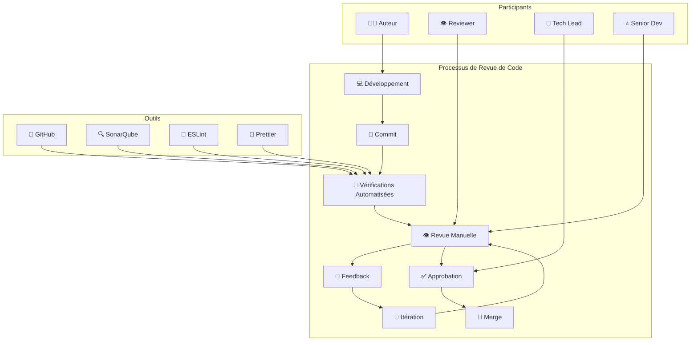
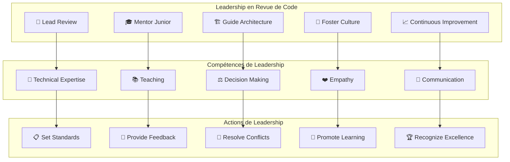

# Guide de Leadership en Revue de Code - Veza Platform

## Vue d'ensemble

Ce guide détaille les pratiques de leadership en revue de code pour la plateforme Veza, couvrant les processus, les bonnes pratiques, le mentorat et l'amélioration continue.

## Table des matières

- [Processus de Revue de Code](#processus-de-revue-de-code)
- [Leadership et Mentorat](#leadership-et-mentorat)
- [Outils et Automatisation](#outils-et-automatisation)
- [Bonnes Pratiques](#bonnes-pratiques)
- [Pièges à Éviter](#pièges-à-éviter)
- [Amélioration Continue](#amélioration-continue)
- [Ressources](#ressources)

## Processus de Revue de Code

### 1. Workflow de Revue de Code



### 2. Standards de Revue de Code

```yaml
# code-review-leadership/standards/review-standards.yaml
apiVersion: v1
kind: ConfigMap
metadata:
  name: veza-code-review-standards
  namespace: veza
data:
  # Critères de qualité
  quality_criteria:
    functionality:
      - "Fonctionnalité correcte"
      - "Gestion d'erreurs appropriée"
      - "Tests couvrant les cas d'usage"
      - "Documentation à jour"
    
    performance:
      - "Performance acceptable"
      - "Optimisation des requêtes"
      - "Gestion de la mémoire"
      - "Scalabilité considérée"
    
    security:
      - "Validation des entrées"
      - "Protection contre les injections"
      - "Gestion sécurisée des secrets"
      - "Autorisations appropriées"
    
    maintainability:
      - "Code lisible et bien structuré"
      - "Nommage clair des variables"
      - "Fonctions courtes et focalisées"
      - "Pas de duplication de code"
  
  # Niveaux de revue
  review_levels:
    junior:
      - "Revue par un senior"
      - "Focus sur les bonnes pratiques"
      - "Explication des patterns"
      - "Guidance technique"
    
    mid:
      - "Revue par un senior ou tech lead"
      - "Focus sur l'architecture"
      - "Considérations de performance"
      - "Amélioration continue"
    
    senior:
      - "Revue par un pair senior"
      - "Focus sur les détails techniques"
      - "Optimisations avancées"
      - "Mentorat des juniors"
  
  # Types de feedback
  feedback_types:
    positive:
      - "Reconnaissance des bonnes pratiques"
      - "Encouragement pour l'innovation"
      - "Validation des choix techniques"
      - "Appréciation du travail"
    
    constructive:
      - "Suggestions d'amélioration"
      - "Explication des alternatives"
      - "Questions pour clarifier"
      - "Recommandations techniques"
    
    critical:
      - "Problèmes de sécurité"
      - "Bugs critiques"
      - "Violations d'architecture"
      - "Problèmes de performance"
```

## Leadership et Mentorat

### 1. Modèle de Leadership en Revue



### 2. Template de Feedback Constructif

```yaml
# code-review-leadership/templates/feedback-template.yaml
apiVersion: v1
kind: ConfigMap
metadata:
  name: veza-feedback-template
  namespace: veza
data:
  # Template de feedback positif
  positive_feedback_template: |
    Excellent travail ! 🎉
    
    **Points forts:**
    - {point_fort_1}
    - {point_fort_2}
    - {point_fort_3}
    
    **Particulièrement apprécié:**
    {detail_apprécié}
    
    Continue comme ça ! 👍
  
  # Template de feedback constructif
  constructive_feedback_template: |
    Bon travail dans l'ensemble ! 👍
    
    **Suggestions d'amélioration:**
    
    **{sujet_1}:**
    - Problème: {description_problème}
    - Suggestion: {suggestion_amélioration}
    - Raison: {explication_raison}
    
    **{sujet_2}:**
    - Problème: {description_problème}
    - Suggestion: {suggestion_amélioration}
    - Raison: {explication_raison}
    
    **Questions pour clarifier:**
    - {question_1}
    - {question_2}
    
    N'hésite pas si tu as des questions ! 🤔
  
  # Template de feedback critique
  critical_feedback_template: |
    Attention, il y a des points importants à corriger ⚠️
    
    **Problèmes critiques:**
    
    **{problème_critique_1}:**
    - Impact: {impact_problème}
    - Solution: {solution_proposée}
    - Priorité: {priorité}
    
    **{problème_critique_2}:**
    - Impact: {impact_problème}
    - Solution: {solution_proposée}
    - Priorité: {priorité}
    
    **Ressources pour t'aider:**
    - {ressource_1}
    - {ressource_2}
    
    Discutons-en si besoin ! 💬
```

### 3. Script de Mentorat en Revue

```python
# code-review-leadership/scripts/mentoring_review.py
#!/usr/bin/env python3

import json
import logging
from datetime import datetime
from typing import Dict, List, Optional

class MentoringReviewer:
    def __init__(self):
        self.logger = self.setup_logger()
    
    def setup_logger(self) -> logging.Logger:
        """Configure le logger"""
        logging.basicConfig(
            level=logging.INFO,
            format='%(asctime)s - %(levelname)s - %(message)s',
            handlers=[
                logging.FileHandler('mentoring_review.log'),
                logging.StreamHandler()
            ]
        )
        return logging.getLogger(__name__)
    
    def create_mentoring_plan(self, developer_data: Dict) -> Dict:
        """Crée un plan de mentorat pour la revue de code"""
        plan = {
            'developer_id': developer_data['developer_id'],
            'experience_level': developer_data.get('experience_level', 'junior'),
            'mentoring_goals': self.generate_mentoring_goals(developer_data),
            'review_strategy': self.create_review_strategy(developer_data),
            'learning_resources': self.get_learning_resources(developer_data),
            'progress_tracking': self.setup_progress_tracking()
        }
        
        return plan
    
    def generate_mentoring_goals(self, developer_data: Dict) -> List[Dict]:
        """Génère les objectifs de mentorat"""
        goals = []
        
        if developer_data.get('experience_level') == 'junior':
            goals = [
                {
                    'category': 'fundamentals',
                    'goal': 'Maîtriser les bonnes pratiques de base',
                    'objectives': [
                        'Comprendre les conventions de nommage',
                        'Écrire du code lisible',
                        'Implémenter des tests unitaires',
                        'Utiliser les patterns de base'
                    ],
                    'timeline': '3 months'
                },
                {
                    'category': 'code_quality',
                    'goal': 'Améliorer la qualité du code',
                    'objectives': [
                        'Réduire la complexité cyclomatique',
                        'Améliorer la couverture de tests',
                        'Éliminer la duplication de code',
                        'Optimiser les performances de base'
                    ],
                    'timeline': '6 months'
                },
                {
                    'category': 'collaboration',
                    'goal': 'Développer les compétences de collaboration',
                    'objectives': [
                        'Participer activement aux revues',
                        'Donner du feedback constructif',
                        'Accepter et intégrer le feedback',
                        'Partager les connaissances'
                    ],
                    'timeline': '3 months'
                }
            ]
        elif developer_data.get('experience_level') == 'mid':
            goals = [
                {
                    'category': 'architecture',
                    'goal': 'Comprendre les principes d\'architecture',
                    'objectives': [
                        'Designer des composants réutilisables',
                        'Implémenter des patterns architecturaux',
                        'Optimiser les performances',
                        'Considérer la scalabilité'
                    ],
                    'timeline': '6 months'
                },
                {
                    'category': 'mentoring',
                    'goal': 'Développer les compétences de mentorat',
                    'objectives': [
                        'Mentorer les développeurs juniors',
                        'Conduire des revues de code',
                        'Partager les bonnes pratiques',
                        'Contribuer à la documentation'
                    ],
                    'timeline': '6 months'
                }
            ]
        else:  # senior
            goals = [
                {
                    'category': 'leadership',
                    'goal': 'Développer le leadership technique',
                    'objectives': [
                        'Guider les décisions d\'architecture',
                        'Mentorer l\'équipe entière',
                        'Définir les standards de qualité',
                        'Contribuer à la stratégie technique'
                    ],
                    'timeline': '12 months'
                }
            ]
        
        return goals
    
    def create_review_strategy(self, developer_data: Dict) -> Dict:
        """Crée une stratégie de revue personnalisée"""
        experience_level = developer_data.get('experience_level', 'junior')
        
        if experience_level == 'junior':
            strategy = {
                'review_frequency': 'every_commit',
                'review_depth': 'detailed',
                'focus_areas': [
                    'Code quality basics',
                    'Testing practices',
                    'Error handling',
                    'Documentation'
                ],
                'mentoring_approach': 'step_by_step',
                'feedback_style': 'constructive_and_encouraging'
            }
        elif experience_level == 'mid':
            strategy = {
                'review_frequency': 'major_changes',
                'review_depth': 'architectural',
                'focus_areas': [
                    'Architecture patterns',
                    'Performance optimization',
                    'Security considerations',
                    'Code maintainability'
                ],
                'mentoring_approach': 'guidance',
                'feedback_style': 'collaborative'
            }
        else:  # senior
            strategy = {
                'review_frequency': 'as_needed',
                'review_depth': 'strategic',
                'focus_areas': [
                    'System design',
                    'Technical strategy',
                    'Code review leadership',
                    'Mentoring others'
                ],
                'mentoring_approach': 'peer_review',
                'feedback_style': 'constructive_critical'
            }
        
        return strategy
    
    def get_learning_resources(self, developer_data: Dict) -> Dict:
        """Obtient les ressources d'apprentissage"""
        resources = {
            'books': [
                'Clean Code by Robert C. Martin',
                'Refactoring by Martin Fowler',
                'Design Patterns by Gang of Four',
                'Code Complete by Steve McConnell'
            ],
            'online_courses': [
                'Advanced Code Review Techniques',
                'Software Architecture Patterns',
                'Testing Best Practices',
                'Performance Optimization'
            ],
            'articles': [
                'Effective Code Review Practices',
                'How to Give Constructive Feedback',
                'Code Review Checklist',
                'Mentoring in Code Reviews'
            ],
            'tools': [
                'SonarQube for code quality',
                'ESLint for JavaScript',
                'Prettier for formatting',
                'GitHub for collaboration'
            ]
        }
        
        return resources
    
    def setup_progress_tracking(self) -> Dict:
        """Configure le suivi de progression"""
        tracking = {
            'metrics': [
                'Code quality score',
                'Review participation rate',
                'Feedback implementation rate',
                'Mentoring contributions'
            ],
            'milestones': [
                'First successful code review',
                'First mentoring session',
                'Improved code quality',
                'Leadership in reviews'
            ],
            'feedback_cycle': 'monthly',
            'review_sessions': 'weekly'
        }
        
        return tracking
    
    def generate_feedback(self, code_review_data: Dict) -> Dict:
        """Génère du feedback personnalisé"""
        feedback = {
            'positive_points': self.identify_positive_points(code_review_data),
            'improvement_areas': self.identify_improvement_areas(code_review_data),
            'specific_suggestions': self.generate_suggestions(code_review_data),
            'learning_resources': self.recommend_learning_resources(code_review_data),
            'next_steps': self.define_next_steps(code_review_data)
        }
        
        return feedback
    
    def identify_positive_points(self, code_review_data: Dict) -> List[str]:
        """Identifie les points positifs"""
        positive_points = []
        
        if code_review_data.get('code_quality', 0) > 7:
            positive_points.append("Excellent code quality")
        
        if code_review_data.get('test_coverage', 0) > 80:
            positive_points.append("Great test coverage")
        
        if code_review_data.get('documentation', False):
            positive_points.append("Good documentation")
        
        if code_review_data.get('performance', False):
            positive_points.append("Performance considerations")
        
        return positive_points
    
    def identify_improvement_areas(self, code_review_data: Dict) -> List[str]:
        """Identifie les domaines d'amélioration"""
        improvement_areas = []
        
        if code_review_data.get('code_quality', 0) < 7:
            improvement_areas.append("Code quality needs improvement")
        
        if code_review_data.get('test_coverage', 0) < 80:
            improvement_areas.append("Test coverage should be increased")
        
        if not code_review_data.get('documentation', False):
            improvement_areas.append("Documentation is missing")
        
        if not code_review_data.get('error_handling', False):
            improvement_areas.append("Error handling could be improved")
        
        return improvement_areas
    
    def generate_suggestions(self, code_review_data: Dict) -> List[str]:
        """Génère des suggestions spécifiques"""
        suggestions = []
        
        if code_review_data.get('complexity', 0) > 10:
            suggestions.append("Consider breaking down complex functions")
        
        if code_review_data.get('duplication', 0) > 5:
            suggestions.append("Extract common code into reusable functions")
        
        if not code_review_data.get('security', False):
            suggestions.append("Add input validation and sanitization")
        
        if not code_review_data.get('logging', False):
            suggestions.append("Add appropriate logging for debugging")
        
        return suggestions
    
    def recommend_learning_resources(self, code_review_data: Dict) -> List[str]:
        """Recommandation de ressources d'apprentissage"""
        resources = []
        
        if code_review_data.get('code_quality', 0) < 7:
            resources.append("Clean Code by Robert C. Martin")
        
        if code_review_data.get('test_coverage', 0) < 80:
            resources.append("Test-Driven Development course")
        
        if not code_review_data.get('architecture', False):
            resources.append("Software Architecture Patterns")
        
        return resources
    
    def define_next_steps(self, code_review_data: Dict) -> List[str]:
        """Définit les prochaines étapes"""
        next_steps = [
            "Implement the suggested improvements",
            "Schedule a follow-up review",
            "Practice the recommended patterns",
            "Share learnings with the team"
        ]
        
        return next_steps

if __name__ == "__main__":
    # Données d'exemple
    developer_data = {
        'developer_id': 'DEV001',
        'experience_level': 'junior'
    }
    
    reviewer = MentoringReviewer()
    mentoring_plan = reviewer.create_mentoring_plan(developer_data)
    
    with open('mentoring_plan.json', 'w') as f:
        json.dump(mentoring_plan, f, indent=2)
    
    print("Plan de mentorat généré: mentoring_plan.json")
```

## Outils et Automatisation

### 1. Configuration des Outils de Revue

```yaml
# code-review-leadership/tools/review-tools-config.yaml
apiVersion: v1
kind: ConfigMap
metadata:
  name: veza-review-tools-config
  namespace: veza
data:
  # Configuration GitHub
  github_config:
    required_reviews: "2"
    dismiss_stale_reviews: "true"
    require_code_owner_reviews: "true"
    require_status_checks: "true"
    required_status_checks:
      - "ci/build"
      - "ci/test"
      - "ci/security"
  
  # Configuration SonarQube
  sonarqube_config:
    quality_gate:
      coverage: "80%"
      duplications: "< 3%"
      maintainability: "A"
      reliability: "A"
      security: "A"
    
    rules:
      - "java:S1066"  # Merge collapsible if statements
      - "java:S1488"  # Local variables should not be declared and then immediately returned
      - "java:S1135"  # Track uses of "FIXME" tags
      - "java:S1172"  # Unused method parameters should be removed
  
  # Configuration ESLint
  eslint_config:
    extends:
      - "eslint:recommended"
      - "@typescript-eslint/recommended"
    
    rules:
      complexity: ["error", 10]
      max-lines: ["error", 300]
      max-params: ["error", 4]
      no-console: "warn"
      prefer-const: "error"
  
  # Configuration Prettier
  prettier_config:
    semi: true
    trailingComma: "es5"
    singleQuote: true
    printWidth: 80
    tabWidth: 2
```

### 2. Script d'Automatisation

```python
# code-review-leadership/scripts/automated_review.py
#!/usr/bin/env python3

import json
import logging
import subprocess
from datetime import datetime
from typing import Dict, List, Optional

class AutomatedReviewer:
    def __init__(self):
        self.logger = self.setup_logger()
    
    def setup_logger(self) -> logging.Logger:
        """Configure le logger"""
        logging.basicConfig(
            level=logging.INFO,
            format='%(asctime)s - %(levelname)s - %(message)s',
            handlers=[
                logging.FileHandler('automated_review.log'),
                logging.StreamHandler()
            ]
        )
        return logging.getLogger(__name__)
    
    def run_code_quality_checks(self, repository_path: str) -> Dict:
        """Exécute les vérifications de qualité de code"""
        results = {
            'timestamp': datetime.now().isoformat(),
            'repository': repository_path,
            'checks': {}
        }
        
        # Vérification ESLint
        try:
            result = subprocess.run(
                ['npx', 'eslint', '--ext', '.js,.ts', '.'],
                cwd=repository_path,
                capture_output=True,
                text=True
            )
            
            results['checks']['eslint'] = {
                'success': result.returncode == 0,
                'output': result.stdout,
                'errors': result.stderr
            }
        except Exception as e:
            self.logger.error(f"Erreur ESLint: {e}")
            results['checks']['eslint'] = {
                'success': False,
                'error': str(e)
            }
        
        # Vérification Prettier
        try:
            result = subprocess.run(
                ['npx', 'prettier', '--check', '.'],
                cwd=repository_path,
                capture_output=True,
                text=True
            )
            
            results['checks']['prettier'] = {
                'success': result.returncode == 0,
                'output': result.stdout,
                'errors': result.stderr
            }
        except Exception as e:
            self.logger.error(f"Erreur Prettier: {e}")
            results['checks']['prettier'] = {
                'success': False,
                'error': str(e)
            }
        
        # Vérification des tests
        try:
            result = subprocess.run(
                ['npm', 'test'],
                cwd=repository_path,
                capture_output=True,
                text=True
            )
            
            results['checks']['tests'] = {
                'success': result.returncode == 0,
                'output': result.stdout,
                'errors': result.stderr
            }
        except Exception as e:
            self.logger.error(f"Erreur tests: {e}")
            results['checks']['tests'] = {
                'success': False,
                'error': str(e)
            }
        
        # Vérification de la couverture
        try:
            result = subprocess.run(
                ['npm', 'run', 'test:coverage'],
                cwd=repository_path,
                capture_output=True,
                text=True
            )
            
            # Extraction du pourcentage de couverture
            coverage_match = None
            if result.stdout:
                import re
                coverage_match = re.search(r'All files\s+\|\s+(\d+\.\d+)%', result.stdout)
            
            results['checks']['coverage'] = {
                'success': result.returncode == 0,
                'percentage': float(coverage_match.group(1)) if coverage_match else 0,
                'output': result.stdout,
                'errors': result.stderr
            }
        except Exception as e:
            self.logger.error(f"Erreur couverture: {e}")
            results['checks']['coverage'] = {
                'success': False,
                'error': str(e)
            }
        
        return results
    
    def analyze_code_complexity(self, repository_path: str) -> Dict:
        """Analyse la complexité du code"""
        complexity_analysis = {
            'timestamp': datetime.now().isoformat(),
            'repository': repository_path,
            'files': []
        }
        
        try:
            # Utilisation de radon pour l'analyse de complexité
            result = subprocess.run(
                ['radon', 'cc', '.', '-j'],
                cwd=repository_path,
                capture_output=True,
                text=True
            )
            
            if result.returncode == 0:
                import json
                complexity_data = json.loads(result.stdout)
                
                for file_path, file_data in complexity_data.items():
                    file_analysis = {
                        'file': file_path,
                        'complexity': 0,
                        'functions': []
                    }
                    
                    for function_name, function_data in file_data.items():
                        complexity = function_data.get('complexity', 0)
                        file_analysis['complexity'] += complexity
                        
                        file_analysis['functions'].append({
                            'name': function_name,
                            'complexity': complexity,
                            'line': function_data.get('lineno', 0)
                        })
                    
                    complexity_analysis['files'].append(file_analysis)
            
        except Exception as e:
            self.logger.error(f"Erreur analyse complexité: {e}")
        
        return complexity_analysis
    
    def check_security_vulnerabilities(self, repository_path: str) -> Dict:
        """Vérifie les vulnérabilités de sécurité"""
        security_check = {
            'timestamp': datetime.now().isoformat(),
            'repository': repository_path,
            'vulnerabilities': []
        }
        
        try:
            # Vérification avec npm audit
            result = subprocess.run(
                ['npm', 'audit', '--json'],
                cwd=repository_path,
                capture_output=True,
                text=True
            )
            
            if result.returncode == 0:
                import json
                audit_data = json.loads(result.stdout)
                
                for vulnerability in audit_data.get('vulnerabilities', []):
                    security_check['vulnerabilities'].append({
                        'name': vulnerability.get('name', ''),
                        'severity': vulnerability.get('severity', ''),
                        'title': vulnerability.get('title', ''),
                        'recommendation': vulnerability.get('recommendation', '')
                    })
            
        except Exception as e:
            self.logger.error(f"Erreur vérification sécurité: {e}")
        
        return security_check
    
    def generate_review_report(self, repository_path: str) -> Dict:
        """Génère un rapport de revue automatisée"""
        report = {
            'timestamp': datetime.now().isoformat(),
            'repository': repository_path,
            'quality_checks': self.run_code_quality_checks(repository_path),
            'complexity_analysis': self.analyze_code_complexity(repository_path),
            'security_check': self.check_security_vulnerabilities(repository_path),
            'recommendations': []
        }
        
        # Génération des recommandations
        recommendations = []
        
        # Recommandations basées sur la qualité
        quality_checks = report['quality_checks']['checks']
        
        if not quality_checks.get('eslint', {}).get('success', False):
            recommendations.append("Corriger les erreurs ESLint")
        
        if not quality_checks.get('prettier', {}).get('success', False):
            recommendations.append("Formater le code avec Prettier")
        
        if not quality_checks.get('tests', {}).get('success', False):
            recommendations.append("Corriger les tests qui échouent")
        
        coverage = quality_checks.get('coverage', {}).get('percentage', 0)
        if coverage < 80:
            recommendations.append(f"Augmenter la couverture de tests (actuellement {coverage}%)")
        
        # Recommandations basées sur la complexité
        for file_analysis in report['complexity_analysis']['files']:
            if file_analysis['complexity'] > 50:
                recommendations.append(f"Réduire la complexité du fichier {file_analysis['file']}")
        
        # Recommandations basées sur la sécurité
        for vulnerability in report['security_check']['vulnerabilities']:
            if vulnerability['severity'] in ['high', 'critical']:
                recommendations.append(f"Corriger la vulnérabilité {vulnerability['name']}")
        
        report['recommendations'] = recommendations
        
        return report
    
    def save_report(self, report: Dict, output_file: str):
        """Sauvegarde le rapport"""
        with open(output_file, 'w') as f:
            json.dump(report, f, indent=2)
        
        self.logger.info(f"Rapport sauvegardé: {output_file}")

if __name__ == "__main__":
    import sys
    
    if len(sys.argv) != 2:
        print("Usage: python3 automated_review.py <repository_path>")
        sys.exit(1)
    
    repository_path = sys.argv[1]
    
    reviewer = AutomatedReviewer()
    report = reviewer.generate_review_report(repository_path)
    
    output_file = f"automated_review_report_{datetime.now().strftime('%Y%m%d_%H%M%S')}.json"
    reviewer.save_report(report, output_file)
    
    print(f"Rapport de revue automatisée généré: {output_file}")
```

## Bonnes Pratiques

### 1. Principes de Revue de Code

```yaml
# code-review-leadership/best-practices/review-principles.yaml
apiVersion: v1
kind: ConfigMap
metadata:
  name: veza-review-principles
  namespace: veza
data:
  # Principes fondamentaux
  fundamental_principles:
    - "Respect et bienveillance"
    - "Feedback constructif"
    - "Apprentissage mutuel"
    - "Amélioration continue"
    - "Qualité avant vitesse"
    - "Collaboration et partage"
  
  # Principes de feedback
  feedback_principles:
    - "Être spécifique et concret"
    - "Expliquer le pourquoi"
    - "Suggérer des améliorations"
    - "Reconnaître les bonnes pratiques"
    - "Poser des questions plutôt que d'imposer"
    - "Encourager la discussion"
  
  # Principes de leadership
  leadership_principles:
    - "Montrer l'exemple"
    - "Développer les talents"
    - "Créer une culture positive"
    - "Faciliter l'apprentissage"
    - "Reconnaître l'excellence"
    - "Promouvoir l'innovation"
```

### 2. Checklist de Revue

```yaml
# code-review-leadership/checklist/review-checklist.yaml
apiVersion: v1
kind: ConfigMap
metadata:
  name: veza-review-checklist
  namespace: veza
data:
  # Checklist fonctionnelle
  functional_checklist:
    - "La fonctionnalité répond-elle aux besoins ?"
    - "Les cas d'erreur sont-ils gérés ?"
    - "Les tests couvrent-ils les cas d'usage ?"
    - "La documentation est-elle à jour ?"
    - "Les performances sont-elles acceptables ?"
  
  # Checklist technique
  technical_checklist:
    - "Le code est-il lisible et bien structuré ?"
    - "Les bonnes pratiques sont-elles respectées ?"
    - "La complexité est-elle maîtrisée ?"
    - "Y a-t-il de la duplication de code ?"
    - "Les patterns appropriés sont-ils utilisés ?"
  
  # Checklist sécurité
  security_checklist:
    - "Les entrées sont-elles validées ?"
    - "Les secrets sont-ils gérés sécuritairement ?"
    - "Les autorisations sont-elles appropriées ?"
    - "Y a-t-il des vulnérabilités connues ?"
    - "La confidentialité est-elle respectée ?"
  
  # Checklist opérationnelle
  operational_checklist:
    - "Le monitoring est-il en place ?"
    - "Les logs sont-ils appropriés ?"
    - "Le déploiement est-il automatisé ?"
    - "La configuration est-elle externalisée ?"
    - "Les métriques sont-elles collectées ?"
```

## Pièges à Éviter

### 1. Feedback Négatif

❌ **Mauvais** :
```yaml
# Feedback négatif
feedback_style:
  tone: "aggressive"
  focus: "problems_only"
  approach: "imposing"
  language: "harsh"
```

✅ **Bon** :
```yaml
# Feedback constructif
feedback_style:
  tone: "constructive"
  focus: "improvement"
  approach: "collaborative"
  language: "respectful"
```

### 2. Pas de Contexte

❌ **Mauvais** :
```yaml
# Pas de contexte
review_approach:
  context: "none"
  explanation: "minimal"
  reasoning: "missing"
```

✅ **Bon** :
```yaml
# Contexte complet
review_approach:
  context: "provided"
  explanation: "detailed"
  reasoning: "clear"
```

### 3. Pas de Mentorat

❌ **Mauvais** :
```yaml
# Pas de mentorat
mentoring:
  guidance: "none"
  teaching: "none"
  development: "none"
```

✅ **Bon** :
```yaml
# Mentorat actif
mentoring:
  guidance: "continuous"
  teaching: "active"
  development: "supported"
```

## Amélioration Continue

### 1. Métriques de Revue

```yaml
# code-review-leadership/metrics/review-metrics.yaml
apiVersion: v1
kind: ConfigMap
metadata:
  name: veza-review-metrics
  namespace: veza
data:
  # Métriques de qualité
  quality_metrics:
    - "Code coverage"
    - "Complexity score"
    - "Duplication rate"
    - "Security vulnerabilities"
    - "Performance impact"
  
  # Métriques de processus
  process_metrics:
    - "Review time"
    - "Iteration count"
    - "Approval rate"
    - "Feedback quality"
    - "Learning outcomes"
  
  # Métriques de collaboration
  collaboration_metrics:
    - "Participation rate"
    - "Knowledge sharing"
    - "Team satisfaction"
    - "Mentoring effectiveness"
    - "Culture improvement"
```

### 2. Plan d'Amélioration

```python
# code-review-leadership/improvement/improvement_plan.py
#!/usr/bin/env python3

import json
import logging
from datetime import datetime
from typing import Dict, List, Optional

class ReviewImprovementPlan:
    def __init__(self):
        self.logger = self.setup_logger()
    
    def setup_logger(self) -> logging.Logger:
        """Configure le logger"""
        logging.basicConfig(
            level=logging.INFO,
            format='%(asctime)s - %(levelname)s - %(message)s',
            handlers=[
                logging.FileHandler('improvement_plan.log'),
                logging.StreamHandler()
            ]
        )
        return logging.getLogger(__name__)
    
    def create_improvement_plan(self, team_data: Dict) -> Dict:
        """Crée un plan d'amélioration pour l'équipe"""
        plan = {
            'team_id': team_data['team_id'],
            'assessment_date': datetime.now().isoformat(),
            'current_state': self.assess_current_state(team_data),
            'improvement_areas': self.identify_improvement_areas(team_data),
            'action_plan': self.create_action_plan(team_data),
            'success_metrics': self.define_success_metrics(),
            'timeline': self.create_timeline()
        }
        
        return plan
    
    def assess_current_state(self, team_data: Dict) -> Dict:
        """Évalue l'état actuel de l'équipe"""
        current_state = {
            'code_quality_score': team_data.get('code_quality_score', 7.5),
            'review_participation_rate': team_data.get('review_participation_rate', 85),
            'feedback_quality_score': team_data.get('feedback_quality_score', 8.0),
            'mentoring_effectiveness': team_data.get('mentoring_effectiveness', 7.0),
            'team_satisfaction': team_data.get('team_satisfaction', 8.5)
        }
        
        return current_state
    
    def identify_improvement_areas(self, team_data: Dict) -> List[Dict]:
        """Identifie les domaines d'amélioration"""
        improvement_areas = []
        
        current_state = self.assess_current_state(team_data)
        
        if current_state['code_quality_score'] < 8.0:
            improvement_areas.append({
                'area': 'Code Quality',
                'current_score': current_state['code_quality_score'],
                'target_score': 8.5,
                'priority': 'high',
                'actions': [
                    'Implement stricter quality gates',
                    'Add automated code quality checks',
                    'Provide code quality training',
                    'Establish coding standards'
                ]
            })
        
        if current_state['review_participation_rate'] < 90:
            improvement_areas.append({
                'area': 'Review Participation',
                'current_score': current_state['review_participation_rate'],
                'target_score': 95,
                'priority': 'medium',
                'actions': [
                    'Make code reviews mandatory',
                    'Schedule regular review sessions',
                    'Recognize active reviewers',
                    'Provide review training'
                ]
            })
        
        if current_state['feedback_quality_score'] < 8.5:
            improvement_areas.append({
                'area': 'Feedback Quality',
                'current_score': current_state['feedback_quality_score'],
                'target_score': 9.0,
                'priority': 'high',
                'actions': [
                    'Provide feedback training',
                    'Establish feedback guidelines',
                    'Review feedback examples',
                    'Encourage constructive feedback'
                ]
            })
        
        if current_state['mentoring_effectiveness'] < 8.0:
            improvement_areas.append({
                'area': 'Mentoring Effectiveness',
                'current_score': current_state['mentoring_effectiveness'],
                'target_score': 8.5,
                'priority': 'medium',
                'actions': [
                    'Train senior developers in mentoring',
                    'Establish mentoring programs',
                    'Provide mentoring resources',
                    'Recognize effective mentors'
                ]
            })
        
        return improvement_areas
    
    def create_action_plan(self, team_data: Dict) -> List[Dict]:
        """Crée un plan d'action"""
        action_plan = [
            {
                'phase': 'Immediate (1-2 weeks)',
                'actions': [
                    'Establish code review guidelines',
                    'Set up automated quality checks',
                    'Schedule review training sessions',
                    'Create feedback templates'
                ]
            },
            {
                'phase': 'Short-term (1-2 months)',
                'actions': [
                    'Implement mentoring program',
                    'Establish review metrics',
                    'Create improvement feedback loop',
                    'Develop review best practices'
                ]
            },
            {
                'phase': 'Long-term (3-6 months)',
                'actions': [
                    'Optimize review process',
                    'Develop advanced mentoring',
                    'Establish review leadership',
                    'Create review culture'
                ]
            }
        ]
        
        return action_plan
    
    def define_success_metrics(self) -> Dict:
        """Définit les métriques de succès"""
        metrics = {
            'quality_metrics': {
                'code_quality_score': 'Target: 8.5/10',
                'test_coverage': 'Target: >85%',
                'security_score': 'Target: A',
                'performance_score': 'Target: A'
            },
            'process_metrics': {
                'review_participation': 'Target: >95%',
                'review_time': 'Target: <2 days',
                'iteration_count': 'Target: <3',
                'approval_rate': 'Target: >90%'
            },
            'culture_metrics': {
                'team_satisfaction': 'Target: >9/10',
                'feedback_quality': 'Target: >9/10',
                'mentoring_effectiveness': 'Target: >8.5/10',
                'knowledge_sharing': 'Target: >8/10'
            }
        }
        
        return metrics
    
    def create_timeline(self) -> List[Dict]:
        """Crée un planning d'amélioration"""
        timeline = [
            {
                'week': 1,
                'focus': 'Establishment',
                'activities': [
                    'Set up review guidelines',
                    'Train team on feedback',
                    'Implement basic metrics'
                ]
            },
            {
                'week': 2,
                'focus': 'Implementation',
                'activities': [
                    'Deploy automated checks',
                    'Start mentoring program',
                    'Begin feedback collection'
                ]
            },
            {
                'week': 4,
                'focus': 'Optimization',
                'activities': [
                    'Analyze initial results',
                    'Adjust processes',
                    'Provide additional training'
                ]
            },
            {
                'week': 8,
                'focus': 'Maturation',
                'activities': [
                    'Establish advanced practices',
                    'Develop review leaders',
                    'Create sustainable culture'
                ]
            }
        ]
        
        return timeline

if __name__ == "__main__":
    # Données d'exemple
    team_data = {
        'team_id': 'TEAM001',
        'code_quality_score': 7.5,
        'review_participation_rate': 85,
        'feedback_quality_score': 8.0,
        'mentoring_effectiveness': 7.0,
        'team_satisfaction': 8.5
    }
    
    planner = ReviewImprovementPlan()
    improvement_plan = planner.create_improvement_plan(team_data)
    
    with open('improvement_plan.json', 'w') as f:
        json.dump(improvement_plan, f, indent=2)
    
    print("Plan d'amélioration généré: improvement_plan.json")
```

## Ressources

### Documentation Interne

- [Guide de Leadership Technique](./technical-leadership.md)
- [Guide d'Onboarding](./team-onboarding.md)
- [Guide de Développement](./development-guide.md)
- [Guide d'Architecture](../architecture/README.md)

### Outils Recommandés

- **GitHub** : Plateforme de revue de code
- **SonarQube** : Analyse de qualité
- **ESLint** : Linting JavaScript
- **Prettier** : Formatage de code
- **Radon** : Analyse de complexité

### Commandes Utiles

```bash
# Analyse automatisée
python3 automated_review.py /path/to/repository
python3 mentoring_review.py
python3 improvement_plan.py

# Outils de qualité
npx eslint --ext .js,.ts .
npx prettier --check .
npm run test:coverage
radon cc . -j

# Documentation
git add code-review/
git commit -m "Update code review documentation"
git push origin main
```

---

**Dernière mise à jour** : $(date)
**Version du guide** : 1.0.0
**Mainteneur** : Équipe Leadership Technique Veza 