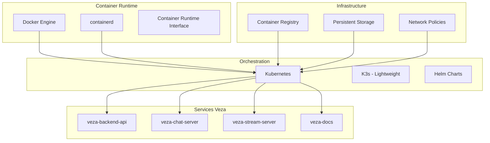

# Guide de Gestion des Conteneurs - Veza Platform

## Vue d'ensemble

Ce guide couvre la gestion complète des conteneurs dans l'écosystème Veza, incluant la conteneurisation avec Docker, l'orchestration avec Kubernetes, et les bonnes pratiques pour le déploiement et la maintenance des services.

## Table des matières

- [Architecture des Conteneurs](#architecture-des-conteneurs)
- [Configuration Docker](#configuration-docker)
- [Orchestration Kubernetes](#orchestration-kubernetes)
- [Bonnes Pratiques](#bonnes-pratiques)
- [Pièges à Éviter](#pièges-à-éviter)
- [Monitoring et Observabilité](#monitoring-et-observabilité)
- [Sécurité](#sécurité)
- [Ressources](#ressources)

## Architecture des Conteneurs

### Stack Technologique



### Structure des Conteneurs

```yaml
# docker-compose.yml - Architecture de développement
version: '3.8'
services:
  backend-api:
    build: ./veza-backend-api
    ports:
      - "8080:8080"
    environment:
      - DB_HOST=postgres
      - REDIS_HOST=redis
    depends_on:
      - postgres
      - redis
    networks:
      - veza-network

  chat-server:
    build: ./veza-chat-server
    ports:
      - "8081:8081"
    environment:
      - NATS_URL=nats://nats:4222
    depends_on:
      - nats
    networks:
      - veza-network

  stream-server:
    build: ./veza-stream-server
    ports:
      - "8082:8082"
    volumes:
      - stream-data:/app/streams
    environment:
      - S3_ENDPOINT=minio
    networks:
      - veza-network

  postgres:
    image: postgres:15-alpine
    environment:
      - POSTGRES_DB=veza
      - POSTGRES_USER=veza_user
      - POSTGRES_PASSWORD=secure_password
    volumes:
      - postgres-data:/var/lib/postgresql/data
    networks:
      - veza-network

  redis:
    image: redis:7-alpine
    command: redis-server --appendonly yes
    volumes:
      - redis-data:/data
    networks:
      - veza-network

  nats:
    image: nats:2.9-alpine
    ports:
      - "4222:4222"
    networks:
      - veza-network

volumes:
  postgres-data:
  redis-data:
  stream-data:

networks:
  veza-network:
    driver: bridge
```

## Configuration Docker

### Dockerfile Best Practices

```dockerfile
# veza-backend-api/Dockerfile
FROM golang:1.21-alpine AS builder

# Install build dependencies
RUN apk add --no-cache git ca-certificates tzdata

# Set working directory
WORKDIR /app

# Copy go mod files
COPY go.mod go.sum ./
RUN go mod download

# Copy source code
COPY . .

# Build the application
RUN CGO_ENABLED=0 GOOS=linux go build -a -installsuffix cgo -o main ./cmd/server

# Production stage
FROM alpine:latest

# Install runtime dependencies
RUN apk --no-cache add ca-certificates tzdata

# Create non-root user
RUN addgroup -g 1001 -S veza && \
    adduser -u 1001 -S veza -G veza

# Set working directory
WORKDIR /app

# Copy binary from builder
COPY --from=builder /app/main .

# Copy configuration files
COPY --from=builder /app/config.example.env ./config.env

# Change ownership
RUN chown -R veza:veza /app

# Switch to non-root user
USER veza

# Expose port
EXPOSE 8080

# Health check
HEALTHCHECK --interval=30s --timeout=3s --start-period=5s --retries=3 \
    CMD wget --no-verbose --tries=1 --spider http://localhost:8080/health || exit 1

# Run the application
CMD ["./main"]
```

### Multi-stage Builds

```dockerfile
# veza-chat-server/Dockerfile
FROM rust:1.70-alpine AS builder

# Install build dependencies
RUN apk add --no-cache musl-dev

WORKDIR /app

# Copy Cargo files
COPY Cargo.toml Cargo.lock ./
COPY src ./src

# Build the application
RUN cargo build --release

# Production stage
FROM alpine:latest

RUN apk --no-cache add ca-certificates tzdata

# Create non-root user
RUN addgroup -g 1001 -S veza && \
    adduser -u 1001 -S veza -G veza

WORKDIR /app

# Copy binary from builder
COPY --from=builder /app/target/release/veza-chat-server .

# Change ownership
RUN chown -R veza:veza /app

USER veza

EXPOSE 8081

HEALTHCHECK --interval=30s --timeout=3s --start-period=5s --retries=3 \
    CMD wget --no-verbose --tries=1 --spider http://localhost:8081/health || exit 1

CMD ["./veza-chat-server"]
```

## Orchestration Kubernetes

### Déploiement Backend API

```yaml
# k8s/backend-api-deployment.yaml
apiVersion: apps/v1
kind: Deployment
metadata:
  name: veza-backend-api
  labels:
    app: veza-backend-api
    version: v1.0.0
spec:
  replicas: 3
  selector:
    matchLabels:
      app: veza-backend-api
  template:
    metadata:
      labels:
        app: veza-backend-api
        version: v1.0.0
    spec:
      containers:
      - name: backend-api
        image: veza/backend-api:latest
        ports:
        - containerPort: 8080
        env:
        - name: DB_HOST
          valueFrom:
            configMapKeyRef:
              name: veza-config
              key: db_host
        - name: REDIS_HOST
          valueFrom:
            configMapKeyRef:
              name: veza-config
              key: redis_host
        - name: JWT_SECRET
          valueFrom:
            secretKeyRef:
              name: veza-secrets
              key: jwt_secret
        resources:
          requests:
            memory: "256Mi"
            cpu: "250m"
          limits:
            memory: "512Mi"
            cpu: "500m"
        livenessProbe:
          httpGet:
            path: /health
            port: 8080
          initialDelaySeconds: 30
          periodSeconds: 10
        readinessProbe:
          httpGet:
            path: /ready
            port: 8080
          initialDelaySeconds: 5
          periodSeconds: 5
      imagePullSecrets:
      - name: registry-secret
```

### Service Configuration

```yaml
# k8s/backend-api-service.yaml
apiVersion: v1
kind: Service
metadata:
  name: veza-backend-api-service
  labels:
    app: veza-backend-api
spec:
  type: ClusterIP
  ports:
  - port: 80
    targetPort: 8080
    protocol: TCP
    name: http
  selector:
    app: veza-backend-api
---
apiVersion: networking.k8s.io/v1
kind: Ingress
metadata:
  name: veza-backend-ingress
  annotations:
    nginx.ingress.kubernetes.io/rewrite-target: /
    cert-manager.io/cluster-issuer: letsencrypt-prod
spec:
  tls:
  - hosts:
    - api.veza.com
    secretName: veza-tls
  rules:
  - host: api.veza.com
    http:
      paths:
      - path: /
        pathType: Prefix
        backend:
          service:
            name: veza-backend-api-service
            port:
              number: 80
```

### Helm Charts

```yaml
# helm/veza/Chart.yaml
apiVersion: v2
name: veza
description: Veza Platform - Complete Stack
type: application
version: 1.0.0
appVersion: "1.0.0"

# helm/veza/values.yaml
global:
  environment: production
  domain: veza.com

backend-api:
  enabled: true
  replicaCount: 3
  image:
    repository: veza/backend-api
    tag: latest
    pullPolicy: Always
  resources:
    requests:
      memory: "256Mi"
      cpu: "250m"
    limits:
      memory: "512Mi"
      cpu: "500m"
  ingress:
    enabled: true
    host: api.veza.com

chat-server:
  enabled: true
  replicaCount: 2
  image:
    repository: veza/chat-server
    tag: latest
  resources:
    requests:
      memory: "512Mi"
      cpu: "500m"
    limits:
      memory: "1Gi"
      cpu: "1000m"

stream-server:
  enabled: true
  replicaCount: 2
  image:
    repository: veza/stream-server
    tag: latest
  persistence:
    enabled: true
    size: 10Gi

postgres:
  enabled: true
  primary:
    persistence:
      enabled: true
      size: 20Gi
  auth:
    postgresPassword: "secure_password"
    database: veza

redis:
  enabled: true
  architecture: replication
  auth:
    enabled: true
    sentinel: false
  master:
    persistence:
      enabled: true
      size: 5Gi

nats:
  enabled: true
  cluster:
    enabled: true
    replicas: 3
```

## Bonnes Pratiques

### 1. Sécurité des Images

```dockerfile
# Exemple de Dockerfile sécurisé
FROM golang:1.21-alpine AS builder

# Installer uniquement les dépendances nécessaires
RUN apk add --no-cache git ca-certificates

# Créer un utilisateur non-root
RUN addgroup -g 1001 -S appuser && \
    adduser -u 1001 -S appuser -G appuser

WORKDIR /app

# Copier et télécharger les dépendances
COPY go.mod go.sum ./
RUN go mod download

# Copier le code source
COPY . .

# Compiler avec des flags de sécurité
RUN CGO_ENABLED=0 GOOS=linux go build \
    -ldflags="-w -s" \
    -a -installsuffix cgo -o main ./cmd/server

# Image de production minimale
FROM scratch

# Copier les certificats CA
COPY --from=builder /etc/ssl/certs/ca-certificates.crt /etc/ssl/certs/

# Copier l'exécutable
COPY --from=builder /app/main /main

# Utiliser un utilisateur non-root
USER 1001:1001

EXPOSE 8080

CMD ["/main"]
```

### 2. Gestion des Secrets

```yaml
# k8s/secrets.yaml
apiVersion: v1
kind: Secret
metadata:
  name: veza-secrets
type: Opaque
data:
  jwt_secret: <base64-encoded-jwt-secret>
  db_password: <base64-encoded-db-password>
  redis_password: <base64-encoded-redis-password>
  api_key: <base64-encoded-api-key>
```

### 3. Resource Limits

```yaml
# Exemple de limites de ressources
resources:
  requests:
    memory: "256Mi"
    cpu: "250m"
  limits:
    memory: "512Mi"
    cpu: "500m"
```

### 4. Health Checks

```yaml
# Exemple de health checks
livenessProbe:
  httpGet:
    path: /health
    port: 8080
  initialDelaySeconds: 30
  periodSeconds: 10
  timeoutSeconds: 5
  failureThreshold: 3

readinessProbe:
  httpGet:
    path: /ready
    port: 8080
  initialDelaySeconds: 5
  periodSeconds: 5
  timeoutSeconds: 3
  failureThreshold: 3
```

## Pièges à Éviter

### 1. Images Trop Grosses

❌ **Mauvais** :
```dockerfile
FROM ubuntu:latest
RUN apt-get update && apt-get install -y \
    build-essential \
    git \
    curl \
    wget \
    vim \
    # ... beaucoup d'autres packages
```

✅ **Bon** :
```dockerfile
FROM golang:1.21-alpine AS builder
# Utiliser des images de base minimales
# Supprimer les dépendances de build après compilation
```

### 2. Exécution en Root

❌ **Mauvais** :
```dockerfile
# Pas d'utilisateur spécifié = root par défaut
CMD ["./app"]
```

✅ **Bon** :
```dockerfile
RUN adduser -D appuser
USER appuser
CMD ["./app"]
```

### 3. Variables d'Environnement Sensibles

❌ **Mauvais** :
```yaml
env:
- name: DB_PASSWORD
  value: "password123"  # En clair dans le YAML
```

✅ **Bon** :
```yaml
env:
- name: DB_PASSWORD
  valueFrom:
    secretKeyRef:
      name: db-secret
      key: password
```

### 4. Pas de Resource Limits

❌ **Mauvais** :
```yaml
# Pas de limites définies
containers:
- name: app
  image: app:latest
```

✅ **Bon** :
```yaml
containers:
- name: app
  image: app:latest
  resources:
    requests:
      memory: "256Mi"
      cpu: "250m"
    limits:
      memory: "512Mi"
      cpu: "500m"
```

## Monitoring et Observabilité

### Métriques de Conteneurs

```yaml
# k8s/monitoring.yaml
apiVersion: v1
kind: ConfigMap
metadata:
  name: prometheus-config
data:
  prometheus.yml: |
    global:
      scrape_interval: 15s
    
    scrape_configs:
    - job_name: 'kubernetes-pods'
      kubernetes_sd_configs:
      - role: pod
      relabel_configs:
      - source_labels: [__meta_kubernetes_pod_annotation_prometheus_io_scrape]
        action: keep
        regex: true
      - source_labels: [__meta_kubernetes_pod_annotation_prometheus_io_path]
        action: replace
        target_label: __metrics_path__
        regex: (.+)
      - source_labels: [__address__, __meta_kubernetes_pod_annotation_prometheus_io_port]
        action: replace
        regex: ([^:]+)(?::\d+)?;(\d+)
        replacement: $1:$2
        target_label: __address__
```

### Logs Centralisés

```yaml
# k8s/logging.yaml
apiVersion: v1
kind: ConfigMap
metadata:
  name: fluentd-config
data:
  fluent.conf: |
    <source>
      @type tail
      path /var/log/containers/*.log
      pos_file /var/log/fluentd-containers.log.pos
      tag kubernetes.*
      read_from_head true
      <parse>
        @type json
        time_format %Y-%m-%dT%H:%M:%S.%NZ
      </parse>
    </source>
    
    <filter kubernetes.**>
      @type kubernetes_metadata
    </filter>
    
    <match kubernetes.**>
      @type elasticsearch
      host elasticsearch
      port 9200
      logstash_format true
      logstash_prefix k8s
    </match>
```

## Sécurité

### Network Policies

```yaml
# k8s/network-policies.yaml
apiVersion: networking.k8s.io/v1
kind: NetworkPolicy
metadata:
  name: backend-api-network-policy
spec:
  podSelector:
    matchLabels:
      app: veza-backend-api
  policyTypes:
  - Ingress
  - Egress
  ingress:
  - from:
    - namespaceSelector:
        matchLabels:
          name: ingress-nginx
    ports:
    - protocol: TCP
      port: 8080
  egress:
  - to:
    - podSelector:
        matchLabels:
          app: postgres
    ports:
    - protocol: TCP
      port: 5432
  - to:
    - podSelector:
        matchLabels:
          app: redis
    ports:
    - protocol: TCP
      port: 6379
```

### Pod Security Standards

```yaml
# k8s/pod-security.yaml
apiVersion: v1
kind: Pod
metadata:
  name: secure-pod
spec:
  securityContext:
    runAsNonRoot: true
    runAsUser: 1001
    runAsGroup: 1001
    fsGroup: 1001
  containers:
  - name: app
    image: app:latest
    securityContext:
      allowPrivilegeEscalation: false
      readOnlyRootFilesystem: true
      capabilities:
        drop:
        - ALL
    volumeMounts:
    - name: tmp
      mountPath: /tmp
    - name: varlog
      mountPath: /var/log
  volumes:
  - name: tmp
    emptyDir: {}
  - name: varlog
    emptyDir: {}
```

## Ressources

### Documentation Interne

- [Guide de Déploiement](../deployment/deployment-guide.md)
- [Configuration des Environnements](../deployment/environment-variables.md)
- [Monitoring et Alerting](../monitoring/README.md)
- [Sécurité et Audit](../security/README.md)

### Outils Recommandés

- **Docker** : Conteneurisation
- **Kubernetes** : Orchestration
- **Helm** : Gestion des packages
- **Prometheus** : Monitoring
- **Grafana** : Visualisation
- **Jaeger** : Traçage distribué
- **Falco** : Détection d'anomalies

### Commandes Utiles

```bash
# Build et push d'images
docker build -t veza/backend-api:latest ./veza-backend-api
docker push veza/backend-api:latest

# Déploiement Kubernetes
kubectl apply -f k8s/
helm install veza ./helm/veza

# Monitoring
kubectl top pods
kubectl logs -f deployment/veza-backend-api

# Debugging
kubectl exec -it deployment/veza-backend-api -- /bin/sh
kubectl port-forward service/veza-backend-api-service 8080:80
```

---

**Dernière mise à jour** : $(date)
**Version du guide** : 1.0.0
**Mainteneur** : Équipe DevOps Veza 