# 🗄️ Migrations de Base de Données

Ce guide explique la gestion des migrations de base de données.

# Guide des Migrations de Base de Données - Veza Platform

## Vue d'ensemble

Ce guide détaille les stratégies et bonnes pratiques pour la gestion des migrations de base de données dans la plateforme Veza, couvrant PostgreSQL, les outils de migration, et les procédures de déploiement.

## Table des matières

- [Stratégies de Migration](#stratégies-de-migration)
- [Outils et Technologies](#outils-et-technologies)
- [Bonnes Pratiques](#bonnes-pratiques)
- [Pièges à Éviter](#pièges-à-éviter)
- [Procédures de Rollback](#procédures-de-rollback)
- [Ressources](#ressources)

## Stratégies de Migration

### 1. Types de Migrations

```mermaid
graph TB
    subgraph "Types de Migrations"
        Schema[🏗️ Schema Changes]
        Data[📊 Data Changes]
        Index[🔍 Index Changes]
        Constraint[🔒 Constraint Changes]
    end
    
    subgraph "Stratégies"
        Forward[➡️ Forward Migration]
        Backward[⬅️ Backward Migration]
        Zero_Downtime[⏱️ Zero Downtime]
        Blue_Green[🔄 Blue-Green]
    end
    
    Schema --> Forward
    Data --> Backward
    Index --> Zero_Downtime
    Constraint --> Blue_Green
```



### 2. Workflow de Migration

```yaml
# database-migrations/migration-workflow.yaml
apiVersion: v1
kind: ConfigMap
metadata:
  name: veza-migration-workflow
  namespace: veza
data:
  # Étapes de migration
  migration_steps:
    planning:
      - "Analyse des changements"
      - "Impact assessment"
      - "Plan de rollback"
      - "Test en environnement"
    
    development:
      - "Création du script"
      - "Tests unitaires"
      - "Validation locale"
      - "Code review"
    
    testing:
      - "Tests d'intégration"
      - "Tests de performance"
      - "Tests de rollback"
      - "Validation des données"
    
    deployment:
      - "Backup de production"
      - "Exécution de migration"
      - "Vérification post-migration"
      - "Monitoring"
```

## Outils et Technologies

### 1. Configuration PostgreSQL

```sql
-- database-migrations/setup/migration_setup.sql
-- Configuration des migrations PostgreSQL

-- Création de la table de migrations
CREATE TABLE IF NOT EXISTS schema_migrations (
    id SERIAL PRIMARY KEY,
    version VARCHAR(255) NOT NULL UNIQUE,
    name VARCHAR(255) NOT NULL,
    applied_at TIMESTAMP DEFAULT CURRENT_TIMESTAMP,
    checksum VARCHAR(64),
    execution_time INTEGER,
    status VARCHAR(20) DEFAULT 'success'
);

-- Index pour les performances
CREATE INDEX IF NOT EXISTS idx_schema_migrations_version 
ON schema_migrations(version);

CREATE INDEX IF NOT EXISTS idx_schema_migrations_applied_at 
ON schema_migrations(applied_at);

-- Fonction pour vérifier si une migration a été appliquée
CREATE OR REPLACE FUNCTION migration_applied(migration_version VARCHAR)
RETURNS BOOLEAN AS $$
BEGIN
    RETURN EXISTS (
        SELECT 1 FROM schema_migrations 
        WHERE version = migration_version
    );
END;
$$ LANGUAGE plpgsql;

-- Fonction pour enregistrer une migration
CREATE OR REPLACE FUNCTION record_migration(
    migration_version VARCHAR,
    migration_name VARCHAR,
    migration_checksum VARCHAR DEFAULT NULL
)
RETURNS VOID AS $$
BEGIN
    INSERT INTO schema_migrations (version, name, checksum)
    VALUES (migration_version, migration_name, migration_checksum);
END;
$$ LANGUAGE plpgsql;
```

### 2. Script de Migration

```python
# database-migrations/scripts/migration_runner.py
#!/usr/bin/env python3

import os
import sys
import logging
import hashlib
import psycopg2
from datetime import datetime
from typing import List, Dict, Optional
from dataclasses import dataclass

@dataclass
class Migration:
    version: str
    name: str
    up_sql: str
    down_sql: str
    checksum: str

class MigrationRunner:
    def __init__(self, db_config: Dict):
        self.db_config = db_config
        self.logger = self.setup_logger()
        self.connection = None
    
    def setup_logger(self) -> logging.Logger:
        """Configure le logger"""
        logging.basicConfig(
            level=logging.INFO,
            format='%(asctime)s - %(levelname)s - %(message)s',
            handlers=[
                logging.FileHandler('migration.log'),
                logging.StreamHandler()
            ]
        )
        return logging.getLogger(__name__)
    
    def connect(self):
        """Établit la connexion à la base de données"""
        try:
            self.connection = psycopg2.connect(**self.db_config)
            self.logger.info("Connexion à la base de données établie")
        except Exception as e:
            self.logger.error(f"Erreur de connexion: {e}")
            raise
    
    def disconnect(self):
        """Ferme la connexion à la base de données"""
        if self.connection:
            self.connection.close()
            self.logger.info("Connexion à la base de données fermée")
    
    def get_applied_migrations(self) -> List[str]:
        """Récupère la liste des migrations appliquées"""
        cursor = self.connection.cursor()
        cursor.execute("SELECT version FROM schema_migrations ORDER BY version")
        versions = [row[0] for row in cursor.fetchall()]
        cursor.close()
        return versions
    
    def calculate_checksum(self, sql: str) -> str:
        """Calcule le checksum d'un script SQL"""
        return hashlib.sha256(sql.encode()).hexdigest()
    
    def load_migration(self, file_path: str) -> Migration:
        """Charge une migration depuis un fichier"""
        with open(file_path, 'r') as f:
            content = f.read()
        
        # Parse le contenu pour extraire up et down
        parts = content.split('-- DOWN')
        if len(parts) != 2:
            raise ValueError(f"Format de migration invalide dans {file_path}")
        
        up_sql = parts[0].replace('-- UP', '').strip()
        down_sql = parts[1].strip()
        
        # Extrait la version et le nom du nom de fichier
        filename = os.path.basename(file_path)
        version = filename.split('_')[0]
        name = '_'.join(filename.split('_')[1:]).replace('.sql', '')
        
        checksum = self.calculate_checksum(content)
        
        return Migration(version, name, up_sql, down_sql, checksum)
    
    def apply_migration(self, migration: Migration) -> bool:
        """Applique une migration"""
        try:
            cursor = self.connection.cursor()
            
            # Vérifie si la migration a déjà été appliquée
            cursor.execute(
                "SELECT 1 FROM schema_migrations WHERE version = %s",
                (migration.version,)
            )
            if cursor.fetchone():
                self.logger.warning(f"Migration {migration.version} déjà appliquée")
                return True
            
            # Applique la migration
            start_time = datetime.now()
            cursor.execute(migration.up_sql)
            
            # Enregistre la migration
            cursor.execute(
                """
                INSERT INTO schema_migrations (version, name, checksum, execution_time)
                VALUES (%s, %s, %s, %s)
                """,
                (
                    migration.version,
                    migration.name,
                    migration.checksum,
                    (datetime.now() - start_time).total_seconds()
                )
            )
            
            self.connection.commit()
            self.logger.info(f"Migration {migration.version} appliquée avec succès")
            return True
            
        except Exception as e:
            self.connection.rollback()
            self.logger.error(f"Erreur lors de l'application de la migration {migration.version}: {e}")
            return False
        finally:
            cursor.close()
    
    def rollback_migration(self, migration: Migration) -> bool:
        """Annule une migration"""
        try:
            cursor = self.connection.cursor()
            
            # Vérifie si la migration a été appliquée
            cursor.execute(
                "SELECT 1 FROM schema_migrations WHERE version = %s",
                (migration.version,)
            )
            if not cursor.fetchone():
                self.logger.warning(f"Migration {migration.version} non appliquée")
                return True
            
            # Annule la migration
            start_time = datetime.now()
            cursor.execute(migration.down_sql)
            
            # Supprime l'enregistrement de migration
            cursor.execute(
                "DELETE FROM schema_migrations WHERE version = %s",
                (migration.version,)
            )
            
            self.connection.commit()
            self.logger.info(f"Migration {migration.version} annulée avec succès")
            return True
            
        except Exception as e:
            self.connection.rollback()
            self.logger.error(f"Erreur lors de l'annulation de la migration {migration.version}: {e}")
            return False
        finally:
            cursor.close()
    
    def run_migrations(self, migrations_dir: str) -> bool:
        """Exécute toutes les migrations en attente"""
        try:
            self.connect()
            
            # Récupère les migrations appliquées
            applied_migrations = set(self.get_applied_migrations())
            
            # Charge et applique les nouvelles migrations
            migration_files = sorted([
                f for f in os.listdir(migrations_dir)
                if f.endswith('.sql')
            ])
            
            for migration_file in migration_files:
                migration_path = os.path.join(migrations_dir, migration_file)
                migration = self.load_migration(migration_path)
                
                if migration.version not in applied_migrations:
                    self.logger.info(f"Application de la migration {migration.version}")
                    if not self.apply_migration(migration):
                        return False
                else:
                    self.logger.info(f"Migration {migration.version} déjà appliquée")
            
            return True
            
        finally:
            self.disconnect()
    
    def rollback_migrations(self, migrations_dir: str, count: int = 1) -> bool:
        """Annule les dernières migrations"""
        try:
            self.connect()
            
            # Récupère les migrations appliquées dans l'ordre inverse
            cursor = self.connection.cursor()
            cursor.execute(
                "SELECT version FROM schema_migrations ORDER BY applied_at DESC LIMIT %s",
                (count,)
            )
            versions_to_rollback = [row[0] for row in cursor.fetchall()]
            cursor.close()
            
            # Annule les migrations
            for version in versions_to_rollback:
                migration_file = f"{version}_*.sql"
                migration_files = [
                    f for f in os.listdir(migrations_dir)
                    if f.startswith(version) and f.endswith('.sql')
                ]
                
                if migration_files:
                    migration_path = os.path.join(migrations_dir, migration_files[0])
                    migration = self.load_migration(migration_path)
                    
                    self.logger.info(f"Annulation de la migration {migration.version}")
                    if not self.rollback_migration(migration):
                        return False
            
            return True
            
        finally:
            self.disconnect()

if __name__ == "__main__":
    import argparse
    
    parser = argparse.ArgumentParser(description='Migration runner')
    parser.add_argument('--migrations-dir', required=True, help='Directory containing migrations')
    parser.add_argument('--rollback', type=int, help='Number of migrations to rollback')
    parser.add_argument('--db-host', required=True, help='Database host')
    parser.add_argument('--db-port', type=int, default=5432, help='Database port')
    parser.add_argument('--db-name', required=True, help='Database name')
    parser.add_argument('--db-user', required=True, help='Database user')
    parser.add_argument('--db-password', required=True, help='Database password')
    
    args = parser.parse_args()
    
    db_config = {
        'host': args.db_host,
        'port': args.db_port,
        'database': args.db_name,
        'user': args.db_user,
        'password': args.db_password
    }
    
    runner = MigrationRunner(db_config)
    
    if args.rollback:
        success = runner.rollback_migrations(args.migrations_dir, args.rollback)
    else:
        success = runner.run_migrations(args.migrations_dir)
    
    sys.exit(0 if success else 1)
```

## Bonnes Pratiques

### 1. Conventions de Nommage

```yaml
# database-migrations/conventions/naming.yaml
apiVersion: v1
kind: ConfigMap
metadata:
  name: veza-migration-naming
  namespace: veza
data:
  # Format des noms de fichiers
  file_naming:
    format: "{timestamp}_{description}.sql"
    examples:
      - "001_create_users_table.sql"
      - "002_add_email_index.sql"
      - "003_add_user_roles.sql"
  
  # Conventions de nommage
  naming_conventions:
    tables:
      - "Utiliser snake_case"
      - "Noms descriptifs"
      - "Éviter les abréviations"
      - "Préfixer avec le module si nécessaire"
    
    columns:
      - "Utiliser snake_case"
      - "Noms explicites"
      - "Éviter les mots réservés"
      - "Utiliser des types appropriés"
    
    indexes:
      - "idx_{table}_{columns}"
      - "idx_{table}_{purpose}"
      - "unique_{table}_{columns}"
  
  # Exemples
  examples:
    tables:
      - "users"
      - "user_profiles"
      - "chat_rooms"
      - "chat_messages"
    
    columns:
      - "created_at"
      - "updated_at"
      - "user_id"
      - "email_address"
    
    indexes:
      - "idx_users_email"
      - "idx_chat_messages_room_id"
      - "unique_users_email"
```

### 2. Structure des Migrations

```sql
-- database-migrations/examples/001_create_users_table.sql
-- UP
-- Migration: Create users table
-- Description: Initial users table with basic fields
-- Author: Veza Development Team
-- Date: 2024-01-15

-- Create users table
CREATE TABLE users (
    id UUID PRIMARY KEY DEFAULT gen_random_uuid(),
    email VARCHAR(255) NOT NULL UNIQUE,
    password_hash VARCHAR(255) NOT NULL,
    first_name VARCHAR(100) NOT NULL,
    last_name VARCHAR(100) NOT NULL,
    role VARCHAR(20) NOT NULL DEFAULT 'user',
    is_active BOOLEAN NOT NULL DEFAULT true,
    email_verified BOOLEAN NOT NULL DEFAULT false,
    created_at TIMESTAMP NOT NULL DEFAULT CURRENT_TIMESTAMP,
    updated_at TIMESTAMP NOT NULL DEFAULT CURRENT_TIMESTAMP
);

-- Create indexes
CREATE INDEX idx_users_email ON users(email);
CREATE INDEX idx_users_role ON users(role);
CREATE INDEX idx_users_created_at ON users(created_at);

-- Create updated_at trigger
CREATE OR REPLACE FUNCTION update_updated_at_column()
RETURNS TRIGGER AS $$
BEGIN
    NEW.updated_at = CURRENT_TIMESTAMP;
    RETURN NEW;
END;
$$ language 'plpgsql';

CREATE TRIGGER update_users_updated_at 
    BEFORE UPDATE ON users 
    FOR EACH ROW 
    EXECUTE FUNCTION update_updated_at_column();

-- DOWN
-- Rollback: Drop users table
DROP TABLE IF EXISTS users CASCADE;
DROP FUNCTION IF EXISTS update_updated_at_column() CASCADE;
```

## Pièges à Éviter

### 1. Migrations Irréversibles

❌ **Mauvais** :
```sql
-- Migration irréversible
ALTER TABLE users DROP COLUMN email;
```

✅ **Bon** :
```sql
-- Migration réversible
-- UP
ALTER TABLE users DROP COLUMN email;

-- DOWN
ALTER TABLE users ADD COLUMN email VARCHAR(255);
```

### 2. Pas de Tests de Rollback

❌ **Mauvais** :
```bash
# Pas de test de rollback
python3 migration_runner.py --migrations-dir ./migrations
```

✅ **Bon** :
```bash
# Test complet avec rollback
python3 migration_runner.py --migrations-dir ./migrations
python3 migration_runner.py --migrations-dir ./migrations --rollback 1
python3 migration_runner.py --migrations-dir ./migrations
```

### 3. Migrations avec Données de Test

❌ **Mauvais** :
```sql
-- Migration avec données de test
INSERT INTO users (email, password_hash, first_name, last_name)
VALUES ('test@example.com', 'hash', 'Test', 'User');
```

✅ **Bon** :
```sql
-- Migration sans données de test
-- Les données de test doivent être dans des seeders séparés
-- ou dans des environnements de développement
```

## Procédures de Rollback

### 1. Script de Rollback Automatique

```bash
#!/bin/bash
# database-migrations/scripts/rollback.sh

set -e

# Configuration
DB_HOST="${DB_HOST:-localhost}"
DB_PORT="${DB_PORT:-5432}"
DB_NAME="${DB_NAME:-veza}"
DB_USER="${DB_USER:-postgres}"
DB_PASSWORD="${DB_PASSWORD:-password}"
MIGRATIONS_DIR="${MIGRATIONS_DIR:-./migrations}"
ROLLBACK_COUNT="${ROLLBACK_COUNT:-1}"

# Couleurs pour les logs
RED='\033[0;31m'
GREEN='\033[0;32m'
YELLOW='\033[1;33m'
NC='\033[0m' # No Color

# Fonctions de logging
log_info() {
    echo -e "${GREEN}[INFO]${NC} $1"
}

log_warn() {
    echo -e "${YELLOW}[WARN]${NC} $1"
}

log_error() {
    echo -e "${RED}[ERROR]${NC} $1"
}

# Vérification des prérequis
check_prerequisites() {
    log_info "Vérification des prérequis..."
    
    if ! command -v psql &> /dev/null; then
        log_error "psql n'est pas installé"
        exit 1
    fi
    
    if ! command -v python3 &> /dev/null; then
        log_error "python3 n'est pas installé"
        exit 1
    fi
    
    if [ ! -d "$MIGRATIONS_DIR" ]; then
        log_error "Le répertoire de migrations n'existe pas: $MIGRATIONS_DIR"
        exit 1
    fi
    
    log_info "Prérequis vérifiés"
}

# Test de connexion à la base de données
test_connection() {
    log_info "Test de connexion à la base de données..."
    
    export PGPASSWORD="$DB_PASSWORD"
    
    if ! psql -h "$DB_HOST" -p "$DB_PORT" -U "$DB_USER" -d "$DB_NAME" -c "SELECT 1;" &> /dev/null; then
        log_error "Impossible de se connecter à la base de données"
        exit 1
    fi
    
    log_info "Connexion à la base de données établie"
}

# Sauvegarde de la base de données
backup_database() {
    log_info "Sauvegarde de la base de données..."
    
    BACKUP_FILE="backup_$(date +%Y%m%d_%H%M%S).sql"
    
    export PGPASSWORD="$DB_PASSWORD"
    
    if pg_dump -h "$DB_HOST" -p "$DB_PORT" -U "$DB_USER" -d "$DB_NAME" > "$BACKUP_FILE"; then
        log_info "Sauvegarde créée: $BACKUP_FILE"
    else
        log_error "Échec de la sauvegarde"
        exit 1
    fi
}

# Exécution du rollback
execute_rollback() {
    log_info "Exécution du rollback de $ROLLBACK_COUNT migration(s)..."
    
    if python3 migration_runner.py \
        --migrations-dir "$MIGRATIONS_DIR" \
        --rollback "$ROLLBACK_COUNT" \
        --db-host "$DB_HOST" \
        --db-port "$DB_PORT" \
        --db-name "$DB_NAME" \
        --db-user "$DB_USER" \
        --db-password "$DB_PASSWORD"; then
        log_info "Rollback exécuté avec succès"
    else
        log_error "Échec du rollback"
        return 1
    fi
}

# Vérification post-rollback
verify_rollback() {
    log_info "Vérification post-rollback..."
    
    export PGPASSWORD="$DB_PASSWORD"
    
    # Vérification de l'intégrité de la base de données
    if psql -h "$DB_HOST" -p "$DB_PORT" -U "$DB_USER" -d "$DB_NAME" -c "SELECT COUNT(*) FROM schema_migrations;" &> /dev/null; then
        log_info "Vérification de l'intégrité réussie"
    else
        log_error "Problème d'intégrité détecté"
        return 1
    fi
}

# Fonction principale
main() {
    log_info "Début du rollback de migrations"
    
    check_prerequisites
    test_connection
    backup_database
    execute_rollback
    verify_rollback
    
    log_info "Rollback terminé avec succès"
}

# Gestion des erreurs
trap 'log_error "Erreur lors de l\'exécution du script"; exit 1' ERR

# Exécution
main "$@"
```

## Ressources

### Documentation Interne

- [Guide de Développement](./development-guide.md)
- [Guide de Base de Données](../database/README.md)
- [Guide de Déploiement](../deployment/README.md)

### Outils Recommandés

- **Alembic** : Migrations Python
- **Flyway** : Migrations Java
- **Liquibase** : Migrations XML
- **pg_dump** : Sauvegarde PostgreSQL

### Commandes Utiles

```bash
# Exécution des migrations
python3 migration_runner.py --migrations-dir ./migrations

# Rollback
python3 migration_runner.py --migrations-dir ./migrations --rollback 1

# Sauvegarde
pg_dump -h localhost -U postgres -d veza > backup.sql

# Restauration
psql -h localhost -U postgres -d veza < backup.sql
```

---

**Dernière mise à jour** : $(date)
**Version du guide** : 1.0.0
**Mainteneur** : Équipe Database Veza 