# Guide de Développement - Veza Platform

## Vue d'ensemble

Ce guide détaille les processus de développement pour la plateforme Veza, couvrant les outils, les workflows et les bonnes pratiques.

## Table des matières

- [Environnement de Développement](#environnement-de-développement)
- [Workflow de Développement](#workflow-de-développement)
- [Outils et Technologies](#outils-et-technologies)
- [Bonnes Pratiques](#bonnes-pratiques)
- [Pièges à Éviter](#pièges-à-éviter)
- [Ressources](#ressources)

## Environnement de Développement

### 1. Configuration de l'Environnement

```yaml
# development-guide/environment/dev-setup.yaml
apiVersion: v1
kind: ConfigMap
metadata:
  name: veza-dev-environment
  namespace: veza
data:
  # Prérequis système
  system_requirements:
    - "Go 1.21+"
    - "Rust 1.70+"
    - "Node.js 18+"
    - "Docker 20+"
    - "Kubernetes 1.27+"
    - "PostgreSQL 15+"
    - "Redis 7+"
  
  # Outils de développement
  development_tools:
    - "VS Code ou GoLand"
    - "Git"
    - "Make"
    - "Docker Compose"
    - "kubectl"
    - "helm"
  
  # Extensions VS Code recommandées
  vscode_extensions:
    - "golang.go"
    - "rust-lang.rust-analyzer"
    - "ms-vscode.vscode-typescript-next"
    - "ms-kubernetes-tools.vscode-kubernetes-tools"
    - "ms-vscode.vscode-docker"
    - "esbenp.prettier-vscode"
    - "ms-vscode.vscode-eslint"
  
  # Variables d'environnement
  environment_variables:
    - "GO_ENV=development"
    - "RUST_ENV=development"
    - "NODE_ENV=development"
    - "DATABASE_URL=postgresql://localhost:5432/veza_dev"
    - "REDIS_URL=redis://localhost:6379"
    - "LOG_LEVEL=debug"
```

### 2. Script de Configuration

```bash
#!/bin/bash
# development-guide/scripts/setup-dev-environment.sh

# Configuration
PROJECT_ROOT="$(cd "$(dirname "${BASH_SOURCE[0]}")/../.." && pwd)"
OS="$(uname -s)"

# Couleurs
RED='\033[0;31m'
GREEN='\033[0;32m'
YELLOW='\033[1;33m'
BLUE='\033[0;34m'
NC='\033[0m'

# Fonctions de logging
log_info() {
    echo -e "${GREEN}[INFO]${NC} $1"
}

log_warn() {
    echo -e "${YELLOW}[WARN]${NC} $1"
}

log_error() {
    echo -e "${RED}[ERROR]${NC} $1"
}

log_step() {
    echo -e "${BLUE}[STEP]${NC} $1"
}

# Vérification des prérequis
check_prerequisites() {
    log_step "Vérification des prérequis"
    
    # Vérification de Go
    if command -v go &> /dev/null; then
        go_version=$(go version | awk '{print $3}')
        log_info "Go installé: $go_version"
    else
        log_error "Go n'est pas installé"
        return 1
    fi
    
    # Vérification de Rust
    if command -v rustc &> /dev/null; then
        rust_version=$(rustc --version | awk '{print $2}')
        log_info "Rust installé: $rust_version"
    else
        log_error "Rust n'est pas installé"
        return 1
    fi
    
    # Vérification de Node.js
    if command -v node &> /dev/null; then
        node_version=$(node --version)
        log_info "Node.js installé: $node_version"
    else
        log_error "Node.js n'est pas installé"
        return 1
    fi
    
    # Vérification de Docker
    if command -v docker &> /dev/null; then
        docker_version=$(docker --version | awk '{print $3}' | sed 's/,//')
        log_info "Docker installé: $docker_version"
    else
        log_error "Docker n'est pas installé"
        return 1
    fi
    
    # Vérification de kubectl
    if command -v kubectl &> /dev/null; then
        kubectl_version=$(kubectl version --client --short | awk '{print $3}')
        log_info "kubectl installé: $kubectl_version"
    else
        log_error "kubectl n'est pas installé"
        return 1
    fi
}

# Installation des outils de développement
install_dev_tools() {
    log_step "Installation des outils de développement"
    
    # Installation de Make si nécessaire
    if ! command -v make &> /dev/null; then
        if [[ "$OS" == "Darwin" ]]; then
            brew install make
        elif [[ "$OS" == "Linux" ]]; then
            sudo apt-get install make
        fi
    fi
    
    # Installation de Helm
    if ! command -v helm &> /dev/null; then
        curl https://get.helm.sh/helm-v3.12.0-linux-amd64.tar.gz | tar xz
        sudo mv linux-amd64/helm /usr/local/bin/
        rm -rf linux-amd64
    fi
    
    # Installation des outils Go
    go install github.com/golangci/golangci-lint/cmd/golangci-lint@latest
    go install github.com/go-delve/delve/cmd/dlv@latest
    go install golang.org/x/tools/cmd/goimports@latest
    
    # Installation des outils Rust
    cargo install clippy
    cargo install rustfmt
    cargo install cargo-audit
    
    # Installation des outils Node.js
    npm install -g eslint prettier typescript
}

# Configuration de l'environnement local
setup_local_environment() {
    log_step "Configuration de l'environnement local"
    
    # Création des répertoires
    mkdir -p "$PROJECT_ROOT/logs"
    mkdir -p "$PROJECT_ROOT/data"
    mkdir -p "$PROJECT_ROOT/config"
    
    # Configuration de la base de données locale
    if ! docker ps | grep -q postgres; then
        log_info "Démarrage de PostgreSQL"
        docker run -d \
            --name veza-postgres \
            -e POSTGRES_DB=veza_dev \
            -e POSTGRES_USER=veza_dev \
            -e POSTGRES_PASSWORD=dev_password \
            -p 5432:5432 \
            postgres:15
    fi
    
    # Configuration de Redis
    if ! docker ps | grep -q redis; then
        log_info "Démarrage de Redis"
        docker run -d \
            --name veza-redis \
            -p 6379:6379 \
            redis:7-alpine
    fi
    
    # Attente des services
    log_info "Attente des services..."
    sleep 10
    
    # Vérification des services
    if docker exec veza-postgres pg_isready -U veza_dev; then
        log_info "PostgreSQL est prêt"
    else
        log_error "PostgreSQL n'est pas accessible"
        return 1
    fi
    
    if docker exec veza-redis redis-cli ping | grep -q PONG; then
        log_info "Redis est prêt"
    else
        log_error "Redis n'est pas accessible"
        return 1
    fi
}

# Configuration des hooks Git
setup_git_hooks() {
    log_step "Configuration des hooks Git"
    
    # Création du répertoire hooks
    mkdir -p "$PROJECT_ROOT/.git/hooks"
    
    # Hook pre-commit
    cat > "$PROJECT_ROOT/.git/hooks/pre-commit" << 'EOF'
#!/bin/bash
set -e

echo "Exécution des hooks pre-commit..."

# Linting Go
if command -v golangci-lint &> /dev/null; then
    echo "Linting Go..."
    golangci-lint run
fi

# Formatage Go
if command -v goimports &> /dev/null; then
    echo "Formatage Go..."
    goimports -w .
fi

# Tests Go
echo "Tests Go..."
go test ./...

# Linting Rust
if command -v cargo &> /dev/null; then
    echo "Linting Rust..."
    cargo clippy --all-targets --all-features -- -D warnings
fi

# Formatage Rust
if command -v rustfmt &> /dev/null; then
    echo "Formatage Rust..."
    cargo fmt --all
fi

# Tests Rust
echo "Tests Rust..."
cargo test

# Linting JavaScript/TypeScript
if command -v eslint &> /dev/null; then
    echo "Linting JavaScript/TypeScript..."
    eslint --ext .js,.ts,.jsx,.tsx src/
fi

# Formatage JavaScript/TypeScript
if command -v prettier &> /dev/null; then
    echo "Formatage JavaScript/TypeScript..."
    prettier --write src/
fi

echo "Hooks pre-commit terminés avec succès"
EOF

    chmod +x "$PROJECT_ROOT/.git/hooks/pre-commit"
    
    log_info "Hooks Git configurés"
}

# Configuration des alias utiles
setup_aliases() {
    log_step "Configuration des alias"
    
    # Création du fichier d'alias
    cat > "$PROJECT_ROOT/.dev-aliases" << 'EOF'
# Alias de développement Veza
alias veza-dev="docker-compose -f docker-compose.dev.yml"
alias veza-test="make test"
alias veza-build="make build"
alias veza-run="make run"
alias veza-lint="make lint"
alias veza-clean="make clean"
alias veza-docs="make docs"
alias veza-deploy="make deploy"

# Alias Kubernetes
alias k="kubectl"
alias kg="kubectl get"
alias kd="kubectl describe"
alias kl="kubectl logs"
alias kx="kubectl exec -it"

# Alias Docker
alias dc="docker-compose"
alias dps="docker ps"
alias dlogs="docker logs"
alias dexec="docker exec -it"

# Alias de développement
alias dev-backend="cd veza-backend-api && go run cmd/server/main.go"
alias dev-chat="cd veza-chat-server && cargo run"
alias dev-stream="cd veza-stream-server && cargo run"
alias dev-frontend="cd veza-frontend && npm run dev"
EOF

    log_info "Alias configurés dans .dev-aliases"
    log_info "Ajoutez 'source .dev-aliases' à votre .bashrc ou .zshrc"
}

# Fonction principale
main() {
    log_info "Configuration de l'environnement de développement Veza"
    
    # Vérification des prérequis
    if ! check_prerequisites; then
        log_error "Prérequis non satisfaits"
        exit 1
    fi
    
    # Installation des outils
    install_dev_tools
    
    # Configuration de l'environnement local
    setup_local_environment
    
    # Configuration des hooks Git
    setup_git_hooks
    
    # Configuration des alias
    setup_aliases
    
    log_info "Environnement de développement configuré avec succès"
    log_info "Prochaines étapes:"
    log_info "1. Ajoutez 'source .dev-aliases' à votre shell"
    log_info "2. Lancez 'make dev' pour démarrer tous les services"
    log_info "3. Consultez la documentation dans docs/"
}

# Exécution
main "$@"
```

## Workflow de Développement

### 1. Processus de Développement

```mermaid
graph TB
    subgraph "Workflow de Développement"
        Planning[📋 Planning]
        Development[💻 Development]
        Testing[🧪 Testing]
        Review[🔍 Code Review]
        Deployment[🚀 Deployment]
        Monitoring[📊 Monitoring]
    end
    
    subgraph "Étapes Clés"
        Requirements[📝 Requirements]
        Implementation[⚙️ Implementation]
        Validation[✅ Validation]
        Integration[🔗 Integration]
        Verification[🔍 Verification]
        Feedback[🔄 Feedback]
    end
    
    Planning --> Requirements
    Development --> Implementation
    Testing --> Validation
    Review --> Integration
    Deployment --> Verification
    Monitoring --> Feedback
    
    Requirements --> Development
    Implementation --> Testing
    Validation --> Review
    Integration --> Deployment
    Verification --> Monitoring
    Feedback --> Planning
```



### 2. Scripts de Workflow

```bash
#!/bin/bash
# development-guide/scripts/dev-workflow.sh

# Configuration
PROJECT_ROOT="$(cd "$(dirname "${BASH_SOURCE[0]}")/../.." && pwd)"

# Fonctions de workflow
start_development() {
    local feature_name="$1"
    
    log_info "Démarrage du développement: $feature_name"
    
    # Création de la branche
    git checkout -b "feature/$feature_name"
    
    # Mise à jour des dépendances
    make update-deps
    
    # Démarrage des services
    make dev
    
    log_info "Environnement de développement prêt"
}

run_tests() {
    log_info "Exécution des tests"
    
    # Tests Go
    cd veza-backend-api
    go test -v ./...
    cd ..
    
    # Tests Rust
    cd veza-chat-server
    cargo test
    cd ..
    
    cd veza-stream-server
    cargo test
    cd ..
    
    # Tests JavaScript/TypeScript
    if [ -d "veza-frontend" ]; then
        cd veza-frontend
        npm test
        cd ..
    fi
    
    log_info "Tests terminés"
}

run_linting() {
    log_info "Exécution du linting"
    
    # Linting Go
    golangci-lint run
    
    # Linting Rust
    cargo clippy --all-targets --all-features -- -D warnings
    
    # Linting JavaScript/TypeScript
    if command -v eslint &> /dev/null; then
        eslint --ext .js,.ts,.jsx,.tsx src/
    fi
    
    log_info "Linting terminé"
}

build_project() {
    log_info "Build du projet"
    
    # Build Go
    cd veza-backend-api
    go build -o bin/server cmd/server/main.go
    cd ..
    
    # Build Rust
    cd veza-chat-server
    cargo build --release
    cd ..
    
    cd veza-stream-server
    cargo build --release
    cd ..
    
    # Build JavaScript/TypeScript
    if [ -d "veza-frontend" ]; then
        cd veza-frontend
        npm run build
        cd ..
    fi
    
    log_info "Build terminé"
}

deploy_staging() {
    log_info "Déploiement en staging"
    
    # Build des images Docker
    docker-compose -f docker-compose.staging.yml build
    
    # Déploiement Kubernetes
    kubectl apply -f k8s/staging/
    
    # Vérification du déploiement
    kubectl rollout status deployment/veza-backend-api -n veza-staging
    kubectl rollout status deployment/veza-chat-server -n veza-staging
    kubectl rollout status deployment/veza-stream-server -n veza-staging
    
    log_info "Déploiement staging terminé"
}

# Menu principal
case "${1:-}" in
    start)
        start_development "${2:-}"
        ;;
    test)
        run_tests
        ;;
    lint)
        run_linting
        ;;
    build)
        build_project
        ;;
    deploy-staging)
        deploy_staging
        ;;
    *)
        echo "Usage: $0 {start|test|lint|build|deploy-staging} [feature_name]"
        exit 1
        ;;
esac
```

## Outils et Technologies

### 1. Stack Technologique

```yaml
# development-guide/tech-stack/technology-stack.yaml
apiVersion: v1
kind: ConfigMap
metadata:
  name: veza-tech-stack
  namespace: veza
data:
  # Backend
  backend:
    language: "Go"
    framework: "Gin"
    database: "PostgreSQL"
    cache: "Redis"
    message_queue: "RabbitMQ"
    search: "Elasticsearch"
  
  # Services spécialisés
  specialized_services:
    chat_server:
      language: "Rust"
      framework: "Tokio"
      protocol: "WebSocket"
      features: ["Real-time messaging", "Presence", "Typing indicators"]
    
    stream_server:
      language: "Rust"
      framework: "Tokio"
      protocol: "HTTP/2"
      features: ["Audio streaming", "Live recording", "Playlist management"]
  
  # Frontend
  frontend:
    framework: "React"
    language: "TypeScript"
    styling: "Tailwind CSS"
    state_management: "Redux Toolkit"
    routing: "React Router"
  
  # Infrastructure
  infrastructure:
    containerization: "Docker"
    orchestration: "Kubernetes"
    monitoring: "Prometheus + Grafana"
    logging: "ELK Stack"
    tracing: "Jaeger"
    ci_cd: "GitHub Actions"
  
  # Base de données
  databases:
    primary: "PostgreSQL"
    cache: "Redis"
    search: "Elasticsearch"
    time_series: "InfluxDB"
  
  # Outils de développement
  development_tools:
    ide: "VS Code / GoLand"
    version_control: "Git"
    package_manager_go: "Go Modules"
    package_manager_rust: "Cargo"
    package_manager_js: "npm/yarn"
    testing_go: "Go testing"
    testing_rust: "Cargo test"
    testing_js: "Jest"
    linting_go: "golangci-lint"
    linting_rust: "clippy"
    linting_js: "ESLint"
    formatting_go: "goimports"
    formatting_rust: "rustfmt"
    formatting_js: "Prettier"
```

### 2. Configuration des Outils

```go
// development-guide/tools/dev-tools.go
package tools

import (
    "fmt"
    "os"
    "os/exec"
    "path/filepath"
)

// Gestionnaire d'outils de développement
type DevTools struct {
    projectRoot string
}

func NewDevTools(projectRoot string) *DevTools {
    return &DevTools{
        projectRoot: projectRoot,
    }
}

// Installation des outils Go
func (dt *DevTools) InstallGoTools() error {
    tools := []string{
        "github.com/golangci/golangci-lint/cmd/golangci-lint@latest",
        "github.com/go-delve/delve/cmd/dlv@latest",
        "golang.org/x/tools/cmd/goimports@latest",
        "github.com/golang/mock/mockgen@latest",
        "github.com/vektra/mockery/v2@latest",
    }
    
    for _, tool := range tools {
        if err := exec.Command("go", "install", tool).Run(); err != nil {
            return fmt.Errorf("échec de l'installation de %s: %v", tool, err)
        }
    }
    
    return nil
}

// Configuration de golangci-lint
func (dt *DevTools) SetupGolangCILint() error {
    config := `
run:
  timeout: 5m
  modules-download-mode: readonly

linters:
  enable:
    - gofmt
    - goimports
    - govet
    - errcheck
    - staticcheck
    - gosimple
    - ineffassign
    - unused
    - misspell
    - gosec

linters-settings:
  gofmt:
    simplify: true
  goimports:
    local-prefixes: github.com/veza

issues:
  exclude-rules:
    - path: _test\.go
      linters:
        - errcheck
`
    
    return os.WriteFile(filepath.Join(dt.projectRoot, ".golangci.yml"), []byte(config), 0644)
}

// Configuration de VS Code
func (dt *DevTools) SetupVSCode() error {
    settings := `{
    "go.useLanguageServer": true,
    "go.lintTool": "golangci-lint",
    "go.formatTool": "goimports",
    "editor.formatOnSave": true,
    "editor.codeActionsOnSave": {
        "source.organizeImports": true
    },
    "files.exclude": {
        "**/node_modules": true,
        "**/target": true,
        "**/dist": true
    },
    "search.exclude": {
        "**/node_modules": true,
        "**/target": true,
        "**/dist": true
    }
}`
    
    vscodeDir := filepath.Join(dt.projectRoot, ".vscode")
    if err := os.MkdirAll(vscodeDir, 0755); err != nil {
        return err
    }
    
    return os.WriteFile(filepath.Join(vscodeDir, "settings.json"), []byte(settings), 0644)
}
```

## Bonnes Pratiques

### 1. Règles de Développement

```yaml
# development-guide/best-practices/development-rules.yaml
apiVersion: v1
kind: ConfigMap
metadata:
  name: veza-development-rules
  namespace: veza
data:
  # Règles de code
  code_rules:
    - "Suivre les conventions de nommage"
    - "Écrire du code lisible et maintenable"
    - "Documenter les fonctions publiques"
    - "Utiliser des types appropriés"
    - "Gérer les erreurs explicitement"
  
  # Règles de tests
  testing_rules:
    - "Écrire des tests pour chaque fonctionnalité"
    - "Maintenir une couverture de code > 80%"
    - "Utiliser des tests unitaires et d'intégration"
    - "Tester les cas d'erreur"
    - "Utiliser des mocks pour les dépendances externes"
  
  # Règles de performance
  performance_rules:
    - "Optimiser les requêtes base de données"
    - "Utiliser le caching approprié"
    - "Éviter les allocations inutiles"
    - "Profiler le code critique"
    - "Monitorer les performances"
  
  # Règles de sécurité
  security_rules:
    - "Valider toutes les entrées utilisateur"
    - "Utiliser des requêtes préparées"
    - "Chiffrer les données sensibles"
    - "Implémenter l'authentification et l'autorisation"
    - "Auditer le code régulièrement"
  
  # Règles de documentation
  documentation_rules:
    - "Maintenir la documentation à jour"
    - "Documenter les APIs"
    - "Créer des guides d'utilisation"
    - "Documenter les décisions d'architecture"
    - "Maintenir un changelog"
```

### 2. Standards de Code

```go
// development-guide/standards/code-standards.go
package standards

import (
    "fmt"
    "strings"
)

// Standards de nommage
type NamingStandards struct{}

func (ns *NamingStandards) ValidateFunctionName(name string) error {
    if !strings.HasPrefix(name, strings.ToLower(name[:1])) {
        return fmt.Errorf("nom de fonction doit commencer par une minuscule: %s", name)
    }
    
    if strings.Contains(name, "_") {
        return fmt.Errorf("nom de fonction ne doit pas contenir d'underscore: %s", name)
    }
    
    return nil
}

func (ns *NamingStandards) ValidateVariableName(name string) error {
    if !strings.HasPrefix(name, strings.ToLower(name[:1])) {
        return fmt.Errorf("nom de variable doit commencer par une minuscule: %s", name)
    }
    
    return nil
}

func (ns *NamingStandards) ValidateConstantName(name string) error {
    if name != strings.ToUpper(name) {
        return fmt.Errorf("nom de constante doit être en majuscules: %s", name)
    }
    
    return nil
}

// Standards de structure
type StructureStandards struct{}

func (ss *StructureStandards) ValidateFileStructure(filePath string) error {
    // Vérification de la structure des fichiers
    if strings.Contains(filePath, " ") {
        return fmt.Errorf("nom de fichier ne doit pas contenir d'espaces: %s", filePath)
    }
    
    return nil
}

func (ss *StructureStandards) ValidatePackageName(packageName string) error {
    if strings.Contains(packageName, "_") {
        return fmt.Errorf("nom de package ne doit pas contenir d'underscore: %s", packageName)
    }
    
    return nil
}

// Standards de documentation
type DocumentationStandards struct{}

func (ds *DocumentationStandards) ValidateFunctionComment(funcName, comment string) error {
    if comment == "" {
        return fmt.Errorf("fonction %s doit avoir un commentaire", funcName)
    }
    
    if !strings.HasPrefix(comment, funcName) {
        return fmt.Errorf("commentaire de fonction %s doit commencer par le nom de la fonction", funcName)
    }
    
    return nil
}

func (ds *DocumentationStandards) ValidatePackageComment(packageName, comment string) error {
    if comment == "" {
        return fmt.Errorf("package %s doit avoir un commentaire", packageName)
    }
    
    return nil
}
```

## Pièges à Éviter

### 1. Code Non Testé

❌ **Mauvais** :
```go
// Fonction sans test
func ProcessData(data []byte) error {
    // Logique sans test
    return nil
}
```

✅ **Bon** :
```go
// Fonction avec test
func ProcessData(data []byte) error {
    // Logique avec test
    return nil
}

func TestProcessData(t *testing.T) {
    data := []byte("test data")
    err := ProcessData(data)
    if err != nil {
        t.Errorf("ProcessData failed: %v", err)
    }
}
```

### 2. Gestion d'Erreurs Inappropriée

❌ **Mauvais** :
```go
// Ignorer les erreurs
result, _ := someFunction()
```

✅ **Bon** :
```go
// Gérer les erreurs explicitement
result, err := someFunction()
if err != nil {
    return fmt.Errorf("failed to execute someFunction: %w", err)
}
```

### 3. Documentation Manquante

❌ **Mauvais** :
```go
// Pas de documentation
func complexFunction() {
    // Logique complexe sans explication
}
```

✅ **Bon** :
```go
// Avec documentation
// complexFunction traite les données utilisateur et applique
// les règles métier spécifiques au contexte Veza.
// Elle retourne une erreur si les données sont invalides.
func complexFunction() error {
    // Logique avec documentation
    return nil
}
```

## Ressources

### Documentation Interne

- [Guide d'API](./api-design.md)
- [Guide de Tests](../testing/README.md)
- [Guide de Déploiement](../deployment/README.md)

### Outils Recommandés

- **GoLand** : IDE Go
- **VS Code** : Éditeur polyvalent
- **Delve** : Debugger Go
- **golangci-lint** : Linting Go

### Commandes Utiles

```bash
# Développement
make dev
make test
make lint
make build

# Debugging
dlv debug cmd/server/main.go
go test -v ./...

# Outils
golangci-lint run
goimports -w .
go mod tidy
```

---

**Dernière mise à jour** : $(date)
**Version du guide** : 1.0.0
**Mainteneur** : Équipe Développement Veza 