# 🔀 Workflow Git

Ce guide décrit le workflow Git utilisé sur Veza.

## Vue d'ensemble

Ce guide détaille le workflow Git utilisé dans la plateforme Veza, couvrant les stratégies de branches, les conventions de commit, les bonnes pratiques de collaboration et les outils de développement.

## Table des matières

- [Stratégie de Branches](#stratégie-de-branches)
- [Conventions de Commit](#conventions-de-commit)
- [Workflow de Développement](#workflow-de-développement)
- [Bonnes Pratiques](#bonnes-pratiques)
- [Pièges à Éviter](#pièges-à-éviter)
- [Outils et Intégrations](#outils-et-intégrations)
- [Ressources](#ressources)

## Stratégie de Branches

### 1. Modèle Git Flow

```mermaid
graph TB
    subgraph "Branches Principales"
        Main[🌿 main]
        Develop[🔧 develop]
        Release[🚀 release/*]
        Hotfix[🔥 hotfix/*]
        Feature[✨ feature/*]
    end
    
    subgraph "Flux de Développement"
        Feature --> Develop
        Develop --> Release
        Release --> Main
        Release --> Develop
        Hotfix --> Main
        Hotfix --> Develop
    end
    
    subgraph "Environnements"
        Production[🏭 Production]
        Staging[🧪 Staging]
        Development[💻 Development]
    end
    
    Main --> Production
    Develop --> Staging
    Feature --> Development
```



### 2. Configuration des Branches

```yaml
# git-workflow/branch-strategy.yaml
apiVersion: v1
kind: ConfigMap
metadata:
  name: veza-git-branch-strategy
  namespace: veza
data:
  # Branches principales
  main_branches:
    main:
      description: "Branche de production"
      protection: true
      required_reviews: 2
      required_status_checks: ["tests", "lint", "security"]
    
    develop:
      description: "Branche de développement"
      protection: true
      required_reviews: 1
      required_status_checks: ["tests", "lint"]
  
  # Branches de fonctionnalités
  feature_branches:
    pattern: "feature/*"
    description: "Nouvelles fonctionnalités"
    naming:
      - "feature/user-authentication"
      - "feature/chat-system"
      - "feature/streaming-api"
  
  # Branches de release
  release_branches:
    pattern: "release/*"
    description: "Préparation des releases"
    naming:
      - "release/v1.0.0"
      - "release/v1.1.0"
  
  # Branches de hotfix
  hotfix_branches:
    pattern: "hotfix/*"
    description: "Corrections urgentes"
    naming:
      - "hotfix/security-patch"
      - "hotfix/critical-bug"
```

## Conventions de Commit

### 1. Format Conventional Commits

```yaml
# git-workflow/commit-conventions.yaml
apiVersion: v1
kind: ConfigMap
metadata:
  name: veza-commit-conventions
  namespace: veza
data:
  # Types de commit
  commit_types:
    feat:
      description: "Nouvelle fonctionnalité"
      emoji: "✨"
      examples:
        - "feat: add user authentication system"
        - "feat(api): implement chat endpoints"
    
    fix:
      description: "Correction de bug"
      emoji: "🐛"
      examples:
        - "fix: resolve database connection issue"
        - "fix(auth): correct token validation"
    
    docs:
      description: "Documentation"
      emoji: "📚"
      examples:
        - "docs: update API documentation"
        - "docs: add deployment guide"
    
    style:
      description: "Formatage et style"
      emoji: "💄"
      examples:
        - "style: format code with prettier"
        - "style: fix indentation"
    
    refactor:
      description: "Refactoring"
      emoji: "♻️"
      examples:
        - "refactor: extract user service"
        - "refactor: simplify authentication logic"
    
    test:
      description: "Tests"
      emoji: "🧪"
      examples:
        - "test: add unit tests for user service"
        - "test: fix failing integration tests"
    
    chore:
      description: "Tâches de maintenance"
      emoji: "🔧"
      examples:
        - "chore: update dependencies"
        - "chore: configure CI/CD pipeline"
    
    perf:
      description: "Amélioration de performance"
      emoji: "⚡"
      examples:
        - "perf: optimize database queries"
        - "perf: improve API response time"
    
    ci:
      description: "Configuration CI/CD"
      emoji: "🚀"
      examples:
        - "ci: add GitHub Actions workflow"
        - "ci: configure automated testing"
    
    revert:
      description: "Annulation de commit"
      emoji: "⏪"
      examples:
        - "revert: remove experimental feature"
        - "revert: undo breaking change"
  
  # Format des messages
  message_format:
    structure: "<type>(<scope>): <description>"
    body: "Detailed description of changes"
    footer: "Breaking changes, fixes, etc."
    
  # Exemples complets
  examples:
    simple:
      - "feat: add user registration"
      - "fix: resolve login issue"
      - "docs: update README"
    
    with_scope:
      - "feat(auth): implement JWT tokens"
      - "fix(api): correct response format"
      - "test(chat): add message tests"
    
    with_body:
      - |
        feat: add user authentication
        
        - Implement JWT token generation
        - Add password hashing with bcrypt
        - Create login/logout endpoints
        - Add user session management
        
        Closes #123
```

### 2. Script de Validation des Commits

```bash
#!/bin/bash
# git-workflow/scripts/commit-validator.sh

# Configuration
COMMIT_TYPES=("feat" "fix" "docs" "style" "refactor" "test" "chore" "perf" "ci" "revert")
MAX_LENGTH=72

# Couleurs
RED='\033[0;31m'
GREEN='\033[0;32m'
YELLOW='\033[1;33m'
NC='\033[0m'

# Fonctions de logging
log_info() {
    echo -e "${GREEN}[INFO]${NC} $1"
}

log_warn() {
    echo -e "${YELLOW}[WARN]${NC} $1"
}

log_error() {
    echo -e "${RED}[ERROR]${NC} $1"
}

# Validation du format du commit
validate_commit_format() {
    local commit_msg="$1"
    
    # Vérification de la longueur
    if [ ${#commit_msg} -gt $MAX_LENGTH ]; then
        log_error "Le message de commit est trop long (${#commit_msg} > $MAX_LENGTH caractères)"
        return 1
    fi
    
    # Vérification du format
    if ! echo "$commit_msg" | grep -qE "^[a-z]+(\([a-z-]+\))?: .+"; then
        log_error "Format de commit invalide. Utilisez: <type>(<scope>): <description>"
        return 1
    fi
    
    # Extraction du type
    local commit_type=$(echo "$commit_msg" | sed -E 's/^([a-z]+).*/\1/')
    
    # Vérification du type
    if [[ ! " ${COMMIT_TYPES[@]} " =~ " ${commit_type} " ]]; then
        log_error "Type de commit invalide: $commit_type"
        log_error "Types valides: ${COMMIT_TYPES[*]}"
        return 1
    fi
    
    log_info "Format de commit valide"
    return 0
}

# Validation du contenu du commit
validate_commit_content() {
    local staged_files=$(git diff --cached --name-only)
    
    # Vérification des fichiers staged
    if [ -z "$staged_files" ]; then
        log_error "Aucun fichier n'est staged pour le commit"
        return 1
    fi
    
    # Vérification des fichiers de test
    local has_tests=false
    for file in $staged_files; do
        if [[ $file == *test* ]] || [[ $file == *spec* ]]; then
            has_tests=true
            break
        fi
    done
    
    # Vérification des fichiers de documentation
    local has_docs=false
    for file in $staged_files; do
        if [[ $file == *.md ]] || [[ $file == *docs* ]]; then
            has_docs=true
            break
        fi
    done
    
    log_info "Fichiers staged: $(echo $staged_files | wc -w)"
    if [ "$has_tests" = true ]; then
        log_info "Tests inclus"
    fi
    if [ "$has_docs" = true ]; then
        log_info "Documentation incluse"
    fi
    
    return 0
}

# Validation des hooks pre-commit
run_pre_commit_hooks() {
    log_info "Exécution des hooks pre-commit..."
    
    # Linting
    if command -v eslint &> /dev/null; then
        log_info "Exécution d'ESLint..."
        if ! npx eslint --fix .; then
            log_error "ESLint a détecté des erreurs"
            return 1
        fi
    fi
    
    # Formatage
    if command -v prettier &> /dev/null; then
        log_info "Formatage avec Prettier..."
        if ! npx prettier --write .; then
            log_error "Prettier a détecté des erreurs"
            return 1
        fi
    fi
    
    # Tests unitaires
    if [ -f "package.json" ]; then
        log_info "Exécution des tests unitaires..."
        if ! npm test; then
            log_error "Les tests unitaires ont échoué"
            return 1
        fi
    fi
    
    log_info "Hooks pre-commit terminés avec succès"
    return 0
}

# Fonction principale
main() {
    local commit_msg="$1"
    
    if [ -z "$commit_msg" ]; then
        log_error "Message de commit requis"
        exit 1
    fi
    
    log_info "Validation du commit: $commit_msg"
    
    # Validation du format
    if ! validate_commit_format "$commit_msg"; then
        exit 1
    fi
    
    # Validation du contenu
    if ! validate_commit_content; then
        exit 1
    fi
    
    # Hooks pre-commit
    if ! run_pre_commit_hooks; then
        exit 1
    fi
    
    log_info "Validation du commit réussie"
}

# Exécution
main "$@"
```

## Workflow de Développement

### 1. Processus de Feature Branch

```mermaid
sequenceDiagram
    participant Dev as Développeur
    participant DevBranch as Feature Branch
    participant Develop as Develop
    participant Review as Code Review
    participant Main as Main
    
    Dev->>DevBranch: Créer feature branch
    Dev->>DevBranch: Développer fonctionnalité
    Dev->>DevBranch: Tests et documentation
    Dev->>Review: Créer Pull Request
    Review->>Dev: Feedback et corrections
    Dev->>DevBranch: Appliquer corrections
    Review->>Develop: Approuver et merger
    Develop->>Main: Release via develop
```



### 2. Script de Workflow

```bash
#!/bin/bash
# git-workflow/scripts/feature-workflow.sh

# Configuration
REPO_URL="https://github.com/veza/veza-platform.git"
DEFAULT_BRANCH="develop"
FEATURE_PREFIX="feature"

# Couleurs
RED='\033[0;31m'
GREEN='\033[0;32m'
YELLOW='\033[1;33m'
BLUE='\033[0;34m'
NC='\033[0m'

# Fonctions de logging
log_info() {
    echo -e "${GREEN}[INFO]${NC} $1"
}

log_warn() {
    echo -e "${YELLOW}[WARN]${NC} $1"
}

log_error() {
    echo -e "${RED}[ERROR]${NC} $1"
}

log_step() {
    echo -e "${BLUE}[STEP]${NC} $1"
}

# Vérification de l'état du repository
check_repository_status() {
    log_step "Vérification de l'état du repository"
    
    # Vérification des modifications non commitées
    if ! git diff-index --quiet HEAD --; then
        log_warn "Modifications non commitées détectées"
        read -p "Voulez-vous les commiter maintenant? (y/n): " -n 1 -r
        echo
        if [[ $REPLY =~ ^[Yy]$ ]]; then
            git add .
            read -p "Message de commit: " commit_msg
            git commit -m "$commit_msg"
        else
            log_error "Veuillez commiter ou stasher vos modifications"
            exit 1
        fi
    fi
    
    # Mise à jour de la branche par défaut
    log_info "Mise à jour de $DEFAULT_BRANCH"
    git checkout $DEFAULT_BRANCH
    git pull origin $DEFAULT_BRANCH
}

# Création d'une feature branch
create_feature_branch() {
    local feature_name="$1"
    local branch_name="$FEATURE_PREFIX/$feature_name"
    
    log_step "Création de la feature branch: $branch_name"
    
    # Vérification de l'existence de la branche
    if git show-ref --verify --quiet refs/heads/$branch_name; then
        log_warn "La branche $branch_name existe déjà"
        read -p "Voulez-vous la supprimer et la recréer? (y/n): " -n 1 -r
        echo
        if [[ $REPLY =~ ^[Yy]$ ]]; then
            git branch -D $branch_name
        else
            log_info "Utilisation de la branche existante"
            git checkout $branch_name
            return
        fi
    fi
    
    # Création de la nouvelle branche
    git checkout -b $branch_name
    log_info "Feature branch créée: $branch_name"
}

# Développement de la fonctionnalité
develop_feature() {
    log_step "Développement de la fonctionnalité"
    
    log_info "Commandes utiles:"
    echo "  git add .                    # Ajouter tous les fichiers"
    echo "  git commit -m 'message'      # Commiter les modifications"
    echo "  git push origin HEAD         # Pousser la branche"
    echo "  git log --oneline           # Voir l'historique"
    echo "  git status                  # Voir l'état du repository"
    echo ""
    log_info "Appuyez sur Entrée quand vous avez terminé le développement..."
    read
}

# Tests et validation
run_tests_and_validation() {
    log_step "Tests et validation"
    
    # Tests unitaires
    if [ -f "package.json" ]; then
        log_info "Exécution des tests unitaires..."
        if ! npm test; then
            log_error "Les tests unitaires ont échoué"
            return 1
        fi
    fi
    
    # Tests d'intégration
    if [ -f "docker-compose.yml" ]; then
        log_info "Exécution des tests d'intégration..."
        if ! docker-compose -f docker-compose.test.yml up --abort-on-container-exit; then
            log_error "Les tests d'intégration ont échoué"
            return 1
        fi
    fi
    
    # Linting
    if command -v eslint &> /dev/null; then
        log_info "Vérification du code avec ESLint..."
        if ! npx eslint .; then
            log_error "ESLint a détecté des erreurs"
            return 1
        fi
    fi
    
    # Formatage
    if command -v prettier &> /dev/null; then
        log_info "Formatage avec Prettier..."
        npx prettier --write .
    fi
    
    log_info "Tests et validation réussis"
    return 0
}

# Création de la Pull Request
create_pull_request() {
    local feature_name="$1"
    local branch_name="$FEATURE_PREFIX/$feature_name"
    
    log_step "Création de la Pull Request"
    
    # Push de la branche
    log_info "Push de la branche $branch_name"
    git push origin $branch_name
    
    # Création de la PR via GitHub CLI
    if command -v gh &> /dev/null; then
        log_info "Création de la Pull Request..."
        gh pr create \
            --title "feat: $feature_name" \
            --body "## Description
            Ajout de la fonctionnalité: $feature_name
            
            ## Changements
            - [ ] Nouvelle fonctionnalité
            - [ ] Tests ajoutés
            - [ ] Documentation mise à jour
            
            ## Tests
            - [ ] Tests unitaires
            - [ ] Tests d'intégration
            - [ ] Tests manuels
            
            ## Checklist
            - [ ] Code review effectuée
            - [ ] Tests passent
            - [ ] Documentation mise à jour
            - [ ] Pas de breaking changes" \
            --base $DEFAULT_BRANCH \
            --head $branch_name
    else
        log_warn "GitHub CLI non installé"
        log_info "Veuillez créer la Pull Request manuellement:"
        log_info "URL: https://github.com/veza/veza-platform/compare/$DEFAULT_BRANCH...$branch_name"
    fi
}

# Nettoyage après merge
cleanup_after_merge() {
    local feature_name="$1"
    local branch_name="$FEATURE_PREFIX/$feature_name"
    
    log_step "Nettoyage après merge"
    
    # Retour à la branche par défaut
    git checkout $DEFAULT_BRANCH
    git pull origin $DEFAULT_BRANCH
    
    # Suppression de la feature branch locale
    if git show-ref --verify --quiet refs/heads/$branch_name; then
        log_info "Suppression de la branche locale $branch_name"
        git branch -d $branch_name
    fi
    
    # Suppression de la feature branch distante
    if command -v gh &> /dev/null; then
        log_info "Suppression de la branche distante $branch_name"
        gh pr delete $branch_name --yes
    else
        log_info "Veuillez supprimer manuellement la branche distante"
    fi
    
    log_info "Nettoyage terminé"
}

# Fonction principale
main() {
    if [ $# -eq 0 ]; then
        log_error "Usage: $0 <feature-name>"
        log_error "Exemple: $0 user-authentication"
        exit 1
    fi
    
    local feature_name="$1"
    
    log_info "Début du workflow pour: $feature_name"
    
    # Vérification de l'état du repository
    check_repository_status
    
    # Création de la feature branch
    create_feature_branch "$feature_name"
    
    # Développement
    develop_feature
    
    # Tests et validation
    if ! run_tests_and_validation; then
        log_error "Échec des tests et validation"
        exit 1
    fi
    
    # Création de la Pull Request
    create_pull_request "$feature_name"
    
    log_info "Workflow terminé pour: $feature_name"
    log_info "Prochaines étapes:"
    log_info "1. Attendre la review de code"
    log_info "2. Appliquer les corrections si nécessaire"
    log_info "3. Merger la Pull Request"
    log_info "4. Exécuter: $0 cleanup $feature_name"
}

# Fonction de nettoyage
cleanup() {
    if [ $# -eq 0 ]; then
        log_error "Usage: $0 cleanup <feature-name>"
        exit 1
    fi
    
    local feature_name="$1"
    cleanup_after_merge "$feature_name"
}

# Gestion des commandes
case "${1:-}" in
    cleanup)
        cleanup "${@:2}"
        ;;
    *)
        main "$@"
        ;;
esac
```

## Bonnes Pratiques

### 1. Règles de Collaboration

```yaml
# git-workflow/best-practices/collaboration-rules.yaml
apiVersion: v1
kind: ConfigMap
metadata:
  name: veza-collaboration-rules
  namespace: veza
data:
  # Règles de base
  basic_rules:
    - "Toujours travailler sur une feature branch"
    - "Commiter fréquemment avec des messages clairs"
    - "Tester avant de pousser"
    - "Documenter les changements"
    - "Respecter les conventions de nommage"
  
  # Code review
  code_review:
    - "Minimum 2 approbations requises"
    - "Tous les tests doivent passer"
    - "Code coverage maintenu"
    - "Documentation mise à jour"
    - "Pas de breaking changes sans discussion"
  
  # Gestion des conflits
  conflict_resolution:
    - "Résoudre les conflits localement"
    - "Tester après résolution"
    - "Communiquer avec l'équipe"
    - "Utiliser git rebase pour l'historique propre"
  
  # Releases
  release_process:
    - "Créer une release branch depuis develop"
    - "Tester en environnement de staging"
    - "Corriger les bugs détectés"
    - "Merger dans main et develop"
    - "Tagger la release"
```

### 2. Configuration Git

```bash
# git-workflow/config/git-config.sh
#!/bin/bash

# Configuration Git pour Veza Platform

# Configuration globale
git config --global user.name "Veza Developer"
git config --global user.email "dev@veza.com"

# Configuration des alias utiles
git config --global alias.co checkout
git config --global alias.br branch
git config --global alias.ci commit
git config --global alias.st status
git config --global alias.lg "log --oneline --graph --decorate"

# Configuration du merge
git config --global merge.ff false
git config --global pull.rebase true

# Configuration des hooks
git config --global core.hooksPath .git/hooks

# Configuration des éditeurs
git config --global core.editor "code --wait"

# Configuration des couleurs
git config --global color.ui auto
git config --global color.branch.current yellow
git config --global color.branch.local green
git config --global color.branch.remote red

# Configuration des templates
git config --global commit.template .gitmessage

echo "Configuration Git terminée"
```

## Pièges à Éviter

### 1. Commits Monolithiques

❌ **Mauvais** :
```bash
# Un seul gros commit
git add .
git commit -m "feat: add complete user management system"
```

✅ **Bon** :
```bash
# Commits atomiques
git add src/models/user.ts
git commit -m "feat: add user model"

git add src/services/user.service.ts
git commit -m "feat: add user service"

git add src/controllers/user.controller.ts
git commit -m "feat: add user controller"

git add tests/user.test.ts
git commit -m "test: add user tests"
```

### 2. Messages de Commit Vagues

❌ **Mauvais** :
```bash
git commit -m "fix bug"
git commit -m "update code"
git commit -m "changes"
```

✅ **Bon** :
```bash
git commit -m "fix(auth): resolve token validation issue"
git commit -m "feat(api): add user registration endpoint"
git commit -m "docs: update API documentation"
```

### 3. Pas de Tests Avant Push

❌ **Mauvais** :
```bash
# Push sans tests
git push origin feature/user-auth
```

✅ **Bon** :
```bash
# Tests avant push
npm test
npm run lint
git push origin feature/user-auth
```

## Outils et Intégrations

### 1. Configuration GitHub Actions

```yaml
# git-workflow/ci/github-actions.yml
name: CI/CD Pipeline

on:
  push:
    branches: [ main, develop ]
  pull_request:
    branches: [ main, develop ]

jobs:
  test:
    runs-on: ubuntu-latest
    
    strategy:
      matrix:
        node-version: [16.x, 18.x]
    
    steps:
    - uses: actions/checkout@v3
    
    - name: Use Node.js ${{ matrix.node-version }}
      uses: actions/setup-node@v3
      with:
        node-version: ${{ matrix.node-version }}
        cache: 'npm'
    
    - name: Install dependencies
      run: npm ci
    
    - name: Run linter
      run: npm run lint
    
    - name: Run tests
      run: npm test
    
    - name: Run security audit
      run: npm audit
    
    - name: Build application
      run: npm run build
    
    - name: Upload coverage
      uses: codecov/codecov-action@v3
      with:
        file: ./coverage/lcov.info

  security:
    runs-on: ubuntu-latest
    
    steps:
    - uses: actions/checkout@v3
    
    - name: Run security scan
      uses: github/codeql-action/init@v2
      with:
        languages: javascript
    
    - name: Perform CodeQL Analysis
      uses: github/codeql-action/analyze@v2

  deploy-staging:
    needs: [test, security]
    runs-on: ubuntu-latest
    if: github.ref == 'refs/heads/develop'
    
    steps:
    - uses: actions/checkout@v3
    
    - name: Deploy to staging
      run: |
        echo "Deploying to staging environment"
        # Add deployment commands here

  deploy-production:
    needs: [test, security]
    runs-on: ubuntu-latest
    if: github.ref == 'refs/heads/main'
    
    steps:
    - uses: actions/checkout@v3
    
    - name: Deploy to production
      run: |
        echo "Deploying to production environment"
        # Add deployment commands here
```

## Ressources

### Documentation Interne

- [Guide de Développement](./development-guide.md)
- [Guide de Code Review](./code-review-leadership.md)
- [Guide de Tests](../testing/README.md)

### Outils Recommandés

- **GitHub CLI** : Interface en ligne de commande
- **GitKraken** : Client Git graphique
- **SourceTree** : Client Git avancé
- **GitLens** : Extension VS Code

### Commandes Utiles

```bash
# Workflow de base
git checkout develop
git pull origin develop
git checkout -b feature/my-feature
# ... développement ...
git add .
git commit -m "feat: add my feature"
git push origin feature/my-feature

# Gestion des branches
git branch -a                    # Lister toutes les branches
git branch -d feature/old        # Supprimer une branche locale
git push origin --delete feature/old  # Supprimer une branche distante

# Historique
git log --oneline --graph       # Historique graphique
git log --author="username"     # Commits par auteur
git log --since="1 week ago"    # Commits récents

# Gestion des conflits
git status                       # État du repository
git diff                         # Diff des modifications
git merge --abort               # Annuler un merge
git rebase --abort              # Annuler un rebase
```

---

**Dernière mise à jour** : $(date)
**Version du guide** : 1.0.0
**Mainteneur** : Équipe DevOps Veza 