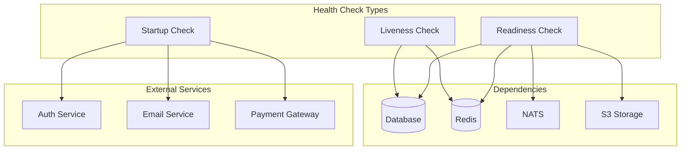

# ❤️ Health Checks

Ce guide explique la mise en place des health checks sur Veza.

## Vue d'ensemble

Ce guide détaille l'implémentation complète des health checks pour la plateforme Veza, incluant les vérifications de l'état des services, des dépendances et de l'infrastructure.

## 🏥 **Architecture des Health Checks**

### Types de Health Checks



## 🔧 **Implémentation des Health Checks**

### Health Check Principal

```go
// internal/infrastructure/health/health.go
package health

import (
    "context"
    "encoding/json"
    "net/http"
    "sync"
    "time"
    "github.com/gin-gonic/gin"
)

type HealthStatus string

const (
    StatusHealthy   HealthStatus = "healthy"
    StatusUnhealthy HealthStatus = "unhealthy"
    StatusDegraded  HealthStatus = "degraded"
)

type HealthCheck struct {
    Name        string                 `json:"name"`
    Status      HealthStatus           `json:"status"`
    Message     string                 `json:"message,omitempty"`
    Timestamp   time.Time              `json:"timestamp"`
    Duration    time.Duration          `json:"duration"`
    Details     map[string]interface{} `json:"details,omitempty"`
    Error       string                 `json:"error,omitempty"`
}

type HealthResponse struct {
    Status      HealthStatus  `json:"status"`
    Timestamp   time.Time     `json:"timestamp"`
    Version     string        `json:"version"`
    Uptime      time.Duration `json:"uptime"`
    Checks      []HealthCheck `json:"checks"`
    Environment string        `json:"environment"`
}

type HealthChecker struct {
    checks    map[string]HealthCheckFunc
    mu        sync.RWMutex
    startTime time.Time
    version   string
    env       string
}

type HealthCheckFunc func(ctx context.Context) HealthCheck

func NewHealthChecker(version, env string) *HealthChecker {
    return &HealthChecker{
        checks:    make(map[string]HealthCheckFunc),
        startTime: time.Now(),
        version:   version,
        env:       env,
    }
}

func (h *HealthChecker) AddCheck(name string, check HealthCheckFunc) {
    h.mu.Lock()
    defer h.mu.Unlock()
    h.checks[name] = check
}

func (h *HealthChecker) RunChecks(ctx context.Context) HealthResponse {
    h.mu.RLock()
    defer h.mu.RUnlock()
    
    var checks []HealthCheck
    var overallStatus HealthStatus = StatusHealthy
    
    // Exécuter tous les checks en parallèle
    checkChan := make(chan HealthCheck, len(h.checks))
    var wg sync.WaitGroup
    
    for name, check := range h.checks {
        wg.Add(1)
        go func(name string, check HealthCheckFunc) {
            defer wg.Done()
            
            start := time.Now()
            result := check(ctx)
            result.Name = name
            result.Duration = time.Since(start)
            result.Timestamp = time.Now()
            
            checkChan <- result
        }(name, check)
    }
    
    // Fermer le canal quand tous les checks sont terminés
    go func() {
        wg.Wait()
        close(checkChan)
    }()
    
    // Collecter les résultats
    for check := range checkChan {
        checks = append(checks, check)
        
        // Déterminer le statut global
        switch check.Status {
        case StatusUnhealthy:
            overallStatus = StatusUnhealthy
        case StatusDegraded:
            if overallStatus != StatusUnhealthy {
                overallStatus = StatusDegraded
            }
        }
    }
    
    return HealthResponse{
        Status:      overallStatus,
        Timestamp:   time.Now(),
        Version:     h.version,
        Uptime:      time.Since(h.startTime),
        Checks:      checks,
        Environment: h.env,
    }
}
```

### Health Checks Spécifiques

```go
// internal/infrastructure/health/checks.go
package health

import (
    "context"
    "database/sql"
    "time"
    "github.com/go-redis/redis/v8"
    "github.com/nats-io/nats.go"
)

// Health check pour la base de données
func DatabaseHealthCheck(db *sql.DB) HealthCheckFunc {
    return func(ctx context.Context) HealthCheck {
        start := time.Now()
        
        // Test de connexion simple
        err := db.PingContext(ctx)
        if err != nil {
            return HealthCheck{
                Status:    StatusUnhealthy,
                Message:   "Database connection failed",
                Error:     err.Error(),
                Duration:  time.Since(start),
                Timestamp: time.Now(),
            }
        }
        
        // Test de requête simple
        var result int
        err = db.QueryRowContext(ctx, "SELECT 1").Scan(&result)
        if err != nil {
            return HealthCheck{
                Status:    StatusUnhealthy,
                Message:   "Database query failed",
                Error:     err.Error(),
                Duration:  time.Since(start),
                Timestamp: time.Now(),
            }
        }
        
        // Vérifier les connexions actives
        var activeConnections int
        err = db.QueryRowContext(ctx, "SELECT count(*) FROM pg_stat_activity").Scan(&activeConnections)
        if err != nil {
            return HealthCheck{
                Status:    StatusDegraded,
                Message:   "Cannot check active connections",
                Error:     err.Error(),
                Duration:  time.Since(start),
                Timestamp: time.Now(),
            }
        }
        
        return HealthCheck{
            Status:  StatusHealthy,
            Message: "Database is healthy",
            Details: map[string]interface{}{
                "active_connections": activeConnections,
            },
            Duration:  time.Since(start),
            Timestamp: time.Now(),
        }
    }
}

// Health check pour Redis
func RedisHealthCheck(client *redis.Client) HealthCheckFunc {
    return func(ctx context.Context) HealthCheck {
        start := time.Now()
        
        // Test de connexion
        err := client.Ping(ctx).Err()
        if err != nil {
            return HealthCheck{
                Status:    StatusUnhealthy,
                Message:   "Redis connection failed",
                Error:     err.Error(),
                Duration:  time.Since(start),
                Timestamp: time.Now(),
            }
        }
        
        // Test d'écriture/lecture
        testKey := "health_check_test"
        testValue := "test_value"
        
        err = client.Set(ctx, testKey, testValue, time.Minute).Err()
        if err != nil {
            return HealthCheck{
                Status:    StatusUnhealthy,
                Message:   "Redis write failed",
                Error:     err.Error(),
                Duration:  time.Since(start),
                Timestamp: time.Now(),
            }
        }
        
        val, err := client.Get(ctx, testKey).Result()
        if err != nil || val != testValue {
            return HealthCheck{
                Status:    StatusUnhealthy,
                Message:   "Redis read failed",
                Error:     err.Error(),
                Duration:  time.Since(start),
                Timestamp: time.Now(),
            }
        }
        
        // Nettoyer la clé de test
        client.Del(ctx, testKey)
        
        // Vérifier l'utilisation mémoire
        info, err := client.Info(ctx, "memory").Result()
        if err != nil {
            return HealthCheck{
                Status:    StatusDegraded,
                Message:   "Cannot get Redis memory info",
                Error:     err.Error(),
                Duration:  time.Since(start),
                Timestamp: time.Now(),
            }
        }
        
        return HealthCheck{
            Status:  StatusHealthy,
            Message: "Redis is healthy",
            Details: map[string]interface{}{
                "memory_info": info,
            },
            Duration:  time.Since(start),
            Timestamp: time.Now(),
        }
    }
}

// Health check pour NATS
func NATSHealthCheck(nc *nats.Conn) HealthCheckFunc {
    return func(ctx context.Context) HealthCheck {
        start := time.Now()
        
        if !nc.IsConnected() {
            return HealthCheck{
                Status:    StatusUnhealthy,
                Message:   "NATS not connected",
                Duration:  time.Since(start),
                Timestamp: time.Now(),
            }
        }
        
        // Test de publication
        testSubject := "health.check.test"
        testData := []byte("test")
        
        err := nc.Publish(testSubject, testData)
        if err != nil {
            return HealthCheck{
                Status:    StatusUnhealthy,
                Message:   "NATS publish failed",
                Error:     err.Error(),
                Duration:  time.Since(start),
                Timestamp: time.Now(),
            }
        }
        
        // Vérifier les statistiques
        stats := nc.Stats()
        
        return HealthCheck{
            Status:  StatusHealthy,
            Message: "NATS is healthy",
            Details: map[string]interface{}{
                "in_msgs":   stats.InMsgs,
                "out_msgs":  stats.OutMsgs,
                "in_bytes":  stats.InBytes,
                "out_bytes": stats.OutBytes,
            },
            Duration:  time.Since(start),
            Timestamp: time.Now(),
        }
    }
}

// Health check pour les services externes
func ExternalServiceHealthCheck(name, url string) HealthCheckFunc {
    return func(ctx context.Context) HealthCheck {
        start := time.Now()
        
        client := &http.Client{
            Timeout: 5 * time.Second,
        }
        
        req, err := http.NewRequestWithContext(ctx, "GET", url, nil)
        if err != nil {
            return HealthCheck{
                Status:    StatusUnhealthy,
                Message:   "Failed to create request",
                Error:     err.Error(),
                Duration:  time.Since(start),
                Timestamp: time.Now(),
            }
        }
        
        resp, err := client.Do(req)
        if err != nil {
            return HealthCheck{
                Status:    StatusUnhealthy,
                Message:   "External service request failed",
                Error:     err.Error(),
                Duration:  time.Since(start),
                Timestamp: time.Now(),
            }
        }
        defer resp.Body.Close()
        
        if resp.StatusCode >= 500 {
            return HealthCheck{
                Status:    StatusUnhealthy,
                Message:   "External service returned error",
                Details: map[string]interface{}{
                    "status_code": resp.StatusCode,
                },
                Duration:  time.Since(start),
                Timestamp: time.Now(),
            }
        }
        
        if resp.StatusCode >= 400 {
            return HealthCheck{
                Status:    StatusDegraded,
                Message:   "External service returned warning",
                Details: map[string]interface{}{
                    "status_code": resp.StatusCode,
                },
                Duration:  time.Since(start),
                Timestamp: time.Now(),
            }
        }
        
        return HealthCheck{
            Status:  StatusHealthy,
            Message: "External service is healthy",
            Details: map[string]interface{}{
                "status_code": resp.StatusCode,
            },
            Duration:  time.Since(start),
            Timestamp: time.Now(),
        }
    }
}
```

## 🌐 **Endpoints de Health Check**

### Routes HTTP

```go
// internal/api/health/routes.go
package health

import (
    "github.com/gin-gonic/gin"
)

func SetupHealthRoutes(r *gin.RouterGroup, checker *HealthChecker) {
    health := r.Group("/health")
    {
        health.GET("/", checker.LivenessHandler())
        health.GET("/ready", checker.ReadinessHandler())
        health.GET("/startup", checker.StartupHandler())
        health.GET("/detailed", checker.DetailedHandler())
    }
}

func (h *HealthChecker) LivenessHandler() gin.HandlerFunc {
    return func(c *gin.Context) {
        ctx, cancel := context.WithTimeout(c.Request.Context(), 5*time.Second)
        defer cancel()
        
        response := h.RunChecks(ctx)
        
        // Pour le liveness, on ne vérifie que les checks critiques
        criticalChecks := h.filterCriticalChecks(response.Checks)
        
        status := http.StatusOK
        if !h.allChecksHealthy(criticalChecks) {
            status = http.StatusServiceUnavailable
        }
        
        c.JSON(status, gin.H{
            "status":    response.Status,
            "timestamp": response.Timestamp,
            "version":   response.Version,
            "uptime":    response.Uptime,
        })
    }
}

func (h *HealthChecker) ReadinessHandler() gin.HandlerFunc {
    return func(c *gin.Context) {
        ctx, cancel := context.WithTimeout(c.Request.Context(), 10*time.Second)
        defer cancel()
        
        response := h.RunChecks(ctx)
        
        status := http.StatusOK
        if response.Status == StatusUnhealthy {
            status = http.StatusServiceUnavailable
        }
        
        c.JSON(status, response)
    }
}

func (h *HealthChecker) StartupHandler() gin.HandlerFunc {
    return func(c *gin.Context) {
        ctx, cancel := context.WithTimeout(c.Request.Context(), 30*time.Second)
        defer cancel()
        
        response := h.RunChecks(ctx)
        
        status := http.StatusOK
        if response.Status == StatusUnhealthy {
            status = http.StatusServiceUnavailable
        }
        
        c.JSON(status, response)
    }
}

func (h *HealthChecker) DetailedHandler() gin.HandlerFunc {
    return func(c *gin.Context) {
        ctx, cancel := context.WithTimeout(c.Request.Context(), 15*time.Second)
        defer cancel()
        
        response := h.RunChecks(ctx)
        
        // Ajouter des métriques système
        response.SystemMetrics = h.getSystemMetrics()
        
        status := http.StatusOK
        if response.Status == StatusUnhealthy {
            status = http.StatusServiceUnavailable
        }
        
        c.JSON(status, response)
    }
}
```

## 📊 **Métriques de Health Check**

### Métriques Prometheus

```go
// internal/monitoring/health_metrics.go
package monitoring

import (
    "github.com/prometheus/client_golang/prometheus"
    "github.com/prometheus/client_golang/prometheus/promauto"
)

var (
    // Métriques de health checks
    healthCheckDuration = promauto.NewHistogramVec(
        prometheus.HistogramOpts{
            Name:    "veza_health_check_duration_seconds",
            Help:    "Duration of health checks in seconds",
            Buckets: prometheus.DefBuckets,
        },
        []string{"check_name", "status"},
    )
    
    healthCheckStatus = promauto.NewGaugeVec(
        prometheus.GaugeOpts{
            Name: "veza_health_check_status",
            Help: "Status of health checks (1 = healthy, 0 = unhealthy)",
        },
        []string{"check_name"},
    )
    
    healthCheckErrors = promauto.NewCounterVec(
        prometheus.CounterOpts{
            Name: "veza_health_check_errors_total",
            Help: "Total number of health check errors",
        },
        []string{"check_name", "error_type"},
    )
    
    // Métriques système
    systemUptime = promauto.NewGauge(
        prometheus.GaugeOpts{
            Name: "veza_system_uptime_seconds",
            Help: "System uptime in seconds",
        },
    )
    
    systemMemoryUsage = promauto.NewGauge(
        prometheus.GaugeOpts{
            Name: "veza_system_memory_usage_percent",
            Help: "System memory usage percentage",
        },
    )
    
    systemCPUUsage = promauto.NewGauge(
        prometheus.GaugeOpts{
            Name: "veza_system_cpu_usage_percent",
            Help: "System CPU usage percentage",
        },
    )
)

// Middleware pour mesurer les health checks
func HealthCheckMetricsMiddleware() func(next http.Handler) http.Handler {
    return func(next http.Handler) http.Handler {
        return http.HandlerFunc(func(w http.ResponseWriter, r *http.Request) {
            start := time.Now()
            
            next.ServeHTTP(w, r)
            
            duration := time.Since(start).Seconds()
            status := "healthy"
            if w.(*responseWriter).status >= 500 {
                status = "unhealthy"
            }
            
            healthCheckDuration.WithLabelValues("overall", status).Observe(duration)
        })
    }
}
```

## 🚨 **Alertes de Health Check**

### Configuration des Alertes

```yaml
# health_check_alerts.yml
groups:
- name: veza_health_check_alerts
  rules:
  - alert: HealthCheckFailed
    expr: veza_health_check_status == 0
    for: 1m
    labels:
      severity: critical
    annotations:
      summary: "Health check failed"
      description: "Health check {{ $labels.check_name }} is failing"
      
  - alert: HealthCheckSlow
    expr: histogram_quantile(0.95, veza_health_check_duration_seconds) > 5
    for: 2m
    labels:
      severity: warning
    annotations:
      summary: "Health check slow"
      description: "Health check {{ $labels.check_name }} is taking more than 5 seconds"
      
  - alert: HighHealthCheckErrorRate
    expr: rate(veza_health_check_errors_total[5m]) > 0.1
    for: 2m
    labels:
      severity: warning
    annotations:
      summary: "High health check error rate"
      description: "Health check error rate is high"
```

## 🛠️ **Scripts d'Automatisation**

### Script de Monitoring

```bash
#!/bin/bash
# health_monitor.sh

echo "=== Monitoring des Health Checks ==="

# Configuration
HEALTH_ENDPOINT="http://localhost:8080/health"
READY_ENDPOINT="http://localhost:8080/health/ready"
DETAILED_ENDPOINT="http://localhost:8080/health/detailed"
ALERT_EMAIL="ops@veza.com"

# Fonction de vérification
check_health() {
    local endpoint=$1
    local name=$2
    
    echo "Vérification de $name..."
    
    response=$(curl -s -w "%{http_code}" -o /tmp/health_response.json $endpoint)
    status_code=${response: -3}
    
    if [ $status_code -eq 200 ]; then
        echo "✅ $name: OK"
        return 0
    else
        echo "❌ $name: FAILED (HTTP $status_code)"
        
        # Envoyer une alerte
        echo "Health check failed for $name" | mail -s "Veza Health Check Alert" $ALERT_EMAIL
        
        return 1
    fi
}

# Vérifications principales
check_health $HEALTH_ENDPOINT "Liveness"
check_health $READY_ENDPOINT "Readiness"

# Vérification détaillée
if check_health $DETAILED_ENDPOINT "Detailed"; then
    echo "Détails des health checks:"
    cat /tmp/health_response.json | jq '.'
fi

echo "✅ Monitoring terminé"
```

### Script de Test

```bash
#!/bin/bash
# test_health_checks.sh

echo "=== Test des Health Checks ==="

# Simuler des problèmes
echo "1. Test avec base de données indisponible..."
docker stop postgres
sleep 5
curl -s http://localhost:8080/health/ready | jq '.status'
docker start postgres

echo "2. Test avec Redis indisponible..."
docker stop redis
sleep 5
curl -s http://localhost:8080/health/ready | jq '.status'
docker start redis

echo "3. Test avec NATS indisponible..."
docker stop nats
sleep 5
curl -s http://localhost:8080/health/ready | jq '.status'
docker start nats

echo "4. Test de récupération..."
sleep 10
curl -s http://localhost:8080/health/ready | jq '.status'

echo "✅ Tests terminés"
```

## 📚 **Documentation et Formation**

### Guide d'Utilisation

```markdown
# Guide d'Utilisation des Health Checks

## Endpoints Disponibles

### `/health` (Liveness)
- Vérifications critiques uniquement
- Timeout: 5 secondes
- Utilisé par Kubernetes pour les liveness probes

### `/health/ready` (Readiness)
- Vérifications complètes
- Timeout: 10 secondes
- Utilisé par Kubernetes pour les readiness probes

### `/health/startup` (Startup)
- Vérifications initiales
- Timeout: 30 secondes
- Utilisé au démarrage de l'application

### `/health/detailed`
- Vérifications complètes + métriques
- Timeout: 15 secondes
- Utilisé pour le debugging

## Codes de Statut

- **200 OK**: Service en bonne santé
- **503 Service Unavailable**: Service indisponible
- **500 Internal Server Error**: Erreur interne

## Bonnes Pratiques

1. **Timeouts Appropriés**
   - Liveness: 5s maximum
   - Readiness: 10s maximum
   - Startup: 30s maximum

2. **Vérifications Minimales**
   - Liveness: Connexions critiques uniquement
   - Readiness: Toutes les dépendances
   - Startup: Services externes

3. **Gestion d'Erreurs**
   - Logs détaillés
   - Métriques Prometheus
   - Alertes automatiques

4. **Monitoring**
   - Dashboard Grafana
   - Alertes Prometheus
   - Logs centralisés
```

---

**Dernière mise à jour** : $(date)
**Version** : 1.0.0 