# Guide de Gestion des Incidents de Sécurité - Veza Platform

## Vue d'ensemble

Ce guide détaille les procédures de gestion des incidents de sécurité pour la plateforme Veza, couvrant la détection, l'analyse, la réponse et la récupération.

## Table des matières

- [Équipe de Réponse aux Incidents](#équipe-de-réponse-aux-incidents)
- [Classification des Incidents](#classification-des-incidents)
- [Procédures de Réponse](#procédures-de-réponse)
- [Outils de Réponse](#outils-de-réponse)
- [Bonnes Pratiques](#bonnes-pratiques)
- [Pièges à Éviter](#pièges-à-éviter)
- [Ressources](#ressources)

## Équipe de Réponse aux Incidents

### 1. Structure de l'Équipe

```mermaid
graph TB
    subgraph "Équipe de Réponse aux Incidents"
        IR_Lead[👤 IR Lead]
        Security_Analyst[🔍 Security Analyst]
        Network_Admin[🌐 Network Admin]
        System_Admin[🖥️ System Admin]
        Legal_Advisor[⚖️ Legal Advisor]
        PR_Manager[📢 PR Manager]
    end
    
    subgraph "Escalation"
        CISO[🛡️ CISO]
        CEO[👑 CEO]
        Board[📋 Board]
    end
    
    subgraph "Support"
        Dev_Team[👨‍💻 Dev Team]
        Ops_Team[🔧 Ops Team]
        External_Experts[🔗 External Experts]
    end
    
    IR_Lead --> Security_Analyst
    IR_Lead --> Network_Admin
    IR_Lead --> System_Admin
    IR_Lead --> Legal_Advisor
    IR_Lead --> PR_Manager
    
    Security_Analyst --> CISO
    CISO --> CEO
    CEO --> Board
    
    Dev_Team --> IR_Lead
    Ops_Team --> IR_Lead
    External_Experts --> IR_Lead
```



### 2. Rôles et Responsabilités

```yaml
# incident-response/team-roles.yaml
apiVersion: v1
kind: ConfigMap
metadata:
  name: veza-ir-team-roles
  namespace: veza
data:
  # IR Lead
  ir_lead:
    responsibilities:
      - "Coordination de la réponse"
      - "Communication avec la direction"
      - "Décisions stratégiques"
      - "Rapport final"
    contact: "ir-lead@veza.com"
    phone: "+33-1-23-45-67-89"
  
  # Security Analyst
  security_analyst:
    responsibilities:
      - "Analyse technique des incidents"
      - "Investigation forensique"
      - "Containment des menaces"
      - "Documentation technique"
    contact: "security-analyst@veza.com"
    phone: "+33-1-23-45-67-90"
  
  # Network Admin
  network_admin:
    responsibilities:
      - "Isolation réseau"
      - "Configuration firewall"
      - "Monitoring trafic"
      - "Restauration réseau"
    contact: "network-admin@veza.com"
    phone: "+33-1-23-45-67-91"
  
  # System Admin
  system_admin:
    responsibilities:
      - "Isolation systèmes"
      - "Backup et restauration"
      - "Patch management"
      - "Monitoring systèmes"
    contact: "system-admin@veza.com"
    phone: "+33-1-23-45-67-92"
  
  # Legal Advisor
  legal_advisor:
    responsibilities:
      - "Conformité légale"
      - "Notification autorités"
      - "Protection données"
      - "Aspects juridiques"
    contact: "legal@veza.com"
    phone: "+33-1-23-45-67-93"
  
  # PR Manager
  pr_manager:
    responsibilities:
      - "Communication externe"
      - "Gestion réputation"
      - "Communication clients"
      - "Relations médias"
    contact: "pr@veza.com"
    phone: "+33-1-23-45-67-94"
```

## Classification des Incidents

### 1. Niveaux de Sévérité

```mermaid
graph LR
    subgraph "Niveau 1 - Faible"
        L1_1[🟢 Spam]
        L1_2[🟢 Tentative de connexion échouée]
        L1_3[🟢 Scan de ports]
    end
    
    subgraph "Niveau 2 - Moyen"
        L2_1[🟡 Vulnérabilité détectée]
        L2_2[🟡 Accès non autorisé]
        L2_3[🟡 Malware détecté]
    end
    
    subgraph "Niveau 3 - Élevé"
        L3_1[🟠 Compromission système]
        L3_2[🟠 Exfiltration données]
        L3_3[🟠 Ransomware]
    end
    
    subgraph "Niveau 4 - Critique"
        L4_1[🔴 Compromission complète]
        L4_2[🔴 Perte de données critiques]
        L4_3[🔴 Arrêt de service]
    end
```



### 2. Types d'Incidents

```yaml
# incident-response/incident-types.yaml
apiVersion: v1
kind: ConfigMap
metadata:
  name: veza-incident-types
  namespace: veza
data:
  # Incidents de sécurité réseau
  network_security:
    - "ddos_attack"
    - "network_intrusion"
    - "man_in_the_middle"
    - "dns_poisoning"
  
  # Incidents applicatifs
  application_security:
    - "sql_injection"
    - "xss_attack"
    - "csrf_attack"
    - "api_abuse"
  
  # Incidents de données
  data_security:
    - "data_breach"
    - "data_exfiltration"
    - "data_corruption"
    - "data_loss"
  
  # Incidents système
  system_security:
    - "malware_infection"
    - "ransomware_attack"
    - "privilege_escalation"
    - "root_compromise"
  
  # Incidents physiques
  physical_security:
    - "unauthorized_access"
    - "equipment_theft"
    - "environmental_damage"
    - "power_outage"
```

## Procédures de Réponse

### 1. Workflow de Réponse

```mermaid
graph TB
    subgraph "Phase 1: Détection"
        Detection[🔍 Détection]
        Alert[🚨 Alerte]
        Initial_Assessment[📋 Évaluation Initiale]
    end
    
    subgraph "Phase 2: Analyse"
        Investigation[🔬 Investigation]
        Classification[🏷️ Classification]
        Escalation[⬆️ Escalation]
    end
    
    subgraph "Phase 3: Réponse"
        Containment[🛡️ Containment]
        Eradication[💥 Éradication]
        Recovery[🔄 Récupération]
    end
    
    subgraph "Phase 4: Post-Incident"
        Lessons_Learned[📚 Leçons Apprises]
        Documentation[📝 Documentation]
        Improvement[🔧 Amélioration]
    end
    
    Detection --> Alert
    Alert --> Initial_Assessment
    Initial_Assessment --> Investigation
    Investigation --> Classification
    Classification --> Escalation
    Escalation --> Containment
    Containment --> Eradication
    Eradication --> Recovery
    Recovery --> Lessons_Learned
    Lessons_Learned --> Documentation
    Documentation --> Improvement
```



### 2. Procédure de Détection

```python
# incident-response/scripts/incident_detection.py
#!/usr/bin/env python3

import logging
import json
import time
from datetime import datetime
from typing import Dict, List, Optional

class IncidentDetector:
    def __init__(self, config_file: str):
        self.config = self.load_config(config_file)
        self.logger = self.setup_logger()
        self.incidents = []
    
    def load_config(self, config_file: str) -> Dict:
        """Charge la configuration de détection"""
        with open(config_file, 'r') as f:
            return json.load(f)
    
    def setup_logger(self) -> logging.Logger:
        """Configure le logger"""
        logging.basicConfig(
            level=logging.INFO,
            format='%(asctime)s - %(levelname)s - %(message)s',
            handlers=[
                logging.FileHandler('incident_detection.log'),
                logging.StreamHandler()
            ]
        )
        return logging.getLogger(__name__)
    
    def detect_security_events(self) -> List[Dict]:
        """Détecte les événements de sécurité"""
        events = []
        
        # Détection d'intrusion réseau
        network_events = self.detect_network_intrusion()
        events.extend(network_events)
        
        # Détection d'anomalies applicatives
        app_events = self.detect_application_anomalies()
        events.extend(app_events)
        
        # Détection de compromission système
        system_events = self.detect_system_compromise()
        events.extend(system_events)
        
        # Détection d'exfiltration de données
        data_events = self.detect_data_exfiltration()
        events.extend(data_events)
        
        return events
    
    def detect_network_intrusion(self) -> List[Dict]:
        """Détecte les intrusions réseau"""
        events = []
        
        # Vérification des connexions suspectes
        suspicious_connections = self.check_suspicious_connections()
        for conn in suspicious_connections:
            events.append({
                'type': 'network_intrusion',
                'severity': 'high',
                'description': f'Connexion suspecte détectée: {conn}',
                'timestamp': datetime.now().isoformat(),
                'source_ip': conn['source_ip'],
                'destination_ip': conn['dest_ip'],
                'port': conn['port']
            })
        
        # Vérification des scans de ports
        port_scans = self.check_port_scans()
        for scan in port_scans:
            events.append({
                'type': 'port_scan',
                'severity': 'medium',
                'description': f'Scan de ports détecté: {scan}',
                'timestamp': datetime.now().isoformat(),
                'source_ip': scan['source_ip'],
                'ports_scanned': scan['ports']
            })
        
        return events
    
    def detect_application_anomalies(self) -> List[Dict]:
        """Détecte les anomalies applicatives"""
        events = []
        
        # Vérification des tentatives d'injection
        injection_attempts = self.check_injection_attempts()
        for attempt in injection_attempts:
            events.append({
                'type': 'injection_attempt',
                'severity': 'high',
                'description': f'Tentative d\'injection détectée: {attempt}',
                'timestamp': datetime.now().isoformat(),
                'payload': attempt['payload'],
                'endpoint': attempt['endpoint']
            })
        
        # Vérification des tentatives de force brute
        brute_force_attempts = self.check_brute_force_attempts()
        for attempt in brute_force_attempts:
            events.append({
                'type': 'brute_force_attempt',
                'severity': 'medium',
                'description': f'Tentative de force brute détectée: {attempt}',
                'timestamp': datetime.now().isoformat(),
                'username': attempt['username'],
                'source_ip': attempt['source_ip']
            })
        
        return events
    
    def detect_system_compromise(self) -> List[Dict]:
        """Détecte les compromissions système"""
        events = []
        
        # Vérification des processus suspects
        suspicious_processes = self.check_suspicious_processes()
        for process in suspicious_processes:
            events.append({
                'type': 'suspicious_process',
                'severity': 'high',
                'description': f'Processus suspect détecté: {process}',
                'timestamp': datetime.now().isoformat(),
                'process_name': process['name'],
                'pid': process['pid']
            })
        
        # Vérification des modifications de fichiers critiques
        critical_file_changes = self.check_critical_file_changes()
        for change in critical_file_changes:
            events.append({
                'type': 'critical_file_change',
                'severity': 'high',
                'description': f'Modification de fichier critique: {change}',
                'timestamp': datetime.now().isoformat(),
                'file_path': change['file_path'],
                'change_type': change['change_type']
            })
        
        return events
    
    def detect_data_exfiltration(self) -> List[Dict]:
        """Détecte l'exfiltration de données"""
        events = []
        
        # Vérification des transferts de données suspects
        suspicious_transfers = self.check_suspicious_data_transfers()
        for transfer in suspicious_transfers:
            events.append({
                'type': 'data_exfiltration',
                'severity': 'critical',
                'description': f'Exfiltration de données détectée: {transfer}',
                'timestamp': datetime.now().isoformat(),
                'data_type': transfer['data_type'],
                'destination': transfer['destination'],
                'size': transfer['size']
            })
        
        return events
    
    def check_suspicious_connections(self) -> List[Dict]:
        """Vérifie les connexions suspectes"""
        # Implémentation de la vérification des connexions
        return []
    
    def check_port_scans(self) -> List[Dict]:
        """Vérifie les scans de ports"""
        # Implémentation de la vérification des scans
        return []
    
    def check_injection_attempts(self) -> List[Dict]:
        """Vérifie les tentatives d'injection"""
        # Implémentation de la vérification des injections
        return []
    
    def check_brute_force_attempts(self) -> List[Dict]:
        """Vérifie les tentatives de force brute"""
        # Implémentation de la vérification de force brute
        return []
    
    def check_suspicious_processes(self) -> List[Dict]:
        """Vérifie les processus suspects"""
        # Implémentation de la vérification des processus
        return []
    
    def check_critical_file_changes(self) -> List[Dict]:
        """Vérifie les modifications de fichiers critiques"""
        # Implémentation de la vérification des fichiers
        return []
    
    def check_suspicious_data_transfers(self) -> List[Dict]:
        """Vérifie les transferts de données suspects"""
        # Implémentation de la vérification des transferts
        return []
    
    def generate_alert(self, event: Dict) -> None:
        """Génère une alerte pour un événement"""
        alert = {
            'id': f"IR-{int(time.time())}",
            'event': event,
            'timestamp': datetime.now().isoformat(),
            'status': 'new'
        }
        
        # Envoi de l'alerte
        self.send_alert(alert)
        
        # Stockage de l'incident
        self.incidents.append(alert)
        
        self.logger.info(f"Alerte générée: {alert['id']}")
    
    def send_alert(self, alert: Dict) -> None:
        """Envoie l'alerte aux équipes concernées"""
        # Envoi par email
        self.send_email_alert(alert)
        
        # Envoi par Slack
        self.send_slack_alert(alert)
        
        # Envoi par SMS (pour les incidents critiques)
        if alert['event']['severity'] in ['critical', 'high']:
            self.send_sms_alert(alert)
    
    def send_email_alert(self, alert: Dict) -> None:
        """Envoie une alerte par email"""
        # Implémentation de l'envoi d'email
        pass
    
    def send_slack_alert(self, alert: Dict) -> None:
        """Envoie une alerte par Slack"""
        # Implémentation de l'envoi Slack
        pass
    
    def send_sms_alert(self, alert: Dict) -> None:
        """Envoie une alerte par SMS"""
        # Implémentation de l'envoi SMS
        pass

if __name__ == "__main__":
    detector = IncidentDetector('incident_detection_config.json')
    
    while True:
        events = detector.detect_security_events()
        
        for event in events:
            detector.generate_alert(event)
        
        time.sleep(60)  # Vérification toutes les minutes
```

### 3. Procédure de Containment

```bash
#!/bin/bash
# incident-response/scripts/incident_containment.sh

# Script de containment d'incident de sécurité

set -e

# Configuration
INCIDENT_ID="$1"
SEVERITY="$2"
TARGET_SYSTEM="$3"

if [ -z "$INCIDENT_ID" ] || [ -z "$SEVERITY" ] || [ -z "$TARGET_SYSTEM" ]; then
    echo "Usage: $0 <incident_id> <severity> <target_system>"
    exit 1
fi

# Logging
LOG_FILE="/var/log/incident_response/containment_${INCIDENT_ID}.log"
exec 1> >(tee -a "$LOG_FILE")
exec 2> >(tee -a "$LOG_FILE" >&2)

echo "$(date): Début du containment pour l'incident $INCIDENT_ID"

# Fonction de containment réseau
containment_network() {
    echo "Containment réseau en cours..."
    
    # Isolation de l'IP source
    if [ ! -z "$SOURCE_IP" ]; then
        iptables -A INPUT -s "$SOURCE_IP" -j DROP
        iptables -A OUTPUT -d "$SOURCE_IP" -j DROP
        echo "IP $SOURCE_IP isolée"
    fi
    
    # Blocage des ports suspects
    if [ ! -z "$SUSPICIOUS_PORTS" ]; then
        for port in $SUSPICIOUS_PORTS; do
            iptables -A INPUT -p tcp --dport "$port" -j DROP
            echo "Port $port bloqué"
        done
    fi
    
    # Activation du mode de sécurité réseau
    systemctl enable fail2ban
    systemctl start fail2ban
    echo "Fail2ban activé"
}

# Fonction de containment système
containment_system() {
    echo "Containment système en cours..."
    
    # Arrêt des services suspects
    if [ ! -z "$SUSPICIOUS_SERVICES" ]; then
        for service in $SUSPICIOUS_SERVICES; do
            systemctl stop "$service"
            systemctl disable "$service"
            echo "Service $service arrêté"
        done
    fi
    
    # Isolation des processus suspects
    if [ ! -z "$SUSPICIOUS_PROCESSES" ]; then
        for pid in $SUSPICIOUS_PROCESSES; do
            kill -STOP "$pid"
            echo "Processus $pid isolé"
        done
    fi
    
    # Protection des fichiers critiques
    chattr +i /etc/passwd
    chattr +i /etc/shadow
    chattr +i /etc/sudoers
    echo "Fichiers critiques protégés"
}

# Fonction de containment applicatif
containment_application() {
    echo "Containment applicatif en cours..."
    
    # Mise en maintenance de l'application
    if [ -f "/var/www/html/maintenance.html" ]; then
        mv /var/www/html/index.html /var/www/html/index.html.backup
        cp /var/www/html/maintenance.html /var/www/html/index.html
        echo "Application mise en maintenance"
    fi
    
    # Désactivation des comptes suspects
    if [ ! -z "$SUSPICIOUS_USERS" ]; then
        for user in $SUSPICIOUS_USERS; do
            usermod -L "$user"
            echo "Utilisateur $user désactivé"
        done
    fi
    
    # Réinitialisation des sessions
    systemctl restart apache2
    systemctl restart nginx
    echo "Sessions réinitialisées"
}

# Fonction de containment des données
containment_data() {
    echo "Containment des données en cours..."
    
    # Sauvegarde des données critiques
    tar -czf "/backup/critical_data_${INCIDENT_ID}.tar.gz" /var/www/html /etc/mysql /etc/apache2
    echo "Sauvegarde des données critiques effectuée"
    
    # Chiffrement des données sensibles
    if [ -f "/usr/local/bin/encrypt_data.sh" ]; then
        /usr/local/bin/encrypt_data.sh
        echo "Données sensibles chiffrées"
    fi
    
    # Audit des accès aux données
    find /var/log -name "*.log" -exec grep -l "data_access" {} \;
    echo "Audit des accès aux données effectué"
}

# Exécution du containment selon la sévérité
case "$SEVERITY" in
    "critical")
        echo "Containment critique en cours..."
        containment_network
        containment_system
        containment_application
        containment_data
        ;;
    "high")
        echo "Containment élevé en cours..."
        containment_network
        containment_system
        containment_application
        ;;
    "medium")
        echo "Containment moyen en cours..."
        containment_network
        containment_application
        ;;
    "low")
        echo "Containment faible en cours..."
        containment_network
        ;;
    *)
        echo "Sévérité inconnue: $SEVERITY"
        exit 1
        ;;
esac

echo "$(date): Containment terminé pour l'incident $INCIDENT_ID"

# Notification de fin de containment
curl -X POST "https://hooks.slack.com/services/YOUR_WEBHOOK" \
  -H "Content-type: application/json" \
  -d "{\"text\":\"Containment terminé pour l'incident $INCIDENT_ID\"}"
```

## Outils de Réponse

### 1. Outils de Forensic

```yaml
# incident-response/tools/forensic-tools.yaml
apiVersion: v1
kind: ConfigMap
metadata:
  name: veza-forensic-tools
  namespace: veza
data:
  # Outils d'analyse mémoire
  memory_analysis:
    - "volatility"
    - "rekall"
    - "memoryze"
    - "winpmem"
  
  # Outils d'analyse disque
  disk_analysis:
    - "autopsy"
    - "sleuthkit"
    - "foremost"
    - "photorec"
  
  # Outils d'analyse réseau
  network_analysis:
    - "wireshark"
    - "tcpdump"
    - "netflow"
    - "bro"
  
  # Outils d'analyse log
  log_analysis:
    - "logstash"
    - "splunk"
    - "elk"
    - "grep"
  
  # Outils de malware analysis
  malware_analysis:
    - "cuckoo"
    - "virustotal"
    - "yara"
    - "peid"
```

### 2. Scripts de Réponse

```python
# incident-response/scripts/incident_response.py
#!/usr/bin/env python3

import subprocess
import json
import logging
from datetime import datetime
from typing import Dict, List

class IncidentResponder:
    def __init__(self, incident_id: str):
        self.incident_id = incident_id
        self.logger = self.setup_logger()
        self.evidence = []
    
    def setup_logger(self) -> logging.Logger:
        """Configure le logger"""
        logging.basicConfig(
            level=logging.INFO,
            format='%(asctime)s - %(levelname)s - %(message)s',
            handlers=[
                logging.FileHandler(f'incident_response_{self.incident_id}.log'),
                logging.StreamHandler()
            ]
        )
        return logging.getLogger(__name__)
    
    def collect_system_info(self) -> Dict:
        """Collecte les informations système"""
        info = {}
        
        # Informations système
        try:
            result = subprocess.run(['uname', '-a'], capture_output=True, text=True)
            info['system'] = result.stdout.strip()
        except Exception as e:
            self.logger.error(f"Erreur lors de la collecte d'infos système: {e}")
        
        # Processus en cours
        try:
            result = subprocess.run(['ps', 'aux'], capture_output=True, text=True)
            info['processes'] = result.stdout
        except Exception as e:
            self.logger.error(f"Erreur lors de la collecte des processus: {e}")
        
        # Connexions réseau
        try:
            result = subprocess.run(['netstat', '-tuln'], capture_output=True, text=True)
            info['network_connections'] = result.stdout
        except Exception as e:
            self.logger.error(f"Erreur lors de la collecte des connexions: {e}")
        
        # Fichiers ouverts
        try:
            result = subprocess.run(['lsof'], capture_output=True, text=True)
            info['open_files'] = result.stdout
        except Exception as e:
            self.logger.error(f"Erreur lors de la collecte des fichiers: {e}")
        
        return info
    
    def collect_logs(self) -> Dict:
        """Collecte les logs pertinents"""
        logs = {}
        
        # Logs système
        log_files = [
            '/var/log/auth.log',
            '/var/log/syslog',
            '/var/log/messages',
            '/var/log/apache2/access.log',
            '/var/log/apache2/error.log',
            '/var/log/nginx/access.log',
            '/var/log/nginx/error.log'
        ]
        
        for log_file in log_files:
            try:
                with open(log_file, 'r') as f:
                    logs[log_file] = f.read()
            except Exception as e:
                self.logger.warning(f"Impossible de lire {log_file}: {e}")
        
        return logs
    
    def collect_network_evidence(self) -> Dict:
        """Collecte les preuves réseau"""
        evidence = {}
        
        # Capture de trafic
        try:
            subprocess.run(['tcpdump', '-w', f'capture_{self.incident_id}.pcap', '-c', '1000'])
            evidence['pcap_file'] = f'capture_{self.incident_id}.pcap'
        except Exception as e:
            self.logger.error(f"Erreur lors de la capture réseau: {e}")
        
        # Informations de routage
        try:
            result = subprocess.run(['route', '-n'], capture_output=True, text=True)
            evidence['routing_table'] = result.stdout
        except Exception as e:
            self.logger.error(f"Erreur lors de la collecte de routage: {e}")
        
        # Tables ARP
        try:
            result = subprocess.run(['arp', '-a'], capture_output=True, text=True)
            evidence['arp_table'] = result.stdout
        except Exception as e:
            self.logger.error(f"Erreur lors de la collecte ARP: {e}")
        
        return evidence
    
    def collect_memory_dump(self) -> str:
        """Collecte un dump mémoire"""
        try:
            dump_file = f'memory_dump_{self.incident_id}.raw'
            subprocess.run(['dd', 'if=/dev/mem', f'of={dump_file}', 'bs=1M'])
            self.logger.info(f"Dump mémoire créé: {dump_file}")
            return dump_file
        except Exception as e:
            self.logger.error(f"Erreur lors du dump mémoire: {e}")
            return ""
    
    def analyze_malware(self, file_path: str) -> Dict:
        """Analyse un fichier suspect"""
        analysis = {}
        
        # Calcul du hash
        try:
            result = subprocess.run(['sha256sum', file_path], capture_output=True, text=True)
            analysis['sha256'] = result.stdout.split()[0]
        except Exception as e:
            self.logger.error(f"Erreur lors du calcul du hash: {e}")
        
        # Analyse des chaînes
        try:
            result = subprocess.run(['strings', file_path], capture_output=True, text=True)
            analysis['strings'] = result.stdout
        except Exception as e:
            self.logger.error(f"Erreur lors de l'analyse des chaînes: {e}")
        
        # Analyse PE (si applicable)
        try:
            result = subprocess.run(['file', file_path], capture_output=True, text=True)
            analysis['file_type'] = result.stdout.strip()
        except Exception as e:
            self.logger.error(f"Erreur lors de l'analyse du type: {e}")
        
        return analysis
    
    def generate_report(self) -> Dict:
        """Génère le rapport d'incident"""
        report = {
            'incident_id': self.incident_id,
            'timestamp': datetime.now().isoformat(),
            'system_info': self.collect_system_info(),
            'logs': self.collect_logs(),
            'network_evidence': self.collect_network_evidence(),
            'evidence_collected': self.evidence
        }
        
        # Sauvegarde du rapport
        with open(f'incident_report_{self.incident_id}.json', 'w') as f:
            json.dump(report, f, indent=2)
        
        return report

if __name__ == "__main__":
    import sys
    
    if len(sys.argv) != 2:
        print("Usage: python3 incident_response.py <incident_id>")
        sys.exit(1)
    
    responder = IncidentResponder(sys.argv[1])
    report = responder.generate_report()
    print(f"Rapport généré: incident_report_{sys.argv[1]}.json")
```

## Bonnes Pratiques

### 1. Communication d'Incident

```yaml
# incident-response/communication/incident-communication.yaml
apiVersion: v1
kind: ConfigMap
metadata:
  name: veza-incident-communication
  namespace: veza
data:
  # Template d'email d'alerte
  alert_email_template: |
    Sujet: [ALERTE SÉCURITÉ] Incident $INCIDENT_ID - $SEVERITY
    
    Bonjour,
    
    Un incident de sécurité a été détecté:
    
    - ID Incident: $INCIDENT_ID
    - Sévérité: $SEVERITY
    - Système affecté: $TARGET_SYSTEM
    - Description: $DESCRIPTION
    - Timestamp: $TIMESTAMP
    
    Actions immédiates requises:
    $IMMEDIATE_ACTIONS
    
    L'équipe de réponse aux incidents a été notifiée.
    
    Cordialement,
    Équipe Sécurité Veza
  
  # Template de notification Slack
  slack_notification_template: |
    🚨 *ALERTE SÉCURITÉ*
    
    *Incident:* $INCIDENT_ID
    *Sévérité:* $SEVERITY
    *Système:* $TARGET_SYSTEM
    *Description:* $DESCRIPTION
    
    *Actions requises:*
    $ACTIONS
    
    *Contact:* $CONTACT
  
  # Template de rapport d'incident
  incident_report_template: |
    # Rapport d'Incident de Sécurité
    
    ## Informations Générales
    - **ID Incident:** $INCIDENT_ID
    - **Date de détection:** $DETECTION_DATE
    - **Sévérité:** $SEVERITY
    - **Statut:** $STATUS
    
    ## Description de l'Incident
    $DESCRIPTION
    
    ## Impact
    $IMPACT
    
    ## Actions Correctives
    $CORRECTIVE_ACTIONS
    
    ## Leçons Apprises
    $LESSONS_LEARNED
    
    ## Recommandations
    $RECOMMENDATIONS
```

### 2. Procédure d'Escalation

```mermaid
graph TB
    subgraph "Niveau 1 - Équipe Technique"
        Tech_Lead[👨‍💻 Tech Lead]
        Security_Analyst[🔍 Security Analyst]
    end
    
    subgraph "Niveau 2 - Management"
        IT_Manager[👔 IT Manager]
        Security_Manager[🛡️ Security Manager]
    end
    
    subgraph "Niveau 3 - Direction"
        CISO[🛡️ CISO]
        CTO[⚙️ CTO]
    end
    
    subgraph "Niveau 4 - Exécutif"
        CEO[👑 CEO]
        Board[📋 Board]
    end
    
    Tech_Lead --> IT_Manager
    Security_Analyst --> Security_Manager
    IT_Manager --> CISO
    Security_Manager --> CISO
    CISO --> CEO
    CEO --> Board
```



## Pièges à Éviter

### 1. Pas de Documentation

❌ **Mauvais** :
```bash
# Action sans documentation
iptables -A INPUT -s $IP -j DROP
```

✅ **Bon** :
```bash
# Action avec documentation
echo "$(date): Blocage IP $IP pour incident $INCIDENT_ID" >> /var/log/incident_response.log
iptables -A INPUT -s $IP -j DROP
echo "$(date): IP $IP bloquée" >> /var/log/incident_response.log
```

### 2. Pas de Sauvegarde

❌ **Mauvais** :
```bash
# Suppression directe
rm -rf /var/www/html/malware.php
```

✅ **Bon** :
```bash
# Sauvegarde avant suppression
cp /var/www/html/malware.php /evidence/malware_${INCIDENT_ID}.php
rm -rf /var/www/html/malware.php
```

### 3. Pas de Communication

❌ **Mauvais** :
```bash
# Action sans notification
systemctl stop apache2
```

✅ **Bon** :
```bash
# Action avec notification
curl -X POST "https://hooks.slack.com/services/YOUR_WEBHOOK" \
  -H "Content-type: application/json" \
  -d "{\"text\":\"Apache2 arrêté pour incident $INCIDENT_ID\"}"
systemctl stop apache2
```

## Ressources

### Documentation Interne

- [Guide de Sécurité](../security/README.md)
- [Guide de Tests de Pénétration](./penetration-testing.md)
- [Guide d'Architecture de Sécurité](./security-architecture.md)
- [Guide de Compliance](../security/README.md)

### Outils Recommandés

- **Volatility** : Analyse mémoire
- **Wireshark** : Analyse réseau
- **Autopsy** : Analyse forensique
- **Splunk** : Analyse de logs
- **Cuckoo** : Analyse de malware
- **Yara** : Détection de patterns

### Commandes Utiles

```bash
# Collecte d'évidence
dd if=/dev/mem of=memory_dump.raw bs=1M
tcpdump -w capture.pcap -c 1000
ps aux > processes.txt
netstat -tuln > connections.txt

# Analyse forensique
strings suspicious_file
file suspicious_file
sha256sum suspicious_file
hexdump -C suspicious_file | head -20

# Réponse à incident
systemctl stop suspicious_service
iptables -A INPUT -s suspicious_ip -j DROP
kill -STOP suspicious_pid
```

---

**Dernière mise à jour** : $(date)
**Version du guide** : 1.0.0
**Mainteneur** : Équipe Sécurité Veza 