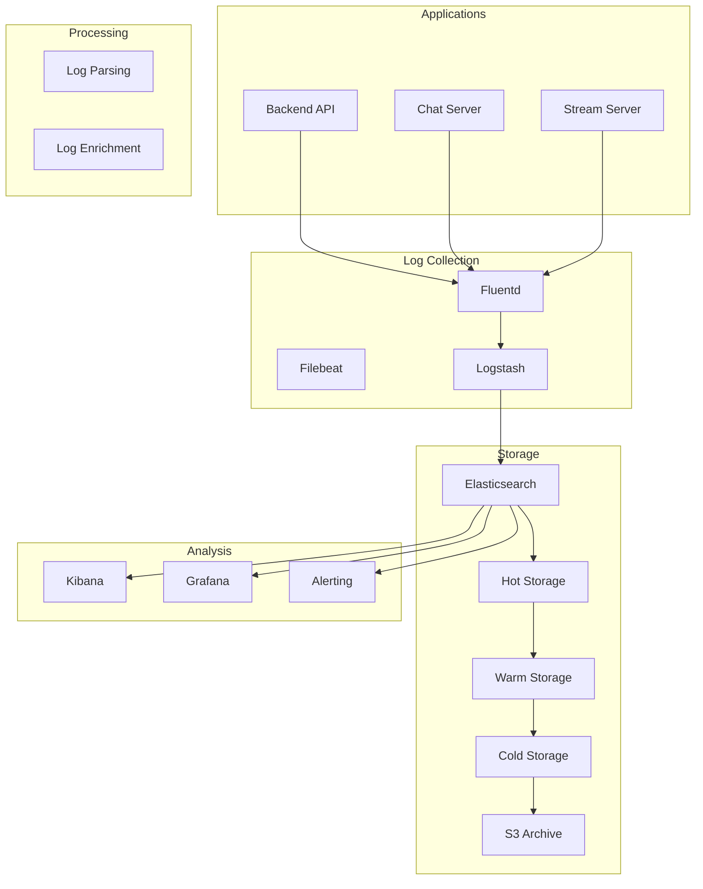

# 📝 Gestion des Logs

Ce guide explique la gestion des logs sur Veza.

# Guide de Gestion des Logs - Veza Platform

## Vue d'ensemble

Ce guide détaille la gestion complète des logs de la plateforme Veza, incluant la collecte, le traitement, le stockage et l'analyse des logs.

## 📊 **Architecture de Logging**

### Stack de Logging



## 🔧 **Configuration du Logging**

### Configuration Structurée

```go
// internal/infrastructure/logger/structured_logger.go
package logger

import (
    "time"
    "github.com/sirupsen/logrus"
    "gopkg.in/natefinch/lumberjack.v2"
)

type LogLevel string

const (
    LogLevelDebug LogLevel = "debug"
    LogLevelInfo  LogLevel = "info"
    LogLevelWarn  LogLevel = "warn"
    LogLevelError LogLevel = "error"
    LogLevelFatal LogLevel = "fatal"
)

type LogConfig struct {
    Level      LogLevel `env:"LOG_LEVEL" default:"info"`
    Format     string   `env:"LOG_FORMAT" default:"json"`
    Output     string   `env:"LOG_OUTPUT" default:"stdout"`
    MaxSize    int      `env:"LOG_MAX_SIZE" default:"100"`
    MaxBackups int      `env:"LOG_MAX_BACKUPS" default:"3"`
    MaxAge     int      `env:"LOG_MAX_AGE" default:"28"`
    Compress   bool     `env:"LOG_COMPRESS" default:"true"`
    Service    string   `env:"SERVICE_NAME" required:"true"`
    Version    string   `env:"SERVICE_VERSION" default:"1.0.0"`
}

type StructuredLogger struct {
    logger *logrus.Logger
    config LogConfig
}

func NewStructuredLogger(config LogConfig) *StructuredLogger {
    logger := logrus.New()
    
    // Set log level
    level, err := logrus.ParseLevel(string(config.Level))
    if err != nil {
        level = logrus.InfoLevel
    }
    logger.SetLevel(level)
    
    // Set formatter
    switch config.Format {
    case "json":
        logger.SetFormatter(&logrus.JSONFormatter{
            TimestampFormat: time.RFC3339,
            FieldMap: logrus.FieldMap{
                logrus.FieldKeyTime:  "timestamp",
                logrus.FieldKeyLevel: "level",
                logrus.FieldKeyMsg:   "message",
                logrus.FieldKeyFunc:  "caller",
            },
        })
    case "text":
        logger.SetFormatter(&logrus.TextFormatter{
            TimestampFormat: time.RFC3339,
            FullTimestamp:   true,
        })
    }
    
    // Set output
    switch config.Output {
    case "file":
        logger.SetOutput(&lumberjack.Logger{
            Filename:   "/var/log/veza/" + config.Service + ".log",
            MaxSize:    config.MaxSize,
            MaxBackups: config.MaxBackups,
            MaxAge:     config.MaxAge,
            Compress:   config.Compress,
        })
    default:
        logger.SetOutput(os.Stdout)
    }
    
    // Add default fields
    logger.AddHook(&DefaultFieldsHook{
        Service: config.Service,
        Version: config.Version,
    })
    
    return &StructuredLogger{
        logger: logger,
        config: config,
    }
}

type DefaultFieldsHook struct {
    Service string
    Version string
}

func (h *DefaultFieldsHook) Levels() []logrus.Level {
    return logrus.AllLevels
}

func (h *DefaultFieldsHook) Fire(entry *logrus.Entry) error {
    entry.Data["service"] = h.Service
    entry.Data["version"] = h.Version
    entry.Data["hostname"] = getHostname()
    return nil
}

func (l *StructuredLogger) WithFields(fields logrus.Fields) *logrus.Entry {
    return l.logger.WithFields(fields)
}

func (l *StructuredLogger) Info(msg string, fields logrus.Fields) {
    l.logger.WithFields(fields).Info(msg)
}

func (l *StructuredLogger) Error(msg string, fields logrus.Fields) {
    l.logger.WithFields(fields).Error(msg)
}

func (l *StructuredLogger) Debug(msg string, fields logrus.Fields) {
    l.logger.WithFields(fields).Debug(msg)
}

func (l *StructuredLogger) Warn(msg string, fields logrus.Fields) {
    l.logger.WithFields(fields).Warn(msg)
}
```

### Middleware de Logging HTTP

```go
// internal/middleware/http_logging.go
package middleware

import (
    "time"
    "github.com/gin-gonic/gin"
    "github.com/sirupsen/logrus"
)

type HTTPLoggingMiddleware struct {
    logger *logrus.Logger
}

func NewHTTPLoggingMiddleware(logger *logrus.Logger) *HTTPLoggingMiddleware {
    return &HTTPLoggingMiddleware{logger: logger}
}

func (m *HTTPLoggingMiddleware) LogRequest() gin.HandlerFunc {
    return func(c *gin.Context) {
        start := time.Now()
        path := c.Request.URL.Path
        raw := c.Request.URL.RawQuery
        
        // Process request
        c.Next()
        
        // Log after request is processed
        latency := time.Since(start)
        statusCode := c.Writer.Status()
        clientIP := c.ClientIP()
        userAgent := c.Request.UserAgent()
        method := c.Request.Method
        
        // Get user info if available
        userID := c.GetString("user_id")
        username := c.GetString("username")
        
        // Determine log level based on status code
        var level logrus.Level
        switch {
        case statusCode >= 500:
            level = logrus.ErrorLevel
        case statusCode >= 400:
            level = logrus.WarnLevel
        default:
            level = logrus.InfoLevel
        }
        
        // Create log entry
        entry := m.logger.WithFields(logrus.Fields{
            "timestamp":    start.Format(time.RFC3339),
            "method":       method,
            "path":         path,
            "query":        raw,
            "status_code":  statusCode,
            "latency":      latency.String(),
            "latency_ms":   latency.Milliseconds(),
            "client_ip":    clientIP,
            "user_agent":   userAgent,
            "user_id":      userID,
            "username":     username,
            "request_id":   c.GetString("request_id"),
            "correlation_id": c.GetString("correlation_id"),
        })
        
        // Log with appropriate level
        switch level {
        case logrus.ErrorLevel:
            entry.Error("HTTP Request")
        case logrus.WarnLevel:
            entry.Warn("HTTP Request")
        default:
            entry.Info("HTTP Request")
        }
    }
}
```

## 📝 **Types de Logs**

### Logs d'Application

```go
// internal/infrastructure/logger/application_logger.go
package logger

import (
    "github.com/sirupsen/logrus"
)

type ApplicationLogger struct {
    logger *logrus.Logger
}

func (l *ApplicationLogger) LogUserAction(userID, action, resource string, details map[string]interface{}) {
    l.logger.WithFields(logrus.Fields{
        "event":     "user_action",
        "user_id":   userID,
        "action":    action,
        "resource":  resource,
        "details":   details,
        "timestamp": time.Now(),
    }).Info("User action performed")
}

func (l *ApplicationLogger) LogBusinessEvent(eventType, entityType, entityID string, data map[string]interface{}) {
    l.logger.WithFields(logrus.Fields{
        "event":       "business_event",
        "event_type":  eventType,
        "entity_type": entityType,
        "entity_id":   entityID,
        "data":        data,
        "timestamp":   time.Now(),
    }).Info("Business event occurred")
}

func (l *ApplicationLogger) LogSystemEvent(eventType, component string, details map[string]interface{}) {
    l.logger.WithFields(logrus.Fields{
        "event":     "system_event",
        "event_type": eventType,
        "component": component,
        "details":   details,
        "timestamp": time.Now(),
    }).Info("System event occurred")
}
```

### Logs de Sécurité

```go
// internal/infrastructure/logger/security_logger.go
package logger

import (
    "github.com/sirupsen/logrus"
)

type SecurityLogger struct {
    logger *logrus.Logger
}

func (l *SecurityLogger) LogAuthentication(userID, username, ip string, success bool, details map[string]interface{}) {
    level := logrus.InfoLevel
    if !success {
        level = logrus.WarnLevel
    }
    
    l.logger.WithFields(logrus.Fields{
        "event":     "authentication",
        "user_id":   userID,
        "username":  username,
        "ip":        ip,
        "success":   success,
        "details":   details,
        "timestamp": time.Now(),
    }).Log(level, "Authentication attempt")
}

func (l *SecurityLogger) LogAuthorization(userID, username, resource, action string, granted bool) {
    l.logger.WithFields(logrus.Fields{
        "event":     "authorization",
        "user_id":   userID,
        "username":  username,
        "resource":  resource,
        "action":    action,
        "granted":   granted,
        "timestamp": time.Now(),
    }).Info("Authorization check")
}

func (l *SecurityLogger) LogSecurityViolation(userID, username, ip, violation string, details map[string]interface{}) {
    l.logger.WithFields(logrus.Fields{
        "event":      "security_violation",
        "user_id":    userID,
        "username":   username,
        "ip":         ip,
        "violation":  violation,
        "details":    details,
        "timestamp":  time.Now(),
        "severity":   "high",
    }).Warn("Security violation detected")
}

func (l *SecurityLogger) LogDataAccess(userID, dataType, purpose string, details map[string]interface{}) {
    l.logger.WithFields(logrus.Fields{
        "event":     "data_access",
        "user_id":   userID,
        "data_type": dataType,
        "purpose":   purpose,
        "details":   details,
        "timestamp": time.Now(),
    }).Info("Data access")
}
```

### Logs de Performance

```go
// internal/infrastructure/logger/performance_logger.go
package logger

import (
    "time"
    "github.com/sirupsen/logrus"
)

type PerformanceLogger struct {
    logger *logrus.Logger
}

func (l *PerformanceLogger) LogDatabaseQuery(query string, duration time.Duration, rows int, error error) {
    fields := logrus.Fields{
        "event":     "database_query",
        "query":     query,
        "duration":  duration,
        "duration_ms": duration.Milliseconds(),
        "rows":      rows,
        "timestamp": time.Now(),
    }
    
    if error != nil {
        fields["error"] = error.Error()
        l.logger.WithFields(fields).Error("Database query failed")
    } else {
        l.logger.WithFields(fields).Debug("Database query executed")
    }
}

func (l *PerformanceLogger) LogCacheOperation(operation, key string, hit bool, duration time.Duration) {
    l.logger.WithFields(logrus.Fields{
        "event":      "cache_operation",
        "operation":  operation,
        "key":        key,
        "hit":        hit,
        "duration":   duration,
        "duration_ms": duration.Milliseconds(),
        "timestamp":  time.Now(),
    }).Debug("Cache operation")
}

func (l *PerformanceLogger) LogExternalAPI(service, endpoint string, duration time.Duration, status int, error error) {
    fields := logrus.Fields{
        "event":      "external_api",
        "service":    service,
        "endpoint":   endpoint,
        "duration":   duration,
        "duration_ms": duration.Milliseconds(),
        "status":     status,
        "timestamp":  time.Now(),
    }
    
    if error != nil {
        fields["error"] = error.Error()
        l.logger.WithFields(fields).Error("External API call failed")
    } else {
        l.logger.WithFields(fields).Info("External API call completed")
    }
}

func (l *PerformanceLogger) LogSlowOperation(operation string, duration time.Duration, threshold time.Duration) {
    if duration > threshold {
        l.logger.WithFields(logrus.Fields{
            "event":      "slow_operation",
            "operation":  operation,
            "duration":   duration,
            "duration_ms": duration.Milliseconds(),
            "threshold":  threshold,
            "threshold_ms": threshold.Milliseconds(),
            "timestamp":  time.Now(),
        }).Warn("Slow operation detected")
    }
}
```

## 🗄️ **Stockage et Rétention**

### Configuration Elasticsearch

```yaml
# elasticsearch.yml
cluster:
  name: veza-logs

node:
  name: veza-log-node-1

path:
  data: /var/lib/elasticsearch
  logs: /var/log/elasticsearch

network:
  host: 0.0.0.0
  port: 9200

discovery:
  seed_hosts: ["localhost"]

xpack:
  security:
    enabled: true
    transport:
      ssl:
        enabled: true
        keystore:
          path: elastic-certificates.p12
        truststore:
          path: elastic-certificates.p12
```

### Index Templates

```json
{
  "index_patterns": ["veza-logs-*"],
  "settings": {
    "number_of_shards": 3,
    "number_of_replicas": 1,
    "index.lifecycle.name": "veza-logs-policy",
    "index.lifecycle.rollover_alias": "veza-logs"
  },
  "mappings": {
    "properties": {
      "timestamp": {
        "type": "date"
      },
      "level": {
        "type": "keyword"
      },
      "service": {
        "type": "keyword"
      },
      "event": {
        "type": "keyword"
      },
      "user_id": {
        "type": "keyword"
      },
      "username": {
        "type": "keyword"
      },
      "client_ip": {
        "type": "ip"
      },
      "method": {
        "type": "keyword"
      },
      "path": {
        "type": "keyword"
      },
      "status_code": {
        "type": "integer"
      },
      "latency_ms": {
        "type": "long"
      },
      "error": {
        "type": "text"
      },
      "details": {
        "type": "object",
        "dynamic": true
      }
    }
  }
}
```

### Politique de Rétention

```json
{
  "policy": {
    "phases": {
      "hot": {
        "min_age": "0ms",
        "actions": {
          "rollover": {
            "max_age": "1d",
            "max_size": "50gb"
          }
        }
      },
      "warm": {
        "min_age": "1d",
        "actions": {
          "forcemerge": {
            "max_num_segments": 1
          },
          "shrink": {
            "number_of_shards": 1
          }
        }
      },
      "cold": {
        "min_age": "7d",
        "actions": {
          "freeze": {}
        }
      },
      "delete": {
        "min_age": "30d",
        "actions": {
          "delete": {}
        }
      }
    }
  }
}
```

## 📊 **Analyse et Monitoring**

### Dashboards Kibana

```json
{
  "dashboard": {
    "title": "Veza Platform Logs",
    "panels": [
      {
        "title": "Log Volume",
        "type": "visualization",
        "visualization": {
          "type": "line",
          "params": {
            "index_pattern": "veza-logs-*",
            "query": "*",
            "aggregation": "count",
            "field": "timestamp",
            "interval": "1m"
          }
        }
      },
      {
        "title": "Error Rate",
        "type": "visualization",
        "visualization": {
          "type": "line",
          "params": {
            "index_pattern": "veza-logs-*",
            "query": "level:error",
            "aggregation": "count",
            "field": "timestamp",
            "interval": "5m"
          }
        }
      },
      {
        "title": "Top Endpoints",
        "type": "visualization",
        "visualization": {
          "type": "table",
          "params": {
            "index_pattern": "veza-logs-*",
            "query": "*",
            "aggregation": "terms",
            "field": "path",
            "size": 10
          }
        }
      },
      {
        "title": "Response Time",
        "type": "visualization",
        "visualization": {
          "type": "line",
          "params": {
            "index_pattern": "veza-logs-*",
            "query": "*",
            "aggregation": "avg",
            "field": "latency_ms",
            "interval": "1m"
          }
        }
      },
      {
        "title": "Security Events",
        "type": "visualization",
        "visualization": {
          "type": "line",
          "params": {
            "index_pattern": "veza-logs-*",
            "query": "event:security*",
            "aggregation": "count",
            "field": "timestamp",
            "interval": "5m"
          }
        }
      }
    ]
  }
}
```

### Alertes de Logs

```yaml
# log_alerts.yml
groups:
- name: veza_log_alerts
  rules:
  - alert: HighErrorRate
    expr: rate(veza_logs_total{level="error"}[5m]) > 0.1
    for: 2m
    labels:
      severity: warning
    annotations:
      summary: "Taux d'erreur élevé dans les logs"
      description: "Le taux d'erreur dans les logs est supérieur à 10%"
      
  - alert: SecurityViolation
    expr: rate(veza_logs_total{event="security_violation"}[5m]) > 0
    for: 1m
    labels:
      severity: critical
    annotations:
      summary: "Violation de sécurité détectée"
      description: "Une violation de sécurité a été détectée dans les logs"
      
  - alert: SlowResponseTime
    expr: histogram_quantile(0.95, veza_logs_latency_ms) > 2000
    for: 5m
    labels:
      severity: warning
    annotations:
      summary: "Temps de réponse élevé"
      description: "Le 95e percentile du temps de réponse est supérieur à 2 secondes"
```

## 🛠️ **Outils et Scripts**

### Script de Rotation des Logs

```bash
#!/bin/bash
# rotate_logs.sh

LOG_DIR="/var/log/veza"
RETENTION_DAYS=30
COMPRESS_DAYS=7

echo "=== Rotation des logs Veza ==="

# Compresser les anciens logs
find $LOG_DIR -name "*.log" -mtime +$COMPRESS_DAYS -exec gzip {} \;

# Supprimer les logs très anciens
find $LOG_DIR -name "*.log.gz" -mtime +$RETENTION_DAYS -delete

# Redémarrer les services pour recharger les handles de fichiers
docker-compose restart veza-backend-api veza-chat-server veza-stream-server

echo "✅ Rotation terminée"
```

### Script d'Analyse des Logs

```bash
#!/bin/bash
# analyze_logs.sh

LOG_FILE="/var/log/veza/application.log"
OUTPUT_DIR="/var/log/veza/analysis"

mkdir -p $OUTPUT_DIR

echo "=== Analyse des logs Veza ==="

# Statistiques générales
echo "Statistiques générales:" > $OUTPUT_DIR/stats.txt
grep -c "ERROR" $LOG_FILE >> $OUTPUT_DIR/stats.txt
grep -c "WARN" $LOG_FILE >> $OUTPUT_DIR/stats.txt
grep -c "INFO" $LOG_FILE >> $OUTPUT_DIR/stats.txt

# Top des erreurs
echo "Top des erreurs:" > $OUTPUT_DIR/errors.txt
grep "ERROR" $LOG_FILE | cut -d' ' -f4- | sort | uniq -c | sort -nr | head -10 >> $OUTPUT_DIR/errors.txt

# Top des utilisateurs
echo "Top des utilisateurs:" > $OUTPUT_DIR/users.txt
grep -o 'user_id":"[^"]*"' $LOG_FILE | cut -d'"' -f3 | sort | uniq -c | sort -nr | head -10 >> $OUTPUT_DIR/users.txt

# Top des endpoints
echo "Top des endpoints:" > $OUTPUT_DIR/endpoints.txt
grep -o 'path":"[^"]*"' $LOG_FILE | cut -d'"' -f3 | sort | uniq -c | sort -nr | head -10 >> $OUTPUT_DIR/endpoints.txt

# Analyse des temps de réponse
echo "Analyse des temps de réponse:" > $OUTPUT_DIR/response_times.txt
grep -o 'latency_ms":[0-9]*' $LOG_FILE | cut -d':' -f2 | sort -n | awk '
BEGIN {count=0; sum=0}
{
    count++
    sum += $1
    if (count == 1) min = max = $1
    if ($1 < min) min = $1
    if ($1 > max) max = $1
}
END {
    avg = sum / count
    print "Count:", count
    print "Sum:", sum
    print "Average:", avg
    print "Min:", min
    print "Max:", max
}' >> $OUTPUT_DIR/response_times.txt

echo "✅ Analyse terminée"
```

### Script de Nettoyage des Logs

```bash
#!/bin/bash
# cleanup_logs.sh

echo "=== Nettoyage des logs Veza ==="

# Anonymiser les données sensibles
echo "Anonymisation des données sensibles..."

# Anonymiser les emails
find /var/log/veza/ -name "*.log" -exec sed -i 's/[a-zA-Z0-9._%+-]\+@[a-zA-Z0-9.-]\+\.[a-zA-Z]{2,}/[EMAIL_ANONYMIZED]/g' {} \;

# Anonymiser les IPs (garder seulement le réseau)
find /var/log/veza/ -name "*.log" -exec sed -i 's/\([0-9]\{1,3\}\.[0-9]\{1,3\}\.[0-9]\{1,3\}\)\.[0-9]\{1,3\}/\1.0/g' {} \;

# Anonymiser les noms d'utilisateur
find /var/log/veza/ -name "*.log" -exec sed -i 's/"username":"[^"]*"/"username":"[ANONYMIZED]"/g' {} \;

# Supprimer les tokens JWT
find /var/log/veza/ -name "*.log" -exec sed -i 's/"token":"[^"]*"/"token":"[ANONYMIZED]"/g' {} \;

echo "✅ Nettoyage terminé"
```

## 📚 **Documentation et Formation**

### Guide d'Utilisation

```markdown
# Guide d'Utilisation des Logs Veza

## Recherche dans Kibana

### Requêtes Utiles

1. **Tous les logs d'un utilisateur**
```
user_id: "user-123"
```

2. **Erreurs récentes**
```
level: "error" AND timestamp: [now-1h TO now]
```

3. **Requêtes lentes**
```
latency_ms: > 1000
```

4. **Violations de sécurité**
```
event: "security_violation"
```

5. **Logs d'authentification**
```
event: "authentication"
```

### Dashboards Recommandés

- **Monitoring Général** : Vue d'ensemble de la plateforme
- **Sécurité** : Événements de sécurité et violations
- **Performance** : Métriques de performance et latence
- **Audit** : Traçabilité des actions utilisateur
- **Erreurs** : Analyse des erreurs et exceptions
```

---

**Dernière mise à jour** : $(date)
**Version** : 1.0.0 