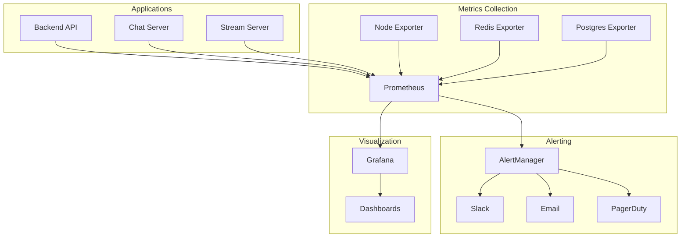

# 🚨 Alertes sur Métriques

Ce guide explique la configuration des alertes sur métriques.

# Guide des Métriques et Alerting - Veza Platform

## Vue d'ensemble

Ce guide détaille la configuration complète du système de métriques et d'alerting de la plateforme Veza, incluant Prometheus, Grafana, et les bonnes pratiques de monitoring.

## 📊 **Architecture de Monitoring**

### Stack de Monitoring



## 🔧 **Configuration Prometheus**

### Configuration Principale

```yaml
# prometheus.yml
global:
  scrape_interval: 15s
  evaluation_interval: 15s

rule_files:
  - "alerts.yml"
  - "recording_rules.yml"

alerting:
  alertmanagers:
    - static_configs:
        - targets:
          - alertmanager:9093

scrape_configs:
  - job_name: 'veza-backend-api'
    static_configs:
      - targets: ['backend-api:8080']
    metrics_path: '/metrics'
    scrape_interval: 10s

  - job_name: 'veza-chat-server'
    static_configs:
      - targets: ['chat-server:8081']
    metrics_path: '/metrics'
    scrape_interval: 10s

  - job_name: 'veza-stream-server'
    static_configs:
      - targets: ['stream-server:8082']
    metrics_path: '/metrics'
    scrape_interval: 10s

  - job_name: 'node-exporter'
    static_configs:
      - targets: ['node-exporter:9100']

  - job_name: 'redis-exporter'
    static_configs:
      - targets: ['redis-exporter:9121']

  - job_name: 'postgres-exporter'
    static_configs:
      - targets: ['postgres-exporter:9187']
```

### Métriques Personnalisées

```go
// internal/monitoring/metrics.go
package monitoring

import (
    "github.com/prometheus/client_golang/prometheus"
    "github.com/prometheus/client_golang/prometheus/promauto"
)

var (
    // Métriques HTTP
    httpRequestsTotal = promauto.NewCounterVec(
        prometheus.CounterOpts{
            Name: "http_requests_total",
            Help: "Total number of HTTP requests",
        },
        []string{"method", "endpoint", "status"},
    )

    httpRequestDuration = promauto.NewHistogramVec(
        prometheus.HistogramOpts{
            Name:    "http_request_duration_seconds",
            Help:    "HTTP request duration in seconds",
            Buckets: prometheus.DefBuckets,
        },
        []string{"method", "endpoint"},
    )

    // Métriques Business
    activeUsers = promauto.NewGauge(
        prometheus.GaugeOpts{
            Name: "veza_active_users",
            Help: "Number of active users",
        },
    )

    messagesPerSecond = promauto.NewCounter(
        prometheus.CounterOpts{
            Name: "veza_messages_total",
            Help: "Total number of messages sent",
        },
    )

    // Métriques Base de Données
    dbConnections = promauto.NewGauge(
        prometheus.GaugeOpts{
            Name: "veza_db_connections",
            Help: "Number of active database connections",
        },
    )

    dbQueryDuration = promauto.NewHistogramVec(
        prometheus.HistogramOpts{
            Name:    "veza_db_query_duration_seconds",
            Help:    "Database query duration in seconds",
            Buckets: prometheus.DefBuckets,
        },
        []string{"query_type"},
    )

    // Métriques Cache
    cacheHits = promauto.NewCounter(
        prometheus.CounterOpts{
            Name: "veza_cache_hits_total",
            Help: "Total number of cache hits",
        },
    )

    cacheMisses = promauto.NewCounter(
        prometheus.CounterOpts{
            Name: "veza_cache_misses_total",
            Help: "Total number of cache misses",
        },
    )

    // Métriques WebSocket
    websocketConnections = promauto.NewGauge(
        prometheus.GaugeOpts{
            Name: "veza_websocket_connections",
            Help: "Number of active WebSocket connections",
        },
    )

    websocketMessages = promauto.NewCounter(
        prometheus.CounterOpts{
            Name: "veza_websocket_messages_total",
            Help: "Total number of WebSocket messages",
        },
    )
)

// Middleware pour les métriques HTTP
func MetricsMiddleware() gin.HandlerFunc {
    return func(c *gin.Context) {
        start := time.Now()
        
        c.Next()
        
        duration := time.Since(start).Seconds()
        
        httpRequestsTotal.WithLabelValues(
            c.Request.Method,
            c.Request.URL.Path,
            strconv.Itoa(c.Writer.Status()),
        ).Inc()
        
        httpRequestDuration.WithLabelValues(
            c.Request.Method,
            c.Request.URL.Path,
        ).Observe(duration)
    }
}
```

## 🚨 **Configuration des Alertes**

### Alertes Critiques

```yaml
# alerts.yml
groups:
- name: veza_critical_alerts
  rules:
  - alert: HighErrorRate
    expr: rate(http_requests_total{status=~"5.."}[5m]) > 0.1
    for: 2m
    labels:
      severity: critical
      team: backend
    annotations:
      summary: "Taux d'erreur élevé"
      description: "Le taux d'erreur HTTP 5xx est supérieur à 10%"
      runbook_url: "https://docs.veza.com/runbooks/high-error-rate"

  - alert: ServiceDown
    expr: up == 0
    for: 1m
    labels:
      severity: critical
      team: infrastructure
    annotations:
      summary: "Service indisponible"
      description: "Le service {{ $labels.job }} est indisponible"

  - alert: HighResponseTime
    expr: histogram_quantile(0.95, http_request_duration_seconds) > 2
    for: 5m
    labels:
      severity: warning
      team: backend
    annotations:
      summary: "Temps de réponse élevé"
      description: "Le 95e percentile du temps de réponse est supérieur à 2 secondes"

  - alert: DatabaseConnectionsHigh
    expr: veza_db_connections > 80
    for: 2m
    labels:
      severity: warning
      team: database
    annotations:
      summary: "Connexions DB élevées"
      description: "Le nombre de connexions à la base de données est élevé"

  - alert: CacheHitRateLow
    expr: rate(veza_cache_hits_total[5m]) / (rate(veza_cache_hits_total[5m]) + rate(veza_cache_misses_total[5m])) < 0.8
    for: 5m
    labels:
      severity: warning
      team: backend
    annotations:
      summary: "Taux de cache hit faible"
      description: "Le taux de cache hit est inférieur à 80%"

  - alert: MemoryUsageHigh
    expr: (node_memory_MemTotal_bytes - node_memory_MemAvailable_bytes) / node_memory_MemTotal_bytes > 0.9
    for: 5m
    labels:
      severity: warning
      team: infrastructure
    annotations:
      summary: "Utilisation mémoire élevée"
      description: "L'utilisation mémoire est supérieure à 90%"

  - alert: DiskUsageHigh
    expr: (node_filesystem_size_bytes - node_filesystem_avail_bytes) / node_filesystem_size_bytes > 0.85
    for: 5m
    labels:
      severity: warning
      team: infrastructure
    annotations:
      summary: "Utilisation disque élevée"
      description: "L'utilisation disque est supérieure à 85%"

  - alert: WebSocketConnectionsLow
    expr: veza_websocket_connections < 10
    for: 10m
    labels:
      severity: warning
      team: backend
    annotations:
      summary: "Connexions WebSocket faibles"
      description: "Le nombre de connexions WebSocket est faible"

  - alert: MessageQueueBacklog
    expr: veza_message_queue_size > 1000
    for: 5m
    labels:
      severity: warning
      team: backend
    annotations:
      summary: "Backlog de messages"
      description: "La file d'attente de messages contient plus de 1000 messages"
```

### Alertes Business

```yaml
- name: veza_business_alerts
  rules:
  - alert: LowActiveUsers
    expr: veza_active_users < 100
    for: 30m
    labels:
      severity: warning
      team: product
    annotations:
      summary: "Utilisateurs actifs faibles"
      description: "Le nombre d'utilisateurs actifs est faible"

  - alert: HighMessageVolume
    expr: rate(veza_messages_total[5m]) > 1000
    for: 5m
    labels:
      severity: info
      team: product
    annotations:
      summary: "Volume de messages élevé"
      description: "Le volume de messages est élevé"

  - alert: UserRegistrationSpike
    expr: rate(veza_user_registrations_total[5m]) > 10
    for: 5m
    labels:
      severity: info
      team: product
    annotations:
      summary: "Pic d'inscriptions"
      description: "Un pic d'inscriptions utilisateur a été détecté"
```

## 📊 **Configuration Grafana**

### Dashboard Principal

```json
{
  "dashboard": {
    "title": "Veza Platform Overview",
    "panels": [
      {
        "title": "Request Rate",
        "type": "graph",
        "targets": [
          {
            "expr": "rate(http_requests_total[5m])",
            "legendFormat": "{{method}} {{endpoint}}"
          }
        ],
        "yAxes": [
          {
            "label": "Requests per second"
          }
        ]
      },
      {
        "title": "Response Time",
        "type": "graph",
        "targets": [
          {
            "expr": "histogram_quantile(0.95, http_request_duration_seconds)",
            "legendFormat": "95th percentile"
          },
          {
            "expr": "histogram_quantile(0.50, http_request_duration_seconds)",
            "legendFormat": "50th percentile"
          }
        ],
        "yAxes": [
          {
            "label": "Response time (seconds)"
          }
        ]
      },
      {
        "title": "Error Rate",
        "type": "graph",
        "targets": [
          {
            "expr": "rate(http_requests_total{status=~\"5..\"}[5m])",
            "legendFormat": "5xx errors"
          },
          {
            "expr": "rate(http_requests_total{status=~\"4..\"}[5m])",
            "legendFormat": "4xx errors"
          }
        ],
        "yAxes": [
          {
            "label": "Errors per second"
          }
        ]
      },
      {
        "title": "Active Users",
        "type": "stat",
        "targets": [
          {
            "expr": "veza_active_users"
          }
        ]
      },
      {
        "title": "WebSocket Connections",
        "type": "stat",
        "targets": [
          {
            "expr": "veza_websocket_connections"
          }
        ]
      },
      {
        "title": "Database Connections",
        "type": "graph",
        "targets": [
          {
            "expr": "veza_db_connections"
          }
        ],
        "yAxes": [
          {
            "label": "Connections"
          }
        ]
      },
      {
        "title": "Cache Hit Rate",
        "type": "graph",
        "targets": [
          {
            "expr": "rate(veza_cache_hits_total[5m]) / (rate(veza_cache_hits_total[5m]) + rate(veza_cache_misses_total[5m])) * 100"
          }
        ],
        "yAxes": [
          {
            "label": "Hit rate (%)"
          }
        ]
      },
      {
        "title": "System Resources",
        "type": "graph",
        "targets": [
          {
            "expr": "(node_memory_MemTotal_bytes - node_memory_MemAvailable_bytes) / node_memory_MemTotal_bytes * 100",
            "legendFormat": "Memory usage"
          },
          {
            "expr": "(node_filesystem_size_bytes - node_filesystem_avail_bytes) / node_filesystem_size_bytes * 100",
            "legendFormat": "Disk usage"
          }
        ],
        "yAxes": [
          {
            "label": "Usage (%)"
          }
        ]
      }
    ]
  }
}
```

### Dashboard de Sécurité

```json
{
  "dashboard": {
    "title": "Security Monitoring",
    "panels": [
      {
        "title": "Failed Login Attempts",
        "type": "graph",
        "targets": [
          {
            "expr": "rate(veza_failed_logins_total[5m])"
          }
        ]
      },
      {
        "title": "Rate Limit Violations",
        "type": "graph",
        "targets": [
          {
            "expr": "rate(veza_rate_limit_violations_total[5m])"
          }
        ]
      },
      {
        "title": "Suspicious IPs",
        "type": "table",
        "targets": [
          {
            "expr": "topk(10, rate(veza_failed_logins_total[1h]))"
          }
        ]
      }
    ]
  }
}
```

## 🔔 **Configuration AlertManager**

### Configuration Principale

```yaml
# alertmanager.yml
global:
  slack_api_url: 'https://hooks.slack.com/services/YOUR/SLACK/WEBHOOK'
  smtp_smarthost: 'smtp.gmail.com:587'
  smtp_from: 'alerts@veza.com'
  smtp_auth_username: 'alerts@veza.com'
  smtp_auth_password: 'your-password'

route:
  group_by: ['alertname', 'cluster', 'service']
  group_wait: 30s
  group_interval: 5m
  repeat_interval: 4h
  receiver: 'slack-notifications'
  routes:
  - match:
      severity: critical
    receiver: 'pager-duty-critical'
    continue: true
  - match:
      severity: warning
    receiver: 'slack-notifications'

receivers:
- name: 'slack-notifications'
  slack_configs:
  - channel: '#alerts'
    send_resolved: true
    title: '{{ template "slack.title" . }}'
    text: '{{ template "slack.text" . }}'

- name: 'pager-duty-critical'
  pagerduty_configs:
  - service_key: 'your-pagerduty-service-key'
    send_resolved: true

- name: 'email-notifications'
  email_configs:
  - to: 'ops@veza.com'
    send_resolved: true
    subject: '{{ template "email.subject" . }}'
    body: '{{ template "email.body" . }}'

templates:
- '/etc/alertmanager/template/*.tmpl'
```

### Templates d'Alertes

```yaml
# templates/slack.tmpl
{{ define "slack.title" }}
[{{ .Status | toUpper }}{{ if eq .Status "firing" }}:{{ .Alerts.Firing | len }}{{ end }}] {{ .CommonLabels.alertname }}
{{ end }}

{{ define "slack.text" }}
{{ range .Alerts }}
*Alert:* {{ .Annotations.summary }}
*Description:* {{ .Annotations.description }}
*Severity:* {{ .Labels.severity }}
*Service:* {{ .Labels.job }}
*Started:* {{ .StartsAt | since }}
{{ if .Annotations.runbook_url }}*Runbook:* {{ .Annotations.runbook_url }}{{ end }}
{{ end }}
{{ end }}
```

## 📈 **Métriques Avancées**

### Métriques Business

```go
// internal/monitoring/business_metrics.go
package monitoring

import (
    "github.com/prometheus/client_golang/prometheus"
    "github.com/prometheus/client_golang/prometheus/promauto"
)

var (
    // Métriques utilisateur
    userRegistrations = promauto.NewCounter(
        prometheus.CounterOpts{
            Name: "veza_user_registrations_total",
            Help: "Total number of user registrations",
        },
    )

    userLogins = promauto.NewCounter(
        prometheus.CounterOpts{
            Name: "veza_user_logins_total",
            Help: "Total number of user logins",
        },
    )

    userSessions = promauto.NewGauge(
        prometheus.GaugeOpts{
            Name: "veza_user_sessions",
            Help: "Number of active user sessions",
        },
    )

    // Métriques de contenu
    messagesCreated = promauto.NewCounter(
        prometheus.CounterOpts{
            Name: "veza_messages_created_total",
            Help: "Total number of messages created",
        },
    )

    filesUploaded = promauto.NewCounter(
        prometheus.CounterOpts{
            Name: "veza_files_uploaded_total",
            Help: "Total number of files uploaded",
        },
    )

    // Métriques de performance
    apiLatency = promauto.NewHistogramVec(
        prometheus.HistogramOpts{
            Name:    "veza_api_latency_seconds",
            Help:    "API latency in seconds",
            Buckets: prometheus.DefBuckets,
        },
        []string{"endpoint", "method"},
    )

    databaseQueryTime = promauto.NewHistogramVec(
        prometheus.HistogramOpts{
            Name:    "veza_db_query_time_seconds",
            Help:    "Database query time in seconds",
            Buckets: prometheus.DefBuckets,
        },
        []string{"query_type", "table"},
    )

    // Métriques de sécurité
    failedLogins = promauto.NewCounter(
        prometheus.CounterOpts{
            Name: "veza_failed_logins_total",
            Help: "Total number of failed login attempts",
        },
    )

    rateLimitViolations = promauto.NewCounter(
        prometheus.CounterOpts{
            Name: "veza_rate_limit_violations_total",
            Help: "Total number of rate limit violations",
        },
    )
)
```

### Métriques d'Infrastructure

```go
// internal/monitoring/infrastructure_metrics.go
package monitoring

import (
    "github.com/prometheus/client_golang/prometheus"
    "github.com/prometheus/client_golang/prometheus/promauto"
)

var (
    // Métriques système
    cpuUsage = promauto.NewGauge(
        prometheus.GaugeOpts{
            Name: "veza_cpu_usage_percent",
            Help: "CPU usage percentage",
        },
    )

    memoryUsage = promauto.NewGauge(
        prometheus.GaugeOpts{
            Name: "veza_memory_usage_percent",
            Help: "Memory usage percentage",
        },
    )

    diskUsage = promauto.NewGaugeVec(
        prometheus.GaugeOpts{
            Name: "veza_disk_usage_percent",
            Help: "Disk usage percentage",
        },
        []string{"mountpoint"},
    )

    // Métriques réseau
    networkBytesReceived = promauto.NewCounter(
        prometheus.CounterOpts{
            Name: "veza_network_bytes_received_total",
            Help: "Total bytes received",
        },
    )

    networkBytesSent = promauto.NewCounter(
        prometheus.CounterOpts{
            Name: "veza_network_bytes_sent_total",
            Help: "Total bytes sent",
        },
    )

    // Métriques de processus
    processUptime = promauto.NewGauge(
        prometheus.GaugeOpts{
            Name: "veza_process_uptime_seconds",
            Help: "Process uptime in seconds",
        },
    )

    goroutines = promauto.NewGauge(
        prometheus.GaugeOpts{
            Name: "veza_goroutines",
            Help: "Number of goroutines",
        },
    )
)
```

## 🛠️ **Scripts d'Automatisation**

### Script de Déploiement des Alertes

```bash
#!/bin/bash
# deploy_alerts.sh

echo "=== Déploiement des Alertes Prometheus ==="

# Vérifier la syntaxe des alertes
promtool check rules alerts.yml
if [ $? -ne 0 ]; then
    echo "❌ Erreur de syntaxe dans les alertes"
    exit 1
fi

# Reload Prometheus
curl -X POST http://localhost:9090/-/reload

# Vérifier les alertes actives
echo "Alertes actives:"
curl -s http://localhost:9090/api/v1/alerts | jq '.data.alerts[] | {alertname: .labels.alertname, severity: .labels.severity, state: .state}'

echo "✅ Alertes déployées"
```

### Script de Test des Alertes

```bash
#!/bin/bash
# test_alerts.sh

echo "=== Test des Alertes ==="

# Simuler une haute utilisation CPU
echo "Simulation haute utilisation CPU..."
stress-ng --cpu 4 --timeout 60s &

# Simuler des erreurs HTTP
echo "Simulation erreurs HTTP..."
for i in {1..100}; do
    curl -s http://localhost:8080/nonexistent > /dev/null
done

# Attendre que les alertes se déclenchent
echo "Attente des alertes..."
sleep 30

# Vérifier les alertes
echo "Alertes déclenchées:"
curl -s http://localhost:9090/api/v1/alerts | jq '.data.alerts[] | select(.state == "active") | {alertname: .labels.alertname, severity: .labels.severity}'

echo "✅ Test terminé"
```

---

**Dernière mise à jour** : $(date)
**Version** : 1.0.0 